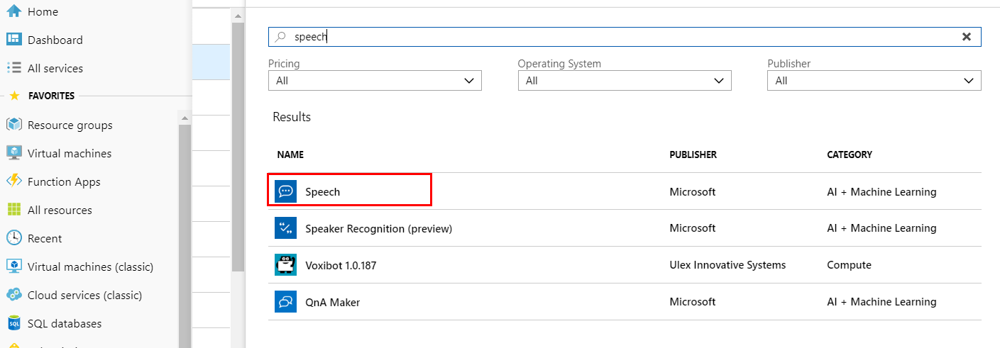
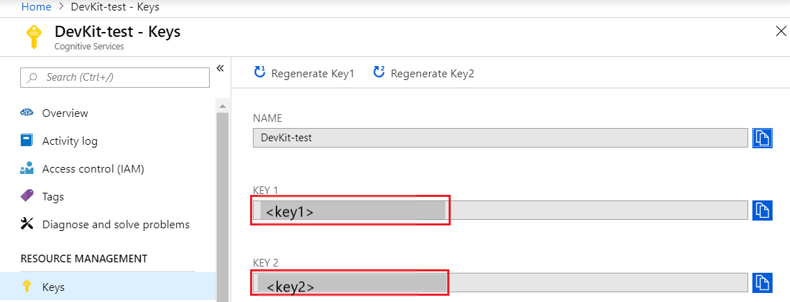
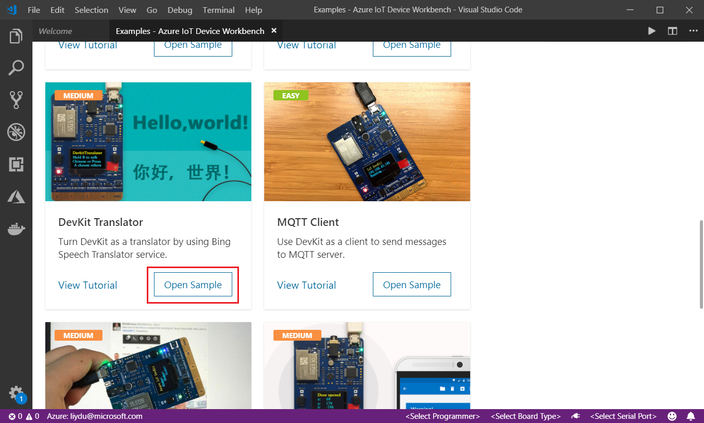
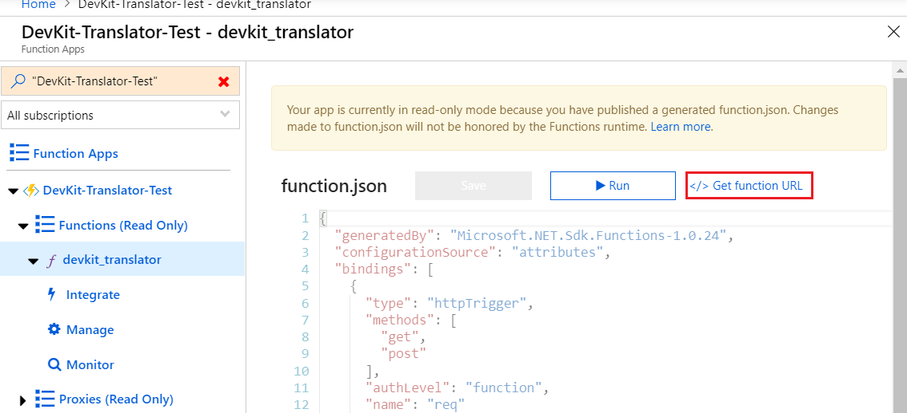
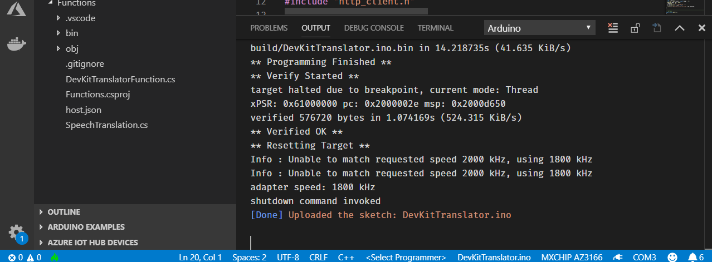

# Use IoT DevKit AZ3166 with Azure Functions and Cognitive Services to make a language translator

In this article, you learn how to make IoT DevKit as a language translator by using [Azure Cognitive Services](https://azure.microsoft.com/services/cognitive-services/). It records your voice and translates it to English text shown on the DevKit screen.

The [MXChip IoT DevKit](https://aka.ms/iot-devkit) is an all-in-one Arduino compatible board with rich peripherals and sensors. You can develop for it using [Azure IoT Device Workbench](https://aka.ms/iot-workbench) or [Azure IoT Tools](https://aka.ms/azure-iot-tools) extension pack in Visual Studio Code. The [projects catalog](https://microsoft.github.io/azure-iot-developer-kit/docs/projects/) contains sample applications to help you prototype IoT solutions.

## Before you begin

To complete the steps in this tutorial, first do the following tasks:

* Prepare your DevKit by following the steps in [Connect IoT DevKit AZ3166 to Azure IoT Hub in the cloud](/azure/iot-hub/iot-hub-arduino-iot-devkit-az3166-get-started).

## Create Azure Cognitive Service

1. In the Azure portal, click **Create a resource** and search for **Speech**. Fill out the form to create the Speech Service.
  

1. Go to the Speech service you just created, click **Keys** section to copy and note down the **Key1** for DevKit accessing to it.
  

## Open sample project

1. Make sure your IoT DevKit is **not connected** to your computer. Start VS Code first, and then connect the DevKit to your computer.

1. Click `F1` to open the command palette, type and select **Azure IoT Device Workbench: Open Examples...**. Then select **IoT DevKit** as board.

1. In the IoT Workbench Examples page, find **DevKit Translator** and click **Open Sample**. Then selects the default path to download the sample code.
  

## Use Speech Service with Azure Functions

1. In VS Code, click `F1`, type and select **Azure IoT Device Workbench: Provision Azure Services...**.
  

1. Follow the steps to finish provisioning of Azure IoT Hub and Azure Functions.
  

  Take a note of the Azure IoT Hub device name you created.

1. Open `Functions\DevKitTranslatorFunction.cs` and update the following lines of code with the devce name and Speech Service key you noted down.
  ```csharp
  // Subscription Key of Speech Service
  const string speechSubscriptionKey = "";

  // Region of the speech service, see https://docs.microsoft.com/azure/cognitive-services/speech-service/regions for more details.
  const string speechServiceRegion = "";

  // Device ID
  const string deviceName = "";
  ```

1. Click `F1`, type and select **Azure IoT Device Workbench: Deploy to Azure...**. If VS Code asks for confirmation for redeployment, click **Yes**.
  

1. Make sure the deployment is successful.
  

1. In Azure portal, go to **Functions Apps** section, find the Azure Function app just created. Click `devkit_translator`, then click **</> Get Function URL** to copy the URL.
  

1. Paste the URL into `azure_config.h` file.
  

  > [!NOTE]
  > If the Function app does not work properly, check this [FAQ](https://microsoft.github.io/azure-iot-developer-kit/docs/faq#compilation-error-for-azure-function) section to resolve it.

## Build and upload device code

1. Switch the DevKit to **configuration mode** by:
  * Hold down button **A**.
  * Press and release **Reset** button.

  You will see the screen displays the DevKit ID and **Configuration**.

  

1. Click `F1`, type and select **Azure IoT Device Workbench: Configure Device Settings... > Config Device Connection String**. Select **Select IoT Hub Device Connection String** to configure it to the DevKit.
  

1. You will see the notification once it's done successfully.
  

1. Click `F1` again, type and select **Azure IoT Device Workbench: Upload Device Code**. It starts compile and upload the code to DevKit.
  

## Test the project

After app initialization, follow the instructions on the DevKit screen. The default source language is Chinese.

To select another language for translation:

1. Press button A to enter setup mode.

2. Press button B to scroll all supported source languages.

3. Press button A to confirm your choice of source language.

4. Press and hold button B while speaking, then release button B to initiate the translation.

5. The translated text in English shows on the screen.


On the translation result screen, you can:

- Press buttons A and B to scroll and select the source language.

- Press the B button to talk. To send the voice and get the translation text, release the B button.

## How it works


The IoT DevKit records your voice then posts an HTTP request to trigger Azure Functions. Azure Functions calls the cognitive service speech translator API to do the translation. After Azure Functions gets the translation text, it sends a C2D message to the device. Then the translation is displayed on the screen.

## Problems and feedback

If you encounter problems, refer to the [IoT DevKit FAQ](https://microsoft.github.io/azure-iot-developer-kit/docs/faq/) or reach out to us using the following channels:

* [Gitter.im](https://gitter.im/Microsoft/azure-iot-developer-kit)
* [Stack Overflow](https://stackoverflow.com/questions/tagged/iot-devkit)

## Next steps

You have learned how to use the IoT DevKit as a translator by using Azure Functions and Cognitive Services. In this how-to, you learned how to:

> [!div class="checklist"]
> * Use Visual Studio Code task to automate cloud provisions
> * Configure Azure IoT device connection string
> * Deploy the Azure Function
> * Test the voice message translation

Advance to the other tutorials to learn:

> [!div class="nextstepaction"]
> [Connect IoT DevKit AZ3166 to Azure IoT Remote Monitoring solution accelerator](https://docs.microsoft.com/azure/iot-hub/iot-hub-arduino-iot-devkit-az3166-devkit-remote-monitoring)
