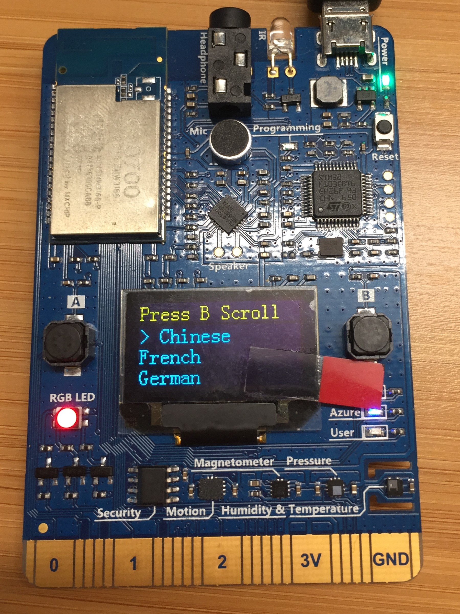
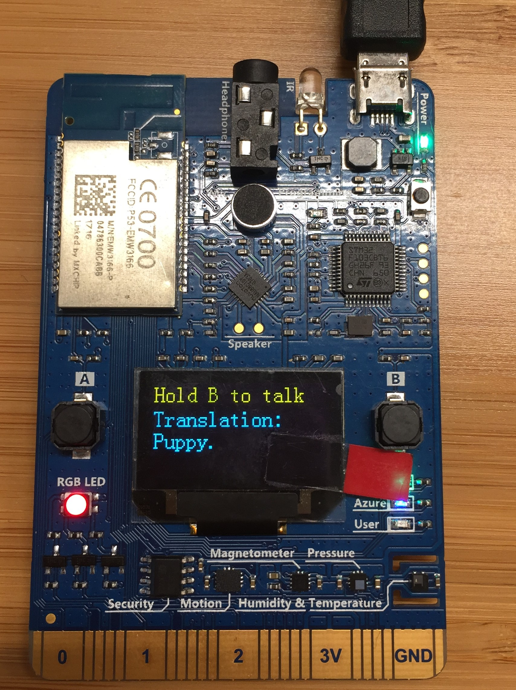
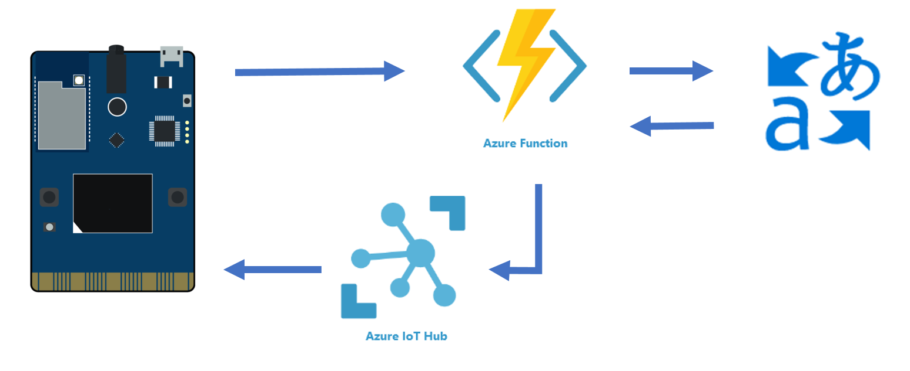

# Use IoT DevKit AZ3166 with Azure Function and Cognitive Services to make a language translator

In this article, you learn how to make IoT DevKit as a language translator by using [Azure Cognitive Services](https://azure.microsoft.com/services/cognitive-services/). It records your voice and translates it to English text shown on the DevKit screen.

The [MXChip IoT DevKit](https://aka.ms/iot-devkit) is an all-in-one Arduino compatible board with rich peripherals and sensors. You can develop for it using [Visual Studio Code extension for Arduino](https://aka.ms/arduino). And it comes with a growing [projects catalog](https://microsoft.github.io/azure-iot-developer-kit/docs/projects/) to guide you prototype Internet of Things (IoT) solutions that take advantage of Microsoft Azure services.

## What you need

Finish the [Getting Started Guide](https://docs.microsoft.com/azure/iot-hub/iot-hub-arduino-iot-devkit-az3166-get-started) to:

* Have your DevKit connected to Wi-Fi
* Prepare the development environment

An active Azure subscription. If you do not have one, you can register via one of these two methods:

* Activate a [free 30-day trial Microsoft Azure account](https://azure.microsoft.com/free/)
* Claim your [Azure credit](https://azure.microsoft.com/pricing/member-offers/msdn-benefits-details/) if you are MSDN or Visual Studio subscriber

## Step 1. Open the project folder

### A. Start VS Code

- Make sure your DevKit is not connected to your PC.
- Start VS Code
- Connect the DevKit to your computer.

### B. Open the Arduino Examples folder

Expand left side **ARDUINO EXAMPLES > Examples for MXCHIP AZ3166 > AzureIoT**, and select **DevKitTranslator**. It opens a new VS Code window with the DEVKITTRANSLATOR project folder in it.

> [!NOTE]
> You can also open example from command palette. Use `Ctrl+Shift+P` (macOS: `Cmd+Shift+P`) to open the command palette, type **Arduino**, and then find and select **Arduino: Examples**.

## Step 2. Provision Azure services

In the solution window, type `Ctrl+P` (macOS: `Cmd+P`) and enter `task cloud-provision`.

In the VS Code terminal, an interactive command line will guide you to provision all necessary Azure services:

## Step 3. Deploy Azure Functions

Use `Ctrl+P` (macOS: `Cmd+P`) to run `task cloud-deploy` to deploy the Azure Functions code. This process usually takes 2 to 5 minutes to complete:

After Azure Function deploys successfully, fill in the azure_config.h file with function app name. You can navigate to [Azure portal](https://portal.azure.com/) to find it:

> [!NOTE]
> If the Azure Function does not work properly, check this [FAQs](https://microsoft.github.io/azure-iot-developer-kit/docs/faq#compilation-error-for-azure-function) section to resolve it.

## Step 4. Build and upload the device code

1. Use `Ctrl+P` (macOS: `Cmd+P`) to run `task config-device-connection`.

2. The terminal will ask you whether you want to use connection string that retrieves from `task cloud-provision` step. You can also input your own device connection string by selecting **'Create New...'**

3. The terminal prompts you to enter configuration mode. To do so, hold down button A, then push and release the reset button. The screen displays the DevKit ID and 'Configuration'.
  

4. After `task config-device-connection` finished, click `F1` to load VS Code commands and select `Arduino: Upload`, then VS Code starts verifying and uploading the Arduino sketch:
  

The DevKit reboots and starts running the code.

## Test the project

After app initialization, follow the instructions on the DevKit screen. The default source language is Chinese.

To select another language for translation:

1. Press button A to enter setup mode.
2. Press button B to scroll all supported source languages.
3. Press button A to confirm your choice of source language.
4. Press and hold button B while speaking, then release button B to initiate the translation.
5. The translated text in English shows on the screen.

On the translation result screen, you can:

- Press button A and B to scroll and select the source language.
- Press button B to talk, release to send the voice and get the translation text

## How it works

The Arduino sketch records your voice then posts an HTTP request to trigger Azure Functions. Azure Functions calls the cognitive service speech translator API to do the translation. After Azure Functions gets the translation text, it sends a C2D message to the device. Then the translation is displayed on the screen.

## Change device ID

The default device ID registered in Azure IoT Hub is **AZ3166**. If you want to modify it, follow [instructions here](https://microsoft.github.io/azure-iot-developer-kit/docs/customize-device-id/).

## Problems and feedback

If you encounter problems, refer to [FAQs](https://microsoft.github.io/azure-iot-developer-kit/docs/faq/) or reach out to us from the following channels:

* [Gitter.im](http://gitter.im/Microsoft/azure-iot-developer-kit)
* [Stackoverflow](https://stackoverflow.com/questions/tagged/iot-devkit)

## Next Steps

Now you make the IoT DevKit as a translator by using Azure Function and Cognitive Services. In this tutorial, you learned how to:

> [!div class="checklist"]
> * Use Visual Studio Code task to automate cloud provisions
> * Configure Azure IoT device connection string
> * Deploy Azure Function
> * Test the voice message translation

Advance to the other tutorials to learn:

> [!div class="nextstepaction"]
> [Connect IoT DevKit AZ3166 to Azure IoT Suite for remote monitoring](https://docs.microsoft.com/en-us/azure/iot-hub/iot-hub-arduino-iot-devkit-az3166-devkit-remote-monitoring)
