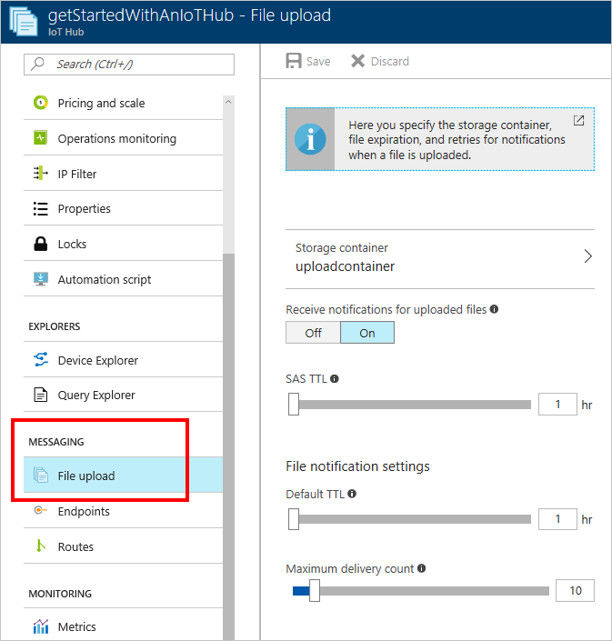
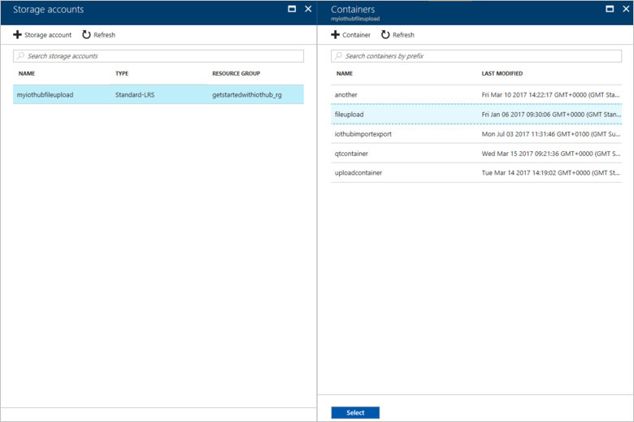
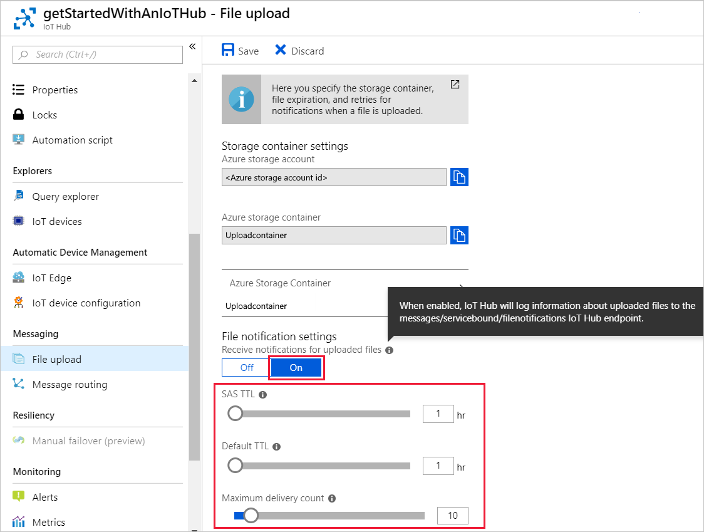

# Configure IoT Hub file uploads using the Azure portal

[!INCLUDE [iot-hub-file-upload-selector](../../includes/iot-hub-file-upload-selector.md)]

## File upload

To use the [file upload functionality in IoT Hub](iot-hub-devguide-file-upload.md), you must first associate an Azure Storage account with your hub. Select **File upload** to display a list of file upload properties for the IoT hub that is being modified.

* **Storage container**: Use the Azure portal to select a blob container in an Azure Storage account in your current Azure subscription to associate with your IoT Hub. If necessary, you can create an Azure Storage account on the **Storage accounts** blade and blob container on the **Containers** blade. IoT Hub automatically generates SAS URIs with write permissions to this blob container for devices to use when they upload files.

* **Receive notifications for uploaded files**: Enable or disable file upload notifications via the toggle.

* **SAS TTL**: This setting is the time-to-live of the SAS URIs returned to the device by IoT Hub. Set to one hour by default but can be customized to other values using the slider.

* **File notification settings default TTL**: The time-to-live of a file upload notification before it is expired. Set to one day by default but can be customized to other values using the slider.

* **File notification maximum delivery count**: The number of times the IoT Hub attempts to deliver a file upload notification. Set to 10 by default but can be customized to other values using the slider.

## Next steps

For more information about the file upload capabilities of IoT Hub, see [Upload files from a device](iot-hub-devguide-file-upload.md) in the IoT Hub developer guide.

Follow these links to learn more about managing Azure IoT Hub:

* [Bulk manage IoT devices](iot-hub-bulk-identity-mgmt.md)
* [IoT Hub metrics](iot-hub-metrics.md)
* [Operations monitoring](iot-hub-operations-monitoring.md)

To further explore the capabilities of IoT Hub, see:

* [IoT Hub developer guide](iot-hub-devguide.md)
* [Deploying AI to edge devices with Azure IoT Edge](../iot-edge/tutorial-simulate-device-linux.md)
* [Secure your IoT solution from the ground up](../iot-fundamentals/iot-security-ground-up)
