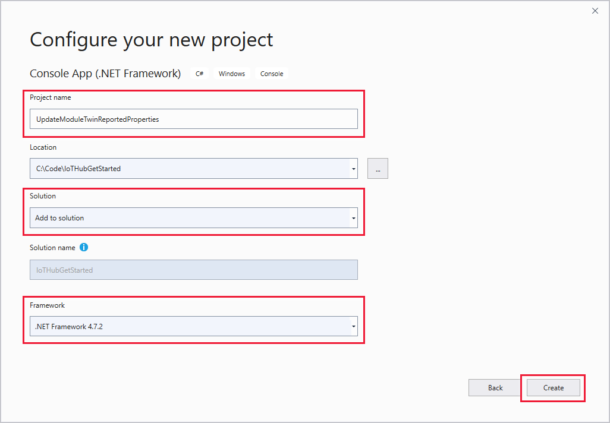
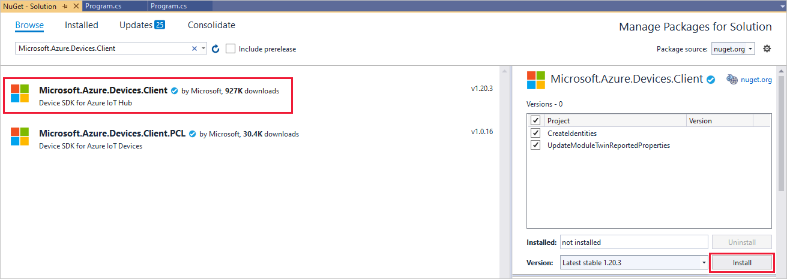

# Get started with IoT Hub module identity and module twin using .NET back end and .NET device

> [!NOTE]
> [Module identities and module twins](iot-hub-devguide-module-twins.md) are similar to Azure IoT Hub device identity and device twin, but provide finer granularity. While Azure IoT Hub device identity and device twin enable the back-end application to configure a device and provides visibility on the device’s conditions, a module identity and module twin provide these capabilities for individual components of a device. On capable devices with multiple components, such as operating system based devices or firmware devices, a module identity and module twin allows for isolated configuration and conditions for each component.

At the end of this tutorial, you'll have two .NET console apps:

* **CreateIdentities**. This app creates a device identity, a module identity, and associated security key to connect your device and module clients.

* **UpdateModuleTwinReportedProperties**. This app sends updated module twin reported properties to your IoT Hub.

> [!NOTE]
> For information about the Azure IoT SDKs that you can use to build both applications to run on devices, and your solution back end, see [Azure IoT SDKs](iot-hub-devguide-sdks.md).

To complete this tutorial, you need the following prerequisites:

* Visual Studio.

* An active Azure account. If you don't have an account, you can create a [free account](https://azure.microsoft.com/pricing/free-trial/) in just a couple of minutes.

## Create an IoT hub

[!INCLUDE [iot-hub-include-create-hub](../../includes/iot-hub-include-create-hub.md)]

## Get the IoT hub connection string

[!INCLUDE [iot-hub-howto-module-twin-shared-access-policy-text](../../includes/iot-hub-howto-module-twin-shared-access-policy-text.md)]

[!INCLUDE [iot-hub-include-find-registryrw-connection-string](../../includes/iot-hub-include-find-registryrw-connection-string.md)]

[!INCLUDE [iot-hub-get-started-create-module-identity-csharp](../../includes/iot-hub-get-started-create-module-identity-csharp.md)]

## Update the module twin using .NET device SDK

In this section, you create a .NET console app on your simulated device that updates the module twin reported properties.

Before you begin, get your module connection string. Sign in to [Azure portal](https://portal.azure.com/). Navigate to your IoT Hub and select **IoT Devices**. Find **myFirstDevice**. Select **myFirstDevice** to open it, and then select **myFirstModule** to open it. In **Module Identity Details**, copy the **Connection string (primary key)** when needed in the following procedure.

   

1. In Visual Studio, add a new project to your solution by selecting **File > New > Project**. In Create a new project, select **Console App (.NET Framework)**, and select **Next**.

1. Name the project **UpdateModuleTwinReportedProperties**. For **Solution**, select **Add to solution**. Make sure the .NET Framework version is 4.6.1 or later.

    

1. In Visual Studio, open **Tools > NuGet Package Manager > Manage NuGet Packages for Solution**. Select the **Browse** tab.
1. Search for **Microsoft.Azure.Devices.Client**. Select it and then select **Install**.

    

1. Add the following `using` statements at the top of the **Program.cs** file:

    ```csharp
    using Microsoft.Azure.Devices.Client;
    using Microsoft.Azure.Devices.Shared;
    using System.Threading.Tasks;
    using Newtonsoft.Json;
    ```

1. Add the following fields to the **Program** class. Replace the placeholder value with the module connection string.

    ```csharp
    private const string ModuleConnectionString = "<Your module connection string>";
    private static ModuleClient Client = null;
    static void ConnectionStatusChangeHandler(ConnectionStatus status, 
      ConnectionStatusChangeReason reason)
    {
        Console.WriteLine("Connection Status Changed to {0}; the reason is {1}", 
          status, reason);
    }
    ```

1. Add the following method **OnDesiredPropertyChanged** to the **Program** class:

    ```csharp
    private static async Task OnDesiredPropertyChanged(TwinCollection desiredProperties, 
      object userContext)
        {
            Console.WriteLine("desired property change:");
            Console.WriteLine(JsonConvert.SerializeObject(desiredProperties));
            Console.WriteLine("Sending current time as reported property");
            TwinCollection reportedProperties = new TwinCollection
            {
                ["DateTimeLastDesiredPropertyChangeReceived"] = DateTime.Now
            };

            await Client.UpdateReportedPropertiesAsync(reportedProperties).ConfigureAwait(false);
        }
    ```

1. Add the following lines to the **Main** method:

    ```csharp
    static void Main(string[] args)
    {
        Microsoft.Azure.Devices.Client.TransportType transport = 
          Microsoft.Azure.Devices.Client.TransportType.Amqp;

        try
        {
            Client = 
              ModuleClient.CreateFromConnectionString(ModuleConnectionString, transport);
            Client.SetConnectionStatusChangesHandler(ConnectionStatusChangeHandler);
            Client.SetDesiredPropertyUpdateCallbackAsync(OnDesiredPropertyChanged, null).Wait();

            Console.WriteLine("Retrieving twin");
            var twinTask = Client.GetTwinAsync();
            twinTask.Wait();
            var twin = twinTask.Result;
            Console.WriteLine(JsonConvert.SerializeObject(twin.Properties)); 

            Console.WriteLine("Sending app start time as reported property");
            TwinCollection reportedProperties = new TwinCollection();
            reportedProperties["DateTimeLastAppLaunch"] = DateTime.Now;

            Client.UpdateReportedPropertiesAsync(reportedProperties);
        }
        catch (AggregateException ex)
        {
            Console.WriteLine("Error in sample: {0}", ex);
        }

        Console.WriteLine("Waiting for Events.  Press enter to exit...");
        Console.ReadLine();
        Client.CloseAsync().Wait();
    }
    ```

    This code sample shows you how to retrieve the module twin and update reported properties with AMQP protocol. In public preview, we only support AMQP for module twin operations.

1. Optionally, you can add these statements to **Main** method to send an event to IoT Hub from your module. Place these lines below the `try catch` block.

    ```csharp
    Byte[] bytes = new Byte[2];
    bytes[0] = 0;
    bytes[1] = 1;
    var sendEventsTask = Client.SendEventAsync(new Message(bytes));
    sendEventsTask.Wait();
    Console.WriteLine("Event sent to IoT Hub.");
    ```

## Run the apps

You can now run the apps. In Visual Studio, in Solution Explorer, right-click your solution, and then click **Set StartUp projects**. Select **Multiple startup projects**, and then select **Start** as the action for the apps, and **OK** to accept your changes. 

And then press F5 to start the apps.

## Next steps

To continue getting started with IoT Hub and to explore other IoT scenarios, see:

* [Getting started with device management](iot-hub-node-node-device-management-get-started.md)
* [Getting started with IoT Edge](../iot-edge/tutorial-simulate-device-linux.md)
