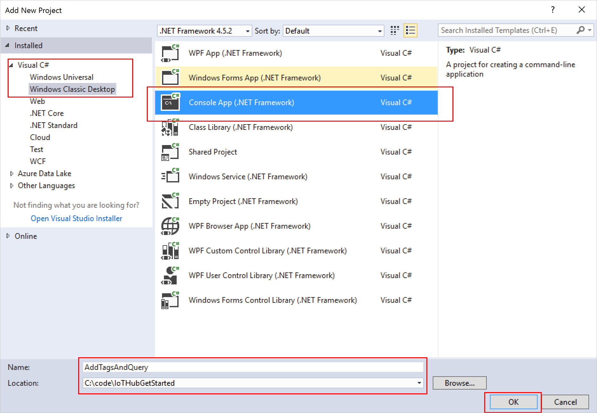
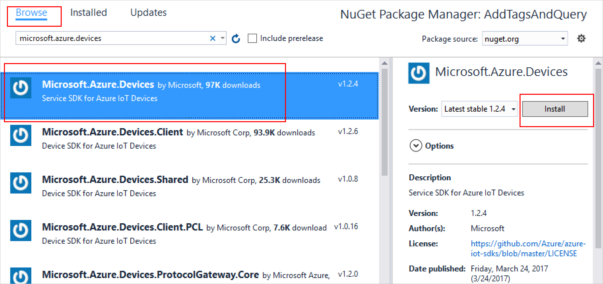
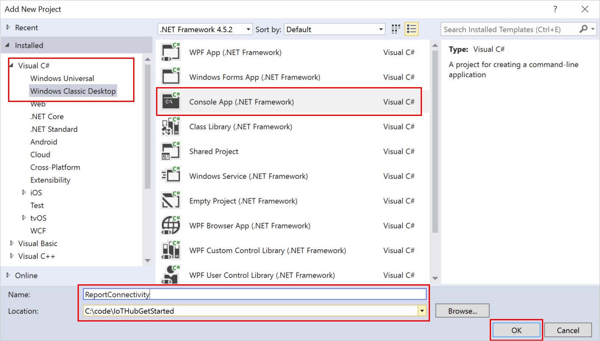
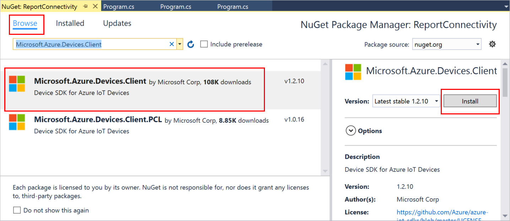

# Get started with device twins (.NET/.NET)
[!INCLUDE [iot-hub-selector-twin-get-started](../../includes/iot-hub-selector-twin-get-started.md)]

At the end of this tutorial, you will have these .NET console apps:

* **CreateDeviceIdentity**, a .NET app which creates a device identity and associated security key to connect your simulated device app.

* **AddTagsAndQuery**, a .NET back-end app which adds tags and queries device twins.

* **ReportConnectivity**, a .NET device app which simulates a device that connects to your IoT hub with the device identity created earlier, and reports its connectivity condition.

> [!NOTE]
> The article [Azure IoT SDKs](iot-hub-devguide-sdks.md) provides information about the Azure IoT SDKs that you can use to build both device and back-end apps.
> 

To complete this tutorial you need the following:

* Visual Studio.
* An active Azure account. (If you don't have an account, you can create a [free account](https://azure.microsoft.com/pricing/free-trial/) in just a couple of minutes.)

## Create an IoT hub

[!INCLUDE [iot-hub-include-create-hub](../../includes/iot-hub-include-create-hub.md)]

## Register a new device in the IoT hub

[!INCLUDE [iot-hub-include-create-device](../../includes/iot-hub-include-create-device.md)]

## Get the IoT hub connection string

In this article, you create a backend service that adds desired properties to a device twin and then queries the identity registry to find all devices with reported properties that have been updated accordingly. To modify desired properties of a device twin your service needs the **service connect** permission. To query the identity registry, your service needs the **registry read** permission. There is no default shared access policy that contains only these two permissions, so you need to create one.

[!INCLUDE [iot-hub-include-find-custom-connection-string](../../includes/iot-hub-include-find-custom-connection-string.md)]

For more information about IoT Hub shared access policies and permissions, see [Access control and permissions](iot-hub-devguide-security.md#access-control-and-permissions).

## Create the service app

In this section, you create a .NET console app (using C#) that adds location metadata to the device twin associated with **myDeviceId**. It then queries the device twins stored in the IoT hub selecting the devices located in the US, and then the ones that reported a cellular connection.

1. In Visual Studio, add a Visual C# Windows Classic Desktop project to the current solution by using the **Console Application** project template. Name the project **AddTagsAndQuery**.
   
    

2. In Solution Explorer, right-click the **AddTagsAndQuery** project, and then click **Manage NuGet Packages...**.

3. In the **NuGet Package Manager** window, select **Browse** and search for **Microsoft.Azure.Devices**. Select **Install** to install the **Microsoft.Azure.Devices** package, and accept the terms of use. This procedure downloads, installs, and adds a reference to the [Azure IoT service SDK](https://www.nuget.org/packages/Microsoft.Azure.Devices/) NuGet package and its dependencies.
   
    

4. Add the following `using` statements at the top of the **Program.cs** file:

    ```csharp  
    using Microsoft.Azure.Devices;
    ```

5. Add the following fields to the **Program** class. Replace the placeholder value with the IoT Hub connection string that you copied previously in [Get the IoT hub connection string](#get-the-iot-hub-connection-string).

    ```csharp  
    static RegistryManager registryManager;
    static string connectionString = "{iot hub connection string}";
    ```

6. Add the following method to the **Program** class:

    ```csharp  
    public static async Task AddTagsAndQuery()
    {
        var twin = await registryManager.GetTwinAsync("myDeviceId");
        var patch =
            @"{
                tags: {
                    location: {
                        region: 'US',
                        plant: 'Redmond43'
                    }
                }
            }";
        await registryManager.UpdateTwinAsync(twin.DeviceId, patch, twin.ETag);
   
        var query = registryManager.CreateQuery(
          "SELECT * FROM devices WHERE tags.location.plant = 'Redmond43'", 100);
        var twinsInRedmond43 = await query.GetNextAsTwinAsync();
        Console.WriteLine("Devices in Redmond43: {0}", 
          string.Join(", ", twinsInRedmond43.Select(t => t.DeviceId)));
   
        query = registryManager.CreateQuery("SELECT * FROM devices WHERE tags.location.plant = 'Redmond43' AND properties.reported.connectivity.type = 'cellular'", 100);
        var twinsInRedmond43UsingCellular = await query.GetNextAsTwinAsync();
        Console.WriteLine("Devices in Redmond43 using cellular network: {0}", 
          string.Join(", ", twinsInRedmond43UsingCellular.Select(t => t.DeviceId)));
    }
    ```
   
    The **RegistryManager** class exposes all the methods required to interact with device twins from the service. The previous code first initializes the **registryManager** object, then retrieves the device twin for **myDeviceId**, and finally updates its tags with the desired location information.
   
    After updating, it executes two queries: the first selects only the device twins of devices located in the **Redmond43** plant, and the second refines the query to select only the devices that are also connected through cellular network.
   
    Note that the previous code, when it creates the **query** object, specifies a maximum number of returned documents. The **query** object contains a **HasMoreResults** boolean property that you can use to invoke the **GetNextAsTwinAsync** methods multiple times to retrieve all results. A method called **GetNextAsJson** is available for results that are not device twins, for example, results of aggregation queries.

7. Finally, add the following lines to the **Main** method:

    ```csharp  
    registryManager = RegistryManager.CreateFromConnectionString(connectionString);
    AddTagsAndQuery().Wait();
    Console.WriteLine("Press Enter to exit.");
    Console.ReadLine();
    ```

8. In the Solution Explorer, open the **Set StartUp projects...** and make sure the **Action** for **AddTagsAndQuery** project is **Start**. Build the solution.

9. Run this application by right-clicking on the **AddTagsAndQuery** project and selecting **Debug**, followed by **Start new instance**. You should see one device in the results for the query asking for all devices located in **Redmond43** and none for the query that restricts the results to devices that use a cellular network.
   
    

In the next section, you create a device app that reports the connectivity information and changes the result of the query in the previous section.

## Create the device app

In this section, you create a .NET console app that connects to your hub as **myDeviceId**, and then updates its reported properties to contain the information that it is connected using a cellular network.

1. In Visual Studio, add a Visual C# Windows Classic Desktop project to the current solution by using the **Console Application** project template. Name the project **ReportConnectivity**.
   
    
    
2. In Solution Explorer, right-click the **ReportConnectivity** project, and then click **Manage NuGet Packages...**.

3. In the **NuGet Package Manager** window, select **Browse** and search for **Microsoft.Azure.Devices.Client**. Select **Install** to install the **Microsoft.Azure.Devices.Client** package, and accept the terms of use. This procedure downloads, installs, and adds a reference to the [Azure IoT device SDK](https://www.nuget.org/packages/Microsoft.Azure.Devices.Client/) NuGet package and its dependencies.
   
    

4. Add the following `using` statements at the top of the **Program.cs** file:

    ```csharp  
    using Microsoft.Azure.Devices.Client;
    using Microsoft.Azure.Devices.Shared;
    using Newtonsoft.Json;
    ```

5. Add the following fields to the **Program** class. Replace the placeholder value with the device connection string that you noted in the previous section.

    ```csharp  
    static string DeviceConnectionString = "HostName=<yourIotHubName>.azure-devices.net;
      DeviceId=<yourIotDeviceName>;SharedAccessKey=<yourIotDeviceAccessKey>";
    static DeviceClient Client = null;
    ```

6. Add the following method to the **Program** class:

    ```csharp
    public static async void InitClient()
    {
        try
        {
            Console.WriteLine("Connecting to hub");
            Client = DeviceClient.CreateFromConnectionString(DeviceConnectionString, 
              TransportType.Mqtt);
            Console.WriteLine("Retrieving twin");
            await Client.GetTwinAsync();
        }
        catch (Exception ex)
        {
            Console.WriteLine();
            Console.WriteLine("Error in sample: {0}", ex.Message);
        }
    }
    ```

    The **Client** object exposes all the methods you require to interact with device twins from the device. The code shown above, initializes the **Client** object, and then retrieves the device twin for **myDeviceId**.

7. Add the following method to the **Program** class:

    ```csharp  
    public static async void ReportConnectivity()
    {
        try
        {
            Console.WriteLine("Sending connectivity data as reported property");
            
            TwinCollection reportedProperties, connectivity;
            reportedProperties = new TwinCollection();
            connectivity = new TwinCollection();
            connectivity["type"] = "cellular";
            reportedProperties["connectivity"] = connectivity;
            await Client.UpdateReportedPropertiesAsync(reportedProperties);
        }
        catch (Exception ex)
        {
            Console.WriteLine();
            Console.WriteLine("Error in sample: {0}", ex.Message);
        }
    }
    ```

   The code above updates **myDeviceId**'s reported property with the connectivity information.

8. Finally, add the following lines to the **Main** method:

    ```csharp
    try
    {
        InitClient();
        ReportConnectivity();
    }
    catch (Exception ex)
    {
        Console.WriteLine();
        Console.WriteLine("Error in sample: {0}", ex.Message);
    }
    Console.WriteLine("Press Enter to exit.");
    Console.ReadLine();
    ```

9. In the Solution Explorer, open the **Set StartUp projects...** and make sure the **Action** for **ReportConnectivity** project is **Start**. Build the solution.

10. Run this application by right-clicking on the **ReportConnectivity** project and selecting **Debug**, followed by **Start new instance**. You should see it getting the twin information, and then sending connectivity as a *reported property*.
   
    
       
11. Now that the device reported its connectivity information, it should appear in both queries. Run the .NET **AddTagsAndQuery** app to run the queries again. This time **myDeviceId** should appear in both query results.
   
    

## Next steps

In this tutorial, you configured a new IoT hub in the Azure portal, and then created a device identity in the IoT hub's identity registry. You added device metadata as tags from a back-end app, and wrote a simulated device app to report device connectivity information in the device twin. You also learned how to query this information using the SQL-like IoT Hub query language.

Use the following resources to learn how to:

* send telemetry from devices with the [Send telemetry from a device to an IoT hub](quickstart-send-telemetry-dotnet.md) tutorial,

* configure devices using device twin's desired properties with the [Use desired properties to configure devices](tutorial-device-twins.md) tutorial,

* control devices interactively (such as turning on a fan from a user-controlled app) with the [Use direct methods](quickstart-control-device-dotnet.md) tutorial.
