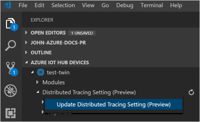
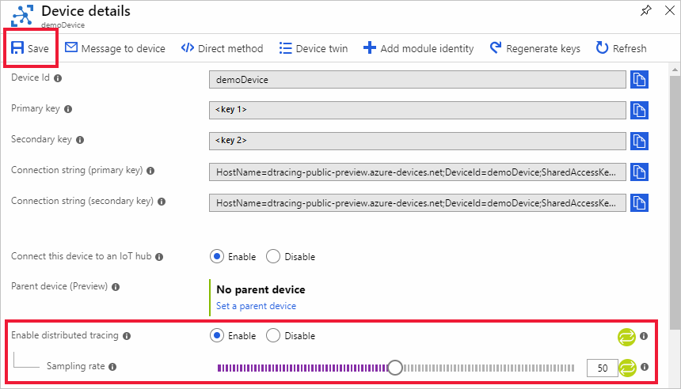

# Add correlation IDs and timestamps to Azure IoT device-to-cloud messages with distributed tracing (preview)

<!---
As your IoT solution grows in size and complexity, so does the difficulty of pinpointing bottlenecks and root causes. For example, you have an IoT solution that uses 5 different Azure services and 1500 active devices. Each device is programmed to send 10 device-to-cloud messages/second (for a total of 15000 messages/second), but you notice that your web app sees only 10000 messages/second - where is the issue? How do you find the culprit?
--->

To better understand the flow of requests or IoT messages across services, consider the [distributed tracing pattern](#Understand-Azure-IoT-distributed-tracing). In this public preview, IoT Hub is one of the first services to support distributed tracing. Enable distributed tracing for IoT Hub to:

- Add correlation IDs (following the [proposed W3C Trace Context format](https://github.com/w3c/trace-context)) to a subset (or all, configured via device twin) of your IoT device-to-cloud messages
- Automatically log the message correlation IDs and timestamps to [Azure Monitor diagnostic logs](iot-hub-monitor-resource-health.md)
- Measure and understand message flow and latency from devices to IoT Hub and routing endpoints 
- Start considering how you will implement distributed tracing for the non-Azure services in your IoT solution

As more Azure services begin to support distributed tracing, you can start tracing IoT messages life cycles throughout Azure. 

[!INCLUDE [iot-hub-basic](../../includes/iot-hub-basic-whole.md)]

## [Bug Bash] Prerequisites
Please ignore the next **Prerequisites** section for bug bash.

- Create IoT Hub under subscription [DEVICEHUB_DEV1](https://ms.portal.azure.com/#@microsoft.onmicrosoft.com/resource/subscriptions/91d12660-3dec-467a-be2a-213b5544ddc0/overview), then create one IoT device(not edge device)
- [Optional] Install VS Code, then download the preview version of Azure IoT Hub Toolkit for VS Code from [here](https://microsoft.sharepoint-df.com/teams/AzureIoTBugbashes/Shared%20Documents/Distributed%20Tracing%20Public%20Preview%20Bug%20Bash/azure-iot-toolkit-2.2.2%20-preview.vsix), and install it ([how to install from a VSIX](https://code.visualstudio.com/docs/editor/extension-gallery#_install-from-a-vsix))
- [Optional] VS 2017 with C++ development feature

If finding any issue during bug bush, please file a bug through [this link](https://dev.azure.com/mseng/VSIoT/_workitems/create/Bug?templateId=d0dfad4a-b90c-4aac-84c4-320acac2381c&ownerId=84f94468-cd47-4af7-887b-bf55a28e67ab). Please send email to xinyiz@microsoft.com to apply permission if you don't have permission to create a bug.

For any questions related the bug bash, please use the team channel [Distributed Tracing Public Preview Bug Bash](https://teams.microsoft.com/l/channel/19%3a74fccb4d41904bdf84a9fe2ef81280b9%40thread.skype/Distributed%2520Tracing%2520Public%2520Preview%2520Bug%2520Bash?groupId=dcc1ac84-f476-4c96-8034-b2d77e54c8bf&tenantId=72f988bf-86f1-41af-91ab-2d7cd011db47) to communicate with us.

## Prerequisites

- [IoT Hub is created](iot-hub-create-through-portal.md)
- You understand [how to send device-to-cloud telemetry messages to IoT Hub](quickstart-send-telemetry-c.md)

## Configure IoT Hub

To config IoT Hub to start logging message correlation IDs and timestamps, turn on the **DistributedTracing** category in IoT Hub's diagnostic settings.

1. Navigate to your IoT hub in Azure portal.

1. Select **Diagnostics settings**.

1. Either **Turn on diagnostics** or, if a diagnostic setting already exists, **Edit setting**.

1. Look for **DistributedTracing**, and check the box next to it.

	

1. Choose where you want to send the logs (Storage, Event Hub, and Log Analytics).

1. **Save** the new settings.

One turned on, IoT Hub records logs when messages containing valid trace properties arrive at the gateway, is ingressed by IoT Hub, and (if enabled) routed to endpoints. To learn more about logs and their schemas, see [Azure IoT Hub diagnostic logs](iot-hub-monitor-resource-health.md#distributed-tracing-preview).

## Enable and configure IoT client devices

[Bug Bash] For Bug Bash, please follow the [instruction](https://microsoft-my.sharepoint.com/:w:/r/personal/rajeevma_microsoft_com/_layouts/15/Doc.aspx?sourcedoc=%7Bd1515522-38d5-40de-bba9-65349dd6fe5b%7D) to run IoT client application, and you may ignore the next section **Deploy client application to your IoT device**

### Deploy client application to your IoT device

If you're using the [Azure IoT device SDK for C](iot-hub-device-sdk-c-intro.md) (other SDK languages will be supported by general availability), follow these instructions to update your code:

1. Download and install the C SDK version x.x on the device.

1. Add the API call `IoTHubClientCore_EnableFeatureConfigurationViaTwin()`.

1. Compile and run the application. The device starts to listen for instructions on how often to add trace properties to messages (sampling) via the device twin.

1. Repeat steps 1 through 3 for each device you want to participate in distributed tracing.

1. Move on to [Configure the percentage of messages sampled using device twin](#configure-the-percentage-of-messages-sampled-using-device-twin).

For a client app that can receive sampling decisions from the cloud, check out [this sample](https://aka.ms/iottracingCsample). 

If you're not using the C SDK, and still would like preview distributed tracing for IoT Hub, construct the message to contain a `tracestate` application property with the creation time of the message in the unix timestamp format. For example, `tracestate=creationtimeutc=1539243209`. To control the percentage of messages containing this property, implement logic to listen to cloud-initiated events such as twin updates.

### Configure the percentage of messages sampled using Azure IoT Hub Toolkit

To use VS Code to configure distributed tracing, you have to install VS Code and preview version of Azure IoT Hub Toolkit as stated in **Prerequisites**

1. Open VS Code, set up IoT Hub connection string for your IoT Hub just created. You may refer to [how to set up IoT Hub connection string](https://marketplace.visualstudio.com/items?itemName=vsciot-vscode.azure-iot-toolkit#user-content-prerequisites)

1. Expand the device just created, click context menu *Update Distributed Tracing Setting (Preview)* of sub node Distributed Tracing Setting (Preview)

    

1. In popup window, select 'Enable' first, then press Enter to confirm 100 as sampling rate

    

    

### Configure the percentage of messages sampled using device twin

To limit or control the percentage of messages to be traced, update the twin. You can use whatever way you like (JSON editor in portal, IoT Hub service SDK, etc.) to update it. For the best experience, use the Azure portal:

1. Navigate to your IoT hub in Azure portal, then click **IoT devices**

1. Click your device

1. Look for **Distributed Tracing (Preview)**, then click **Enable**

    

1. Choose a **Sampling rate** between 0% and 100%.

1. Click **Save**

1. If successfully acknowledged by device, a check mark is shown (*pending*)

This doesn't do anything unless your device is set up to listen to twin changes by following the [Deploy client application to your IoT device](#deploy-client-application-to-your-IoT-device) section.

To update the distributed tracing sampling configuration for multiple devices, use [automatic device configuration](iot-hub-auto-device-config.md) 

#### Twin schema

The exact JSON schema is shown in the following snippet. Changes in the UX directly update the [desired properties section](iot-hub-devguide-device-twins.md#device-twins) and vise versa.

```json
{
	"properties": {
		"desired": {
			"azureiot*com^dtracing^1*0*0": {
				"sampling_mode": 2,
				"sampling_rate": 10
			}
		},
		"reported": {
			"__iot:interfaces": {
				"azureiot*com^dtracing^1*0*0": {
					"@id": "http://azureiot.com/dtracing/1.0.0"
				}
			},
			"azureiot*com^dtracing^1*0*0": {
				"sampling_mode": {
					"value": 10,
					"status": {
						"code": 102,
						"version": 3,
						"description": "Completed"
					}
				},
				"sampling_rate": 10
			}
		}
	}
}
```

| Element name | Required | Type | Description |
|-----------------|----------|---------|-----------------------------------------------------|
| `sampling_mode` | Yes | Integer | Two possible values where `1` is On and `2` is Off |
| `sampling_rate` | Yes | Integer | Only values from 0 to 100 permitted (inclusive) |


## Query and visualize

### Query using Storage or Log Analytics

If you've set up [Log Analytics with diagnostic logs](../azure-monitor/platform/diagnostic-logs-stream-log-store.md), query by looking for logs in the `DistributedTracing` category. For example, you may want to trace one message with a specific trace ID. Here's how it would look.

Query to show life cycle of message with correlation ID `8cd869a412459a25f5b4f31311223344`:

```Kusto
AzureDiagnostics
| where category == "DistributedTracing" and CorrelationId contains "8cd869a412459a25f5b4f31311223344"
```

Example logs as shown by Log Analytics:

| TimeGenerated | OperationName | Category | Level | CorrelationId | DurationMs | Properties |
|--------------------------|---------------|--------------------|---------------|---------------------------------------------------------|------------|------------------------------------------------------------------------------------------------------------------------------------------|
| 2018-02-22T03:28:28.633Z | DiagnosticIoTHubD2C | DistributedTracing | Informational | 00-8cd869a412459a25f5b4f31311223344-0144d2590aacd909-01 |  | {"deviceId":"AZ3166","messageSize":"96","callerLocalTimeUtc":"2018-02-22T03:27:28.633Z","calleeLocalTimeUtc":"2018-02-22T03:27:28.687Z"} |
| 2018-02-22T03:28:38.633Z | DiagnosticIoTHubIngress | DistributedTracing | Informational | 00-8cd869a412459a25f5b4f31311223344-349810a9bbd28730-01 | 20 | {"isRoutingEnabled":"false","parentSpanId":"0144d2590aacd909"} |
| 2018-02-22T03:28:48.633Z | DiagnosticIoTHubEgress | DistributedTracing | Informational | 00-8cd869a412459a25f5b4f31311223344-349810a9bbd28730-01 | 23 | {"endpointType":"EventHub","endpointName":"myEventHub", "parentSpanId":"0144d2590aacd909"} |

### Application Map

[Bug Bash] We provide a tool to simplify exporting distributed tracing from Azure Monitor to Application Insights. The tool is available [here](https://github.com/Azure-Samples/e2e-diagnostic-provision-cli).

To visualize the flow of IoT messages participating distributed tracing, set up the Application Map sample app. It works by piping date from IoT Hub to Azure Monitor, which pipes to storage, then to [Application Map](../application-insights/app-insights-app-map.md).


> [!div class="button"]
<a href="https://aka.ms/iottracingsample" target="_blank">Get the sample on Github</a>

## Understand Azure IoT distributed tracing

[TBD](https://docs.microsoft.com/azure/architecture/microservices/logging-monitoring#distributed-tracing).

## [Bug Bash] Clean up

1. Delete IoT Hub you created for bug bash

1. Uninstall preview version of Azure IoT Hub Toolkit and re-install official version from Extension tab if necessary

## Limits of the public preview 

- Proposal for W3C Trace Context standard is still in draft.
- The only language supported by client SDK is C for now.
- For Basic SKUs, the cloud-to-device twin capability is not available. However, IoT Hub will still log to Azure Monitor if it sees a properly composed trace context header.
- We will be implementing an explicit throttle control to prevent abuse

## Next steps

* To learn more about the general distributed tracing pattern in microservices, see [Microservice architecture pattern: distributed tracing](https://microservices.io/patterns/observability/distributed-tracing.html).
* To set up configuration to apply distributed tracing settings to a large number of devices, see [Configure and monitor IoT devices at scale](iot-hub-auto-device-config.md).
* To learn more about Azure Monitor, see [What is Azure Monitor?](../azure-monitor/overview.md).
