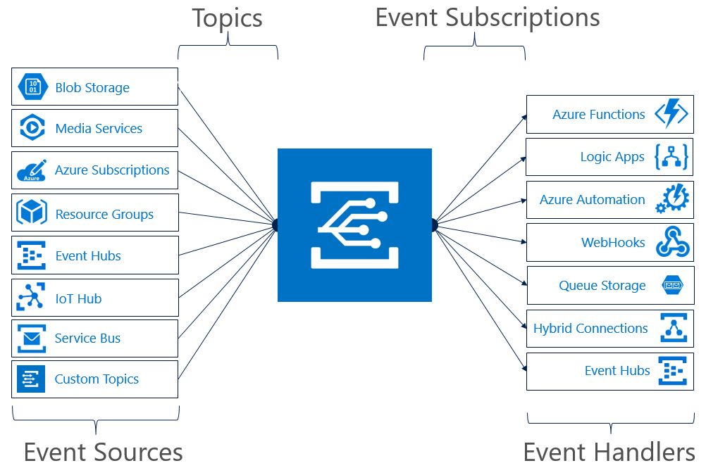

# React to IoT Hub events by using Event Grid to trigger actions - Preview

Automate your Internet of Things (IoT) scenario by setting alerts based on Azure IoT Hub service events and triggering downstream processes. Azure IoT Hub works with [Azure Event Grid][lnk-eg-overview] for near-real time event routing.   

Azure Event Grid is a fully managed event routing service that uses a publish-subscribe model. Event Grid has built-in support for Azure services, including serverless applications like [Azure Functions](../azure-functions/functions-overview.md) and [Azure Logic Apps](../logic-apps/logic-apps-what-are-logic-apps.md), as well as non-Azure services using webhooks. 

The integration of Iot Hub and Event Grid enables publishing IoT Hub device lifecycle events in a reliable and scalable way. For example, build an application to automatically perform multiple actions like updating a database, creating a ticket, and delivering an email notification every time a new IoT device is registered to your IoT hub. 

For a complete list of the event handlers that Event Grid supports, see [An introduction to Azure Event Grid][lnk-eg-overview]. 



## Regional availability

The Event Grid integration is in public preview, so is available in a limited number of regions. The integration works for IoT hubs located in the following regions:

* Central US
* East US
* East US 2
* West Central US
* West US
* West US 2

## Event types

IoT Hub publishes the following event types: 

| Event type | Description |
| ---------- | ----------- |
| Microsoft.Devices.DeviceCreated | Published when a device is registered to an IoT hub. |
| Microsoft.Devices.DeviceDeleted | Published when a device is deleted from an IoT hub. | 

Use either the Azure portal or Azure CLI to configure which events to publish from each IoT hub. For an example, try the tutorial [Send email notifications about Azure IoT Hub events using Logic Apps](../event-grid/publish-iot-hub-events-to-logic-apps.md). 

## Event schema

IoT Hub events contain all the information you need to respond to changes in your device lifecycle. You can identify an IoT Hub event by checking that the eventType property starts with **Microsoft.Devices**. For more information about how to use Event Grid event properties, see the [Event Grid event schema](../event-grid/event-schema.md).

### Device created schema

The following example shows the schema of a device created event: 

```json
[{
  "id": "56afc886-767b-d359-d59e-0da7877166b2",
  "topic": "/SUBSCRIPTIONS/<subscription ID>/RESOURCEGROUPS/<resource group name>/PROVIDERS/MICROSOFT.DEVICES/IOTHUBS/<hub name>",
  "subject": "devices/LogicAppTestDevice",
  "eventType": "Microsoft.Devices.DeviceCreated",
  "eventTime": "2018-01-02T19:17:44.4383997Z",
  "data": {
    "twin": {
      "deviceId": "LogicAppTestDevice",
      "etag": "AAAAAAAAAAE=",
      "status": "enabled",
      "statusUpdateTime": "0001-01-01T00:00:00",
      "connectionState": "Disconnected",
      "lastActivityTime": "0001-01-01T00:00:00",
      "cloudToDeviceMessageCount": 0,
      "authenticationType": "sas",
      "x509Thumbprint": {
        "primaryThumbprint": null,
        "secondaryThumbprint": null
      },
      "version": 2,
      "properties": {
        "desired": {
          "$metadata": {
            "$lastUpdated": "2018-01-02T19:17:44.4383997Z"
          },
          "$version": 1
        },
        "reported": {
          "$metadata": {
            "$lastUpdated": "2018-01-02T19:17:44.4383997Z"
          },
          "$version": 1
        }
      }
    },
    "hubName": "egtesthub1",
    "deviceId": "LogicAppTestDevice",
    "operationTimestamp": "2018-01-02T19:17:44.4383997Z",
    "opType": "DeviceCreated"
  },
  "dataVersion": "",
  "metadataVersion": "1"
}]
```

For a detailed description of each property, see [Azure Event Grid event schema for IoT Hub](../event-grid/event-schema-iot-hub.md)

## Filter events

IoT Hub event subscriptions can filter events based on event type and device name. Subject filters in Event Grid work based on **prefix** and **suffix** matches, so that events with a matching subject are delivered to the subscriber. 

The subject of IoT Events uses the format:

```json
devices/{deviceId}
```

### Tips for consuming events

Applications that handle IoT Hub events should follow these suggested practices:

* Multiple subscriptions can be configured to route events to the same event handler, so it's important not to assume that events are from a particular source. Always check the message topic to ensure that it comes from the IoT hub that you expect. 
* Don't assume that all events your receive will be the types that you expect. Always check the eventType before processing the message.
* Messages can arrive out of order or after a delay. Use the etag field to understand if your information about objects is up-to-date.


## Next steps

* [Try the IoT Hub events tutorial](../event-grid/publish-iot-hub-events-to-logic-apps.md)
* [Learn more about Event Grid][lnk-eg-overview]
* [Compare the differences between routing IoT Hub events and messages][lnk-eg-compare]

<!-- Links -->
[lnk-eg-overview]: ../event-grid/overview.md
[lnk-eg-compare]: iot-hub-event-grid-routing-comparison.md