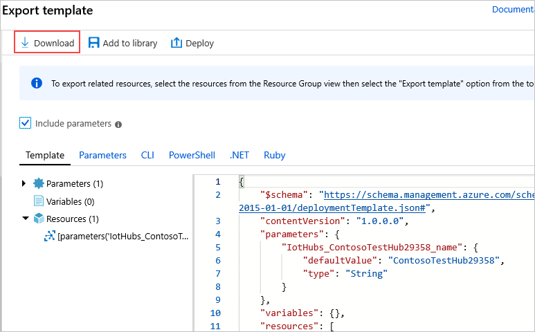
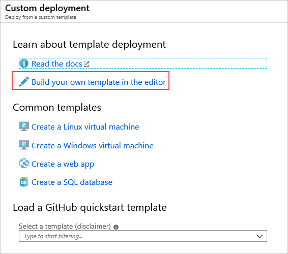
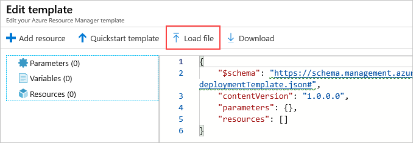
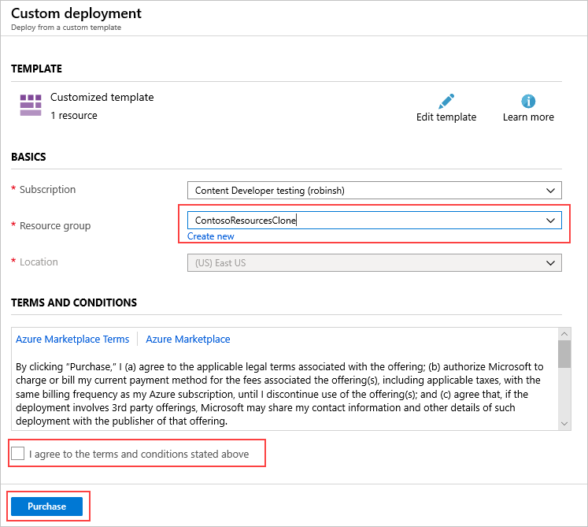

# How to clone an Azure IoT hub 

This article explores ways to clone an IoT Hub and provides some questions you need to answer before you start. There are several reasons you might want to clone an IoT hub from one region to another. 

* You want to migrate your hub from the Free or Basic tier to a Standard tier. You can't change the tier of a hub using the Azure portal, Azure PowerShell, or Azure CLI.

* You are moving your company from one region to another, such as from Europe to North America (or vice versa), and you want your resources and data to be geographically close to your new location.

* You are setting up a hub for a development vs production environment.

* You want to do a custom implementation of multi-hub high availability. For more information, see the [How to achieve cross region HA section of IoT Hub high availability and disaster recovery](https://docs.microsoft.com/en-us/azure/iot-hub/iot-hub-ha-dr#achieve-cross-region-ha).

To move a hub to a different region, you need a subscription with administrative access to the original hub. You can put the new hub in a new resource group and region, in the same subscription as the original hub, or even in a new subscription. You just can't use the same name because the hub name has to be globally unique.

> [!NOTE]
> At this time, there's no first-class feature for cloning an IoT hub. It's primarily a manual process, and thus is fairly error-prone. The complexity of cloning a hub is directly proportional to the simplicity of the hub. For example, cloning an IoT hub with no message routing is fairly simple. If you add message routing as just one complexity, cloning the hub becomes at least an order of magnitude more complicated.

## Things to consider

There are several things to consider when cloning an IoT hub.

* Do not remove the original resources before creating and verifying the cloned version. Once you remove a hub, it's gone forever, and there is no way to recover it to check the settings or data to make sure you had replicated them correctly.

* Many resources require globally unique names, so you must use different names for the cloned versions. Also use a different name for the resource group to which the cloned hub belongs. 

* Data for the original IoT hub is not migrated. This includes telemetry messages, cloud-to-device (C2D) commands, and job-related information such as schedules and history. Metrics and logging results are also not migrated. 

* For data or messages routed to Azure Storage, you can leave the data in the original storage account, or transfer that data to a new storage account in the new region. For more information on moving data in Blob storage, see [Get started with AzCopy](../storage/common/storage-use-azcopy-v10.md).

* Data for Event Hubs and for Service Bus Topics and Queues can not be migrated. This is point-in-time data and is not stored after the messages are processed.

* You need to schedule downtime for the migration. Cloning the devices to the new hub takes time. It can take up to a second to move 100 devices. If you interpolate that upward, it may take 3 hours to move a million devices. 

* You can copy the devices to the new hub without shutting down or changing the devices. The device have to be modified to use the new hub. For example, if using a connection string on the device to the hub, it has to be updated to point to the new hub instead of the old one.

* You need to update any certificates you are using so you can use them with the new resources. Also, you probably have the hub defined in a DNS table somewhere -- this needs to be updated as well.

## Methodology 

This is the general method we recommend for moving an IoT Hub from one region to another. This assumes the hub does not have any custom message routing. See the [section on Routing](#routing) for ideas if you want to move a hub using the message routing feature.

   1. Export the hub and its settings to a Resource Manager template. 
   
   1. Make the necessary changes to the template, such as updating all occurrences of the name and the location for the cloned hub.
   
   1. Import the template into a new resource group in the new location. This creates the clone.

   1. Debug as needed. 
   
   1. Add anything that wasn't exported to the template. 
   
       For example, consumer group is not exported to the template. You need to add the consumer group to the template manually or use the [Azure portal](https://portal.azure.com) after the hub is created. There is an example of adding consumer group to a template in the article [Use an Azure Resource Manager template to configure IoT Hub message routing](tutorial-routing-config-message-routing-rm-template.md).

   1. Copy the devices from the original hub to the clone. This is covered in the section [Managing the devices registered to the IoT hub](#managing-the-devices-registered-to-the-iot-hub).

## Steps for migrating the hub to another region

This section outlines provides instructions for migrating a hub.

### Find the original hub and export it to a resource template.

1. Sign into the [Azure portal](https://portal.azure.com). 

1. Go to **Resource Group** and select the resource group that contains the hub you want to move. You can also go to **Resources** and find the hub that way. Click on the hub.

1. Select **Export template** from the list of properties and settings for the hub. 

   

1. Select **Download** to download the template. Save the file somewhere you can find it again. 

   

### View the template 

1. Go to the Downloads folder (or to whatever folder you exported the template) and find the zip file. In the zip file, the template name is in the format `ExportedTemplate-<ResourceGroupName>`. This example shows a generic hub with no routing configuration. It is an S1 tier hub (with 1 unit) called **ContosoTestHub29358** in region **westus**. Extract that one file (template.json) from the zip file so you can edit it. Here is the template exported in this example.

    ```json
    {
        "$schema": "https://schema.management.azure.com/schemas/2015-01-01/deploymentTemplate.json#",
        "contentVersion": "1.0.0.0",
        "parameters": {
            "IotHubs_ContosoTestHub29358_name": {
                "defaultValue": "ContosoTestHub29358",
                "type": "String"
            }
        },
        "variables": {},
        "resources": [
            {
                "type": "Microsoft.Devices/IotHubs",
                "apiVersion": "2018-04-01",
                "name": "[parameters('IotHubs_ContosoTestHub29358_name')]",
                "location": "westus",
                "sku": {
                    "name": "S1",
                    "tier": "Standard",
                    "capacity": 1
                },
                "properties": {
                    "operationsMonitoringProperties": {
                        "events": {
                            "None": "None",
                            "Connections": "None",
                            "DeviceTelemetry": "None",
                            "C2DCommands": "None",
                            "DeviceIdentityOperations": "None",
                            "FileUploadOperations": "None",
                            "Routes": "None"
                        }
                    },
                    "ipFilterRules": [],
                    "eventHubEndpoints": {
                        "events": {
                            "retentionTimeInDays": 1,
                            "partitionCount": 2,
                            "partitionIds": [
                                "0",
                                "1"
                            ],
                            "path": "contosotesthub29358",
                            "endpoint": "sb://iothub-ns-contosotes-2227755-92aefc8b73.servicebus.windows.net/"
                        },
                        "operationsMonitoringEvents": {
                            "retentionTimeInDays": 1,
                            "partitionCount": 2,
                            "partitionIds": [
                                "0",
                                "1"
                            ],
                            "path": "contosotesthub29358-operationmonitoring",
                            "endpoint": "sb://iothub-ns-contosotes-2227755-92aefc8b73.servicebus.windows.net/"
                        }
                    },
                    "routing": {
                        "endpoints": {
                            "serviceBusQueues": [],
                            "serviceBusTopics": [],
                            "eventHubs": [],
                            "storageContainers": []
                        },
                        "routes": [],
                        "fallbackRoute": {
                            "name": "$fallback",
                            "source": "DeviceMessages",
                            "condition": "true",
                            "endpointNames": [
                                "events"
                            ],
                            "isEnabled": true
                        }
                    },
                    "storageEndpoints": {
                        "$default": {
                            "sasTtlAsIso8601": "PT1H",
                            "connectionString": "",
                            "containerName": ""
                        }
                    },
                    "messagingEndpoints": {
                        "fileNotifications": {
                            "lockDurationAsIso8601": "PT1M",
                            "ttlAsIso8601": "PT1H",
                            "maxDeliveryCount": 10
                        }
                    },
                    "enableFileUploadNotifications": false,
                    "cloudToDevice": {
                        "maxDeliveryCount": 10,
                        "defaultTtlAsIso8601": "PT1H",
                        "feedback": {
                            "lockDurationAsIso8601": "PT1M",
                            "ttlAsIso8601": "PT1H",
                            "maxDeliveryCount": 10
                        }
                    },
                    "features": "None"
                }
            }
        ]
    }
    ```

### Edit the template 

You have to make some changes before you can use the template to create the new hub in the new region. Use [VS Code](https://code.visualstudio.com) or a text editor to edit the template.

1. Remove the parameters section at the top -- it is much simpler to just use the hub name because we're not going to have multiple parameters. 

    ``` json
        "parameters": {
            "IotHubs_ContosoTestHub29358_name": {
                "defaultValue": "ContosoTestHub29358",
                "type": "String"
            }
        },
    ```

1. Change the name to use the actual (new) name rather than retrieving it from a parameter (which you removed in the previous step). 

    For the new hub, use the name of the original hub plus the string *clone* to make up the new name. Start by cleaning up the hub name and location.
    
    Old version:

    ```json 
    "name": "[parameters('IotHubs_ContosoTestHub29358_name')]",
    "location": "westus",
    ```
    
    New version: 

    ```json 
    "name": "IotHubs_ContosoTestHub29358clone",
    "location": "eastus",
    ```

    Next, you'll find that the values for **path** contain the old hub name. Change them to use the new one. These are the path values under **eventHubEndpoints** called **events** and **OperationsMonitoringEvents**.

    When you're done, your event hub endpoints section should look like this:

    ```json
    "eventHubEndpoints": {
        "events": {
            "retentionTimeInDays": 1,
            "partitionCount": 2,
            "partitionIds": [
                "0",
                "1"
            ],
            "path": "contosotesthub29358clone",
            "endpoint": "sb://iothub-ns-contosotes-2227755-92aefc8b73.servicebus.windows.net/"
        },
        "operationsMonitoringEvents": {
            "retentionTimeInDays": 1,
            "partitionCount": 2,
            "partitionIds": [
                "0",
                "1"
            ],
            "path": "contosotesthub29358clone-operationmonitoring",
            "endpoint": "sb://iothub-ns-contosotes-2227755-92aefc8b73.servicebus.windows.net/"
        }
    ```

### Create a new hub in the new region by loading the template

Now create the new hub in the new location.

1. Sign into the [Azure portal](https://portal.azure.com).

1. Select **Create a resource**. 

1. In the search box, put in "template deployment" and select Enter.

1. Select **template deployment (deploy using custom**. This takes you to a screen for the Template deployment. Select **Create**. You see this screen:

   

1. Select **Build your own template in the editor**, which enables you to upload your template from a file. 

1. Select **Load file**. 

   

1. Browse for the new template you edited and select it, then select **Open**. It loads your template in the edit window. Select **Save**. 

   

1. Fill in the following fields.

   **Subscription**: select the subscription to use.

   **Resource group**: create a new resource group in a new location. If you already have a new one set up, you can select it instead of creating a new one.

   **Location**: this is be filled in for you to match the location of the resource group.

   **I agree checkbox**: this basically says that you agree to pay for the resource(s) you're creating.

1. Select the **Purchase** button.

It now validates your template and deploys your cloned hub. 

## Managing the devices registered to the IoT hub

Now that you have your clone up and running, you need to copy all of the devices from the original hub to the clone. To do this, you can use the C# Import/Export sample app. This application targets .NET Core, so you can run it on either Windows or Linux.

### The sample code, explained

1. Use the IoT C# samples from this page: [Azure IoT Samples for C#](https://azure.microsoft.com/en-us/resources/samples/azure-iot-samples-csharp/.) Download the zip file and unzip it on your computer. 

1. The pertinent code is in ./iot-hub/Samples/service/ImportExportDevicesSample. You can use VSCode or Visual Studio to edit the code if needed.

1. **Program.cs** calls ImportExportDevicesSample.cs, which contains the code for various import/export procedures.

1. **ImportExportDevicesSample** has multiple methods. Comment out the method calls you don't want to run. Note especially that there are two calls that enable you to remove all devices from the source and/or destination hub. Be very sure that's what you want when you run one of those, because there is no going back. Once the devices are deleted, they are gone. Here's what's in this class:

    **RunSampleAsync** -- this is the driving method where you comment out the bits you don't want to run. 

    **CopyAllDevicesToNewHub** -- this copies all the devices from one hub to another. In our case, it is used to copy the devices from the original hub to the clone. 

    **GenerateAndAddDevices** -- for testing -- this generates new devices with random device names, complete with encryption keys, and registers those new devices with the original hub. You could use this for testing -- create a hub, generate 100 devices on it, clone the hub, then copy those 100 devices to the clone and check out the results. 

    **ExportDevices** -- this exports the list of devices from the IoT Hub to a file in blob storage. You could use this to view the list of registered devices, or to back up your existing devices before making bulk changes to your identity registry.

    **DeleteAllDevicesFromHub** -- this deletes all of the devices registered for an IoT hub. Use this with care. There are two of these -- one for the source hub and one for the destination hub.

In general, all of the method calls should be commented out in **RunSampleAsync** except for **CopyAllDevicesToNewHub**. 

### Run the sample code

You can run the application by setting environment variables and then running the application in Visual Studio or from the command line. You can also pass in the variables as arguments on the command line. We'll look at how to use environment variables. 

#### Set the environment variables

1. To run the sample, you need the connection strings to the old and new IoT hubs, and to a storage account you can use for temporary work files. 

1. To get the connection string values, sign in to the [Azure portal](https://portal.azure.com). 

1. Put the connection strings somewhere you can retrieve them, such as NotePad. Copy the following, then you can paste the connection strings in directly. Don't add spaces around the equal sign, or it changes the variable name. Also, you do not need double-quotes around the connection strings. If you put quotes around the storage account connection string, it won't work.

For Windows, this is how the environment variables are defined on the command line:

   ```command  
   SET IOTHUB_CONN_STRING=<put connection string to original IoT Hub here>
   SET DEST_IOTHUB_CONN_STRING=<put connection string to destination or clone IoT Hub here>
   SET STORAGE_ACCT_CONN_STRING=<put connection string to the storage account here>
   ```

For Linux, this is how the environment variables are defined:

   ```command  
   export IOTHUB_CONN_STRING="<put connection string to original IoT Hub here>"
   export DEST_IOTHUB_CONN_STRING="<put connection string to destination or clone IoT Hub here>"
   export STORAGE_ACCT_CONN_STRING="<put connection string to the storage account here>"
   ```

1. For the IoT hub connection strings, go to each hub in the portal. You can search in **Resources** for the hub. If you know the Resource Group, you can go to **Resource groups**, select your resource group, and then select the hub from the list of assets in that resource group. 

1. Select **Shared access policies** from the Settings for the hub, then select **iothubowner** and copy one of the connection strings. Do the same for the destination hub. Add them to the appropriate SET commands.

1. For the storage account connection string, find the storage account in **Resources** or under its **Resource group** and open it. 
   
1. Under the Settings section, select **Access keys** and copy one of the connection strings. Put the connection string in your text file for the appropriate SET command. 

Now that your environment variables are ready, let's set them and run the application.

#### Running the sample application

1. Open a Command Prompt window and navigate to `./iot-hub/Samples/service/` in your unzipped project folder. This is where you run the application.

1. Copy the commands that set the environment variables, one at a time, and paste them into the Command Prompt window and select Enter. When you're finished, you can type `SET` in the Command Prompt window and it shows your connection strings. Once you've copied these into the Command Prompt window, you don't have to copy them again, unless you open a new Command Prompt window.

1.  Make sure the methods you don't want to run (such as DeleteAllDevicesFromHub) are commented out in ImportExportDevicesSample.cs. 

1. To run the application in Visual Studio, run this command in the command line window to open the solution in Visual Studio. You must do this in the same command window where you set the environment variables.

    ```command       
    ImportExportDevicesSample.sln
    ```

    Right-click on the project ImportExportDevicesSample and select **Set as startup project**.    
    
    Select F5 to run the application. 

1. To run the application without using Visual Studio, you can type this command in the same command window where you set the environment variables. It builds and then runs the application.

    ```command
    dotnet run --project ImportExportDevicesSample
    ```

1. Go to the new hub using the [Azure portal](https://portal.azure.com). Select your hub, then select **IoT Devices**. You see the devices you just copied from the old hub to the clone. You can also view the properties for the clone. 

1. To check for errors, go to the Azure storage account in the [Azure portal](https://portal.azure.com) and look in the `devicefiles` container for the `ImportErrors.log`. If this file is empty, there were no errors. If you try to import the same device more than once, it rejects the device the second time and adds an error message to the log file.

At this point, you have copied your hub to the new regions, and migrated the devices to the new clone. Make the changes needed to make sure the devices work with the cloned hub, and you should be finished.

## Routing 

If your hub uses [custom routing](iot-hub-devguide-messages-read-custom.md), exporting the template for the hub includes the routing configuration. However, it does not export resources used for the routing. For example, you can set up routing on your hub to send all messages containing the string *critical* to Azure Storage. When you export that hub to a template, it includes the routing configuration required to send messages meeting that condition to a storage account. However, it does not create the storage account, so the routing fails. 

> [!NOTE]
> If your hub uses [message enhancements](iot-hub-message-enrichments-overview.md), you will have to set them up manually on the new IoT hub, as they are not exported with the Resource Manager template.
> 

### Migrate the routing resources

In these steps, you export the template for the hub, then create resources used by the routing, the use the template for the hub to create the hub. You can create the routing resources using the Azure portal]*(https://portal.azure.com), or by exporting the Resource Manager template for each of the resources used by the message routing, editing them, and importing them. After the resources are set up, you can import the hub's template (which includes the routing configuration).

1. Export the hub and its routing configuration to a Resource Manager template. 

1. Next, create each resource used by the routing. You can do this manually using the [Azure portal](https://portal.azure.com), or create the resources using Resource Manager templates. If you want to use templates, these are the steps to follow:

    1. For each resource used by the routing, export it to a Resource Manager template.
    
    1. Update the name and location of the resource. 

    1. Update any cross-references between the resources. For example, if you create a template for a new storage account, you need to update the storage account name in that template and any other template that references it. In most cases, the routing section in the template for the hub is the only other template that references the resource. 

    1. Import each of the templates, which deploys each resource.

    Once the resources used by the routing are set up and running, you can continue.

1. Edit the template for the IoT hub and change the name of the hub to its new name. Also, if you haven't already done so, update the resource names in the routing section of the template to match the new resource names.

1. Import the hub's template to create the hub and the routing configuration.

1. Copy the devices from the original hub to the clone. This is covered in the section [Managing the devices registered to the IoT hub](#managing-the-devices-registered-to-the-iot-hub).

## Checking the results 

To check the results, change your IoT solution to point to your new hub in its new location and run it. In other words, perform the same actions with the new hub that you performed with the previous hub and make sure they work correctly. 

If you have implemented routing, test that and make sure your messages are routed to the new resources correctly.

## Next steps

You have cloned an IoT hub into a new hub in a new region, complete with the devices. For more information about performing bulk operations against the identity registry in an IoT Hub, see [Import and export IoT Hub device identities in bulk](iot-hub-bulk-identity-mgmt.md).

For more information about IoT Hub and development for the hub, please see the following articles.

* [IoT Hub developer's guide](iot-hub-devguide.md)

* [IoT Hub routing tutorial](tutorial-routing.md)

* [IoT Hub device management overview](iot-hub-device-management-overview.md)

* If you want to deploy the sample application, please see [.NET Core application deployment](https://docs.microsoft.com/en-us/dotnet/core/deploying/index).