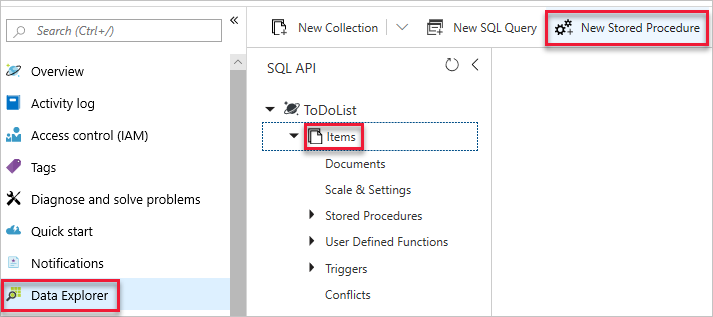
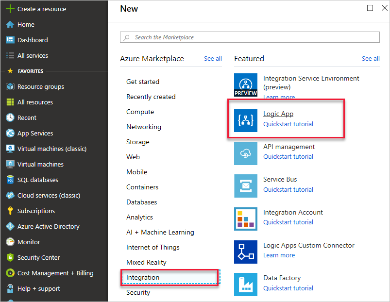
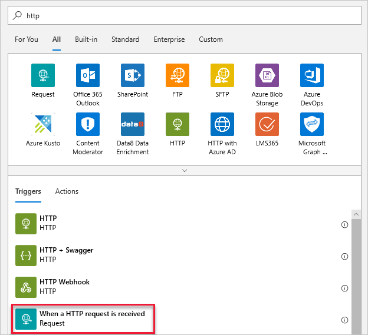
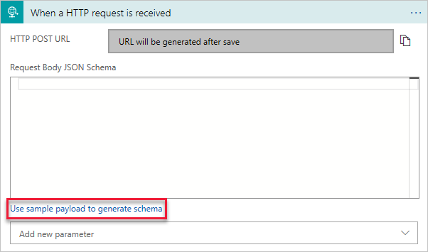
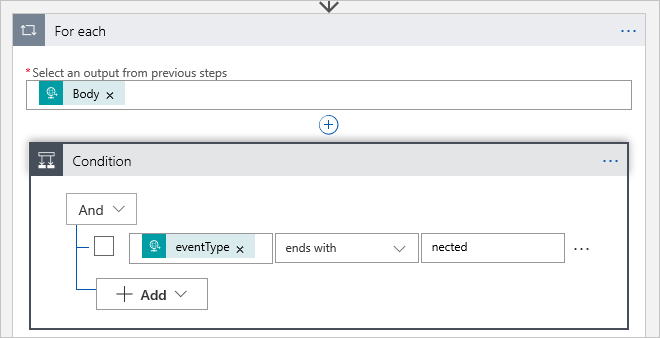
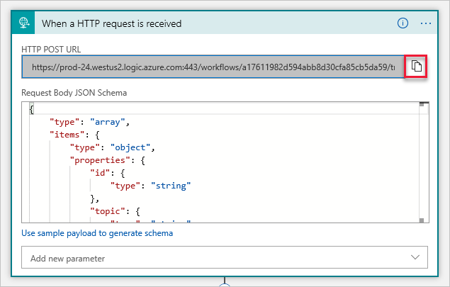
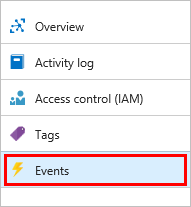
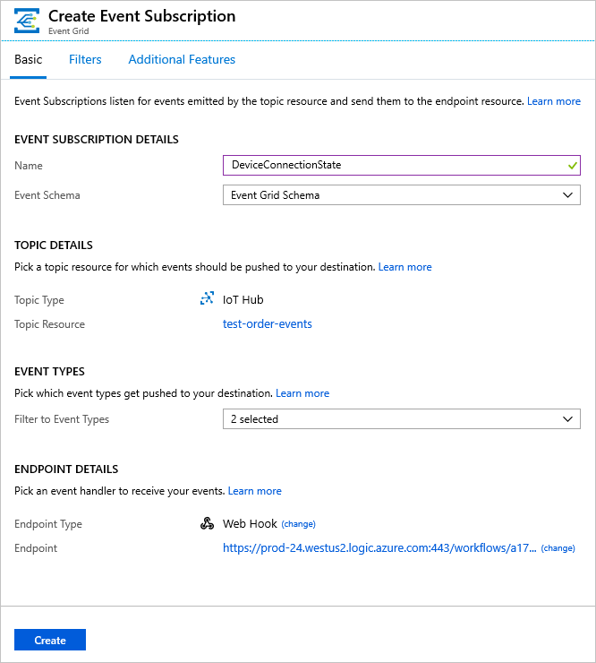
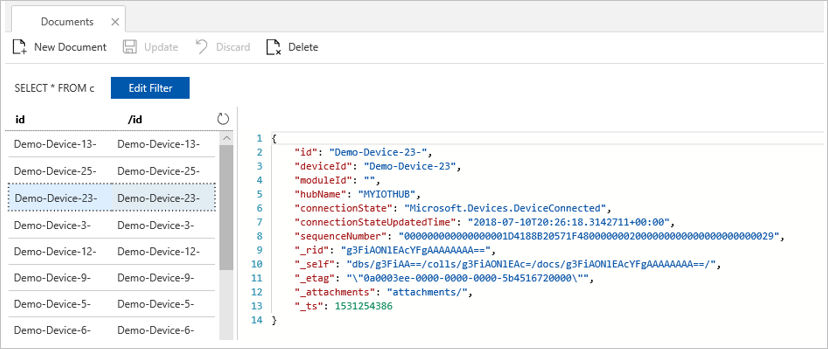

# Maintain latest device connection state from Azure IoT Hub using Azure Cosmos DB

Azure Event Grid helps you identify the connection status of your IoT devices and easily integrate these in your business solutions. This article walks you through a set up which can be used to track and store the latest device connection state in Cosmos DB. We will use the sequence number available in the Device Connected and Device Disconnected events and store the latest state in Cosmos DB. A sequence number is strictly increasing, and the latest event will have a higher number than other events. This is useful if you have frequent device connects and disconnects, and want to ensure only the latest event is used to trigger a downstream action, as Azure Event Grid doesn’t support ordering of events.

For this tutorial, we are going to use a stored procedure, which is an application logic that is executed against a collection in Cosmos DB. We will order the incoming device connected and device disconnected events to manage the current connection state of a device. One row is created per device connection state in Cosmos DB. 

## Prerequisites

* An active Azure account. If you don't have one, you can [create a free account](http://azure.microsoft.com/pricing/free-trial/).
* An active Azure Cosmos DB SQL API account. If you haven't created one yet, see [Create a database account](https://docs.microsoft.com/azure/cosmos-db/create-sql-api-dotnet#create-a-database-account) for a walkthrough.
* A collection in your database. See [Add a collection](https://docs.microsoft.com/azure/cosmos-db/create-sql-api-dotnet#add-a-collection) for a walkthrough.
* An Iot hub in Azure. If you haven't created one yet, see [Get started with IoT Hub](../iot-hub/iot-hub-csharp-csharp-getstarted.md) for a walkthrough. 

## Create a stored procedure

First, create a stored procedure and set it up to run a logic that compares sequence numbers of incoming events and records the latest event per device in the database.

1. In your Cosmos DB SQL API, select **Data Explorer**-> **Items**->**New Stored Procedure**.

   

2.  Enter a stored procedure id and paste the following in the “Stored Procedure body”. Note that this code should replace any existing code in the stored procedure          body. This code maintains one row per device ID and records the latest connection state of that device id by identifying the highest sequence number. 

```java
// SAMPLE STORED PROCEDURE
function UpdateDevice(deviceId, moduleId, hubName, connectionState, connectionStateUpdatedTime, sequenceNumber) {
  var collection = getContext().getCollection();
  var response = {};
  
  var docLink = getDocumentLink(deviceId, moduleId);

  var isAccepted = collection.readDocument(docLink, function(err, doc) {
    if (err) {
      console.log('Cannot find device ' + docLink + ' - ');
      createDocument();
    } else {
      console.log('Document Found - ');
      replaceDocument(doc);
    }
  });

  function replaceDocument(document) {
    console.log(
      'Old Seq :' +
        document.sequenceNumber +
        ' New Seq: ' +
        sequenceNumber +
        ' - '
    );
    if (sequenceNumber > document.sequenceNumber) {
      document.connectionState = connectionState;
      document.connectionStateUpdatedTime = connectionStateUpdatedTime;
      document.sequenceNumber = sequenceNumber;

      console.log('replace doc - ');

      isAccepted = collection.replaceDocument(docLink, document, function(
        err,
        updated
      ) {
        if (err) {
          getContext()
            .getResponse()
            .setBody(err);
        } else {
          getContext()
            .getResponse()
            .setBody(updated);
        }
      });
    } else {
      getContext()
        .getResponse()
        .setBody('Old Event - current: ' + document.sequenceNumber + ' Incoming: ' + sequenceNumber);
    }
  }
  function createDocument() {
    document = {
      id: deviceId + '-' + moduleId,
      deviceId: deviceId,
      moduleId: moduleId,
      hubName: hubName,
      connectionState: connectionState,
      connectionStateUpdatedTime: connectionStateUpdatedTime,
      sequenceNumber: sequenceNumber
    };
    console.log('Add new device - ' + collection.getAltLink());
    isAccepted = collection.createDocument(
      collection.getAltLink(),
      document,
      function(err, doc) {
        if (err) {
          getContext()
            .getResponse()
            .setBody(err);
        } else {
          getContext()
            .getResponse()
            .setBody(doc);
        }
      }
    );
  }

  function getDocumentLink(deviceId, moduleId) {
    return collection.getAltLink() + '/docs/' + deviceId + '-' + moduleId;
  }
}
```
3. Save the stored procedure: 

  


## Create a logic app

First, create a logic app and add an Event grid trigger that monitors the resource group for your virtual machine. 

### Create a logic app resource


1. In the [Azure portal](https://portal.azure.com), select **New** > **Enterprise Integration** > **Logic App**.

   

2. Give your logic app a name that's unique in your subscription, then select the same subscription, resource group, and location as your IoT hub. 
3. When you're ready, select **Pin to dashboard**, and choose **Create**.

   You've now created an Azure resource for your logic app. After Azure deploys your logic app, the Logic Apps Designer shows you templates for common patterns so you can get started faster.

   > [!NOTE] 
   > When you select **Pin to dashboard**, 
   > your logic app automatically opens in Logic Apps Designer. 
   > Otherwise, you can manually find and open your logic app.

4. In the Logic App Designer under **Templates**, choose **Blank Logic App** so that you can build your logic app from scratch.

## Select a trigger

A trigger is a specific event that starts your logic app. For this tutorial, the trigger that sets off the workflow is receiving a request over HTTP.  

1. In the connectors and triggers search bar, type **HTTP**.
2. Select **Request - When a HTTP request is received** as the trigger. 

   

3. Select **Use sample payload to generate schema**. 

   

4. Paste the following sample JSON code into the text box, then select **Done**:

   ```json
   [{
    "id": "fbfd8ee1-cf78-74c6-dbcf-e1c58638ccbd",
    "topic":
      "/SUBSCRIPTIONS/BDF55CDD-8DAB-4CF4-9B2F-C21E8A780472/RESOURCEGROUPS/EGTESTRG/PROVIDERS/MICROSOFT.DEVICES/IOTHUBS/EGTESTHUB1",
    "subject": "devices/48e44e11-1437-4907-83b1-4a8d7e89859e",
    "eventType": "Microsoft.Devices.DeviceConnected",
    "eventTime": "2018-07-03T23:20:11.6921933+00:00",
    "data": {
      "deviceConnectionStateEventInfo": {
        "sequenceNumber":
          "000000000000000001D4132452F67CE200000002000000000000000000000001"
      },
      "hubName": "EGTESTHUB1",
      "deviceId": "48e44e11-1437-4907-83b1-4a8d7e89859e",
      "moduleId": ""
    },
    "dataVersion": "",
    "metadataVersion": "1"
   }]
   ```

5. You may receive a pop-up notification that says, **Remember to include a Content-Type header set to application/json in your request.** You can safely ignore this suggestion, and move on to the next section. 

## Create a condition
Conditions help run specific actions after passing a specific condition, in your the logic app workflow. Once the condition is met, a desired action can be defined. For this tutorial, the condition is to check whether eventType is device connected or device disconnected. The action will be to execute the stored procedure in your database. 

1. Select **New step** then **Add a condition**. 

   

2. Fill the condition as shown below to only execute this for Device Connected and Device Disconnected events:

Choose a value: eventType
Change "is equal to" to "ends with"
Choose a value: nected

   

3. If the condition is true, click on **Add an action**.
  
   

4. Search for Cosmos DB and click on **Azure Cosmos DB - Execute stored procedure**

   

5. Populate the form for Execute stored procure by selecting values from your database. Enter the partition key value and parameters as shown below. 

   

6. Save your logic app. 

### Copy the HTTP URL

Before you leave the Logic Apps Designer, copy the URL that your logic apps is listening to for a trigger. You use this URL to configure Event Grid. 

1. Expand the **When a HTTP request is received** trigger configuration box by clicking on it. 
2. Copy the value of **HTTP POST URL** by selecting the copy button next to it. 

   

3. Save this URL so that you can refer to it in the next section. 

## Publish an event from IoT Hub

In this section, you configure your IoT Hub to publish events as they occur. 

1. In the Azure portal, navigate to your IoT hub. 
2. Select **Events**.

   

3. Select **Event subscription**. 

   

4. Create the event subscription with the following values: 
**Event Type**: Uncheck Subscribe to all event types and select **Device Connected** and **Device Disconnected** from the menu
**Endpoint Details**: Select Endpoint Type as **Web Hook** and click on select endpoint and paste the URL that you copied from your logic app and confirm selection.

   

**Event Subscription Details**: Provide a descriptive name and select **Event Grid Schema**

   When you're done, the form should look like the following example: 

   

5. Select **Create** to save the event subscription.

## Create a new device

Test your logic app by connecting a device to trigger a record in Cosmos DB. 

1. From your IoT hub, select **IoT Devices**. 
2. Select **Add**.
3. For **Device ID**, enter `Building1_Floor1_Room1_Temperature`.
4. Select **Save**. 
5. You can add multiple devices with different device IDs to test the event subscription filters. Try these examples: 
   * Building1_Floor1_Room1_Light
   * Building1_Floor2_Room2_Temperature
   * Building2_Floor1_Room1_Temperature
   * Building2_Floor1_Room1_Light

Once you've added a few devices to your IoT hub, check your Cosmos DB document to see the latest device connection states.

### Observe events

You can see results of the executed stored procedure in your Cosmos DB document. Here's what it will look like. Note that each row contains latest device connection state per device

   

## Use the Azure CLI

Instead of using the Azure portal, you can accomplish the IoT Hub steps using the Azure CLI. For details, see the Azure CLI pages for [creating an event subscription](https://docs.microsoft.com/cli/azure/eventgrid/event-subscription) and [creating an IoT device](https://docs.microsoft.com/cli/azure/iot/device).

## Clean up resources

This tutorial used resources that incur charges on your Azure subscription. When you're done trying out the tutorial and testing your results, disable or delete resources that you don't want to keep. 

If you don't want to lose the work on your logic app, disable it instead of deleting it. 

1. Navigate to your logic app.
2. On the **Overview** blade select **Delete** or **Disable**. 

Each subscription can have one free IoT hub. If you created a free hub for this tutorial, then you don't need to delete it to prevent charges.

1. Navigate to your IoT hub. 
2. On the **Overview** blade select **Delete**. 

Even if you keep your IoT hub, you may want to delete the event subscription that you created. 

1. In your IoT hub, select **Event Grid**.
2. Select the event subscription that you want to remove. 
3. Select **Delete**. 

To remove an Azure Cosmos DB account from the Azure portal, righ-click the account name and click **Delete account**. See detailed instructions for [deleting an Azure Cosmos DB account](https://docs.microsoft.com/azure/cosmos-db/manage-account#delete).

## Next steps

Learn more about [Reacting to IoT Hub events by using Event Grid to trigger actions](../iot-hub/iot-hub-event-grid.md).

Learn about what else you can do with [Event Grid](overview.md).


