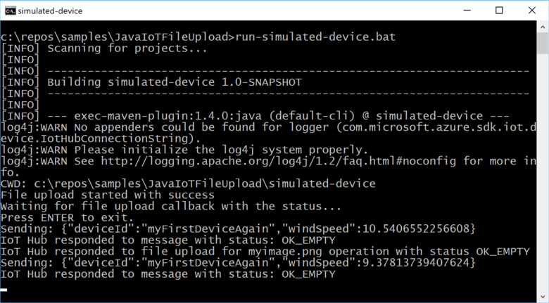
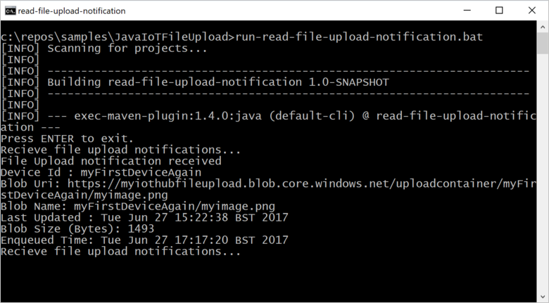
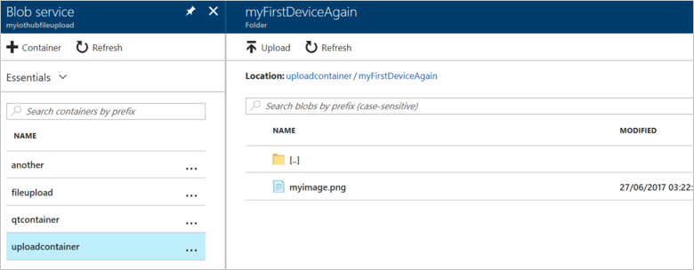

# Upload files from your device to the cloud with IoT Hub

[!INCLUDE [iot-hub-file-upload-language-selector](../../includes/iot-hub-file-upload-language-selector.md)]

This tutorial builds on the code in the [Send Cloud-to-Device messages with IoT Hub](iot-hub-java-java-c2d.md) tutorial to show you how to use the [file upload capabilities of IoT Hub](iot-hub-devguide-file-upload.md) to upload a file to [Azure blob storage](../storage/index.md). The tutorial shows you how to:

- Securely provide a device with an Azure blob URI for uploading a file.
- Use the IoT Hub file upload notifications to trigger processing the file in your app back end.

The [Get started with IoT Hub](iot-hub-java-java-getstarted.md) and [Send Cloud-to-Device messages with IoT Hub](iot-hub-java-java-c2d.md) tutorials show the basic device-to-cloud and cloud-to-device messaging functionality of IoT Hub. The [Process Device-to-Cloud messages](iot-hub-java-java-process-d2c.md) tutorial describes a way to reliably store device-to-cloud messages in Azure blob storage. However, in some scenarios you cannot easily map the data your devices send into the relatively small device-to-cloud messages that IoT Hub accepts. For example:

* Large files that contain images
* Videos
* Vibration data sampled at high frequency
* Some form of preprocessed data.

These files are typically batch processed in the cloud using tools such as [Azure Data Factory](../data-factory/introduction.md) or the [Hadoop](../hdinsight/index.md) stack. When you need to upland files from a device, you can still use the security and reliability of IoT Hub.

At the end of this tutorial you run two Java console apps:

* **simulated-device**, a modified version of the app created in the [Send Cloud-to-Device messages with IoT Hub] tutorial. This app uploads a file to storage using a SAS URI provided by your IoT hub.
* **read-file-upload-notification**, which receives file upload notifications from your IoT hub.

> [!NOTE]
> IoT Hub supports many device platforms and languages (including C, .NET, and Javascript) through Azure IoT device SDKs. Refer to the [Azure IoT Developer Center] for step-by-step instructions on how to connect your device to Azure IoT Hub.

To complete this tutorial, you need the following:

* The latest [Java SE Development Kit 8](http://www.oracle.com/technetwork/java/javase/downloads/jdk8-downloads-2133151.html)
* [Maven 3](https://maven.apache.org/install.html)
* An active Azure account. (If you don't have an account, you can create a [free account](http://azure.microsoft.com/pricing/free-trial/) in just a couple of minutes.)

[!INCLUDE [iot-hub-associate-storage](../../includes/iot-hub-associate-storage.md)]

## Upload a file from a device app

In this section, you modify the device app you created in [Send Cloud-to-Device messages with IoT Hub](iot-hub-java-java-c2d.md) to upload a file to IoT hub.

1. Copy an image file to the `simulated-device` folder and rename it `myimage.png`.

1. Using a text editor, open the `simulated-device\src\main\java\com\mycompany\app\App.java` file.

1. Add the variable declaration to the **App** class:

    ```java
    private static String fileName = "myimage.png";
    ```

1. To process file upload status callback messages, add the following nested class to the **App** class:

    ```java
    // Define a callback method to print status codes from IoT Hub.
    protected static class FileUploadStatusCallBack implements IotHubEventCallback {
      public void execute(IotHubStatusCode status, Object context) {
        System.out.println("IoT Hub responded to file upload for " + fileName
            + " operation with status " + status.name());
      }
    }
    ```

1. To upload images to IoT Hub, add the following method to the **App** class to upload images to IoT Hub:

    ```java
    // Use IoT Hub to upload a file asynchronously to Azure blob storage.
    private static void uploadFile(String fullFileName) throws FileNotFoundException, IOException
    {
      File file = new File(fullFileName);
      InputStream inputStream = new FileInputStream(file);
      long streamLength = file.length();

      client.uploadToBlobAsync(fileName, inputStream, streamLength, new FileUploadStatusCallBack(), null);
    }
    ```

1. Modify the **main** method to call the **uploadFile** method as shown in the following snippet:

    ```java
    client.open();

    try
    {
      // Get the filename and start the upload.
      String fullFileName = System.getProperty("user.dir") + File.separator + fileName;
      uploadFile(fullFileName);
      System.out.println("File upload started with success");
    }
    catch (Exception e)
    {
      System.out.println("Exception uploading file: " + e.getCause() + " \nERROR: " + e.getMessage());
    }

    MessageSender sender = new MessageSender();
    ```

1. Use the following command to build the **simulated-device** app and check for errors:

    ```cmd/sh
    mvn clean package -DskipTests
    ```

## Receive a file upload notification

In this section, you create a Java console app that receives file upload notification messages from IoT Hub.

You need the **iothubowner** connection string for your IoT Hub to complete this section. You can find the connection string in the [Azure portal](https://portal.azure.com/) on the **Shared access policy** blade.

1. Create a Maven project called **read-file-upload-notification** using the following command at your command prompt. Note this command is a single, long command:

    ```cmd/sh
    mvn archetype:generate -DgroupId=com.mycompany.app -DartifactId=read-file-upload-notification -DarchetypeArtifactId=maven-archetype-quickstart -DinteractiveMode=false
    ```

1. At your command prompt, navigate to the new `read-file-upload-notification` folder.

1. Using a text editor, open the `pom.xml` file in the `read-file-upload-notification` folder and add the following dependency to the **dependencies** node. Adding the dependency enables you to use the **iothub-java-service-client** package in your application to communicate with your IoT hub service:

    ```xml
    <dependency>
      <groupId>com.microsoft.azure.sdk.iot</groupId>
      <artifactId>iot-service-client</artifactId>
      <version>1.7.23</version>
    </dependency>
    ```

    > [!NOTE]
    > You can check for the latest version of **iot-service-client** using [Maven search](http://search.maven.org/#search%7Cga%7C1%7Ca%3A%22iot-service-client%22%20g%3A%22com.microsoft.azure.sdk.iot%22).

1. Save and close the `pom.xml` file.

1. Using a text editor, open the `read-file-upload-notification\src\main\java\com\mycompany\app\App.java` file.

1. Add the following **import** statements to the file:

    ```java
    import com.microsoft.azure.sdk.iot.service.*;
    import java.io.IOException;
    import java.net.URISyntaxException;
    import java.util.concurrent.ExecutorService;
    import java.util.concurrent.Executors;
    ```

1. Add the following class-level variables to the **App** class:

    ```java
    private static final String connectionString = "{Your IoT Hub connection string}";
    private static final IotHubServiceClientProtocol protocol = IotHubServiceClientProtocol.AMQPS;
    private static FileUploadNotificationReceiver fileUploadNotificationReceiver = null;
    ```

1. To print information about the file upload to the console, add the following nested class to the **App** class:

    ```java
    // Create a thread to receive file upload notifications.
    private static class ShowFileUploadNotifications implements Runnable {
      public void run() {
        try {
          while (true) {
            System.out.println("Recieve file upload notifications...");
            FileUploadNotification fileUploadNotification = fileUploadNotificationReceiver.receive();
            if (fileUploadNotification != null) {
              System.out.println("File Upload notification received");
              System.out.println("Device Id : " + fileUploadNotification.getDeviceId());
              System.out.println("Blob Uri: " + fileUploadNotification.getBlobUri());
              System.out.println("Blob Name: " + fileUploadNotification.getBlobName());
              System.out.println("Last Updated : " + fileUploadNotification.getLastUpdatedTimeDate());
              System.out.println("Blob Size (Bytes): " + fileUploadNotification.getBlobSizeInBytes());
              System.out.println("Enqueued Time: " + fileUploadNotification.getEnqueuedTimeUtcDate());
            }
          }
        } catch (Exception ex) {
          System.out.println("Exception reading reported properties: " + ex.getMessage());
        }
      }
    }
    ```

1. To start the thread that listens for file upload notifications, add the following code to the **main** method:

    ```java
    public static void main(String[] args) throws IOException, URISyntaxException, Exception {
      ServiceClient serviceClient = ServiceClient.createFromConnectionString(connectionString, protocol);

      if (serviceClient != null) {
        serviceClient.open();

        // Get a file upload notification receiver from the ServiceClient.
        fileUploadNotificationReceiver = serviceClient.getFileUploadNotificationReceiver();
        fileUploadNotificationReceiver.open();

        // Start the thread to receive file upload notifications.
        ShowFileUploadNotifications showFileUploadNotifications = new ShowFileUploadNotifications();
        ExecutorService executor = Executors.newFixedThreadPool(1);
        executor.execute(showFileUploadNotifications);

        System.out.println("Press ENTER to exit.");
        System.in.read();
        executor.shutdownNow();
        System.out.println("Shutting down sample...");
        fileUploadNotificationReceiver.close();
        serviceClient.close();
      }
    }
    ```

1. Save and close the `read-file-upload-notification\src\main\java\com\mycompany\app\App.java` file.

1. Use the following command to build the **read-file-upload-notification** app and check for errors:

    ```cmd/sh
    mvn clean package -DskipTests
    ```

## Run the applications

Now you are ready to run the applications.

At a command prompt in the `read-file-upload-notification` folder, run the following command:

```cmd/sh
mvn exec:java -Dexec.mainClass="com.mycompany.app.App"
```

At a command prompt in the `simulated-device` folder, run the following command:

```cmd/sh
mvn exec:java -Dexec.mainClass="com.mycompany.app.App"
```

The following screenshot shows the output from the **simulated-device** app:



The following screenshot shows the output from the **read-file-upload-notification** app:



You can use the portal to view the uploaded file in the storage container you configured:



## Next steps

In this tutorial, you learned how to use the file upload capabilities of IoT Hub to simplify file uploads from devices. You can continue to explore IoT hub features and scenarios with the following articles:

* [Create an IoT hub programmatically][lnk-create-hub]
* [Introduction to C SDK][lnk-c-sdk]
* [Azure IoT SDKs][lnk-sdks]

To further explore the capabilities of IoT Hub, see:

* [Simulating a device with IoT Edge][lnk-iotedge]

<!-- Images. -->

[50]: ./media/iot-hub-csharp-csharp-file-upload/run-apps1.png
[1]: ./media/iot-hub-csharp-csharp-file-upload/image-properties.png
[2]: ./media/iot-hub-csharp-csharp-file-upload/file-upload-project-csharp1.png
[3]: ./media/iot-hub-csharp-csharp-file-upload/enable-file-notifications.png

<!-- Links -->


[Azure IoT Developer Center]: http://www.azure.com/develop/iot

[Transient Fault Handling]: https://msdn.microsoft.com/library/hh680901(v=pandp.50).aspx
[Azure Storage]:../storage/common/storage-create-storage-account.md#create-a-storage-account
[lnk-configure-upload]: iot-hub-configure-file-upload.md
[Azure IoT service SDK NuGet package]: https://www.nuget.org/packages/Microsoft.Azure.Devices/
[lnk-free-trial]: http://azure.microsoft.com/pricing/free-trial/

[lnk-create-hub]: iot-hub-rm-template-powershell.md
[lnk-c-sdk]: iot-hub-device-sdk-c-intro.md
[lnk-sdks]: iot-hub-devguide-sdks.md

[lnk-iotedge]: iot-hub-windows-iot-edge-simulated-device.md


