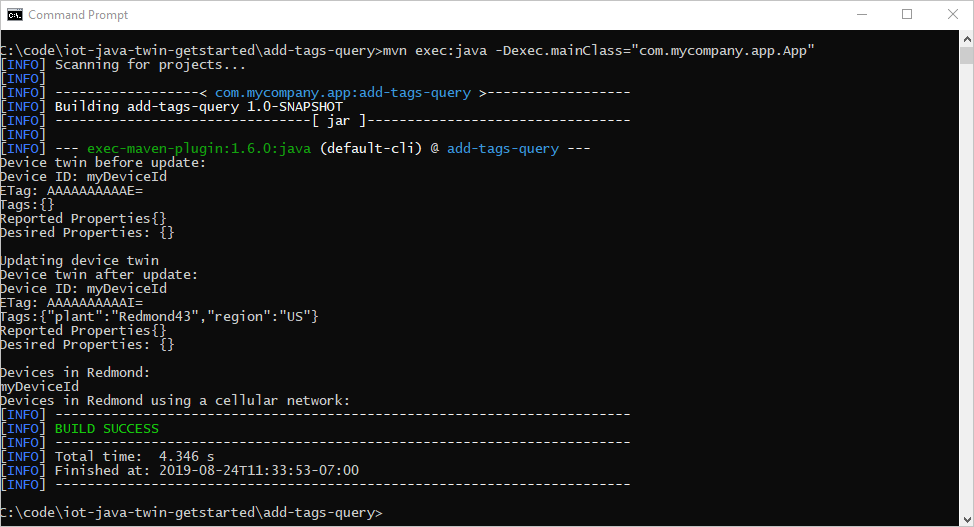
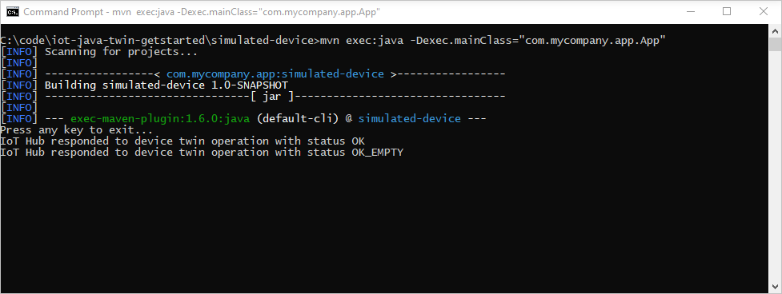
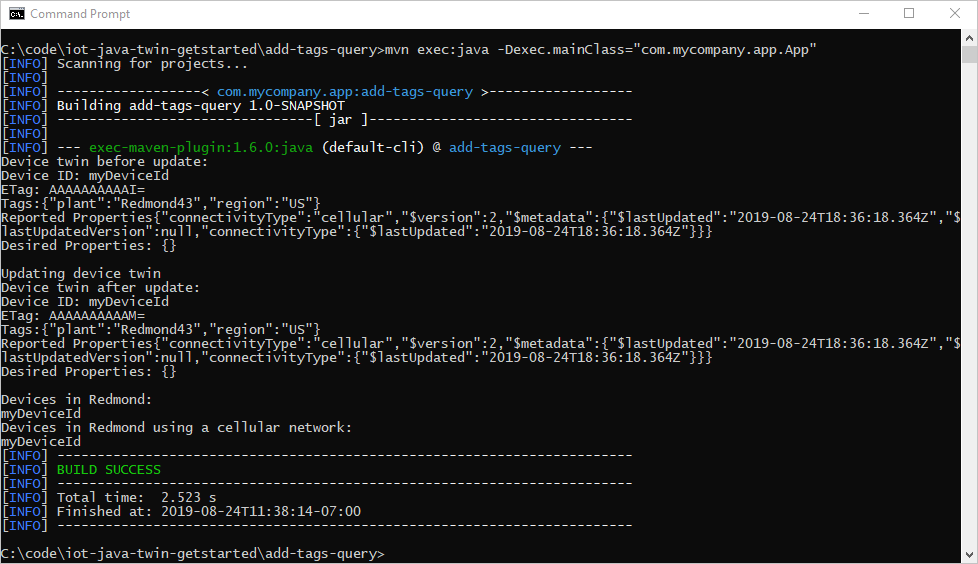

# Get started with device twins (Java)

[!INCLUDE [iot-hub-selector-twin-get-started](../../includes/iot-hub-selector-twin-get-started.md)]

In this tutorial, you create two Java console apps:

* **add-tags-query**, a Java back-end app that adds tags and queries device twins.
* **simulated-device**, a Java device app that connects to your IoT hub and reports its connectivity condition using a reported property.

> [!NOTE]
> The article [Azure IoT SDKs](iot-hub-devguide-sdks.md) provides information about the Azure IoT SDKs that you can use to build both device and back-end apps.

To complete this tutorial, you need:

* The latest [Java SE Development Kit 8](https://aka.ms/azure-jdks)

* [Maven 3](https://maven.apache.org/install.html)

* An active Azure account. (If you don't have an account, you can create a [free account](https://azure.microsoft.com/pricing/free-trial/) in just a couple of minutes.)

## Create an IoT hub

[!INCLUDE [iot-hub-include-create-hub](../../includes/iot-hub-include-create-hub.md)]

[!INCLUDE [iot-hub-include-find-connection-string](../../includes/iot-hub-include-find-connection-string.md)]

[!INCLUDE [iot-hub-get-started-create-device-identity-portal](../../includes/iot-hub-get-started-create-device-identity-portal.md)]

## Create the service app

In this section, you create a Java app that adds location metadata as a tag to the device twin in IoT Hub associated with **myDeviceId**. The app first queries IoT hub for devices located in the US, and then for devices that report a cellular network connection.

1. On your development machine, create an empty folder called `iot-java-twin-getstarted`.

2. In the `iot-java-twin-getstarted` folder, create a Maven project called **add-tags-query** using the following command at your command prompt. Note this is a single, long command:

    ```
    mvn archetype:generate -DgroupId=com.mycompany.app -DartifactId=add-tags-query -DarchetypeArtifactId=maven-archetype-quickstart -DinteractiveMode=false
    ```

3. At your command prompt, navigate to the `add-tags-query` folder.

4. Using a text editor, open the `pom.xml` file in the `add-tags-query` folder and add the following dependency to the **dependencies** node. This dependency enables you to use the **iot-service-client** package in your app to communicate with your IoT hub:

    ```xml
    <dependency>
      <groupId>com.microsoft.azure.sdk.iot</groupId>
      <artifactId>iot-service-client</artifactId>
      <version>1.7.23</version>
      <type>jar</type>
    </dependency>
    ```

    > [!NOTE]
    > You can check for the latest version of **iot-service-client** using [Maven search](http://search.maven.org/#search%7Cga%7C1%7Ca%3A%22iot-service-client%22%20g%3A%22com.microsoft.azure.sdk.iot%22).

5. Add the following **build** node after the **dependencies** node. This configuration instructs Maven to use Java 1.8 to build the app:

    ```xml
    <build>
      <plugins>
        <plugin>
          <groupId>org.apache.maven.plugins</groupId>
          <artifactId>maven-compiler-plugin</artifactId>
          <version>3.3</version>
          <configuration>
            <source>1.8</source>
            <target>1.8</target>
          </configuration>
        </plugin>
      </plugins>
    </build>
    ```

6. Save and close the `pom.xml` file.

7. Using a text editor, open the `add-tags-query\src\main\java\com\mycompany\app\App.java` file.

8. Add the following **import** statements to the file:

    ```java
    import com.microsoft.azure.sdk.iot.service.devicetwin.*;
    import com.microsoft.azure.sdk.iot.service.exceptions.IotHubException;

    import java.io.IOException;
    import java.util.HashSet;
    import java.util.Set;
    ```

9. Add the following class-level variables to the **App** class. Replace `{youriothubconnectionstring}` with your IoT hub connection string you noted in the *Create an IoT Hub* section:

    ```java
    public static final String iotHubConnectionString = "{youriothubconnectionstring}";
    public static final String deviceId = "myDeviceId";

    public static final String region = "US";
    public static final String plant = "Redmond43";
    ```

10. Update the **main** method signature to include the following `throws` clause:

    ```java
    public static void main( String[] args ) throws IOException
    ```

11. Add the following code to the **main** method to create the **DeviceTwin** and **DeviceTwinDevice** objects. The **DeviceTwin** object handles the communication with your IoT hub. The **DeviceTwinDevice** object represents the device twin with its properties and tags:

    ```java
    // Get the DeviceTwin and DeviceTwinDevice objects
    DeviceTwin twinClient = DeviceTwin.createFromConnectionString(iotHubConnectionString);
    DeviceTwinDevice device = new DeviceTwinDevice(deviceId);
    ```

12. Add the following `try/catch` block to the **main** method:

    ```java
    try {
      // Code goes here
    } catch (IotHubException e) {
      System.out.println(e.getMessage());
    } catch (IOException e) {
      System.out.println(e.getMessage());
    }
    ```

13. To update the **region** and **plant** device twin tags in your device twin, add the following code in the `try` block:

    ```java
    // Get the device twin from IoT Hub
    System.out.println("Device twin before update:");
    twinClient.getTwin(device);
    System.out.println(device);

    // Update device twin tags if they are different
    // from the existing values
    String currentTags = device.tagsToString();
    if ((!currentTags.contains("region=" + region) && !currentTags.contains("plant=" + plant))) {
      // Create the tags and attach them to the DeviceTwinDevice object
      Set<Pair> tags = new HashSet<Pair>();
      tags.add(new Pair("region", region));
      tags.add(new Pair("plant", plant));
      device.setTags(tags);

      // Update the device twin in IoT Hub
      System.out.println("Updating device twin");
      twinClient.updateTwin(device);
    }

    // Retrieve the device twin with the tag values from IoT Hub
    System.out.println("Device twin after update:");
    twinClient.getTwin(device);
    System.out.println(device);
    ```

14. To query the device twins in IoT hub, add the following code to the `try` block after the code you added in the previous step. The code runs two queries. Each query returns a maximum of 100 devices:

    ```java
    // Query the device twins in IoT Hub
    System.out.println("Devices in Redmond:");

    // Construct the query
    SqlQuery sqlQuery = SqlQuery.createSqlQuery("*", SqlQuery.FromType.DEVICES, "tags.plant='Redmond43'", null);

    // Run the query, returning a maximum of 100 devices
    Query twinQuery = twinClient.queryTwin(sqlQuery.getQuery(), 100);
    while (twinClient.hasNextDeviceTwin(twinQuery)) {
      DeviceTwinDevice d = twinClient.getNextDeviceTwin(twinQuery);
      System.out.println(d.getDeviceId());
    }

    System.out.println("Devices in Redmond using a cellular network:");

    // Construct the query
    sqlQuery = SqlQuery.createSqlQuery("*", SqlQuery.FromType.DEVICES, "tags.plant='Redmond43' AND properties.reported.connectivityType = 'cellular'", null);

    // Run the query, returning a maximum of 100 devices
    twinQuery = twinClient.queryTwin(sqlQuery.getQuery(), 3);
    while (twinClient.hasNextDeviceTwin(twinQuery)) {
      DeviceTwinDevice d = twinClient.getNextDeviceTwin(twinQuery);
      System.out.println(d.getDeviceId());
    }
    ```

15. Save and close the `add-tags-query\src\main\java\com\mycompany\app\App.java` file

16. Build the **add-tags-query** app and correct any errors. At your command prompt, navigate to the `add-tags-query` folder and run the following command:

    ```
    mvn clean package -DskipTests
    ```

## Create a device app

In this section, you create a Java console app that sets a reported property value that is sent to IoT Hub.

1. In the `iot-java-twin-getstarted` folder, create a Maven project called **simulated-device** using the following command at your command prompt. Note this is a single, long command:

    ```
    mvn archetype:generate -DgroupId=com.mycompany.app -DartifactId=simulated-device -DarchetypeArtifactId=maven-archetype-quickstart -DinteractiveMode=false
    ```

2. At your command prompt, navigate to the `simulated-device` folder.

3. Using a text editor, open the `pom.xml` file in the `simulated-device` folder and add the following dependencies to the **dependencies** node. This dependency enables you to use the **iot-device-client** package in your app to communicate with your IoT hub:

    ```xml
    <dependency>
      <groupId>com.microsoft.azure.sdk.iot</groupId>
      <artifactId>iot-device-client</artifactId>
      <version>1.3.32</version>
    </dependency>
    ```

    > [!NOTE]
    > You can check for the latest version of **iot-device-client** using [Maven search](http://search.maven.org/#search%7Cga%7C1%7Ca%3A%22iot-device-client%22%20g%3A%22com.microsoft.azure.sdk.iot%22).

4. Add the following **build** node after the **dependencies** node. This configuration instructs Maven to use Java 1.8 to build the app:

    ```xml
    <build>
      <plugins>
        <plugin>
          <groupId>org.apache.maven.plugins</groupId>
          <artifactId>maven-compiler-plugin</artifactId>
          <version>3.3</version>
          <configuration>
            <source>1.8</source>
            <target>1.8</target>
          </configuration>
        </plugin>
      </plugins>
    </build>
    ```

5. Save and close the `pom.xml` file.

6. Using a text editor, open the `simulated-device\src\main\java\com\mycompany\app\App.java` file.

7. Add the following **import** statements to the file:

    ```java
    import com.microsoft.azure.sdk.iot.device.*;
    import com.microsoft.azure.sdk.iot.device.DeviceTwin.*;

    import java.io.IOException;
    import java.net.URISyntaxException;
    import java.util.Scanner;
    ```

8. Add the following class-level variables to the **App** class. Replacing `{youriothubname}` with your IoT hub name, and `{yourdevicekey}` with the device key value you generated in the *Create a device identity* section:

    ```java
    private static String connString = "HostName={youriothubname}.azure-devices.net;DeviceId=myDeviceID;SharedAccessKey={yourdevicekey}";
    private static IotHubClientProtocol protocol = IotHubClientProtocol.MQTT;
    private static String deviceId = "myDeviceId";
    ```

    This sample app uses the **protocol** variable when it instantiates a **DeviceClient** object. 

9. Add the following code to the **main** method to:
    * Create a device client to communicate with IoT Hub.
    * Create a **Device** object to store the device twin properties.

    ```java
    DeviceClient client = new DeviceClient(connString, protocol);

    // Create a Device object to store the device twin properties
    Device dataCollector = new Device() {
      // Print details when a property value changes
      @Override
      public void PropertyCall(String propertyKey, Object propertyValue, Object context) {
        System.out.println(propertyKey + " changed to " + propertyValue);
      }
    };
    ```

10. Add the following code to the **main** method to create a **connectivityType** reported property and send it to IoT Hub:

    ```java
    try {
      // Open the DeviceClient and start the device twin services.
      client.open();
      client.startDeviceTwin(new DeviceTwinStatusCallBack(), null, dataCollector, null);

      // Create a reported property and send it to your IoT hub.
      dataCollector.setReportedProp(new Property("connectivityType", "cellular"));
      client.sendReportedProperties(dataCollector.getReportedProp());
    }
    catch (Exception e) {
      System.out.println("On exception, shutting down \n" + " Cause: " + e.getCause() + " \n" + e.getMessage());
      dataCollector.clean();
      client.close();
      System.out.println("Shutting down...");
    }
    ```

11. Add the following code to the end of the **main** method. Waiting for the **Enter** key allows time for IoT Hub to report the status of the device twin operations:

    ```java
    System.out.println("Press any key to exit...");

    Scanner scanner = new Scanner(System.in);
    scanner.nextLine();

    dataCollector.clean();
    client.close();
    ```

12. Save and close the `simulated-device\src\main\java\com\mycompany\app\App.java` file.

13. Build the **simulated-device** app and correct any errors. At your command prompt, navigate to the `simulated-device` folder and run the following command:

    ```
    mvn clean package -DskipTests
    ```

## Run the apps

You are now ready to run the console apps.

1. At a command prompt in the `add-tags-query` folder, run the following command to run the **add-tags-query** service app:

    ```
    mvn exec:java -Dexec.mainClass="com.mycompany.app.App"
    ```

    

    You can see the **plant** and **region** tags added to the device twin. The first query returns your device, but the second does not.

2. At a command prompt in the `simulated-device` folder, run the following command to add the **connectivityType** reported property to the device twin:

    ```
    mvn exec:java -Dexec.mainClass="com.mycompany.app.App"
    ```

    

3. At a command prompt in the `add-tags-query` folder, run the following command to run the **add-tags-query** service app a second time:

    ```
    mvn exec:java -Dexec.mainClass="com.mycompany.app.App"
    ```

    

    Now your device has sent the **connectivityType** property to IoT Hub, the second query returns your device.

## Next steps

In this tutorial, you configured a new IoT hub in the Azure portal, and then created a device identity in the IoT hub's identity registry. You added device metadata as tags from a back-end app, and wrote a device app to report device connectivity information in the device twin. You also learned how to query the device twin information using the SQL-like IoT Hub query language.

Use the following resources to learn how to:

* Send telemetry from devices with the [Get started with IoT Hub](quickstart-send-telemetry-java.md) tutorial.

* Control devices interactively (such as turning on a fan from a user-controlled app) with the [Use direct methods](quickstart-control-device-java.md) tutorial.