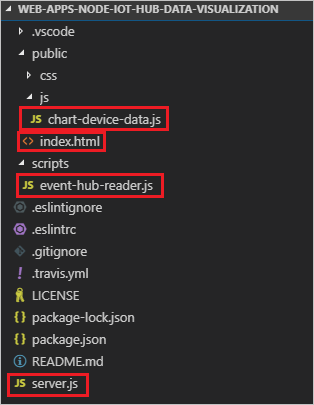
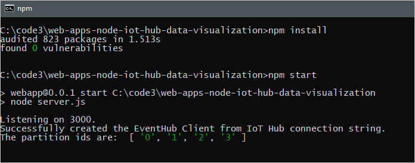
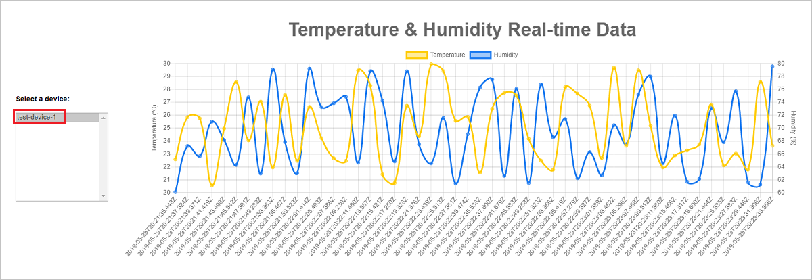
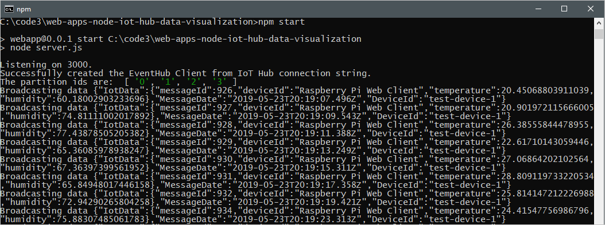

# Visualize real-time sensor data from your Azure IoT hub in a web application


[!INCLUDE [iot-hub-get-started-note](../../includes/iot-hub-get-started-note.md)]

## What you learn

In this tutorial, you learn how to visualize real-time sensor data that your IoT hub receives with a node.js web app running on your local computer. After running the web app locally, you can optionally follow steps to host the web app in Azure App Service. If you want to try to visualize the data in your IoT hub by using Power BI, see [Use Power BI to visualize real-time sensor data from Azure IoT Hub](iot-hub-live-data-visualization-in-power-bi.md).

## What you do

* Add a consumer group to your IoT hub that the web application will use to read sensor data.
* Download the web app code from GitHub.
* Examine the web app code.
* Configure environment variables to hold the IoT Hub artifacts needed by your web app.
* Run the web app on your development machine.
* Open a web page to see real-time temperature and humidity data from your IoT hub.
* (Optional) Use Azure CLI to host your web app in Azure App Service.

## What you need

* Complete the [Raspberry Pi online simulator](iot-hub-raspberry-pi-web-simulator-get-started.md) tutorial or one of the device tutorials; for example, [Raspberry Pi with node.js](iot-hub-raspberry-pi-kit-node-get-started.md). These cover the following requirements:

  * An active Azure subscription
  * An Iot hub under your subscription
  * A client application that sends messages to your Iot hub

* [Download Git](https://www.git-scm.com/downloads)

* The steps in this article assume a Windows development machine; however, you can easily perform these steps on a Linux system in your preferred shell.

[!INCLUDE [cloud-shell-try-it.md](../../includes/cloud-shell-try-it.md)]

Run the following command to add the Microsoft Azure IoT Extension for Azure CLI to your Cloud Shell instance. The IOT Extension adds IoT Hub, IoT Edge, and IoT Device Provisioning Service (DPS) specific commands to Azure CLI.

```azurecli-interactive
az extension add --name azure-cli-iot-ext
```

## Add a consumer group to your IoT hub

[Consumer groups](https://docs.microsoft.com/azure/event-hubs/event-hubs-features#event-consumers) provide independent views into the event stream that enable apps and Azure services to independently consume data from the same Event Hub endpoint. In this section, you add a consumer group to your IoT hub's built-in endpoint that the web app will use to read data from.

Run the following command to add a consumer group to the built-in endpoint of your IoT hub:

```azurecli-interactive
az iot hub consumer-group create --hub-name YourIoTHubName --name YourConsumerGroupName
```

Note down the name you choose, you will need it later in this tutorial.

## Get a service connection string for your IoT hub

IoT hubs are created with several default access policies. One such policy is the **service** policy, which provides sufficient permissions for a service to read and write the IoT hub's endpoints. Run the following command to get a connection string for your IoT hub that adheres to the service policy:

```azurecli-interactive
az iot hub show-connection-string --hub-name YourIotHub --policy-name service
```

The connection string should look similar to the following:

```javascript
"HostName={YourIotHubName}.azure-devices.net;SharedAccessKeyName=service;SharedAccessKey={YourSharedAccessKey}"
```

Note down the service connection string, you will need it later in this tutorial.

## Download the web app from GitHub

Open a command window, and enter the following commands to download the sample from GitHub and change to the sample directory:

```cmd
git clone https://github.com/Azure-Samples/web-apps-node-iot-hub-data-visualization.git
cd web-apps-node-iot-hub-data-visualization
```

## Examine the web app code

From the web-apps-node-iot-hub-data-visualization directory, open the web app in your favorite editor. The following shows the file structure viewed in VS Code:



Take a moment to examine the following files:

* **Server.js** is a service-side script that initializes the web socket and the Event Hub wrapper class. It provides a callback to the Event Hub wrapper class that the class uses to broadcast incoming messages to the web socket.

* **Event-hub-reader.js** is a service-side script that connects to the IoT hub's built-in endpoint using the specified connection string and consumer group. It extracts the DeviceId and EnqueuedTimeUtc from metadata on incoming messages and then relays the message using the callback method registered by server.js.

* **Chart-device-data.js** is a client-side script that listens on the web socket, keeps track of each DeviceId, and stores the last 50 points of incoming data for each device. It then binds the selected device data to the chart object.

* **Index.html** handles the UI layout for the web page and references the necessary scripts for client-side logic.

## Configure environment variables for the web app

To read data from your IoT hub, the web app needs your IoT hub's connection string and the name of the consumer group that it should read through. It gets these strings from the process environment in the following lines in server.js:

```javascript
const iotHubConnectionString = process.env.IotHubConnectionString;
const eventHubConsumerGroup = process.env.EventHubConsumerGroup;
```

Set the environment variables in your command window with the following commands. Replace the placeholder values with the service connection string for your IoT hub and the name of the consumer group you created previously. Do not quote the strings.

```cmd
set IotHubConnectionString=YourIoTHubConnectionString
set EventHubConsumerGroup=YourConsumerGroupName
```

## Run the web app

1. Make sure that your device is running and sending data.

2. In the command window, run  the following lines to download and install referenced packages and start the website:

   ```cmd
   npm install
   npm start
   ```

3. You should see output in the console that indicates that the web app has successfully connected to your IoT hub and is listening on port 3000:

   

## Open a web page to see data from your IoT hub

Open a browser to `http://localhost:3000`.

In the **Select a device** list, select your device to see a running plot of the last 50 temperature and humidity data points sent by the device to your IoT hub.



You should also see output in the console that shows the messages that your web app is broadcasting to the browser client:  



## Host the web app in App Services

The [Web Apps feature of Azure App Service](https://docs.microsoft.com/en-us/azure/app-service/overview) provides a platform as a service (PAAS) that enables your web applications to benefit from powerful Azure features like additional security, load balancing, and scalability as well as Azure and partner DevOps solutions like continuous deployment, package management, and so on. Azure App Service supports web applications developed in many popular languages and deployed on Windows or Linux infrastructure.

In this section, you provision a web app in App Service and deploy your code to it by using Azure CLI commands. You can find details of the commands used in the [az webapp](https://docs.microsoft.com/en-us/cli/azure/webapp?view=azure-cli-latest) documentation.

1. An [App Service plan](https://docs.microsoft.com/azure/app-service/overview-hosting-plans) defines a set of compute resources for an app hosted in App Service to run. In this tutorial, we use the Developer/Free tier to host the web app. With the Free tier, your web app runs on shared Windows resources with other App Service apps, including apps of other customers. Azure also offers App Service plans to deploy web apps on Linux compute resources. You can skip this step if you already have an App Service plan that you want to use.

   To create an App Service plan using the Windows free tier, run the following command. Use the same resource group your IoT hub is in.

   ```azurecli-interactive
   az appservice plan create --name <app service plan name> --resource-group <your resource group> --sku FREE
   ```

2. Now provision a web app in your App Service plan. The `-l` parameter enables the web app code to be uploaded and deployed from a Git repository on your local machine.

   ```azurecli-interactive
   az webapp create -g <your resource group> -n <your web app name> -p <your app service plan name>  -l
   ```

3. Now add Application Settings for the environment variables that specify the IoT hub connection string and the Event hub consumer group. Individual settings are space delimited in the `-settings` parameter. Use the service connection string for your IoT hub and the consumer group you created previously in this tutorial. Do not quote the values.

   ```azurecli-interactive
   az webapp config appsettings set -g <your resource group> -n <your web app name> --settings EventHubConsumerGroup=<your consumer group> IotHubConnectionString=HostName=<your IoT hub connection string>
   ```

4. Enable the Web Sockets protocol for the web app and set the web app to receive HTTPS requests only (HTTP requests are redirected to HTTPS).

   ```azurecli-interactive
   az webapp config set -g <your resource group> -n <your web app name>  --web-sockets-enabled true
   az webapp update -n <your web app name> -g <your resource group name> --https-only true
   ```

5. Get the Git URL to use to push your code up to App Service.

   ```azurecli-interactive
   az webapp deployment source config-local-git -n <your web app name> -g <your resource group name>
   ```

6. Add a remote to your clone that references the Git repository for the web app in App Service. For \<Git clone URL\>, use the URL returned in the previous step. Run the following command in your command window.

   ```cmd
   git remote add webapp <Git clone URL>
   ```

7. Because the web app is configured for HTTPS-only, you must change the web socket protocol used to send data to the client javascript to secure web sockets. Open the `web-apps-node-iot-hub-data-visualization/public/js/chart-device-data.js` file in your favorite editor and change the line near the top of the file where the protocol is set from `ws://` to `wss://`. Then save the file and quit the editor.

   ```javascript
   // if deployed to a site requiring SSL, change to wss://
   var protocol = 'wss://';
   ```

8. Commit the changes.

   ```cmd
   git add .
   git commit -m "updated client code to use wss"
   ```

9. To push your changes to App Service, you need either user-level or app-level credentials. Both sets of credentials enable you to authenticate for Git-local, FTP, and Webdeploy deployments. User-level credentials are valid for all apps across your Azure subscription while app-level credentials are auto-generated and valid only for a specific app. To learn more, see [Configure deployment credentials for Azure App Service](https://docs.microsoft.com/azure/app-service/deploy-configure-credentials). 

   For this tutorial app-level credentials are sufficient. To get the app-level credentials for your web app, run the following command to return the `publishingUserName` and `publishingPassword` properties for your web app. Note these values down.

   ```azurecli-interactive
   az webapp deployment list-publishing-credentials -n <your web app name> -g <your resource group name> --query "[publishingUserName, publishingPassword]"
   ```

10. To push the web application code up to App Service, enter the following command in your command window. If you are prompted for credentials, enter the app-level credentials that you got in the previous step. Make sure that you push to the master branch of the App Service remote.

    ```cmd
    git push webapp master:master
    ```

11. The progress of the deployment will update in your command window. A successful deployment will end with lines similar to the following output:

    ```cmd
    remote:
    remote: Finished successfully.
    remote: Running post deployment command(s)...
    remote: Deployment successful.
    To https://contoso-web-app-3.scm.azurewebsites.net/contoso-web-app-3.git
    6b132dd..7cbc994  app-service-site -> master
    ```

12. Run the following command to query the state of your web app and make sure it is running:

    ```azurecli-interactive
    az webapp show -g <your resource group> -n <your web app name> --query state
    ```

13. Run the following command to open a browser to your web app. A web page similar to the one you saw when you ran the web app locally opens. Assuming that your device is running and sending data, you should see a running plot of the 50 most recent temperature and humidity readings sent by the device.

    ```azurecli-interactive
    az webapp browse -g <your resource group> -n <your web app name>
    ```

## Troubleshooting

If you encounter any issues with this sample, try the following steps. If you still have problems, send us Feedback at the bottom of this topic.

* Client issues:
  * If a device does not appear in the list, or no graph is being drawn, make sure the device code is running on your device.
  * In the browser, open the developer tools (in many browsers the F12 key will open it), and find the console. Look for any warnings or errors printed there.
    * Also, you can debug client-side script in /js/chat-device-data.js.
* Local website issues:
  * Watch the output in the window where node was launched for console output.
  * Debug the server code, specifically server.js and /scripts/event-hub-reader.js.
* Azure App Service issues:
  * In Azure portal, go to your web app. Under **Monitoring** in the left pane, select **App Service logs**. Turn **Application Logging (File System)** to on, set **Level** to Error, and then select **Save**. Then open **Log stream** (under **Monitoring**).
  * From your web app in Azure portal, under **Development Tools**  select  **Console** and validate node and npm versions with `node -v` and `npm -v`.
  * If you see an error about not finding a package, you may have run the steps out of order. When the site is deployed (with `git push`) the app service runs `npm install`, which runs based on the current version of node it has configured. If that is changed in configuration later, you'll need to make a meaningless change to the code and push again.

## Next steps

You've successfully used your web app to visualize real-time sensor data from your IoT hub.

For an alternative way to visualize data from Azure IoT Hub, see [Use Power BI to visualize real-time sensor data from your IoT hub](iot-hub-live-data-visualization-in-power-bi.md).

[!INCLUDE [iot-hub-get-started-next-steps](../../includes/iot-hub-get-started-next-steps.md)]