# IoT remote monitoring and notifications with Azure Logic Apps connecting your IoT hub and mailbox


[!INCLUDE [iot-hub-get-started-note](../../includes/iot-hub-get-started-note.md)]

[Azure Logic Apps](https://docs.microsoft.com/azure/logic-apps/) can help you orchestrate workflows across on-premises and cloud services, one or more enterprises, and across various protocols. A logic app begins with a trigger, which is then followed by one or more actions that can be sequenced using built-in controls, such as conditions and iterators. This flexibility makes Logic Apps an ideal IoT solution for IoT monitoring scenarios. For example, the arrival of telemetry data from a device at an IoT Hub endpoint can initiate logic app workflows to warehouse the data in an Azure Storage blob, send email alerts to warn of data anomalies, schedule a technician visit if a device reports a failure, and so on.

## What you learn

You learn how to create a logic app that connects your IoT hub and your mailbox for temperature monitoring and notifications.

The client code running on your device sets an application property, `temperatureAlert`, on every telemetry message it sends to your IoT hub. When the client code detects a temperature above 30 C, it sets this property to `true`; otherwise, it sets the property to `false`.

Messages arriving at your IoT hub look similar to the following, with the telemetry data contained in the body and the `temperatureAlert` property contained in the application properties (system properties are not shown):

```json
{
  "body": {
    "messageId": 18,
    "deviceId": "Raspberry Pi Web Client",
    "temperature": 27.796111770668457,
    "humidity": 66.77637926438427
  },
  "applicationProperties": {
    "temperatureAlert": "false"
  }
}
```

To learn more about IoT Hub message format, see [Create and read IoT Hub messages](iot-hub-devguide-messages-construct.md).

In this topic, you set up routing on your IoT hub to send messages in which the `temperatureAlert` property is `true` to a Service Bus endpoint. You then set up a logic app that triggers on the messages arriving at the Service Bus endpoint and sends you an email notification.

## What you do

* Create a Service Bus namespace and add a Service Bus queue to it.
* Add a custom endpoint and a routing rule to your IoT hub to route messages that contain a temperature alert to the Service Bus queue.
* Create, configure, and test a logic app to consume messages from your Service Bus queue and send notification emails to a desired recipient.

## What you need

* Complete the [Raspberry Pi online simulator](iot-hub-raspberry-pi-web-simulator-get-started.md) tutorial or one of the device tutorials; for example, [Raspberry Pi with node.js](iot-hub-raspberry-pi-kit-node-get-started.md). These cover the following requirements:

  * An active Azure subscription.
  * An Azure IoT hub under your subscription.
  * A client application running on your device that sends telemetry messages to your Azure IoT hub.

## Create Service Bus namespace and queue

Create a Service Bus namespace and queue. Later in this topic, you create a routing rule in your IoT hub to direct messages that contain a temperature alert to the Service Bus queue, where they will be picked up by a logic app and trigger it to send a notification email.

### Create a Service Bus namespace

1. On the [Azure portal](https://portal.azure.com/), select **+ Create a resource** > **Integration** > **Service Bus**.

1. On the **Create namespace** pane, provide the following information:

   **Name**: The name of the service bus namespace. The namespace must be unique across Azure.

   **Pricing tier**: Select **Basic** from the drop-down list. The Basic tier is sufficient for this tutorial.

   **Resource group**: Use the same resource group that your IoT hub uses.

   **Location**: Use the same location that your IoT hub uses.

   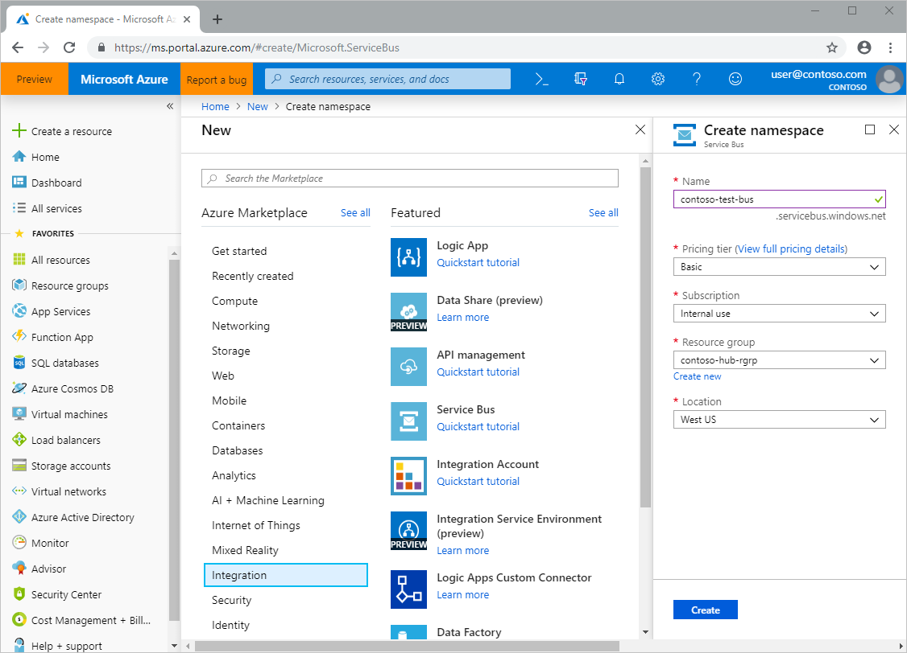

1. Select **Create**. Wait for the deployment to complete before moving on to the next step.

### Add a Service Bus queue to the namespace

1. Open the Service Bus namespace. The easiest way to get to the Service Bus namespace is to select **Resource groups** from the resource pane, select your resource group, then select the Service Bus namespace from the list of resources.

1. On the **Service Bus Namespace** pane, select **+ Queue**.

1. Enter a name for the queue and then select **Create**. When the queue has been successfully created, the **Create queue** pane closes.

   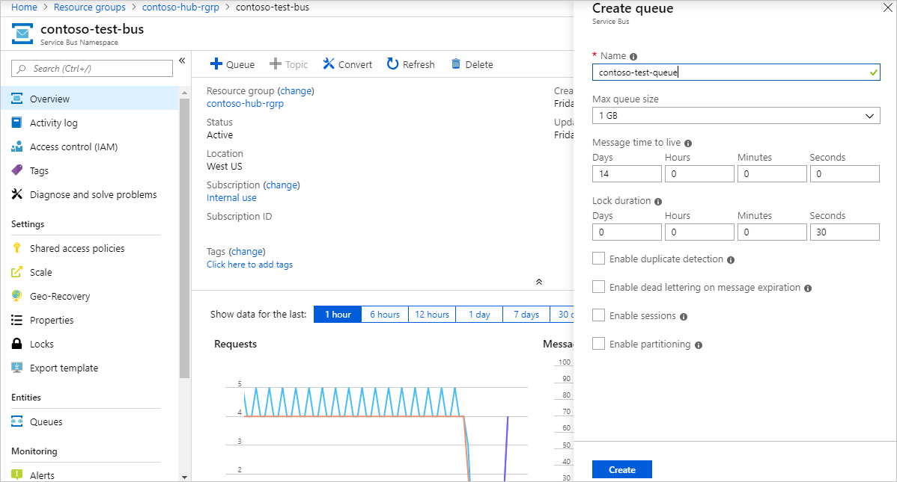

1. Back on the **Service Bus Namespace** pane, under **Entities**, select **Queues**. Open the Service Bus queue from the list, and then select **Shared access policies** > **+ Add**.

1. Enter a name for the policy, check **Manage**, and then select **Create**.

   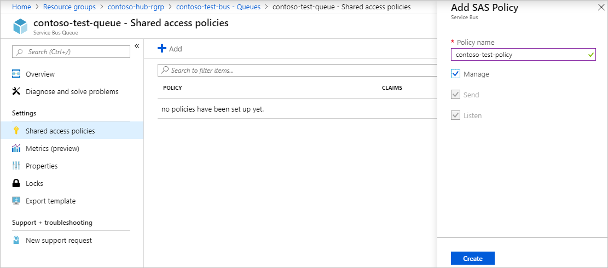

## Add a custom endpoint and routing rule to your IoT hub

Add a custom endpoint for the Service Bus queue to your IoT hub and create a message routing rule to direct messages that contain a temperature alert to that endpoint, where they will be picked up by your logic app. The routing rule uses a routing query, `temperatureAlert = "true"`, to forward messages based on the value of the `temperatureAlert` application property set by the client code running on the device. To learn more, see [Message routing query based on message properties](https://docs.microsoft.com/azure/iot-hub/iot-hub-devguide-routing-query-syntax#message-routing-query-based-on-message-properties).

### Add a custom endpoint

1. Open your IoT hub. The easiest way to get to the IoT hub is to select **Resource groups** from the resource pane, select your resource group, then select your IoT hub from the list of resources.

1. Under **Messaging**, select **Message routing**. On the **Message routing** pane, select the **Custom endpoints** tab and then select **+ Add**. From the drop-down list, select **Service bus queue**.

   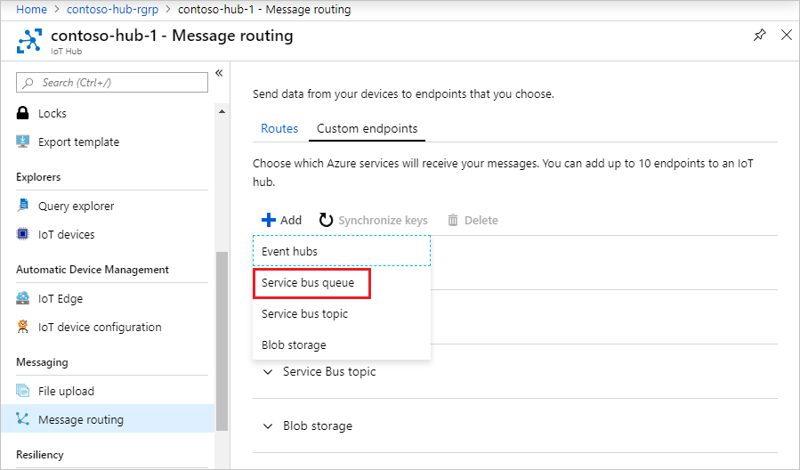

1. On the **Add a service bus endpoint** pane, enter the following information:

   **Endpoint name**: The name of the endpoint.

   **Service bus namespace**: Select the namespace you created.

   **Service bus queue**: Select the queue you created.

   

1. Select **Create**. After the endpoint is successfully created, proceed to the next step.

### Add a routing rule

1. Back on the **Message routing** pane, select the **Routes** tab and then select **+ Add**.

1. On the **Add a route** pane, enter the following information:

   **Name**: The name of the routing rule.

   **Endpoint**: Select the endpoint you created.

   **Data source**: Select **Device Telemetry Messages**.

   **Routing query**: Enter `temperatureAlert = "true"`.

   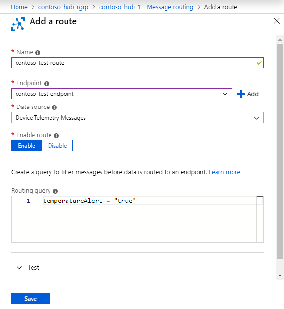

1. Select **Save**. You can close the **Message routing** pane.

## Create and configure a Logic App

In the preceding section, you set up your IoT hub to route messages containing a temperature alert to your Service Bus queue. Now, you set up a logic app to monitor the Service Bus queue and send an e-mail notification whenever a message is added to the queue.

### Create a logic app

1. Select **Create a resource** > **Integration** > **Logic App**.

1. Enter the following information:

   **Name**: The name of the logic app.

   **Resource group**: Use the same resource group that your IoT hub uses.

   **Location**: Use the same location that your IoT hub uses.

   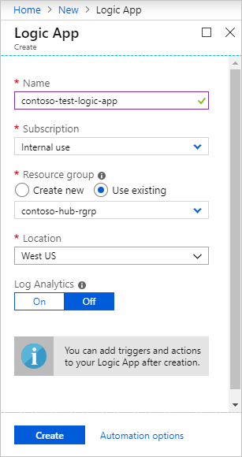

1. Select **Create**.

### Configure the logic app trigger

1. Open the logic app. The easiest way to get to the logic app is to select **Resource groups** from the resource pane, select your resource group, then select your logic app from the list of resources. When you select the logic app, the Logic Apps Designer opens.

1. In the Logic Apps Designer, scroll down to **Templates** and select **Blank Logic App**.

   

1. Select the **All** tab and then select **Service Bus**.

   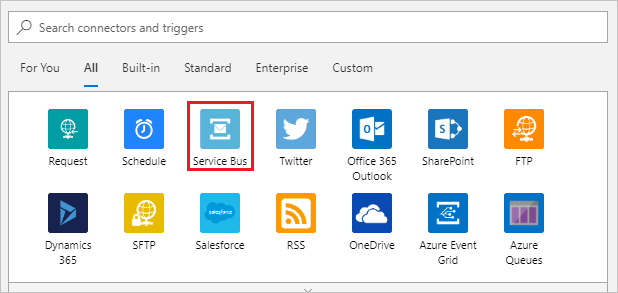

1. Under **Triggers**, select **When one or more messages arrive in a queue (auto-complete)**.

   

1. Create a service bus connection.
   1. Enter a connection name and select your Service Bus namespace from the list. The next screen opens.

      

   1. Select the service bus policy (RootManageSharedAccessKey). Then select  **Create**.

      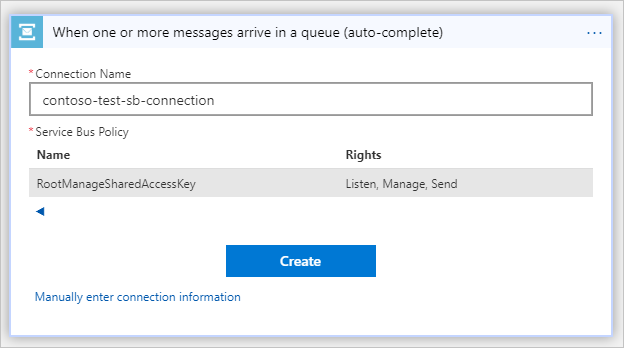

   1. On the final screen, for **Queue name**, select the queue that you created from the drop-down. Enter `175` for **Maximum message count**.

      

   1. Select **Save** on the menu at the top of the Logic Apps Designer to save your changes.

### Configure the logic app action

1. Create an SMTP service connection.

   1. Select **New step**. In **Choose an action**, select the **All** tab.

   1. Type `smtp` in the search box, select the **SMTP** service in the search result, and then select **Send Email**.

      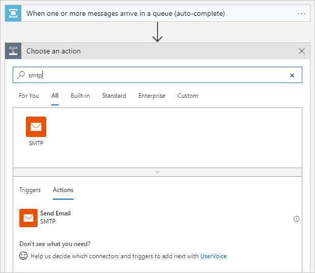

   1. Enter the SMTP information for your mailbox, and then select **Create**.

      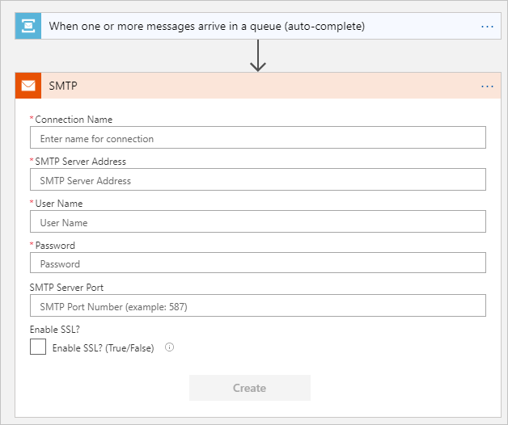

      Get the SMTP information for [Hotmail/Outlook.com](https://support.office.com/article/Add-your-Outlook-com-account-to-another-mail-app-73f3b178-0009-41ae-aab1-87b80fa94970), [Gmail](https://support.google.com/a/answer/176600?hl=en), and [Yahoo Mail](https://help.yahoo.com/kb/SLN4075.html).

      > [!NOTE]
      > You may need to disable TLS to establish the connection. If this is the case and you want to re-enable TLS after the connection has been established, see the optional step at the end of this section.

   1. From the **Add new parameter** drop-down on the **Send Email** step, select **From**, **To**, **Subject** and **Body**. Click or tap anywhere on the screen to close the selection box.

      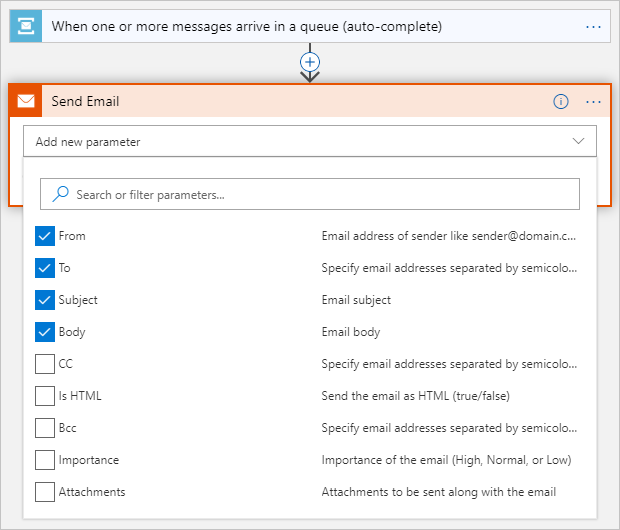

   1. Enter your email address for **From** and **To**, and `High temperature detected` for **Subject** and **Body**. If the **Add dynamic content from the apps and connectors used in this flow** dialog opens, select **Hide** to close it. You do not use dynamic content in this tutorial.

      

   1. Select **Save** to save the SMTP connection.

1. (Optional) If you had to disable TLS to establish a connection with your email provider and want to re-enable it, follow these steps:

   1. On the **Logic app** pane, under **Development Tools**, select **API connections**.

   1. From the list of API connections, select the SMTP connection.

   1. On the **smtp API Connection** pane, under **General**, select **Edit API connection**.

   1. On the **Edit API Connection** pane, select **Enable SSL?**, re-enter the password for your email account, and select **Save**.

      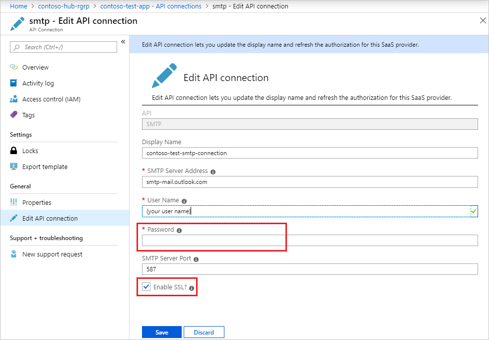

Your logic app is now ready to process temperature alerts from the Service Bus queue and send notifications to your email account.

## Test the logic app

1. Start the client application on your device.

1. If you're using a physical device, carefully bring a heat source near the heat sensor until the temperature exceeds 30 degrees C. If you're using the online simulator, the client code will randomly output telemetry messages that exceed 30 C.

1. You should begin receiving email notifications sent by the logic app.

   > [!NOTE]
   > Your email service provider may need to verify the sender identity to make sure it is you who sends the email.

## Next steps

You have successfully created a logic app that connects your IoT hub and your mailbox for temperature monitoring and notifications.

[!INCLUDE [iot-hub-get-started-next-steps](../../includes/iot-hub-get-started-next-steps.md)]
