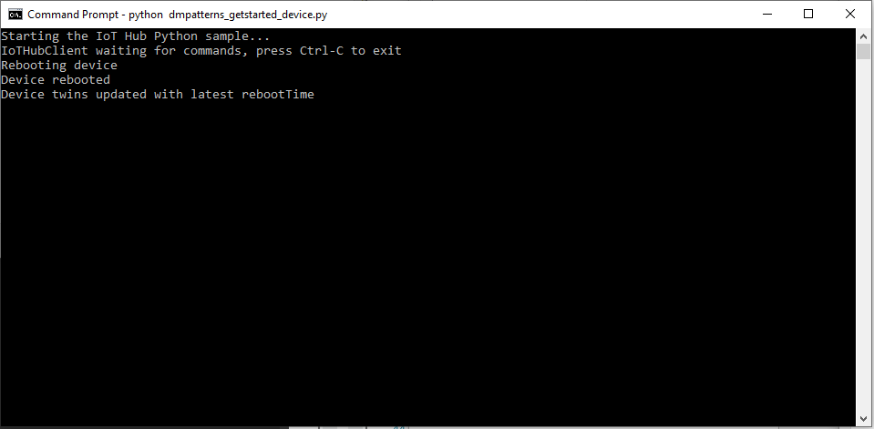
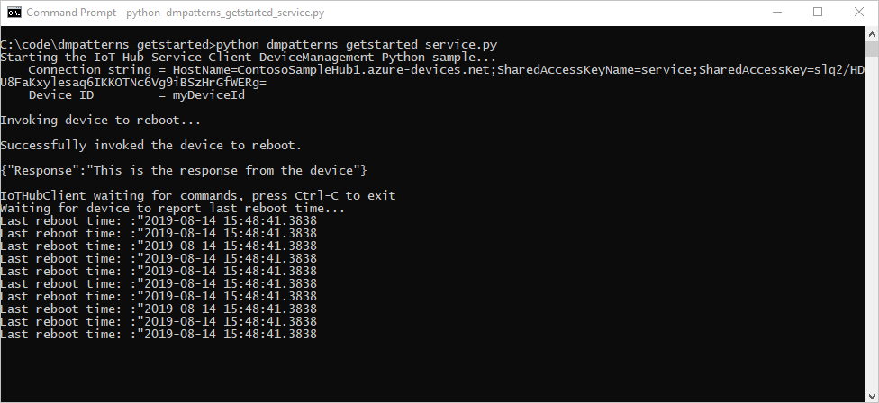

# Get started with device management (Python)

[!INCLUDE [iot-hub-selector-dm-getstarted](../../includes/iot-hub-selector-dm-getstarted.md)]

This tutorial shows you how to:

* Use the Azure portal to create an IoT Hub and create a device identity in your IoT hub.

* Create a simulated device app that contains a direct method that reboots that device. Direct methods are invoked from the cloud.

* Create a Python console app that calls the reboot direct method in the simulated device app through your IoT hub.

At the end of this tutorial, you have two Python console apps:

* **dmpatterns_getstarted_device.py**, which connects to your IoT hub with the device identity created earlier, receives a reboot direct method, simulates a physical reboot, and reports the time for the last reboot.

* **dmpatterns_getstarted_service.py**, which calls a direct method in the simulated device app, displays the response, and displays the updated reported properties.

[!INCLUDE [iot-hub-include-python-sdk-note](../../includes/iot-hub-include-python-sdk-note.md)]

## Prerequisites

To complete this tutorial, you need:

[!INCLUDE [iot-hub-include-python-installation-notes](../../includes/iot-hub-include-python-installation-notes.md)]

## Create an IoT hub

[!INCLUDE [iot-hub-include-create-hub](../../includes/iot-hub-include-create-hub.md)]

## Register a new device in the IoT hub

[!INCLUDE [iot-hub-get-started-create-device-identity](../../includes/iot-hub-get-started-create-device-identity.md)]

## Create a simulated device app

In this section, you:

* Create a Python console app that responds to a direct method called by the cloud

* Simulate a device reboot

* Use the reported properties to enable device twin queries to identify devices and when they last rebooted

1. At your command prompt, run the following command to install the **azure-iot-device-client** package:

    ```cmd/sh
    pip install azure-iothub-device-client
    ```

   > [!NOTE]
   > The pip packages for azure-iothub-service-client and azure-iothub-device-client are currently available only for Windows OS. For Linux/Mac OS, please refer to the Linux and Mac OS-specific sections on the [Prepare your development environment for Python](https://github.com/Azure/azure-iot-sdk-python/blob/master/doc/python-devbox-setup.md) post.
   >

2. Using a text editor, create a file named **dmpatterns_getstarted_device.py** in your working directory.

3. Add the following `import` statements at the start of the **dmpatterns_getstarted_device.py** file.

    ```python
    import random
    import time, datetime
    import sys

    import iothub_client
    from iothub_client import IoTHubClient, IoTHubClientError, IoTHubTransportProvider, IoTHubClientResult, IoTHubError, DeviceMethodReturnValue
    ```

4. Add variables including a **CONNECTION_STRING** variable and the client initialization.  Replace the `{deviceConnectionString}` placeholder value with your device connection string. You copied this connection string previously in [Register a new device in the IoT hub](#register-a-new-device-in-the-iot-hub).  

    ```python
    CONNECTION_STRING = "{deviceConnectionString}"
    PROTOCOL = IoTHubTransportProvider.MQTT

    CLIENT = IoTHubClient(CONNECTION_STRING, PROTOCOL)

    WAIT_COUNT = 5

    SEND_REPORTED_STATE_CONTEXT = 0
    METHOD_CONTEXT = 0

    SEND_REPORTED_STATE_CALLBACKS = 0
    METHOD_CALLBACKS = 0
    ```

5. Add the following function callbacks to implement the direct method on the device.

    ```python
    def send_reported_state_callback(status_code, user_context):
        global SEND_REPORTED_STATE_CALLBACKS

        print ( "Device twins updated." )

    def device_method_callback(method_name, payload, user_context):
        global METHOD_CALLBACKS

        if method_name == "rebootDevice":
            print ( "Rebooting device..." )
            time.sleep(20)

            print ( "Device rebooted." )

            current_time = str(datetime.datetime.now())
            reported_state = "{\"rebootTime\":\"" + current_time + "\"}"
            CLIENT.send_reported_state(reported_state, len(reported_state), send_reported_state_callback, SEND_REPORTED_STATE_CONTEXT)

            print ( "Updating device twins: rebootTime" )

        device_method_return_value = DeviceMethodReturnValue()
        device_method_return_value.response = "{ \"Response\": \"This is the response from the device\" }"
        device_method_return_value.status = 200

        return device_method_return_value
    ```

6. Start the direct method listener and wait.

    ```python
    def iothub_client_init():
        if CLIENT.protocol == IoTHubTransportProvider.MQTT or client.protocol == IoTHubTransportProvider.MQTT_WS:
            CLIENT.set_device_method_callback(device_method_callback, METHOD_CONTEXT)

    def iothub_client_sample_run():
        try:
            iothub_client_init()

            while True:
                print ( "IoTHubClient waiting for commands, press Ctrl-C to exit" )

                status_counter = 0
                while status_counter <= WAIT_COUNT:
                    time.sleep(10)
                    status_counter += 1

        except IoTHubError as iothub_error:
            print ( "Unexpected error %s from IoTHub" % iothub_error )
            return
        except KeyboardInterrupt:
            print ( "IoTHubClient sample stopped" )

    if __name__ == '__main__':
        print ( "Starting the IoT Hub Python sample..." )
        print ( "    Protocol %s" % PROTOCOL )
        print ( "    Connection string=%s" % CONNECTION_STRING )

        iothub_client_sample_run()
    ```

7. Save and close the **dmpatterns_getstarted_device.py** file.

> [!NOTE]
> To keep things simple, this tutorial does not implement any retry policy. In production code, you should implement retry policies (such as an exponential backoff), as suggested in the article, [Transient Fault Handling](/azure/architecture/best-practices/transient-faults).

## Get the IoT hub connection string

[!INCLUDE [iot-hub-howto-device-management-shared-access-policy-text](../../includes/iot-hub-howto-device-management-shared-access-policy-text.md)]

[!INCLUDE [iot-hub-include-find-service-connection-string](../../includes/iot-hub-include-find-service-connection-string.md)]

## Trigger a remote reboot on the device using a direct method

In this section, you create a Python console app that initiates a remote reboot on a device using a direct method. The app uses device twin queries to discover the last reboot time for that device.

1. At your command prompt, run the following command to install the **azure-iot-service-client** package:

    ```cmd/sh
    pip install azure-iothub-service-client
    ```

   > [!NOTE]
   > The pip packages for azure-iothub-service-client and azure-iothub-device-client are currently available only for Windows OS. For Linux/Mac OS, please refer to the Linux and Mac OS-specific sections on the [Prepare your development environment for Python](https://github.com/Azure/azure-iot-sdk-python/blob/master/doc/python-devbox-setup.md) post.
   >

2. Using a text editor, create a file named **dmpatterns_getstarted_service.py** in your working directory.

3. Add the following `import` statements at the start of the **dmpatterns_getstarted_service.py** file.

    ```python
    import sys, time
    import iothub_service_client

    from iothub_service_client import IoTHubDeviceMethod, IoTHubError, IoTHubDeviceTwin
    ```

4. Add the following variable declarations. Replace the `{IoTHubConnectionString}` placeholder value with the IoT hub connection string you copied previously in [Get the IoT hub connection string](#get-the-iot-hub-connection-string). Replace the `{deviceId}` placeholder value with the device ID you registered in [Register a new device in the IoT hub](#register-a-new-device-in-the-iot-hub).

    ```python
    CONNECTION_STRING = "{IoTHubConnectionString}"
    DEVICE_ID = "{deviceId}"

    METHOD_NAME = "rebootDevice"
    METHOD_PAYLOAD = "{\"method_number\":\"42\"}"
    TIMEOUT = 60
    WAIT_COUNT = 10
    ```

5. Add the following function to invoke the device method to reboot the target device, then query for the device twins and get the last reboot time.

    ```python
    def iothub_devicemethod_sample_run():
        try:
            iothub_twin_method = IoTHubDeviceTwin(CONNECTION_STRING)
            iothub_device_method = IoTHubDeviceMethod(CONNECTION_STRING)

            print ( "" )
            print ( "Invoking device to reboot..." )

            response = iothub_device_method.invoke(DEVICE_ID, METHOD_NAME, METHOD_PAYLOAD, TIMEOUT)

            print ( "" )
            print ( "Successfully invoked the device to reboot." )

            print ( "" )
            print ( response.payload )

            while True:
                print ( "" )
                print ( "IoTHubClient waiting for commands, press Ctrl-C to exit" )

                status_counter = 0
                while status_counter <= WAIT_COUNT:
                    twin_info = iothub_twin_method.get_twin(DEVICE_ID)

                    if twin_info.find("rebootTime") != -1:
                        print ( "Last reboot time: " + twin_info[twin_info.find("rebootTime")+11:twin_info.find("rebootTime")+37])
                    else:
                        print ("Waiting for device to report last reboot time...")

                    time.sleep(5)
                    status_counter += 1

        except IoTHubError as iothub_error:
            print ( "" )
            print ( "Unexpected error {0}".format(iothub_error) )
            return
        except KeyboardInterrupt:
            print ( "" )
            print ( "IoTHubDeviceMethod sample stopped" )

    if __name__ == '__main__':
        print ( "Starting the IoT Hub Service Client DeviceManagement Python sample..." )
        print ( "    Connection string = {0}".format(CONNECTION_STRING) )
        print ( "    Device ID         = {0}".format(DEVICE_ID) )

        iothub_devicemethod_sample_run()
    ```

6. Save and close the **dmpatterns_getstarted_service.py** file.

## Run the apps

You're now ready to run the apps.

1. At the command prompt, run the following command to begin listening for the reboot direct method.

    ```cmd/sh
    python dmpatterns_getstarted_device.py
    ```

2. At another command prompt, run the following command to trigger the remote reboot and query for the device twin to find the last reboot time.

    ```cmd/sh
    python dmpatterns_getstarted_service.py
    ```

3. You see the device response to the direct method in the console.

   The following shows the device response to the reboot direct method:

   

   The following shows the service calling the reboot direct method and polling the device twin for status:

   

[!INCLUDE [iot-hub-dm-followup](../../includes/iot-hub-dm-followup.md)]