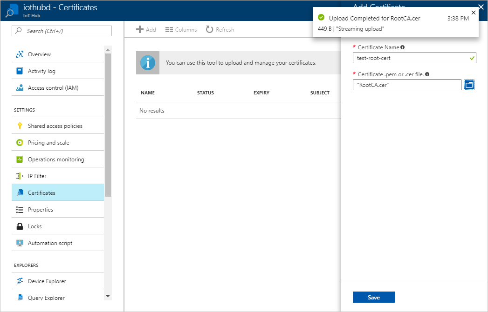
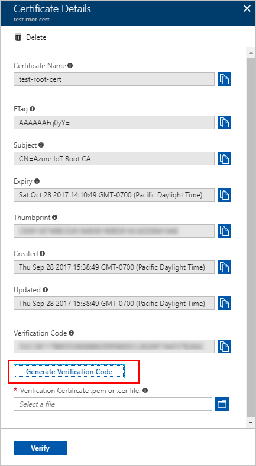

# Get started on setting up X.509 security in your Azure IoT hub

This tutorial describes the tasks you need to do to set up the CA-based X.509 based security in Azure IoT Hub, with the help of a simulated script. It uses the open source tool [OpenSSL](https://www.openssl.org/) to create certificates locally on your Windows machine. We recommend that you use this tutorial for test purposes only. For production environment, you should purchase the certificates from a *certificate authority (CA)* such as **VeriSign**. 

## Prerequisites
This tutorial requires that you have the following resources ready:

- You have created an IoT hub with your Azure subscription. See [Create an IoT hub through portal](iot-hub-create-through-portal.md) for detailed steps to create a hub. 
- You have downloaded the OpenSSL source code and built the binaries on your machine. You may also ownload and install the [third-party OpenSSL binaries for your development environment](https://wiki.openssl.org/index.php/Binaries), such as [SourceForge](https://sourceforge.net/projects/openssl/). Make sure the environment variables such as *PATH* are updated.

<a id="createcerts"></a>

## Task 1: Create X.509 certificates
The X.509 certificate-based security in the IoT Hub requires you to start with an [X.509 certificate chain](https://en.wikipedia.org/wiki/X.509#Certificate_chains_and_cross-certification), which includes the root certificate as well as any intermediate certificates up until the leaf certificate. The following steps show you how to create these certificates locally. 

1. Open a PowerShell windows as an *Administrator*. 
2. Navigate to your working directory. Run the following script to set the global variables. 
    ```PowerShell
    $openSSLBinSource = "<full_path_to_the_binaries>\OpenSSL\bin"
    $errorActionPreference    = "stop"

    # Note that these values are for test purpose only
    $_rootCertSubject         = "CN=Azure IoT Root CA"
    $_intermediateCertSubject = "CN=Azure IoT Intermediate {0} CA"
    $_privateKeyPassword      = "123"

    $rootCACerFileName          = "./RootCA.cer"
    $rootCAPemFileName          = "./RootCA.pem"
    $intermediate1CAPemFileName = "./Intermediate1.pem"
    $intermediate2CAPemFileName = "./Intermediate2.pem"
    $intermediate3CAPemFileName = "./Intermediate3.pem"

    $openSSLBinDir              = Join-Path $ENV:TEMP "openssl-bin"

    # Whether to use ECC or RSA.
    $useEcc                     = $true
    ```
3. Then run the following script that copies the OpenSSL binaries to your working directory and sets the environment variables:

    ```PowerShell
    function Initialize-CAOpenSSL()
    {
        Write-Host ("Beginning copy of openssl binaries to {0} (and setting up env variables...)" -f $openSSLBinDir)
        if (-not (Test-Path $openSSLBinDir))
        {
            mkdir $openSSLBinDir | Out-Null
        }

        robocopy $openSSLBinSource $openSSLBinDir * /s 
        robocopy $openSSLBinSource . * /s 

        Write-Host "Setting up PATH and other environment variables."
        $ENV:PATH += "; $openSSLBinDir"
        $ENV:OPENSSL_CONF = Join-Path $openSSLBinDir "openssl.cnf"

        Write-Host "Success"
    }
    Initialize-CAOpenSSL
    ```
4. Next run the following script that searches if certificate by the specified *Subject Name* is already installed and whether OpenSSL is configured correctly on your machine:
    ```PowerShell
    function Get-CACertBySubjectName([string]$subjectName)
    {
        $certificates = gci -Recurse Cert:\LocalMachine\ |? { $_.gettype().name -eq "X509Certificate2" }
        $cert = $certificates |? { $_.subject -eq $subjectName -and $_.PSParentPath -eq "Microsoft.PowerShell.Security\Certificate::LocalMachine\My" }
        if ($NULL -eq $cert)
        {
            throw ("Unable to find certificate with subjectName {0}" -f $subjectName)
        }
    
        write $cert
    }
    function Test-CAPrerequisites()
    {
        $certInstalled = $null
        try
        {
            $certInstalled = Get-CACertBySubjectName $_rootCertSubject
        }
        catch {}

        if ($NULL -ne $certInstalled)
        {
            throw ("Certificate {0} already installed.  Cleanup CA Dogfood certs 1st" -f $_rootCertSubject)
        }

        if ($NULL -eq $ENV:OPENSSL_CONF)
        {
            throw ("OpenSSL not configured on this system.  Run 'Initialize-CADogfoodOpenSSL' (even if you've already done so) to set everything up.")
        }
        Write-Host "Success"
    }
    Test-CAPrerequisites
    ```
    If everything is configured correctly, you should see "Success" message.
5. Create a certificate chain with a root CA, for example, "CN=Azure IoT Root CA" that this sample uses, by running the following PowerShell script. This also updates your Windows OS certificate store, as well creates certificate files in your working directory. 
    1. The following script creates a PowerShell function to create a self signed certificate, for a given *Subject Name* and signing authority. 
    ```PowerShell
    function New-CASelfsignedCertificate([string]$subjectName, [object]$signingCert, [bool]$isASigner=$true)
    {
	      # Build up argument list
	      $selfSignedArgs =@{"-DnsName"=$subjectName; 
	                         "-CertStoreLocation"="cert:\LocalMachine\My";
                           "-NotAfter"=(get-date).AddDays(30); 
	                        }

	      if ($isASigner -eq $true)
	      {
		        $selfSignedArgs += @{"-KeyUsage"="CertSign"; }
            $selfSignedArgs += @{"-TextExtension"= @(("2.5.29.19={text}ca=TRUE&pathlength=12"))  ; }
	      }
        else
        {
            $selfSignedArgs += @{"-TextExtension"= @("2.5.29.37={text}1.3.6.1.5.5.7.3.2,1.3.6.1.5.5.7.3.1", "2.5.29.19={text}ca=FALSE&pathlength=0")  }
        }

	      if ($signingCert -ne $null)
	      {
		        $selfSignedArgs += @{"-Signer"=$signingCert }
	      }

        if ($useEcc -eq $true)
        {
            $selfSignedArgs += @{"-KeyAlgorithm"="ECDSA_nistP256";
                             "-CurveExport"="CurveName" }
        }

	      # Now use splatting to process this
	      Write-Host ("Generating certificate {0} which is for prototyping, NOT PRODUCTION.  It will expire in 30 days." -f $subjectName)
	      write (New-SelfSignedCertificate @selfSignedArgs)
    }
    ``` 
    2. The following PowerShell function creates intermediate X.509 certificates using the preceding function as well as the OpenSSL binaries. 
    ```PowerShell
    function New-CAIntermediateCert([string]$subjectName, [Microsoft.CertificateServices.Commands.Certificate]$signingCert, [string]$pemFileName)
    {
        $certFileName = ($subjectName + ".cer")
        $newCert = New-CASelfsignedCertificate $subjectName $signingCert
        Export-Certificate -Cert $newCert -FilePath $certFileName -Type CERT | Out-Null
        Import-Certificate -CertStoreLocation "cert:\LocalMachine\CA" -FilePath $certFileName | Out-Null

        # Store public PEM for later chaining
        openssl x509 -inform der -in $certFileName -out $pemFileName

        del $certFileName
   
        write $newCert
    }  
    ```
    3. The following PowerShell function creates the X.509 certificate chain. Read [Certificate chains](https://en.wikipedia.org/wiki/X.509#Certificate_chains_and_cross-certification) for more information.
    ```PowerShell
    function New-CACertChain()
    {
        Write-Host "Beginning to install certificate chain to your LocalMachine\My store"
        $rootCACert =  New-CASelfsignedCertificate $_rootCertSubject $null
    
        Export-Certificate -Cert $rootCACert -FilePath $rootCACerFileName  -Type CERT
        Import-Certificate -CertStoreLocation "cert:\LocalMachine\Root" -FilePath $rootCACerFileName

        openssl x509 -inform der -in $rootCACerFileName -out $rootCAPemFileName

        $intermediateCert1 = New-CAIntermediateCert ($_intermediateCertSubject -f "1") $rootCACert $intermediate1CAPemFileName
        $intermediateCert2 = New-CAIntermediateCert ($_intermediateCertSubject -f "2") $intermediateCert1 $intermediate2CAPemFileName
        $intermediateCert3 = New-CAIntermediateCert ($_intermediateCertSubject -f "3") $intermediateCert2 $intermediate3CAPemFileName
        Write-Host "Success"
    }    
    ```
<a id="uploadcerts"></a>

## Task 2: Upload X.509 certificates through the portal

These steps show you how to add a new Certificate Authority to your hub through the portal.

1. In the Azure portal, navigate to your IoT hub and open the **Certificate Explorer**. 
2. Click **Add** to add a new certificate.
3. Enter a friendly display name to your certificate, select the root certificate file from your machine, and **Upload** it. Make sure to avoid adding sensitive information in the display name.
4. The **Certificate** box will show your certificate once uploaded. Click **Save**.

      

   This will show your certificate in the **Certificate Explorer** list.

<a id="verifycerts"></a>

## Task 3: Verify your certificate with your IoT hub

1. In the Azure portal, navigate to your IoT hub's **Certificate Explorer** and click on the certificate that you added in the previous section.
2. In the certificate information blade, click **Generate Verification Code**.
3. It creates a **Verfication Code** for your certificate. Copy the code to your clipboard. 

     

4. In the PowerShell window on your desktop, run the following code.
    ```
    New-CAVerificationCert "<your verification code>"
    ```
   This creates a certificate with the given subject name, signed by the CA. This lets your IoT hub know that you actually have the signing permission (for example, the private key) of this CA.
5. In the certificate information blade on the Azure portal, navigate to the **Verification Certificate .pem or .cer file**, and select the output of the preceding PowerShell command to **Upload**.

     

   Once the certificate is verified, you should see the **STATUS** of your certificate change to **_Verified_** in the **Certificate Explorer** blade. 

<a id="registerdevice"></a>

## Task 4: Register your device with your IoT hub

1. In the Azure portal, navigate to your IoT hub's **Device Explorer**.
2. 

<a id="deviceconnects"></a>

## Task 5: Device connects to the hub


## See also
To learn more about securing your IoT solution, see:

* [IoT Security Best Practices][lnk-security-best-practices]
* [IoT Security Architecture][lnk-security-architecture]
* [Secure your IoT deployment][lnk-security-deployment]

To further explore the capabilities of IoT Hub, see:

* [Simulating a device with Azure IoT Edge][lnk-iotedge]

[lnk-security-best-practices]: iot-hub-security-best-practices.md
[lnk-security-architecture]: iot-hub-security-architecture.md
[lnk-security-deployment]: iot-hub-security-deployment.md

[lnk-iotedge]: iot-hub-linux-iot-edge-simulated-device.md
