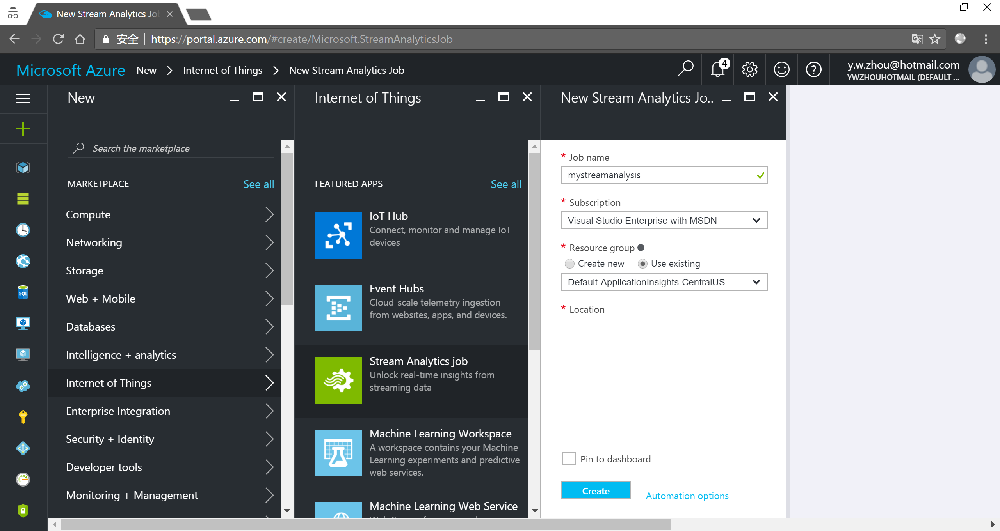
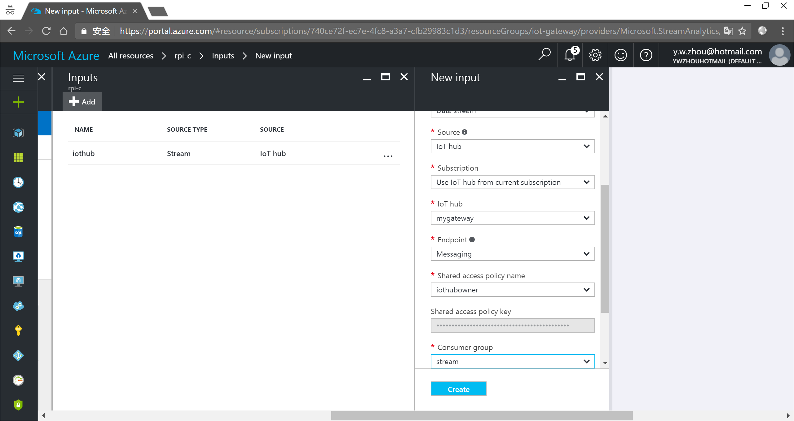
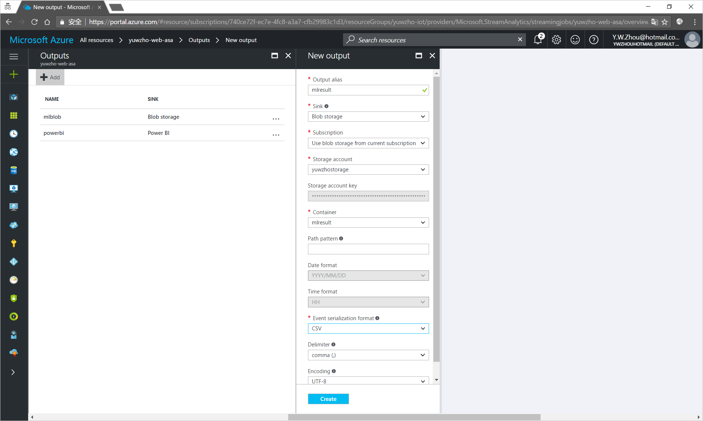
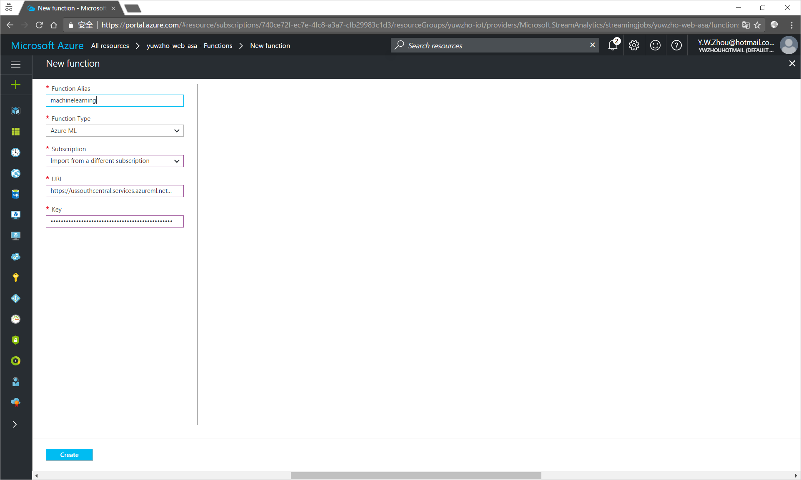
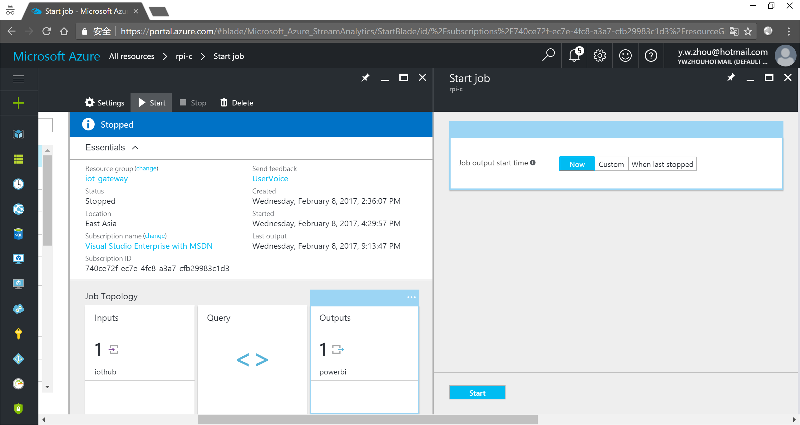

# Weather forecast using the sensor data from your IoT hub in Azure Machine Learning


[!INCLUDE [iot-hub-get-started-note](../../includes/iot-hub-get-started-note.md)]

Machine learning is a technique of data science that helps computers learn from existing data to forecast future behaviors, outcomes, and trends. Azure Machine Learning is a cloud predictive analytics service that makes it possible to quickly create and deploy predictive models as analytics solutions.

## What you learn

You learn how to use Azure Machine Learning to do weather forecast (chance of rain) using the temperature and humidity data from your Azure IoT hub. The chance of rain is the output of a prepared weather prediction model. The model is built upon historic data to forecast chance of rain based on temperature and humidity.

## What you do

- Deploy the weather prediction model as a web service.
- Get your IoT hub ready for data access by adding a consumer group.
- Create a Stream Analytics job and configure the job to:
  - Read temperature and humidity data from your IoT hub.
  - Call the web service to get the rain chance.
  - Save the result to an Azure blob storage.
- Use Microsoft Azure Storage Explorer to view the weather forecast.

## What you need

- Complete the [Raspberry Pi online simulator](iot-hub-raspberry-pi-web-simulator-get-started.md) tutorial or one of the device tutorials; for example, [Raspberry Pi with node.js](iot-hub-raspberry-pi-kit-node-get-started.md). These cover the following requirements:
  - An active Azure subscription.
  - An Azure IoT hub under your subscription.
  - A client application that sends messages to your Azure IoT hub.
- An [Azure Machine Learning Studio (classic)](https://studio.azureml.net/) account.

## Deploy the weather prediction model as a web service

In this section you get the weather prediction model from the Azure AI Library. Then you add an R-script module to the model to clean the temperature and humidity data. Lastly, you deploy the model as a predictive web service.

### Get the weather prediction model

In this section you get the weather prediction model from the Azure AI Gallery and open it in Azure Machine Learning Studio (classic).

1. Go to the [weather prediction model page](https://gallery.cortanaintelligence.com/Experiment/Weather-prediction-model-1).

   

1. Click **Open in Studio (classic)** to open the model in Microsoft Azure Machine Learning Studio (classic).

   

### Add an R-script module to clean temperature and humidity data

For the model to behave correctly, the temperature and humidity data must be convertible to numeric data. In this section, you add an R-script module to the weather prediction model that removes any rows that have data values for temperature or humidity that cannot be converted to numeric values.

1. On the left-side of the Azure Machine Learning Studio window, click the arrow to expand the tools panel. Enter "Execute" into the search box. Select the **Execute R Script** module.

   

1. Drag the **Execute R Script** module near the **Clean Missing Data** module and the existing **Execute R Script** module on the experiment canvas. Connect the inputs and outputs as shown.

   

1. Select the new **Execute R Script** module to open its properties window. Copy and paste the following code into the **R Script** box. Make sure **CRAN R** is selected for the R version.

   ```r
   # Map 1-based optional input ports to variables
   data <- maml.mapInputPort(1) # class: data.frame

   data$temperature <- as.numeric(as.character(data$temperature))
   data$humidity <- as.numeric(as.character(data$humidity))

   completedata <- data[complete.cases(data), ]

   maml.mapOutputPort('completedata')

   ```

   When you're finished the properties window should look similar to the following:

   

1. Click **Run** to validate the steps in the model. This step might take a few minutes to complete.

   

### Deploy predictive web service

1. Click **SET UP WEB SERVICE** > **Predictive Web Service**.

   

1. In the diagram, drag the **Web service input** module somewhere near the **Score Model** module.

1. Connect the **Web service input** module to the **Score Model** module.

   

1. Click **RUN** to validate the steps in the model.

1. Click **DEPLOY WEB SERVICE** to deploy the model as a web service.

1. On the dashboard of the model, download the **Excel 2010 or earlier workbook** for **REQUEST/RESPONSE**.

   > [!Note]
   > Make sure that you download the **Excel 2010 or earlier workbook** even if you are running a later version of Excel on your computer.

   

1. Open the Excel workbook, make a note of the **WEB SERVICE URL** and **ACCESS KEY**.

[!INCLUDE [iot-hub-get-started-create-consumer-group](../../includes/iot-hub-get-started-create-consumer-group.md)]

## Create, configure, and run a Stream Analytics job

### Create a Stream Analytics job

1. In the [Azure portal](https://portal.azure.com/), click **Create a resource** > **Internet of Things** > **Stream Analytics job**.
1. Enter the following information for the job.

   **Job name**: The name of the job. The name must be globally unique.

   **Resource group**: Use the same resource group that your IoT hub uses.

   **Location**: Use the same location as your resource group.

   **Pin to dashboard**: Check this option for easy access to your IoT hub from the dashboard.

   

1. Click **Create**.

### Add an input to the Stream Analytics job

1. Open the Stream Analytics job.
1. Under **Job Topology**, click **Inputs**.
1. In the **Inputs** pane, click **Add**, and then enter the following information:

   **Input alias**: The unique alias for the input.

   **Source**: Select **IoT hub**.

   **Consumer group**: Select the consumer group you created.

   

1. Click **Create**.

### Add an output to the Stream Analytics job

1. Under **Job Topology**, click **Outputs**.
1. In the **Outputs** pane, click **Add**, and then enter the following information:

   **Output alias**: The unique alias for the output.

   **Sink**: Select **Blob Storage**.

   **Storage account**: The storage account for your blob storage. You can create a storage account or use an existing one.

   **Container**: The container where the blob is saved. You can create a container or use an existing one.

   **Event serialization format**: Select **CSV**.

   

1. Click **Create**.

### Add a function to the Stream Analytics job to call the web service you deployed

1. Under **Job Topology**, click **Functions** > **Add**.
1. Enter the following information:

   **Function Alias**: Enter `machinelearning`.

   **Function Type**: Select **Azure ML**.

   **Import option**: Select **Import from a different subscription**.

   **URL**: Enter the WEB SERVICE URL that you noted down from the Excel workbook.

   **Key**: Enter the ACCESS KEY that you noted down from the Excel workbook.

   

1. Click **Create**.

### Configure the query of the Stream Analytics job

1. Under **Job Topology**, click **Query**.
1. Replace the existing code with the following code:

   ```sql
   WITH machinelearning AS (
      SELECT EventEnqueuedUtcTime, temperature, humidity, machinelearning(temperature, humidity) as result from [YourInputAlias]
   )
   Select System.Timestamp time, CAST (result.[temperature] AS FLOAT) AS temperature, CAST (result.[humidity] AS FLOAT) AS humidity, CAST (result.[Scored Probabilities] AS FLOAT ) AS 'probabalities of rain'
   Into [YourOutputAlias]
   From machinelearning
   ```

   Replace `[YourInputAlias]` with the input alias of the job.

   Replace `[YourOutputAlias]` with the output alias of the job.

1. Click **Save**.

### Run the Stream Analytics job

In the Stream Analytics job, click **Start** > **Now** > **Start**. Once the job successfully starts, the job status changes from **Stopped** to **Running**.



## Use Microsoft Azure Storage Explorer to view the weather forecast

Run the client application to start collecting and sending temperature and humidity data to your IoT hub. For each message that your IoT hub receives, the Stream Analytics job calls the weather forecast web service to produce the chance of rain. The result is then saved to your Azure blob storage. Azure Storage Explorer is a tool that you can use to view the result.

1. [Download and install Microsoft Azure Storage Explorer](https://storageexplorer.com/).
1. Open Azure Storage Explorer.
1. Sign in to your Azure account.
1. Select your subscription.
1. Click your subscription > **Storage Accounts** > your storage account > **Blob Containers** > your container.
1. Open a .csv file to see the result. The last column records the chance of rain.

   

## Summary

You’ve successfully used Azure Machine Learning to produce the chance of rain based on the temperature and humidity data that your IoT hub receives.

[!INCLUDE [iot-hub-get-started-next-steps](../../includes/iot-hub-get-started-next-steps.md)]