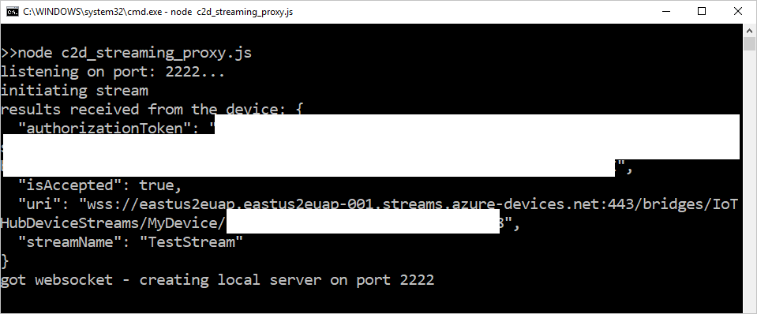
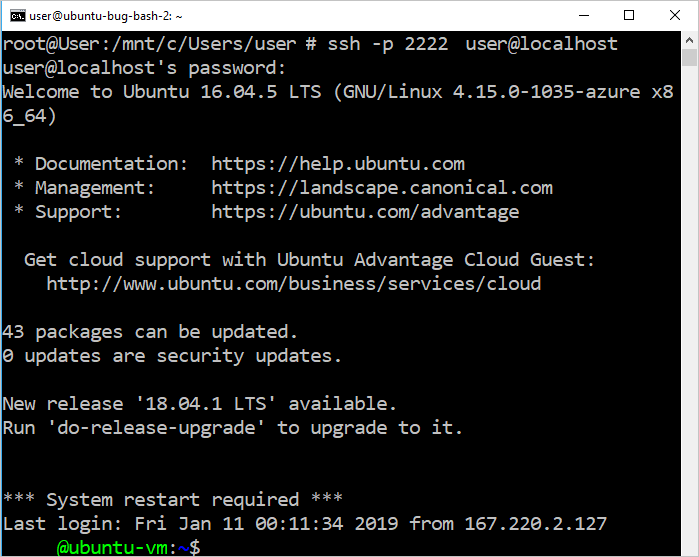

# Quickstart: Enable SSH and RDP over an IoT Hub device stream by using a Node.js proxy application (preview)

[!INCLUDE [iot-hub-quickstarts-4-selector](../../includes/iot-hub-quickstarts-4-selector.md)]

Microsoft Azure IoT Hub currently supports device streams as a [preview feature](https://azure.microsoft.com/support/legal/preview-supplemental-terms/).

[IoT Hub device streams](./iot-hub-device-streams-overview.md) allow service and device applications to communicate in a secure and firewall-friendly manner. 

This quickstart describes the execution of a Node.js proxy application that's running on the service side to enable Secure Shell (SSH) and Remote Desktop Protocol (RDP) traffic to be sent to the device over a device stream. For an overview of the setup, see [Local Proxy Sample](./iot-hub-device-streams-overview.md#local-proxy-sample-for-ssh-or-rdp). 

During public preview, the Node.js SDK supports device streams on the service side only. As a result, this quickstart covers instructions to run only the service-local proxy application. To run the device-local proxy application, see:  

   * [Enable SSH and RDP over IoT Hub device streams by using a C proxy application](./quickstart-device-streams-proxy-c.md)
   * [Enable SSH and RDP over IoT Hub device streams by using a C# proxy application](./quickstart-device-streams-proxy-csharp.md)

This article describes the setup for SSH (by using port 22) and then describes how to modify the setup for RDP (which uses port 3389). Because device streams are application- and protocol-agnostic, you can modify the same sample to accommodate other types of client-server application traffic, usually by modifying the communication port.

[!INCLUDE [cloud-shell-try-it.md](../../includes/cloud-shell-try-it.md)]

If you don’t have an Azure subscription, create a [free account](https://azure.microsoft.com/free/?WT.mc_id=A261C142F) before you begin.

## Prerequisites

* The preview of device streams is currently supported only for IoT hubs that are created in the following regions:

  * Central US
  * Central US EUAP

* To run the service-local application in this quickstart, you need Node.js v10.x.x or later on your development machine.
  * Download [Node.js](https://nodejs.org) for multiple platforms.
  * Verify the current version of Node.js on your development machine by using the following command:

   ```
   node --version
   ```

* Add the Azure IoT Extension for Azure CLI to your Cloud Shell instance by running the following command. The IOT Extension adds IoT Hub, IoT Edge, and IoT Device Provisioning Service (DPS)-specific commands to the Azure CLI.

    ```azurecli-interactive
    az extension add --name azure-cli-iot-ext
    ```

* If you haven't already done so, [download the sample Node.js project](https://github.com/Azure-Samples/azure-iot-samples-node/archive/streams-preview.zip) and extract the ZIP archive.

## Create an IoT hub

If you completed the previous [Quickstart: Send telemetry from a device to an IoT hub](quickstart-send-telemetry-node.md), you can skip this step.

[!INCLUDE [iot-hub-include-create-hub-device-streams](../../includes/iot-hub-include-create-hub-device-streams.md)]

## Register a device

If you completed [Quickstart: Send telemetry from a device to an IoT hub](quickstart-send-telemetry-node.md), you can skip this step.

A device must be registered with your IoT hub before it can connect. In this section, you use Azure Cloud Shell to register a simulated device.

1. To create the device identity, run the following command in Cloud Shell:

   > [!NOTE]
   > * Replace the *YourIoTHubName* placeholder with the name you chose for your IoT hub.
   > * For the name of the device you're registering, it's recommended to use *MyDevice* as shown. If you choose a different name for your device, use that name throughout this article, and update the device name in the sample applications before you run them.

    ```azurecli-interactive
    az iot hub device-identity create --hub-name {YourIoTHubName} --device-id MyDevice
    ```

1. To enable the back-end application to connect to your IoT hub and retrieve the messages, you also need a *service connection string*. The following command retrieves the string for your IoT hub:

   > [!NOTE]
   > Replace the *YourIoTHubName* placeholder with the name you chose for your IoT hub.

    ```azurecli-interactive
    az iot hub show-connection-string --policy-name service --name {YourIoTHubName} --output table
    ```

   Note the returned service connection string for later use in this quickstart. It looks like the following example:

   `"HostName={YourIoTHubName}.azure-devices.net;SharedAccessKeyName=service;SharedAccessKey={YourSharedAccessKey}"`

## SSH to a device via device streams

In this section, you establish an end-to-end stream to tunnel SSH traffic.

### Run the device-local proxy application

As mentioned earlier, the IoT Hub Node.js SDK supports device streams on the service side only. For the device-local application, use a device proxy application that's available in one of the following quickstarts:

   * [Enable SSH and RDP over IoT Hub device streams by using a C proxy application](./quickstart-device-streams-proxy-c.md)
   * [Enable SSH and RDP over IoT Hub device streams by using a C# proxy application](./quickstart-device-streams-proxy-csharp.md) 

Before you proceed to the next step, ensure that the device-local proxy application is running.

### Run the service-local proxy application

With the device-local proxy application running, run the service-local proxy application that's written in Node.js by doing the following in a local terminal window:

1. For environment variables, provide your service credentials, the target device ID where the SSH daemon runs, and the port number for the proxy that's running on the device.

   ```
   # In Linux
   export IOTHUB_CONNECTION_STRING="{ServiceConnectionString}"
   export STREAMING_TARGET_DEVICE="MyDevice"
   export PROXY_PORT=2222

   # In Windows
   SET IOTHUB_CONNECTION_STRING={ServiceConnectionString}
   SET STREAMING_TARGET_DEVICE=MyDevice
   SET PROXY_PORT=2222
   ```

   Change the ServiceConnectionString placeholder to match your service connection string, and **MyDevice** to match your device ID if you gave yours a different name.

1. Navigate to the `Quickstarts/device-streams-service` directory in your unzipped project folder. Use the following code to run the service-local proxy application:

   ```
   cd azure-iot-samples-node-streams-preview/iot-hub/Quickstarts/device-streams-service

   # Install the preview service SDK, and other dependencies
   npm install azure-iothub@streams-preview
   npm install

   # Run the service-local proxy application
   node proxy.js
   ```

### SSH to your device via device streams

In Linux, run SSH by using `ssh $USER@localhost -p 2222` on a terminal. In Windows, use your favorite SSH client (for example, PuTTY).

Console output on the service-local after SSH session is established (the service-local proxy application listens on port 2222):



Console output of the SSH client application (SSH client communicates to SSH daemon by connecting to port 22, which the service-local proxy application is listening on):



### RDP to your device via device streams

Now use your RDP client application and connect to the service proxy on port 2222, an arbitrary port that you chose earlier.

> [!NOTE]
> Ensure that your device proxy is configured correctly for RDP and configured with RDP port 3389.


## Clean up resources

[!INCLUDE [iot-hub-quickstarts-clean-up-resources](../../includes/iot-hub-quickstarts-clean-up-resources-device-streams.md)]

## Next steps

In this quickstart, you set up an IoT hub, registered a device, and deployed a service proxy application to enable RDP and SSH on an IoT device. The RDP and SSH traffic will be tunneled via a device stream through the IoT hub. This process eliminates the need for direct connectivity to the device.

To learn more about device streams, see:

> [!div class="nextstepaction"]
> [Device streams overview](./iot-hub-device-streams-overview.md)
