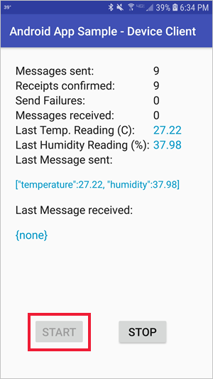

# Quickstart: Send IoT telemetry from an Android device

[!INCLUDE [iot-hub-quickstarts-1-selector](../../includes/iot-hub-quickstarts-1-selector.md)]

IoT Hub is an Azure service that enables you to ingest high volumes of telemetry from your IoT devices into the cloud for storage or processing. In this quickstart, you send telemetry from a simulated device application, through IoT Hub, to a back-end application for processing.

The quickstart uses a pre-written Android application to send the telemetry. The telemetry will be read from the IoT Hub using the Azure Cloud Shell. Before you run the application, you create an IoT hub and register a device with the hub.

[!INCLUDE [cloud-shell-try-it.md](../../includes/cloud-shell-try-it.md)]

If you don’t have an Azure subscription, create a [free account](https://azure.microsoft.com/free/?WT.mc_id=A261C142F) before you begin.

## Prerequisites

* Android studio from https://developer.android.com/studio/. For more information regarding Android Studio installation, see [android-installation](https://developer.android.com/studio/install). 

* Android SDK 27 is used by the sample in this article. 

* The [sample application](https://github.com/Azure-Samples/azure-iot-samples-java/tree/master/iot-hub/Samples/device/AndroidSample) you run in this quickstart is written for Android. Download or clone the [azure-iot-sample-java](https://github.com/Azure-Samples/azure-iot-samples-java) repository on GitHub.


## Create an IoT hub

[!INCLUDE [iot-hub-include-create-hub](../../includes/iot-hub-include-create-hub.md)]

## Register a device

A device must be registered with your IoT hub before it can connect. In this quickstart, you use the Azure Cloud Shell to register a simulated device.

1. Run the following commands in Azure Cloud Shell to add the IoT Hub CLI extension and to create the device identity. 

   **YourIoTHubName**: Replace this placeholder below with the name you choose for your IoT hub.

   **MyAndroidDevice**: MyAndroidDevice is the name given for the registered device. Use MyAndroidDevice as shown. If you choose a different name for your device, you will also need to use that name throughout this article, and update the device name in the sample applications before you run them.

    ```azurecli-interactive
    az extension add --name azure-cli-iot-ext
    az iot hub device-identity create --hub-name YourIoTHubName --device-id MyAndroidDevice
    ```

2. Run the following commands in Azure Cloud Shell to get the _device connection string_ for the device you just registered:
    **YourIoTHubName**: Replace this placeholder below with the name you choose for your IoT hub.

    ```azurecli-interactive
    az iot hub device-identity show-connection-string --hub-name YourIoTHubName --device-id MyAndroidDevice --output table
    ```

    Make a note of the device connection string, which looks like:

   `HostName={YourIoTHubName}.azure-devices.net;DeviceId=MyNodeDevice;SharedAccessKey={YourSharedAccessKey}`

    You use this value later in the quickstart.

## Send simulated telemetry

1. Open the github sample Android project in Android Studio. 

2. In Android Studio, open gradle.properties for the sample project and replace the **Device_Connection_String** placeholder with your device connection string you noted earlier.

    ```
    DeviceConnectionString=HostName={YourIoTHubName}.azure-devices.net;DeviceId=MyNodeDevice;SharedAccessKey={YourSharedAccessKey}
    ```

3. In Android Studio, click **File** > **Sync Project with Gradle Files**. Verify the build completes.

4. Once the build is completed, click **Run** > **Run 'app'** and run the app on a physical device or emulator. For more Information on running an app on a physical device or emulator, see [Run your app](https://developer.android.com/training/basics/firstapp/running-app).

5. Once the app loads, click the **Start** button to start sending telemetry to your IoT Hub:

    


## Read the telemetry from your hub

In this section, you will use the Azure Cloud Shell with the [IoT extension](https://docs.microsoft.com/cli/azure/ext/azure-cli-iot-ext/iot?view=azure-cli-latest) to monitor the device messages that are sent by the simulated device.

1. Using the Azure Cloud Shell, run the following command to connect and read messages from your IoT hub:

   **YourIoTHubName**: Replace this placeholder below with the name you choose for your IoT hub.

    ```azurecli-interactive
    az iot hub monitor-events --hub-name YourIoTHubName --output table
    ```
    The following screenshot shows the output as the IoT hub receives telemetry sent by the simulated device:

      


## Clean up resources

[!INCLUDE [iot-hub-quickstarts-clean-up-resources](../../includes/iot-hub-quickstarts-clean-up-resources.md)]

## Next steps

In this quickstart, you've setup an IoT hub, registered a device, sent simulated telemetry to the hub using an Android application, and read the telemetry from the hub using the Azure Cloud Shell.

To learn how to control your simulated device from a back-end application, continue to the next quickstart.

> [!div class="nextstepaction"]
> [Quickstart: Control a device connected to an IoT hub](quickstart-control-device-java.md)

