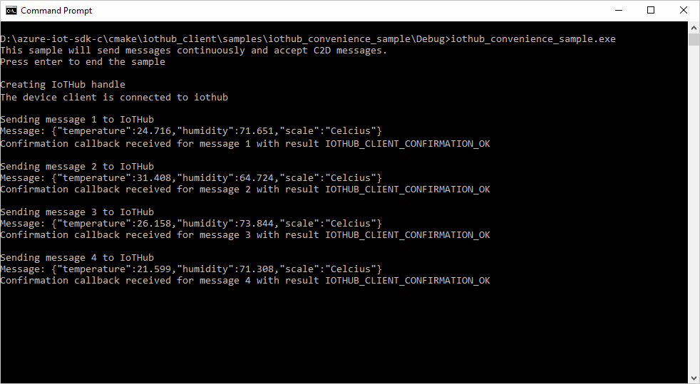
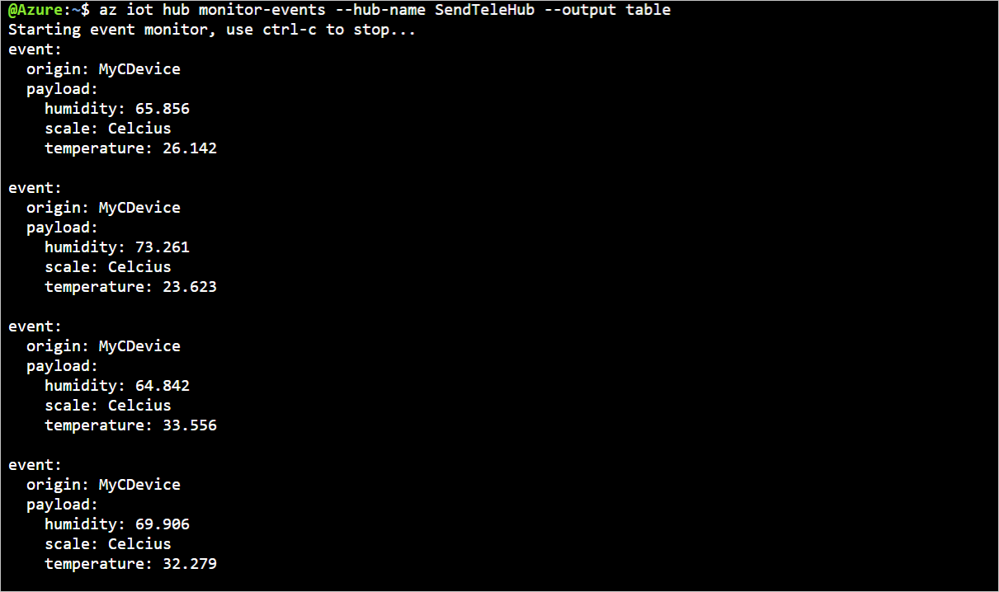

# Quickstart: Send telemetry from a device to an IoT hub and read the telemetry from the hub with a back-end application (C)

[!INCLUDE [iot-hub-quickstarts-1-selector](../../includes/iot-hub-quickstarts-1-selector.md)]

IoT Hub is an Azure service that enables you to ingest high volumes of telemetry from your IoT devices into the cloud for storage or processing. In this quickstart, you send telemetry from a simulated device application, through IoT Hub, to a back-end application for processing.

The quickstart uses two pre-written C applications, one to send the telemetry and one to read the telemetry from the hub. Before you run these two applications, you create an IoT hub and register a device with the hub.

[!INCLUDE [cloud-shell-try-it.md](../../includes/cloud-shell-try-it.md)]

If you don’t have an Azure subscription, create a [free account](https://azure.microsoft.com/free/?WT.mc_id=A261C142F) before you begin.

## Prerequisites

* Install [Visual Studio 2017](https://www.visualstudio.com/vs/) with the ['Desktop development with C++'](https://www.visualstudio.com/vs/support/selecting-workloads-visual-studio-2017/) workload enabled.
* Install the latest version of [Git](https://git-scm.com/download/).

## Prepare the development environment

In this section, you will prepare a development environment used to build the [Azure IoT C SDK](https://github.com/Azure/azure-iot-sdk-c) which includes the sample code for this article.

1. Download the latest release version of the [CMake build system](https://cmake.org/download/). From that same site, look up the cryptographic hash for the version of the binary distribution you chose. Verify the downloaded binary using the corresponding cryptographic hash value. The following example used Windows PowerShell to verify the cryptographic hash for version 3.11.4 of the x64 MSI distribution:

    ```PowerShell
    PS C:\Users\wesmc\Downloads> $hash = get-filehash .\cmake-3.11.4-win64-x64.msi
    PS C:\Users\wesmc\Downloads> $hash.Hash -eq "56e3605b8e49cd446f3487da88fcc38cb9c3e9e99a20f5d4bd63e54b7a35f869"
    True
    ```

    It is important that the Visual Studio prerequisites (Visual Studio and the 'Desktop development with C++' workload) are installed on your machine, **before** starting the `CMake` installation. Once the prerequisites are in place, and the download is verified, install the CMake build system.

2. Open a command prompt or Git Bash shell. Execute the following command to clone the [Azure IoT C SDK](https://github.com/Azure/azure-iot-sdk-c) GitHub repository:
    
    ```cmd/sh
    git clone https://github.com/Azure/azure-iot-sdk-c.git --recursive
    ```
    The size of this repository is currently around 220 MB. You should expect this operation to take several minutes to complete.


3. Create a `cmake` subdirectory in the root directory of the git repository, and navigate to that folder. 

    ```cmd/sh
    cd azure-iot-sdk-c
    mkdir cmake
    cd cmake
    ```

4. Run the following command that builds a version of the SDK specific to your development client platform. A Visual Studio solution for the simulated device will be generated in the `cmake` directory. 

    ```cmd
    cmake ..
    ```
    
    If `cmake` does not find your C++ compiler, you might get build errors while running the above command. If that happens, try running this command in the [Visual Studio command prompt](https://docs.microsoft.com/dotnet/framework/tools/developer-command-prompt-for-vs). 

    Once the build succeeds, the last few output lines will look similar to the following output:

    ```cmd/sh
    $ cmake ..
    -- Building for: Visual Studio 15 2017
    -- Selecting Windows SDK version 10.0.16299.0 to target Windows 10.0.17134.
    -- The C compiler identification is MSVC 19.12.25835.0
    -- The CXX compiler identification is MSVC 19.12.25835.0

    ...

    -- Configuring done
    -- Generating done
    -- Build files have been written to: E:/IoT Testing/azure-iot-sdk-c/cmake
    ```


## Create an IoT hub

[!INCLUDE [iot-hub-quickstarts-create-hub](../../includes/iot-hub-quickstarts-create-hub.md)]

## Register a device

A device must be registered with your IoT hub before it can connect. In this quickstart, you use the Azure CLI to register a simulated device.

1. Add the IoT Hub CLI extension and create the device identity. Replace `{YourIoTHubName}` with the name you chose for your IoT hub:

    ```azurecli-interactive
    az extension add --name azure-cli-iot-ext
    az iot hub device-identity create --hub-name {YourIoTHubName} --device-id MyCDevice
    ```

    If you choose a different name for your device, update the device name in the sample applications before you run them.

2. Run the following command to get the _device connection string_ for the device you just registered:

    ```azurecli-interactive
    az iot hub device-identity show-connection-string --hub-name {YourIoTHubName} --device-id MyCDevice --output table
    ```

    Make a note of the device connection string, which looks like `Hostname=...=`. You use this value later in the quickstart.

3. You also need the _Event Hubs-compatible endpoint_, _Event Hubs-compatible path_, and _iothubowner primary key_ from your IoT hub to enable the back-end application to connect to your IoT hub and retrieve the messages. The following commands retrieve these values for your IoT hub:

    ```azurecli-interactive
    az iot hub show --query properties.eventHubEndpoints.events.endpoint --name {YourIoTHubName}

    az iot hub show --query properties.eventHubEndpoints.events.path --name {YourIoTHubName}

    az iot hub policy show --name iothubowner --query primaryKey --hub-name {your IoT Hub name}
    ```

    Make a note of these three values, which you use later in the quickstart.

## Send simulated telemetry

The simulated device application connects to a device-specific endpoint on your IoT hub and sends a string as simulated telemetry.

1. Using a text editor, open the iothub_convenience_sample.c source file. The file is located in the following location:

    ```
    \azure-iot-sdk-c\iothub_client\samples\iothub_convenience_sample\iothub_convenience_sample.c
    ```

2. Find the declaration of the `connectionString` constant:

    ```C
    /* Paste in your device connection string  */
    static const char* connectionString = "[device connection string]";
    ```
    Replace the value of the `connectionString` constant with the device connection string you made a note of previously. Then save your changes to **iothub_convenience_sample.c**.

3. In a terminal window, navigate to the *iothub_convenience_sample* project directory in the CMake directory that you created in the Azure IoT C SDK.

    ```
    cd /azure-iot-sdk-c/cmake/iothub_client/samples/iothub_convenience_sample
    ```

4. Run CMake using the following command line to build the sample with your updated `connectionString` value:

    ```cmd/sh
    cmake --build . --target iothub_convenience_sample --config Debug
    ```

4. In a command prompt, run the following command to run the simulated device applicationcle:

    ```cmd/sh
    Debug\iothub_convenience_sample.exe
    ```

    The following screenshot shows the output as the simulated device application sends telemetry to your IoT hub:

    

## Read the telemetry from your hub

* The simulated device does not loop sending telemetry. So we've already missed the messages. 

    **Run a message reader first, or update the sample in the SDK to loop as the other samples do.**

* Is there a C sample for reading device to cloud messages?

* Tested with Node.js...

    

    

## Clean up resources

[!INCLUDE [iot-hub-quickstarts-clean-up-resources](../../includes/iot-hub-quickstarts-clean-up-resources.md)]

## Next steps

In this quickstart, you've setup an IoT hub, registered a device, sent simulated telemetry to the hub using a C application, and read the telemetry from the hub using a simple back-end application.

To learn how to control your simulated device from a back-end application, continue to the next quickstart.

> [!div class="nextstepaction"]
> [Quickstart: Control a device connected to an IoT hub](quickstart-control-device-dotnet.md)