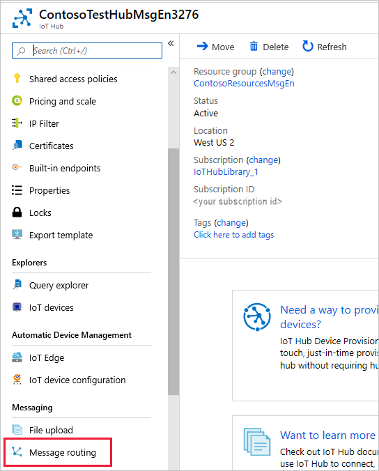
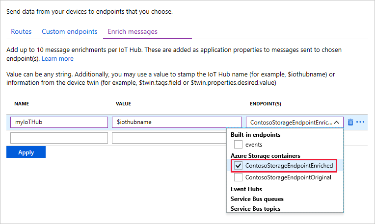
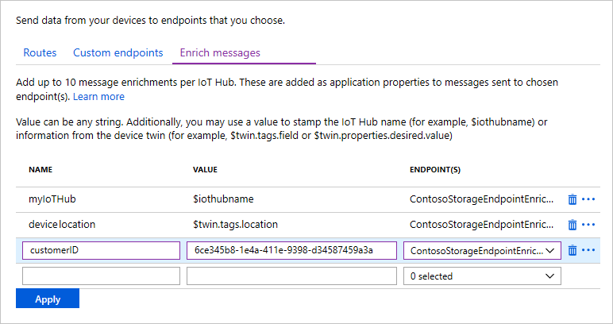
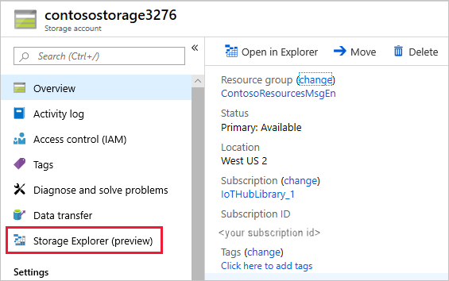
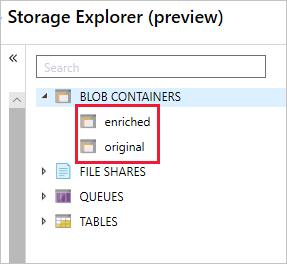

# Tutorial: Using Azure IoT Hub message enrichments

*Message enrichments* is the ability of the IoT Hub to *stamp* messages with additional information before the messages are sent to the designated endpoint. One reason to use message enrichments is to include data that can be used to simplify downstream processing. For example, enriching device telemetry messages with a device twin tag can reduce load on customers to make device twin API calls for this information. For more information, see the [Overview of message enrichments](iot-hub-message-enrichments-overview.md).

In this tutorial, you see two ways to create and configure the resources needed to test the message enrichments for an IoT Hub. The resources include one storage account with two storage containers -- one to hold the enriched messages and one to hold the original messages. Also included is an IoT hub to receive the messages and send them to the appropriate storage container depending on whether they are enriched or not. 

The first method is to use the Azure CLI to create the resources and configuration the message routing. Then you define the enrichments using the (Azure portal)(https://portal.azure.com). 

The second method is to use an Azure Resource Manager template to create both the resources *and* the configurations for the routing and the message enrichments. 

After the configuration for the message enrichments are complete, you use an application to send messages to the IoT Hub, which then routes them to both storage containers. Only the messages sent to the endpoint for the **enriched** storage container are enriched.

Here are the tasks you will perform to complete this tutorial:

**Using IoT Hub message enrichments**
> [!div class="checklist"]
> * Create the resources and configure the message routing using the Azure CLI. The resources are an IoT hub, a storage account with two endpoints, and the routing configuration. 
> * Configure the message enrichments using the (Azure portal)[https://portal.azure.com).
> * OR
> * Create the resources and configure the routing and the message enrichments with an Azure Resource Manager template. 
> * Run an app that simulates an IoT Device sending messages to the hub.
> * View the results and verify the message enrichments are working as expected.

## Prerequisites

* You must have an Azure subscription. If you don't have an Azure subscription, create a [free account](https://azure.microsoft.com/free/?WT.mc_id=A261C142F) before you begin.

* Install [Visual Studio](https://www.visualstudio.com/).

[!INCLUDE [cloud-shell-try-it.md](../../includes/cloud-shell-try-it.md)]

## Retrieve the resources from the IoT C# Samples repository.

Download the [IoT C# Samples](https://github.com/Azure-Samples/azure-iot-samples-csharp/archive/master.zip) and unzip them. This repository has several applications in it. The ones to be used for this tutorial are as follows:

* A script for creating the resources for the first method. This script is in /azure-iot-samples-csharp/iot-hub/Tutorials/Routing/SimulatedDevice/resources/iothub_msgenrichment_cli.azcli. 

* The Azure Resource Manager template for the second method. Thie template is in /azure-iot-samples-csharp/iot-hub/Tutorials/Routing/SimulatedDevice/resources/template_msgenrichments.json. This template creates all of the resources needed, and configures the routing and the message enrichemnts. 

* Device Simulation, which you use to send messages to the IoT hub and test the message enhancements.

## Set up and configure resources and routing using Azure CLI (method 1)

In addition to creating the necessary resources, the Azure CLI script also configures the two routes to the endpoints that are separate storage containers. For more information on configuring the routing, see the [routing tutorial](tutorial-routing.md). After the resources are set up, you use the [Azure portal](https://portal.azure.com) to configure message enrichments for each endpoint, and then continue to the testing step.

> [!NOTE]
> All messages are routed to both endpoints, but only the messages going to the endpoint with configured message enrichments will be enriched.
>

You can use the script below, or open the script in the /resources folder of the downloaded repository. Here are the steps the script will perform:

* Create an IoT Hub.
* Create a storage account.
* Create two containers in the storage account -- one for the enriched messages and one for messages that are not enriched.
* Set up routing for the two different storage accounts.
    * Create an endpoint for each storage account container.
    * Create a route to each of the storage account container endpoints.

There are several resource names that must be globally unique, such as the IoT Hub name and the storage account name. To make running the script easier, those resource names are appended with a random alphanumeric value called *randomValue*. The randomValue is generated once at the top of the script and appended to the resource names as needed throughout the script. If you don't want it to be random, you can set it to an empty string or to a specific value.

If you haven't already done so, open a [Cloud Shell window](https://shell.azure.com) and ensure it is set to Bash. Open the script in the unzipped repository, use Ctrl-A to select all of it, then Ctrl-C to copy it. Alternately, you can copy the following CLI script or open it directly in Cloud Shell. Paste the script in the Cloud Shell window by right-clicking on the command line and selecting **Paste**. The script is run one statement at a time. After the script stops running, select **Enter** to make sure it runs the last command. The following code block shows the script that is used, with comments explaining what it's doing.

Here are the resources created by the script. **Enriched** means that resource is for messages with enrichments. **Original** means that resource is for messages that are not enriched.

| Name | Value |
|-----|-----|
| resourceGroup | ContosoResourcesMsgEn |
| container name | original  |
| container name | enriched  |
| IoT device name | Contoso-Test-Device |
| IoT Hub name | ContosoTestHubMsgEn |
| storage Account Name | contosostorage |
| endpoint Name 1 | ContosoStorageEndpointOriginal |
| endpoint Name 2 | ContosoStorageEndpointEnriched|
| route Name 1 | ContosoStorageRouteOriginal |
| route Name 2 | ContosoStorageRouteEnriched |

```azurecli-interactive
# This command retrieves the subscription id of the current Azure account.
# This field is used when setting up the routing queries.
subscriptionID=$(az account show --query id -o tsv)

# Concatenate this number onto the resources that have to be globally unique.
# You can set this to "" or to a specific value if you don't want it to be random.
# This retrieves a random value.
randomValue=$RANDOM

# This command installs the IOT Extension for Azure CLI.
# You only need to install this the first time.
# You need it to create the device identity.
az extension add --name azure-cli-iot-ext

# Set the values for the resource names that
#   don't have to be globally unique.
location=westus2
resourceGroup=ContosoResourcesMsgEn
containerName1=original
containerName2=enriched
iotDeviceName=Contoso-Test-Device

# Create the resource group to be used
#   for all the resources for this tutorial.
az group create --name $resourceGroup \
    --location $location

# The IoT hub name must be globally unique,
#   so add a random value to the end.
iotHubName=ContosoTestHubMsgEn$randomValue
echo "IoT hub name = " $iotHubName

# Create the IoT hub.
az iot hub create --name $iotHubName \
    --resource-group $resourceGroup \
    --sku S1 --location $location

# You need a storage account that will have two containers
#   -- one for the original messages and
#   one for the enriched messages.
# The storage account name must be globally unique,
#   so add a random value to the end.
storageAccountName=contosostorage$randomValue
echo "Storage account name = " $storageAccountName

# Create the storage account to be used as a routing destination.
az storage account create --name $storageAccountName \
    --resource-group $resourceGroup \
    --location $location \
    --sku Standard_LRS

# Get the primary storage account key.
#    You need this to create the containers.
storageAccountKey=$(az storage account keys list \
    --resource-group $resourceGroup \
    --account-name $storageAccountName \
    --query "[0].value" | tr -d '"')

# See the value of the storage account key.
echo "storage account key = " $storageAccountKey

# Create the containers in the storage account.
az storage container create --name $containerName1 \
    --account-name $storageAccountName \
    --account-key $storageAccountKey \
    --public-access off

az storage container create --name $containerName2 \
    --account-name $storageAccountName \
    --account-key $storageAccountKey \
    --public-access off

# Create the IoT device identity to be used for testing.
az iot hub device-identity create --device-id $iotDeviceName \
    --hub-name $iotHubName

# Retrieve the information about the device identity, then copy the primary key to
#   Notepad. You need this to run the device simulation during the testing phase.
# If you are using Cloud Shell, you can scroll the window back up to retrieve this value.
az iot hub device-identity show --device-id $iotDeviceName \
    --hub-name $iotHubName

##### ROUTING FOR STORAGE #####

# You're going to have two routes and two endpoints.
# One route points to the first container ("original") in the storage account
#   and includes the original messages.
# The other points to the second container ("enriched") in the same storage account
#   and includes the enriched versions of the messages.

endpointType="azurestoragecontainer"
endpointName1="ContosoStorageEndpointOriginal"
endpointName2="ContosoStorageEndpointEnriched"
routeName1="ContosoStorageRouteOriginal"
routeName2="ContosoStorageRouteEnriched"

# for both endpoints, retrieve the messages going to storage
condition='level="storage"'

# Get the connection string for the storage account.
# Adding the "-o tsv" makes it be returned without the default double quotes around it.
storageConnectionString=$(az storage account show-connection-string \
  --name $storageAccountName --query connectionString -o tsv)

# Create the routing endpoints and routes.
# Set the encoding format to either avro or json.

# This is the endpoint for the first container, for endpoint messages that are not enriched.
az iot hub routing-endpoint create \
  --connection-string $storageConnectionString \
  --endpoint-name $endpointName1 \
  --endpoint-resource-group $resourceGroup \
  --endpoint-subscription-id $subscriptionID \
  --endpoint-type $endpointType \
  --hub-name $iotHubName \
  --container $containerName1 \
  --resource-group $resourceGroup \
  --encoding json

# This is the endpoint for the second container, for endpoint messages that are enriched.
az iot hub routing-endpoint create \
  --connection-string $storageConnectionString \
  --endpoint-name $endpointName2 \
  --endpoint-resource-group $resourceGroup \
  --endpoint-subscription-id $subscriptionID \
  --endpoint-type $endpointType \
  --hub-name $iotHubName \
  --container $containerName2 \
  --resource-group $resourceGroup \
  --encoding json

# This is the route for messages that are not enriched.
# Create the route for the first storage endpoint.
az iot hub route create \
  --name $routeName1 \
  --hub-name $iotHubName \
  --source devicemessages \
  --resource-group $resourceGroup \
  --endpoint-name $endpointName1 \
  --enabled \
  --condition $condition

# This is the route for messages that are enriched.
# Create the route for the second storage endpoint.
az iot hub route create \
  --name $routeName2 \
  --hub-name $iotHubName \
  --source devicemessages \
  --resource-group $resourceGroup \
  --endpoint-name $endpointName2 \
  --enabled \
  --condition $condition
```

At this point, the resources are all set up and the routing is configured. You can view the message routing configuration in the portal and set up the message enrichments for messages going to the **enriched** storage container.

### View routing and configure the message enrichments: method 1

1. Go to your IoT Hub by selecting **Resource groups**, then select the resource group set up for this tutorial (**ContosoResources_MsgEn**). Find the IoT Hub in the list and select it. Select **Message Routing** for the Iot Hub.

   

   The message routing pane has three tabs -- **Routes**, **Custom endpoints**, and **Enrich messages**. You can browse the first two tabs to see the configuration set up by the script. Use the third tab to add message enrichments. Let's enrich messages going to the endpoint for the storage container called **enriched**. Fill in the name and value, and then select the endpoint **ContosoStorageEndpointEnriched** from the dropdown list. Here's an example of setting up an enrichment that adds the IoT Hub name to the message:

   

2. Add these values to the list for the ContosoStorageEndpointEnriched endpoint.

   | Key | Value | Endpoint (dropdown list) |
   | ---- | ----- | -------------------------|
   | myIotHub | $iothubname | AzureStorageContainers > ContosoStorageEndpointEnriched |
   | DeviceLocation | $twin.tags.location | AzureStorageContainers > ContosoStorageEndpointEnriched |
   |customerID | 6ce345b8-1e4a-411e-9398-d34587459a3a | AzureStorageContainers > ContosoStorageEndpointEnriched |

   > [!NOTE]
   > If your device does not have a twin, the value you put in here will be stamped as a string for the value in the message enrichments. To see the device twin information, go to your hub in the portal, then select  **IoT devices**, select your device, and then select **Device twin** at the top of the page.
   >
   > You can edit the twin information to add tags (such as location) and set it to a specific value if you want to. For more information, see [Understand and use device twins in IoT Hub](iot-hub-devguide-device-twins.md)

3. When you're finished, your pane should look similar to this image:

   

4. Select **Apply** to save the changes.

## Create the resources, routing, and message enrichments (method 2)

1. Log into the Azure portal.
2. +Resource
3. select Custom Deployment
4. Upload template
5. wait for it to finish deploying

## Send messages to the IoT Hub

Now that the message enrichments are configured for the endpoint, run the Simulated Device application to send messages to the IoT Hub. The hub has been set up with settings that accomplish the following:

* Messages routed to the storage endpoint ContosoStorageEndpointOriginal will not be enriched and will be stored in the storage container `original`.

* Messages routed to the storage endpoint ContosoStorageEndpointEnriched will be enriched and stored in the storage container `enriched`.

The Simulated Device application is one of the applications in the unzipped download. The application sends messages for each of the different message routing methods in the [Routing Tutorial](tutorial-routing.md); this includes Azure Storage.

Double-click on the solution file (IoT_SimulatedDevice.sln) to open the code in Visual Studio, then open Program.cs. Substitute the IoT hub name for the marker `{your hub name}`. The format of the IoT hub host name is **{your hub name}.azure-devices.net**. For this tutorial, the hub host name is **ContosoTestHubMsgEn.azure-devices.net**. Next, substitute the device key you saved earlier when running the script to create the resources for the marker `{your device key}`.

If you don't have the device key, you can retrieve it from the portal. After logging in, go to **Resource groups**, select your resource group, then select your IoT Hub. Look under **IoT Devices** for your test device and select your device. Select the copy icon next to **Primary key** to copy it to the clipboard.

   ```csharp
        private readonly static string s_myDeviceId = "Contoso-Test-Device";
        private readonly static string s_iotHubUri = "ContosoTestHubMsgEn.azure-devices.net";
        // This is the primary key for the device. This is in the portal.
        // Find your IoT hub in the portal > IoT devices > select your device > copy the key.
        private readonly static string s_deviceKey = "{your device key}";
   ```

## Run and test

Run the console application. Wait a few minutes. The messages that are being sent are displayed on the console screen of the application.

The app sends a new device-to-cloud message to the IoT hub every second. The message contains a JSON-serialized object with the device ID, temperature, humidity, and message level, which defaults to `normal`. It randomly assigns a level of `critical` or `storage`, causing the message to be routed to the storage account or to the default endpoint. The messages sent to the **enriched** container in the storage account will be enriched.

After several storage messages have been sent, view the data.

1. Select **Resource groups**, then find your resource group (ContosoResourcesMsgEn) and select it.

2. Select your storage account (contosostorage). Then select **Storage Explorer (preview)** from the selection pane on the left.

   

   Select **BLOB CONTAINERS** to see the two containers that can be used.

   

The messages in the container called **enriched** have the message enrichments included in the messages. The messages in the container called **original** will have the raw messages with no enrichments. Drill down into one of the containers until you get to the bottom and open the most recent message file, then do the same for the other container to verify that there are no enrichments added to messages in that container.

When you look at messages that have been enriched, you should see the "my IoT Hub" with the hub name, as well as the location and the customer ID, like this:

```json
{"EnqueuedTimeUtc":"2019-05-10T06:06:32.7220000Z","Properties":{"level":"storage","my IoT Hub":"contosotesthubmsgen3276","devicelocation":"$twin.tags.location","customerID":"6ce345b8-1e4a-411e-9398-d34587459a3a"},"SystemProperties":{"connectionDeviceId":"Contoso-Test-Device","connectionAuthMethod":"{\"scope\":\"device\",\"type\":\"sas\",\"issuer\":\"iothub\",\"acceptingIpFilterRule\":null}","connectionDeviceGenerationId":"636930642531278483","enqueuedTime":"2019-05-10T06:06:32.7220000Z"},"Body":"eyJkZXZpY2VJZCI6IkNvbnRvc28tVGVzdC1EZXZpY2UiLCJ0ZW1wZXJhdHVyZSI6MjkuMjMyMDE2ODQ4MDQyNjE1LCJodW1pZGl0eSI6NjQuMzA1MzQ5NjkyODQ0NDg3LCJwb2ludEluZm8iOiJUaGlzIGlzIGEgc3RvcmFnZSBtZXNzYWdlLiJ9"}
```

Here is an unenriched message. "my IoT Hub", "devicelocation", and "customerID" do not show up here, because these are the fields that would be added by the enrichments, and this endpoint has no enrichments.

```json
{"EnqueuedTimeUtc":"2019-05-10T06:06:32.7220000Z","Properties":{"level":"storage"},"SystemProperties":{"connectionDeviceId":"Contoso-Test-Device","connectionAuthMethod":"{\"scope\":\"device\",\"type\":\"sas\",\"issuer\":\"iothub\",\"acceptingIpFilterRule\":null}","connectionDeviceGenerationId":"636930642531278483","enqueuedTime":"2019-05-10T06:06:32.7220000Z"},"Body":"eyJkZXZpY2VJZCI6IkNvbnRvc28tVGVzdC1EZXZpY2UiLCJ0ZW1wZXJhdHVyZSI6MjkuMjMyMDE2ODQ4MDQyNjE1LCJodW1pZGl0eSI6NjQuMzA1MzQ5NjkyODQ0NDg3LCJwb2ludEluZm8iOiJUaGlzIGlzIGEgc3RvcmFnZSBtZXNzYWdlLiJ9"}
```

## Clean up resources

If you want to remove all of the resources you've created in this tutorial, delete the resource group. This action deletes all resources contained within the group. In this case, it removes the IoT hub, the storage account, and the resource group itself.

### Use the Azure CLI to clean up resources

To remove the resource group, use the [az group delete](https://docs.microsoft.com/cli/azure/group?view=azure-cli-latest#az-group-delete) command. `$resourceGroup` was set to **ContosoResources** back at the beginning of this tutorial.

```azurecli-interactive
az group delete --name $resourceGroup
```

## Next steps

In this tutorial, you configured and tested adding message enrichments to IoT Hub messages using the following steps:

**Using IoT Hub message enrichments**
> [!div class="checklist"]
> * Using the Azure CLI, create the resources -- an IoT hub, a storage account with two enendpoints, and the routing configuration.
> * Use the Azure portal to configure message enrichments.
> * Run an app that simulates an IoT Device sending message to the hub.
> * View the results and verify the message enrichments are working as expected.

For more information about message enrichments, see the [overview of message enrichments](iot-hub-message-enrichments-overview.md).

For more information about message routing, see these articles:

* [Use IoT Hub message routing to send device-to-cloud messages to different endpoints](iot-hub-devguide-messages-d2c.md)

* [Tutorial: IoT Hub routing](tutorial-routing.md)