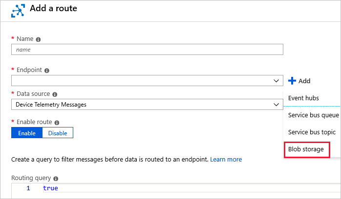
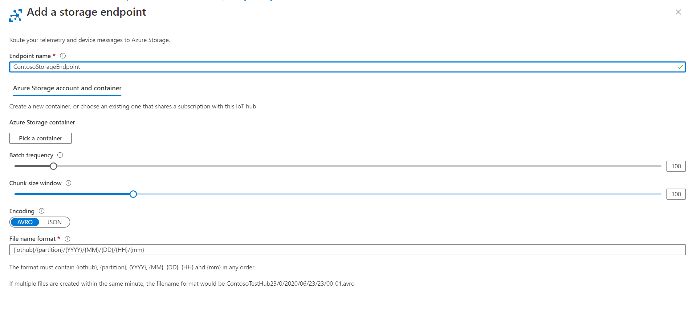
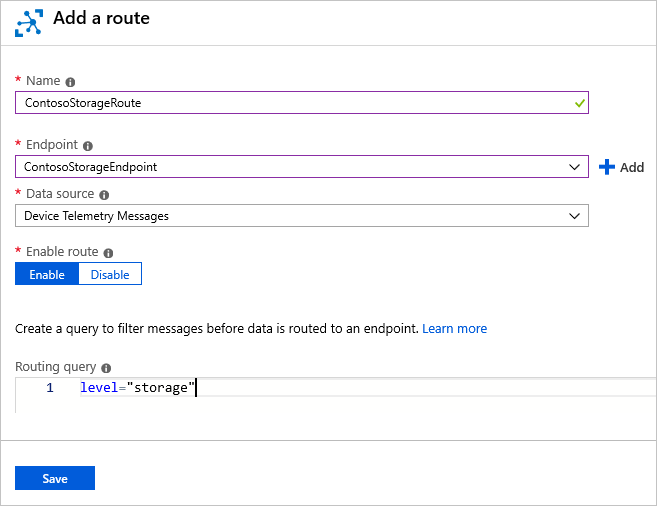
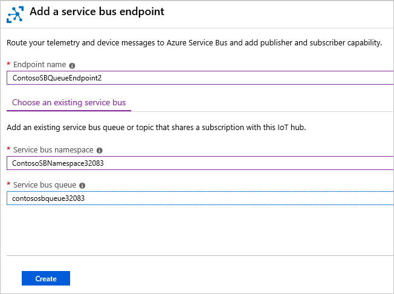
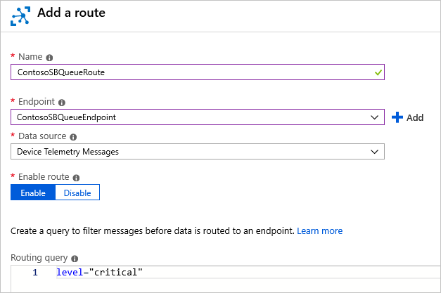
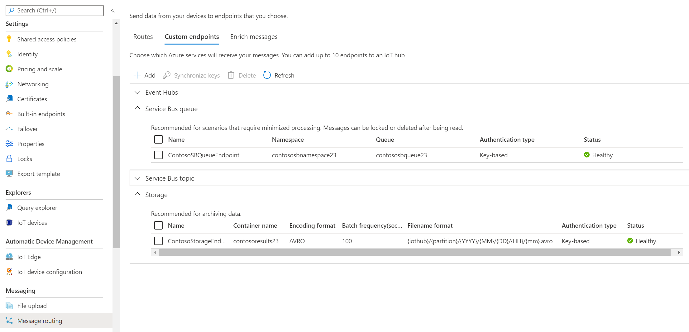

# Tutorial: Configure message routing with IoT Hub

[Message routing](iot-hub-devguide-messages-d2c.md) enables sending telemetry data from your IoT devices to built-in Event Hub-compatible endpoints or custom endpoints such as blob storage, Service Bus Queue, Service Bus Topic, and Event Hubs. While configuring message routing, you can create [routing queries](iot-hub-devguide-routing-query-syntax.md) to customize the route that matches a certain condition. Once set up, the incoming data is automatically routed to the endpoints by the IoT Hub. 

In this tutorial, you learn how to set up and use routing queries with IoT Hub. You will route messages from an IoT device to one of multiple services, including blob storage and a Service Bus queue. Messages to the Service Bus queue will be picked up by a Logic App and sent via e-mail. Messages that do not have routing specifically set up are sent to the default endpoint, and viewed in a Power BI visualization.

In this tutorial, you perform the following tasks:

> [!div class="checklist"]
> * Using Azure CLI or PowerShell, set up the base resources -- an IoT hub, a storage account, a Service Bus queue, and a simulated device.
> * Configure endpoints and routes in IoT hub for the storage account and Service Bus queue.
> * Create a Logic App that is triggered and sends e-mail when a message is added to the Service Bus queue.
> * Download and run an app that simulates an IoT Device sending messages to the hub for the different routing options.
> * Create a Power BI visualization for data sent to the default endpoint.
> * View the results ...
> * ...in the Service Bus queue and e-mails.
> * ...in the storage account.
> * ...in the Power BI visualization.

## Prerequisites

- An Azure subscription. If you don't have an Azure subscription, create a [free account](https://azure.microsoft.com/free/?WT.mc_id=A261C142F) before you begin.

- Install [Visual Studio](https://www.visualstudio.com/). 

- A Power BI account to analyze the default endpoint's stream analytics. ([Try Power BI for free](https://app.powerbi.com/signupredirect?pbi_source=web).)

- An Office 365 account to send notification e-mails. 

[!INCLUDE [cloud-shell-try-it.md](../../includes/cloud-shell-try-it.md)]

## Set up resources

For this tutorial, you need an IoT hub, a storage account, and a Service Bus queue. These resources can be created using Azure CLI or Azure PowerShell. Use the same resource group and location for all of the resources. Then at the end, you can remove everything in one step by deleting the resource group.

The following sections describe how to do these required steps. Follow the CLI *or* the PowerShell instructions.

1. Create a [resource group](../azure-resource-manager/resource-group-overview.md). 

2. Create an IoT hub in the S1 tier. Add a consumer group to your IoT hub. The consumer group is used by the Azure Stream Analytics when retrieving data.

   > [!NOTE]
   > You must use an Iot hub in a paid tier to complete this tutorial. The free tier only allows you to set up one endpoint, and this tutorial requires multiple endpoints.
   > 

3. Create a standard V1 storage account with Standard_LRS replication.

4. Create a Service Bus namespace and queue. 

5. Create a device identity for the simulated device that sends messages to your hub. Save the key for the testing phase.

### Set up your resources using Azure CLI

Copy and paste this script into Cloud Shell. Assuming you are already logged in, it runs the script one line at a time. 

The variables that must be globally unique have `$RANDOM` concatenated to them. When the script is run and the variables are set, a random numeric string is generated and concatenated to the end of the fixed string, making it unique.

```azurecli-interactive

# This is the IOT Extension for Azure CLI.
# You only need to install this the first time.
# You need it to create the device identity. 
az extension add --name azure-cli-iot-ext

# Set the values for the resource names that don't have to be globally unique.
# The resources that have to have unique names are named in the script below
#   with a random number concatenated to the name so you can probably just
#   run this script, and it will work with no conflicts.
location=westus
resourceGroup=ContosoResources
iotHubConsumerGroup=ContosoConsumers
containerName=contosoresults
iotDeviceName=Contoso-Test-Device 

# Create the resource group to be used
#   for all the resources for this tutorial.
az group create --name $resourceGroup \
    --location $location

# The IoT hub name must be globally unique, so add a random number to the end.
iotHubName=ContosoTestHub$RANDOM
echo "IoT hub name = " $iotHubName

# Create the IoT hub.
az iot hub create --name $iotHubName \
    --resource-group $resourceGroup \
    --sku S1 --location $location

# Add a consumer group to the IoT hub.
az iot hub consumer-group create --hub-name $iotHubName \
    --name $iotHubConsumerGroup

# The storage account name must be globally unique, so add a random number to the end.
storageAccountName=contosostorage$RANDOM
echo "Storage account name = " $storageAccountName

# Create the storage account to be used as a routing destination.
az storage account create --name $storageAccountName \
    --resource-group $resourceGroup \
	--location $location \
    --sku Standard_LRS

# Get the primary storage account key. 
#    You need this to create the container.
storageAccountKey=$(az storage account keys list \
    --resource-group $resourceGroup \
    --account-name $storageAccountName \
    --query "[0].value" | tr -d '"') 

# See the value of the storage account key.
echo "$storageAccountKey"

# Create the container in the storage account. 
az storage container create --name $containerName \
    --account-name $storageAccountName \
    --account-key $storageAccountKey \
    --public-access off 

# The Service Bus namespace must be globally unique, so add a random number to the end.
sbNameSpace=ContosoSBNamespace$RANDOM
echo "Service Bus namespace = " $sbNameSpace

# Create the Service Bus namespace.
az servicebus namespace create --resource-group $resourceGroup \
    --name $sbNameSpace \
    --location $location
	
# The Service Bus queue name must be globally unique, so add a random number to the end.
sbQueueName=ContosoSBQueue$RANDOM
echo "Service Bus queue name = " $sbQueueName

# Create the Service Bus queue to be used as a routing destination.
az servicebus queue create --name $sbQueueName \
    --namespace-name $sbNameSpace \
	--resource-group $resourceGroup

# Create the IoT device identity to be used for testing.
az iot hub device-identity create --device-id $iotDeviceName \
    --hub-name $iotHubName

# Retrieve the information about the device identity, then copy the primary key to
#   Notepad. You need this to run the device simulation during the testing phase.
az iot hub device-identity show --device-id $iotDeviceName \
    --hub-name $iotHubName

```

### Set up your resources using Azure PowerShell

Copy and paste this script into Cloud Shell. Assuming you are already logged in, it runs the script one line at a time.

The variables that must be globally unique have `$(Get-Random)` concatenated to them. When the script is run and the variables are set, a random numeric string is generated and concatenated to the end of the fixed string, making it unique.

```azurepowershell-interactive
# Log into Azure account.
Login-AzureRMAccount

# Set the values for the resource names that don't have to be globally unique.
# The resources that have to have unique names are named in the script below
#   with a random number concatenated to the name so you can probably just
#   run this script, and it will work with no conflicts.
$location = "West US"
$resourceGroup = "ContosoResources"
$iotHubConsumerGroup = "ContosoConsumers"
$containerName = "contosoresults"
$iotDeviceName = "Contoso-Test-Device"

# Create the resource group to be used 
#   for all resources for this tutorial.
New-AzureRmResourceGroup -Name $resourceGroup -Location $location

# The IoT hub name must be globally unique, so add a random number to the end.
$iotHubName = "ContosoTestHub$(Get-Random)"
Write-Host "IoT hub name is " $iotHubName

# Create the IoT hub.
New-AzureRmIotHub -ResourceGroupName $resourceGroup `
    -Name $iotHubName `
    -SkuName "S1" `
    -Location $location `
    -Units 1

# Add a consumer group to the IoT hub for the 'events' endpoint.
Add-AzureRmIotHubEventHubConsumerGroup -ResourceGroupName $resourceGroup `
  -Name $iotHubName `
  -EventHubConsumerGroupName $iotHubConsumerGroup `
  -EventHubEndpointName "events"

# The storage account name must be globally unique, so add a random number to the end.
$storageAccountName = "contosostorage$(Get-Random)"
Write-Host "storage account name is " $storageAccountName

# Create the storage account to be used as a routing destination.
# Save the context for the storage account 
#   to be used when creating a container.
$storageAccount = New-AzureRmStorageAccount -ResourceGroupName $resourceGroup `
    -Name $storageAccountName `
    -Location $location `
    -SkuName Standard_LRS `
    -Kind Storage
$storageContext = $storageAccount.Context 

# Create the container in the storage account.
New-AzureStorageContainer -Name $containerName `
    -Context $storageContext

# The Service Bus namespace must be globally unique,
#   so add a random number to the end.
$serviceBusNamespace = "ContosoSBNamespace$(Get-Random)"
Write-Host "Service Bus namespace is " $serviceBusNamespace

# Create the Service Bus namespace.
New-AzureRmServiceBusNamespace -ResourceGroupName $resourceGroup `
    -Location $location `
    -Name $serviceBusNamespace 

# The Service Bus queue name must be globally unique,
#  so add a random number to the end.
$serviceBusQueueName  = "ContosoSBQueue$(Get-Random)"
Write-Host "Service Bus queue name is " $serviceBusQueueName 

# Create the Service Bus queue to be used as a routing destination.
New-AzureRmServiceBusQueue -ResourceGroupName $resourceGroup `
    -Namespace $serviceBusNamespace `
    -Name $serviceBusQueueName 

```

Next, create a device identity and save its key for later use. This device identity is used by the simulation application to send messages to the IoT hub. This capability is not available in PowerShell, but you can create the device in the [Azure portal](https://portal.azure.com).

1. Open the [Azure portal](https://portal.azure.com) and log into your Azure account.

2. Click on **Resource groups** and select your resource group. This tutorial uses **ContosoResources**.

3. In the list of resources, click your IoT hub. This tutorial uses **ContosoTestHub**. Select **IoT Devices** from the Hub pane.

4. Click **+ Add**. On the Add Device pane, fill in the device ID. This tutorial uses **Contoso-Test-Device**. Leave the keys empty, and check **Auto Generate Keys**. Make sure **Connect device to IoT hub** is enabled. Click **Save**.

   

5. Now that it's been created, click on the device to see the generated keys. Click the Copy icon on the Primary key and save it somewhere such as Notepad for the testing phase of this tutorial.

   

## Set up message routing

You are going to route messages to different resources based on properties attached to the message by the simulated device. Messages that are not custom routed are sent to the default endpoint (messages/events). 

|value |Result|
|------|------|
|level="storage" |Write to Azure Storage.|
|level="critical" |Write to a Service Bus queue. A Logic App retrieves the message from the queue and uses Office 365 to e-mail the message.|
|default |Display this data using Power BI.|

### Routing to a storage account 

Now set up the routing for the storage account. You go to the Message Routing pane, then add a route. When adding the route, define a new endpoint for the route. After this is set up, messages where the **level** property is set to **storage** are written to a storage account automatically. 

The data is written to blob storage in the Avro format by default.

1. In the [Azure portal](https://portal.azure.com), click **Resource Groups**, then select your resource group. This tutorial uses **ContosoResources**. 

2. Click the IoT hub under the list of resources. This tutorial uses **ContosoTestHub**. 

3. Click **Message Routing**. In the **Message Routing** pane, click +**Add**. On the **Add a Route** pane, click +**Add** next to the Endpoint field, as displayed in the following picture:

   

4. Select **Blob storage**. You see the **Add Storage Endpoint** pane. 

   

5. Enter a name for the endpoint. This tutorial uses **StorageContainer**.

6. Click **Pick a container**. This takes you to a list of your storage accounts. Select the one you set up in the preparation steps. This tutorial uses **contosostorage**. It shows a list of containers in that storage account. Select the container you set up in the preparation steps. This tutorial uses **contosoresults**. Click **Select**. You return to the **Add endpoint** pane. 

7. For the purpose of this tutorial, use the defaults for the rest of the fields. 

   > [!NOTE]
   > You can set the format of the blob name using the **Blob file name format**. The default is `{iothub}/{partition}/{YYYY}/{MM}/{DD}/{HH}/{mm}`. The format must contain {iothub}, {partition}, {YYYY}, {MM}, {DD}, {HH}, and {mm} in any order. 
   > 
   > For example, using the default blob file name format, if the hub name is ContosoTestHub, and the date/time is October 30, 2018 at 10:56 a.m., the blob name will look like this: `ContosoTestHub/0/2018/10/30/10/56`.
   > 
   > The blobs are written in the Avro format by default. You can choose to write files in JSON format. The capability to encode JSON format is in preview. See [guidance on routing to blob storage] (iot-hub-devguide-messages-d2c.md#azure-blob-storage).
   > 
   > When routing to blob storage, we recommend enlisting the blobs and then iterating over them, to ensure all containers are read without making any assumptions of partition. The partition range could potentially change during a [Microsoft-initiated failover](iot-hub-ha-dr.md#microsoft-initiated-failover) or IoT Hub [manual failover](iot-hub-ha-dr.md#manual-failover-preview). To learn how to enumerate the list of blobs see [routing to blob storage](iot-hub-devguide-messages-d2c.md#azure-blob-storage)
   >

8. Click **Create** to create the storage endpoint and add it to the route. You return to the **Add a route** pane.

9. Now complete the rest of the routing query information. This query specifies the criteria for sending messages to the storage container you just added as an endpoint. Fill in the fields on the screen. 

   **Name**: Enter a name for your routing query. This tutorial uses **StorageRoute**.

   **Endpoint**: This shows the endpoint you just set up. 
   
   **Data source**: Select **Device Telemetry Messages** from the dropdown list.

   **Enable route**: Be sure this is enabled.
   
   **Routing query**: Enter `level="storage"` as the query string. 

     
   
   Click **Save**. When it finishes, it returns to the Message Routing pane, where you can see your new routing query for storage. Close the Routes pane, which returns you to the Resource group page.

### Routing to a Service Bus queue 

Now set up the routing for the Service Bus queue. You go to the Message Routing pane, then add a route. When adding the route, define a new endpoint for the route. After this is set up, message where the **level** property is set to **critical** are written to the Service Bus queue, which triggers a Logic App, which then sends an e-mail with the information. 

1. On the Resource group page, click your IoT hub, then click **Message Routing**. 

2. In the **Message Routing** pane, click +**Add**. 

3. On the **Add a Route** pane, click +**Add** next to the Endpoint field. Select **Service Bus Queue**. You see the **Add Service Bus Endpoint** pane. 

   

4. Fill in the fields:

   **Endpoint Name**: Enter a name for the endpoint. This tutorial uses **CriticalQueue**.
   
   **Service Bus Namespace**: Click on this field to reveal the dropdown list; select the service bus namespace you set up in the preparation steps. This tutorial uses **ContosoSBNamespace**.

   **Service Bus queue**: Click on this field to reveal the dropdown list; select the Service Bus queue from the dropdown list. This tutorial uses **contososbqueue**.

5. Click **Create** to add the Service Bus queue endpoint. You return to the **Add a route** pane. 

6.  Now you complete the rest of the routing query information. This query specifies the criteria for sending messages  to the Service Bus queue you just added as an endpoint. Fill in the fields on the screen. 

   **Name**: Enter a name for your routing query. This tutorial uses **SBQueueRoute**. 

   **Endpoint**: This shows the endpoint you just set up.

   **Data source**: Select **Device Telemetry Messages** from the dropdown list.

   **Routing query**: Enter `level="critical"` as the query string. 

   

7. Click **Save**. When it returns to the Routes pane, you see both of your new routes, as displayed here.

   

8. You can see the custom endpoints you set up by clicking on the **Custom Endpoints** tab.

   

9. Close the Message Routing pane, which returns you to the Resource group pane.

## Create a Logic App  

The Service Bus queue is to be used for receiving messages designated as critical. Set up a Logic app to monitor the Service Bus queue, and send an e-mail when a message is added to the queue. 

1. In the [Azure portal](https://portal.azure.com), click **+ Create a resource**. Put **logic app** in the search box and click Enter. From the search results displayed, select Logic App, then click **Create** to continue to the **Create logic app** pane. Fill in the fields. 

   **Name**: This field is the name of the logic app. This tutorial uses **ContosoLogicApp**. 

   **Subscription**: Select your Azure subscription.

   **Resource group**: Click **Use existing** and select your resource group. This tutorial uses **ContosoResources**. 

   **Location**: Use your location. This tutorial uses **West US**. 

   **Log Analytics**: This toggle should be turned off. 

   

   Click **Create**.

2. Now go to the Logic App. The easiest way to get to the Logic App is to click on **Resource groups**, select your resource group (this tutorial uses **ContosoResources**), then select the Logic App from the list of resources. The Logic Apps Designer page appears (you might have to scroll over to the right to see the full page). On the Logic Apps Designer page, scroll down until you see the tile that says **Blank Logic App +** and click it. 

3. A list of connectors is displayed. Select **Service Bus**. 

   

4. A list of triggers is displayed. Select **Service Bus - When a message is received in a queue (auto-complete)**. 

   

5. On the next screen, fill in the Connection Name. This tutorial uses **ContosoConnection**. 

   

   Click the Service Bus namespace. This tutorial uses **ContosoSBNamespace**. When you select the namespace, the portal queries the Service Bus namespace to retrieve the keys. Select **RootManageSharedAccessKey** and click **Create**. 
   
   

6. On the next screen, select the name of the queue (this tutorial uses **contososbqueue**) from the dropdown list. You can use the defaults for the rest of the fields. 

   

7. Now set up the action to send an e-mail when a message is received in the queue. In the Logic Apps Designer, click **+ New step** to add a step, then click **Add an action**. In the **Choose an action** pane, find and click **Office 365 Outlook**. On the triggers screen, select **Office 365 Outlook - Send an email**.  

   

8. Next, log into your Office 365 account to set up the connection. Specify the e-mail addresses for the recipient(s) of the e-mails. Also specify the subject, and type what message you'd like the recipient to see in the body. For testing, fill in your own e-mail address as the recipient.

   Click **Add dynamic content** to show the content from the message that you can include. Select **Content** -- it will include the message in the e-mail. 

   

9. Click **Save**. Then close the Logic App Designer.

## Set up Azure Stream Analytics

To see the data in a Power BI visualization, first set up a Stream Analytics job to retrieve the data. Remember that only the messages where the **level** is **normal** are sent to the default endpoint, and will be retrieved by the Stream Analytics job for the Power BI visualization.

### Create the Stream Analytics job

1. In the [Azure portal](https://portal.azure.com), click **Create a resource** > **Internet of Things** > **Stream Analytics job**.

2. Enter the following information for the job.

   **Job name**: The name of the job. The name must be globally unique. This tutorial uses **contosoJob**.

   **Resource group**: Use the same resource group used by your IoT hub. This tutorial uses **ContosoResources**. 

   **Location**: Use the same location used in the setup script. This tutorial uses **West US**. 

   

3. Click **Create** to create the job. To get back to the job, click **Resource groups**. This tutorial uses **ContosoResources**. Select the resource group, then click the Stream Analytics job in the list of resources. 

### Add an input to the Stream Analytics job

4. Under **Job Topology**, click **Inputs**.

5. In the **Inputs** pane, click **Add stream input** and select IoT Hub. On the screen that comes up, fill in the following fields:

   **Input alias**: This tutorial uses **contosoinputs**.

   **Subscription**: Select your subscription.

   **IoT Hub**: Select the IoT Hub. This tutorial uses **ContosoTestHub**.

   **Endpoint**: Select **Messaging**. (If you select Operations Monitoring, you get the telemetry data about the IoT hub rather than the data you're sending through.) 

   **Shared access policy name**: Select **iothubowner**. The portal fills in the Shared Access Policy Key for you.

   **Consumer group**: Select the consumer group you created earlier. This tutorial uses **contosoconsumers**.
   
   For the rest of the fields, accept the defaults. 

   

6. Click **Save**.

### Add an output to the Stream Analytics job

1. Under **Job Topology**, click **Outputs**.

2. In the **Outputs** pane, click **Add**, and then select **Power BI**. On the screen that comes up, fill in the following fields:

   **Output alias**: The unique alias for the output. This tutorial uses **contosooutputs**. 

   **Dataset name**: Name of the dataset to be used in Power BI. This tutorial uses **contosodataset**. 

   **Table name**: Name of the table to be used in Power BI. This tutorial uses **contosotable**.

   Accept the defaults for the rest of the fields.

3. Click **Authorize**, and sign into your Power BI account.

   

4. Click **Save**.

### Configure the query of the Stream Analytics job

1. Under **Job Topology**, click **Query**.

2. Replace `[YourInputAlias]` with the input alias of the job. This tutorial uses **contosoinputs**.

3. Replace `[YourOutputAlias]` with the output alias of the job. This tutorial uses **contosooutputs**.

   

4. Click **Save**.

5. Close the Query pane. This returns you to the view of the resources in the Resource Group. Click the Stream Analytics job. This tutorial calls it **contosoJob**.

### Run the Stream Analytics job

In the Stream Analytics job, click **Start** > **Now** > **Start**. Once the job successfully starts, the job status changes from **Stopped** to **Running**.

To set up the Power BI report, you need data, so you'll set up Power BI after creating the device and running the device simulation application.

## Run Simulated Device app

Earlier in the script setup section, you set up a device to simulate using an IoT device. In this section, you download a .NET console app that simulates a device that sends device-to-cloud messages to an IoT hub. This application sends messages for each of the different routing methods. 

Download the solution for the [IoT Device Simulation](https://github.com/Azure-Samples/azure-iot-samples-csharp/archive/master.zip). This downloads a repo with several applications in it; the solution you are looking for is in iot-hub/Tutorials/Routing/SimulatedDevice/.

Double-click on the solution file (SimulatedDevice.sln) to open the code in Visual Studio, then open Program.cs. Substitute `{iot hub hostname}` with the IoT hub host name. The format of the IoT hub host name is **{iot-hub-name}.azure-devices.net**. For this tutorial, the hub host name is **ContosoTestHub.azure-devices.net**. Next, substitute `{device key}` with the device key you saved earlier when setting up the simulated device. 

   ```csharp
        static string myDeviceId = "contoso-test-device";
        static string iotHubUri = "ContosoTestHub.azure-devices.net";
        // This is the primary key for the device. This is in the portal. 
        // Find your IoT hub in the portal > IoT devices > select your device > copy the key. 
        static string deviceKey = "{your device key here}";
   ```

## Run and test 

Run the console application. Wait a few minutes. You can see the messages being sent on the console screen of the application.

The app sends a new device-to-cloud message to the IoT hub every second. The message contains a JSON-serialized object with the device ID, temperature, humidity, and message level, which defaults to `normal`. It randomly assigns a level of `critical` or `storage`, causing the message to be routed to the storage account or to the Service Bus queue (which triggers your Logic App to send an e-mail). The default (`normal`) readings will be displayed in the BI report you set up next.

If everything is set up correctly, at this point you should see the following results:

1. You start getting e-mails about critical messages. 

   

   This means the following:

   * The routing to the Service Bus queue is working correctly.
   * The Logic App retrieving the message from the Service Bus queue is working correctly.
   * The Logic App connector to Outlook is working correctly. 

2. In the [Azure portal](https://portal.azure.com), click **Resource groups** and select your Resource Group. This tutorial uses **ContosoResources**. Select the storage account, click **Blobs**, then select the Container. This tutorial uses **contosoresults**. You should see a folder, and you can drill down through the directories until you see one or more files. Open one of those files; they contain the entries routed to the storage account. 

   

This means the following:

   * The routing to the storage account is working correctly.

Now with the application still running, set up the Power BI visualization to see the messages coming through the default routing. 

## Set up the Power BI Visualizations

1. Sign in to your [Power BI](https://powerbi.microsoft.com/) account.

2. Go to **Workspaces** and select the workspace that you set when you created the output for the Stream Analytics job. This tutorial uses **My Workspace**. 

3. Click **Datasets**.

   You should see the listed dataset that you specified when you created the output for the Stream Analytics job. This tutorial uses **contosodataset**. (It may take 5-10 minutes for the dataset to show up the first time.)

4. Under **ACTIONS**, click the first icon to create a report.

   

5. Create a line chart to show real-time temperature over time.

   * On the report creation page, add a line chart by clicking the line chart icon.

   

   * On the **Fields** pane, expand the table that you specified when you created the output for the Stream Analytics job. This tutorial uses **contosotable**.

   * Drag **EventEnqueuedUtcTime** to **Axis** on the **Visualizations** pane.

   * Drag **temperature** to **Values**.

   A line chart is created. The x-axis displays date and time in the UTC time zone. The y-axis displays temperature from the sensor.

6. Create another line chart to show real-time humidity over time. To set up the second chart, follow the same steps above and place **EventEnqueuedUtcTime** on the x-axis and **humidity** on the y-axis.

   

7. Click **Save** to save the report.

You should be able to see data on both charts. This means the following:

   * The routing to the default endpoint is working correctly.
   * The Azure Stream Analytics job is streaming correctly.
   * The Power BI Visualization is set up correctly.

You can refresh the charts to see the most recent data by clicking the Refresh button on the top of the Power BI window. 

## Clean up resources 

If you want to remove all of the resources you've created, delete the resource group. This action deletes all resources contained within the group. In this case, it removes the IoT hub, the Service Bus namespace and queue, the Logic App, the storage account, and the resource group itself. 

### Clean up resources in the Power BI visualization

Log into your [Power BI](https://powerbi.microsoft.com/) account. Go to your workspace. This tutorial uses **My Workspace**. To remove the Power BI visualization, go to DataSets and click the trash can icon to delete the dataset. This tutorial uses **contosodataset**. When you remove the dataset, the report is removed as well.

### Clean up resources using Azure CLI

To remove the resource group, use the [az group delete](https://docs.microsoft.com/cli/azure/group?view=azure-cli-latest#az-group-delete) command.

```azurecli-interactive
az group delete --name $resourceGroup
```
### Clean up resources using PowerShell

To remove the resource group, use the [Remove-AzureRmResourceGroup](https://docs.microsoft.com/powershell/module/azurerm.resources/remove-azurermresourcegroup) command. $resourceGroup was set to **ContosoIoTRG1** back at the beginning of this tutorial.

```azurepowershell-interactive
Remove-AzureRmResourceGroup -Name $resourceGroup
```

## Next steps

In this tutorial, you learned how to use message routing to route IoT Hub messages to different destinations by performing the following tasks.  

> [!div class="checklist"]
> * Using Azure CLI or PowerShell, set up the base resources -- an IoT hub, a storage account, a Service Bus queue, and a simulated device.
> * Configure endpoints and routes in IoT hub for the storage account and Service Bus queue.
> * Create a Logic App that is triggered and sends e-mail when a message is added to the Service Bus queue.
> * Download and run an app that simulates an IoT Device sending messages to the hub for the different routing options.
> * Create a Power BI visualization for data sent to the default endpoint.
> * View the results ...
> * ...in the Service Bus queue and e-mails.
> * ...in the storage account.
> * ...in the Power BI visualization.

Advance to the next tutorial to learn how to manage the state of an IoT device. 

> [!div class="nextstepaction"]
[Configure your devices from a back-end service](tutorial-device-twins.md)
