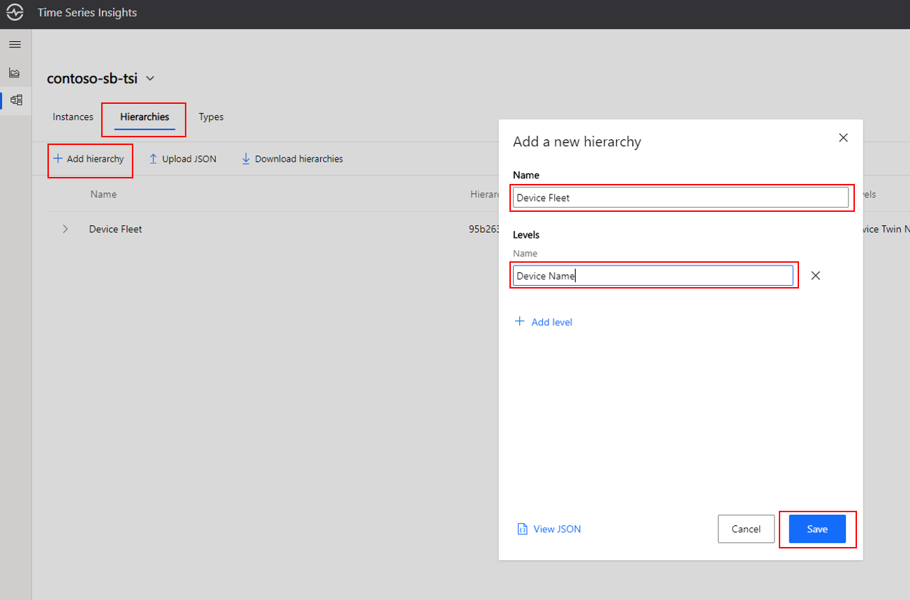
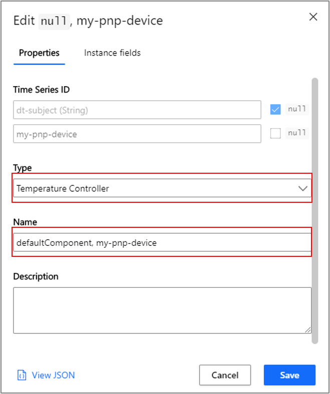
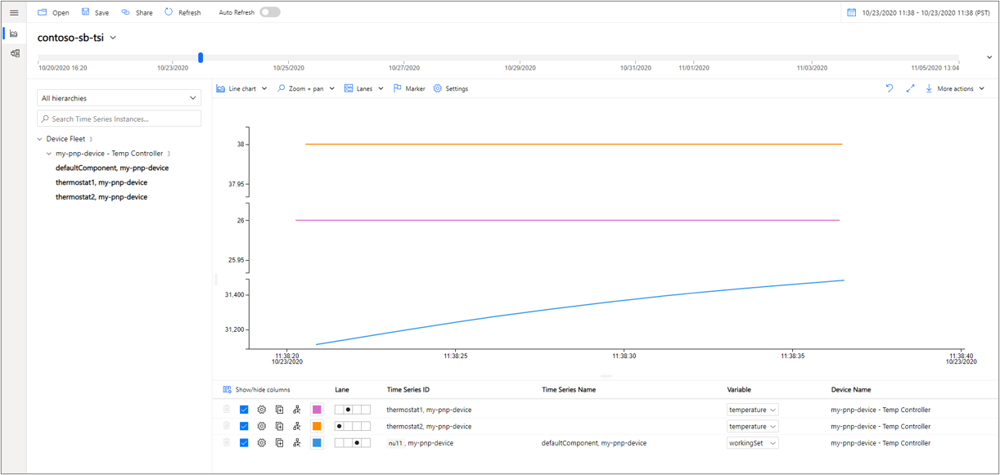

# Preview Tutorial: Create and Connect to Time Series Insights Gen2 to store, visualize, and analyze IoT Plug and Play device telemetry

In this tutorial, you'll learn how to create and correctly configure an [Azure Time Series Insights Gen2](https://docs.microsoft.com/azure/time-series-insights/overview-what-is-tsi) (TSI) environment to integrate with your IoT Plug and Play solution. With TSI, you can collect, process, store, query and visualize time series data at Internet of Things (IoT) scale.

First you'll provision a TSI environment and connect your IoT Hub as a streaming event source. Then you'll work through model synchronization to author your TSI environment's Time Series Model based off of the [Digital Twins Definition Language (DTDL)](https://github.com/Azure/opendigitaltwins-dtdl) sample model files you used for the temperature controller and thermostat devices.

> [!NOTE]
> This integration is in preview. How DTDL device models map to TSI's Time Series Model may change. 

## Prerequisites

[!INCLUDE [iot-pnp-prerequisites](../../includes/iot-pnp-prerequisites.md)]

At this point, you should have completed the following:
* An Azure IoT Hub
* An DPS instance linked to your IoT Hub, with an individual device enrollment for your IoT Plug and Play device
* A connection to your IoT Hub from either a single or multi-component device, streaming simulated data  

To avoid the requirement to install the Azure CLI locally, you can use the Azure Cloud Shell to set up the cloud services.

[!INCLUDE [cloud-shell-try-it.md](../../includes/cloud-shell-try-it.md)]

## Prepare your event source

The IoT Hub you created previously will be your TSI environment's [event source](https://docs.microsoft.com/azure/time-series-insights/concepts-streaming-ingestion-event-sources).

Disable any existing IoT Hub routes: There is a known issue when using IoT Hubs as a TSI event source with [routing](https://docs.microsoft.com/azure/iot-hub/iot-hub-devguide-messages-d2c#routing-endpoints) configured. Temporarily disable any routing endpoints, and once your IoT Hub is connected to TSI you can re-enable them.

You'll need to create a unique consumer group on your IoT Hub for TSI to consume from. Replace `my-pnp-hub` with the name of the IoT Hub you used previously.

```azurecli-interactive
az iot hub consumer-group create --hub-name my-pnp-hub --name tsi-consumer-group
```

### Time Series ID selection

While provisioning your TSI environment, you'll be required to select a Time Series ID. Selecting the appropriate Time Series ID is critical, as the property is immutable and cannot be changed after it's set. Choosing a Time Series ID is like choosing a partition key for a database, and it acts as the primary key for your Time Series Model. For more details, read [Best practices for choosing a Time Series ID
](https://docs.microsoft.com/azure/time-series-insights/how-to-select-tsid).

As an IoT Plug and Play user, for your TS ID you should specify a _composite key_ consisting of `iothub-connection-device-id` and `dt-subject`. These properties will be added by IoT Hub as system properties containing the values of your IoT Plug & Play device ID, and the name of your device's components, respectively.

My IoT Plug & Play devices are no component [devices](https://docs.microsoft.com/azure/iot-pnp/concepts-convention)--why should I include the component name as part of my TS ID? 

Even if components aren't currently used as part of your device capability models, by adding `dt-subject` as part of a composite key you're ensuring that you can use them in the future. Becuase your TS ID is immutable, we recommend enabling this option for your solution down the road. 

> [!NOTE]
> The examples below are for the multi component TemperatureController, but the concepts are the same for the no component Thermostat device.

## Provision your Azure Time Series Insights Gen2 environment

The command below does the following:

* Creates an Azure storage account for your environment's [cold store](https://docs.microsoft.com/azure/time-series-insights/concepts-storage#cold-store), designed for long-term retention and analytics over historical data.
  * Replace `mytsicoldstore` with a unique name for your cold storage account.
* Creates an Azure Time Series Insights Gen2 environment, including warm storage with a retention period of 7 days, and a cold store for infinite retention. 
  * Replace `my-tsi-env` with a unique name for your TSI environment 
  * Replace `my-pnp-resourcegroup` with the name of the resource group you used during set-up
  * Note that `iothub-connection-device-id, dt-subject` will become your Time Series ID property

```azurecli-interactive
storage=mytsicoldstore
rg=my-pnp-resourcegroup
az storage account create -g $rg -n $storage --https-only
key=$(az storage account keys list -g $rg -n $storage --query [0].value --output tsv)
az timeseriesinsights environment longterm create --name my-tsi-env --resource-group $rg --time-series-id-properties iothub-connection-device-id, dt-subject --sku-name L1 --sku-capacity 1 --data-retention 7 --storage-account-name $storage --storage-management-key $key --location eastus2
```

Connect your IoT Hub event source. Replace `my-pnp-resourcegroup`, `my-pnp-hub`, and `my-tsi-env` with your respective values. Note that this command references the consumer group for TSI that you created above. 

```azurecli-interactive
rg=my-pnp-resourcegroup
iothub=my-pnp-hub
env=my-tsi-env
es_resource_id=$(az iot hub create -g $rg -n $iothub --query id --output tsv)
shared_access_key=$(az iot hub policy list -g $rg --hub-name $iothub --query "[?keyName=='service'].primaryKey" --output tsv)
az timeseriesinsights event-source iothub create -g $rg --environment-name $env -n iot-hub-event-source --consumer-group-name tsi-consumer-group  --key-name iothubowner --shared-access-key $shared_access_key --event-source-resource-id $es_resource_id
```
Navigate to your resource group in the [Azure portal](https://portal.azure.com) and select your newly created Time Series Insights environment. Visit the *Time Series Insights Explorer URL* shown in the instance overview.


In the explorer, you should see three instances: 
* &lt;your pnp device ID&gt;, thermostat1
* &lt;your pnp device ID&gt;, thermostat2
* &lt;your pnp device ID&gt;, `null`

> [!NOTE]
> The third tag above represents telemetry from the TemperatureController itself, such as the working set of device memory. Because this is a top level property, the value for the component name is null. In a later step, you'll update this to a more user-friendly name.


## Model synchronization between Digital Twins Definition Language and Time Series Insights Gen2

Next you'll translate your DTDL device model to the asset model in Azure Time Series Insights (TSI). TSI's Time Series Model is a semantic modeling tool for data contextualization within TSI. Time Series Model has three core components:

* [Time Series Model instances](https://docs.microsoft.com/azure/time-series-insights/concepts-model-overview#time-series-model-instances). Instances are virtual representations of the time series themselves. Instances will be uniquely identified by your TS ID.
* [Time Series Model hierarchies](https://docs.microsoft.com/azure/time-series-insights/concepts-model-overview#time-series-model-hierarchies). Hierarchies organize instances by specifying property names and their relationships.
* [Time Series Model types](https://docs.microsoft.com/azure/time-series-insights/concepts-model-overview#time-series-model-types). Types help you define [variables](https://docs.microsoft.com/azure/time-series-insights/concepts-variables) or formulas for doing computations. Types are associated with a specific instance.

### Define your Types

You can begin ingesting data into Azure Time Series Insights Gen2 without having re-defined a model. When telemetry arrives, TSI will attempt to auto-resolve time series instances based on your TS ID property value(s). All instances will be assigned the *Default Type*. You'll need to manually create a new Type to correctly categorize your instances. The details below depict the most straight-forward method to synchronize your device DTDL models with your TSM Types:

* Your digital twin model identifier (DTMI) will become your Type ID
* The Type name can be either the model's name or display name
* The model description becomes the Type's description
* At least one Type variable is created for each telemetry of  numeric schema. 
  * Only numeric data types can be used for variables, but if a value is sent as a string that is parsable, `"0"` for example, you can use a [conversion](https://docs.microsoft.com/rest/api/time-series-insights/reference-time-series-expression-syntax#conversion-functions) function such as `toDouble`
* The variable name can either be the telemetry name or display name
* When defining the variable Time Series Expression (TSX), refer to the telemetry's name on the wire, and it's data type.


| DTDL JSON | TSM Type JSON | Example Value |
|-----------|------------------|-------------|
| `@id` | `id` | `dtmi:com:example:TemperatureController;1` |
| `displayName`    | `name`   |   `Temperature Controller`  |
| `description`  |  `description`  |  `Device with two thermostats and remote reboot.` |  
|`contents` (array)| `variables` (object)  | View the exampe below


> [!NOTE]
> This example shows three variables, but each Type can have up to 100. Different variables can reference the same telemetry value to perform different calucaultions as needed. For the full list of filters, aggregates, and scalar functions view the [Time Series Insights Gen2 Time Series Expression syntax](https://docs.microsoft.com/rest/api/time-series-insights/reference-time-series-expression-syntax) documentation.

Open your text editor of choice and save the JSON below to your local drive:

```JSON
{
  "put": [
    {
      "id": "dtmi:com:example:TemperatureController;1",
      "name": "Temperature Controller",
      "description": "Device with two thermostats and remote reboot.",
      "variables": {
        "workingSet": {
          "kind": "numeric",
          "value": {
            "tsx": "coalesce($event.workingSet.Long, toLong($event.workingSet.Double))"
          }, 
          "aggregation": {
            "tsx": "avg($value)"
          }
        },
        "temperature": {
          "kind": "numeric",
          "value": {
            "tsx": "coalesce($event.temperature.Long, toLong($event.temperature.Double))"
          },
          "aggregation": {
            "tsx": "avg($value)"
          }
        },
        "eventCount": {
          "kind": "aggregate",
          "aggregation": {
            "tsx": "count()"
          }
        }
      }
    }
  ]
}
```

In your Time Series Insights Explorer navigate to the Model tab by clicking on the model icon on the left. Click on **Types** and the click on **Upload JSON**:


Select **Choose file**, select the JSON you saved previously, and click **Upload**

You should see the newly defined Temperature Controller Type.

### Create a hierarchy

Create a hierarchy to organize the tags under their TemeraptureController parent. The following is a simple, single-level example, but IoT solutions commonly have many levels of nesting to contextualize tags within their physical and semantic position within a firm.

Click on *Hierarchies* and select *Add a hierarchy*. Enter `Device Fleet` as the name and create one level called `Device Name` and then click *Save*.



### Assign your instances to the correct type

Next you'll change the Type of your instances and situate them within the hierarchy
Select the *Instances* tab, find the instance that represents the device's working set of memory, and click on the *Edit* icon on the far right.


Click on the Type dropdown and select `Temperature Controller`. Update the name of the instance to represent all top-level tags associated with your device by entering `defaultComponent, <your device name>`.



Before clicking save, select the *Instance Fields* tab of the modal and check the `Device Fleet` box. Enter `<your deivce name> - Temp Controller` to group the telemetry together, and then click *Save*.


Now repeat the above to assign your thermostat tags the correct Type and Hierarchy.

### View your data

Navigate back to the charting pane and expand Device Fleet > your device. Click on thermostat1, select the `Temperature` variable, and then click *Add* to chart the value. Do the same for thermostat2 and the defaultComponent's `workingSet`.



## Next steps

* To learn more about the various charting options, including interval sizing and Y-axis controls, view the [Azure Time Series Insights Explorer
](https://docs.microsoft.com/azure/time-series-insights/concepts-ux-panels) documentation.

* For an in-depth overview of your environment's Time Series Model see [this](https://docs.microsoft.com/azure/time-series-insights/concepts-model-overview) article.

* To dive into the query APIs and the Time Series Expression syntax, [select](https://docs.microsoft.com/rest/api/time-series-insights/reference-query-apis).


