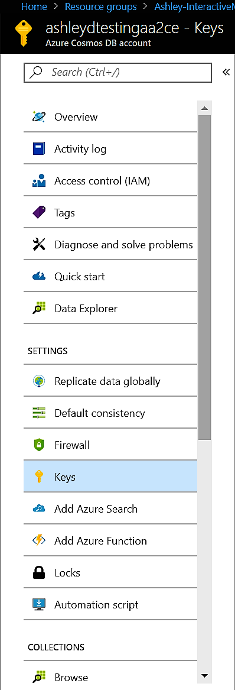
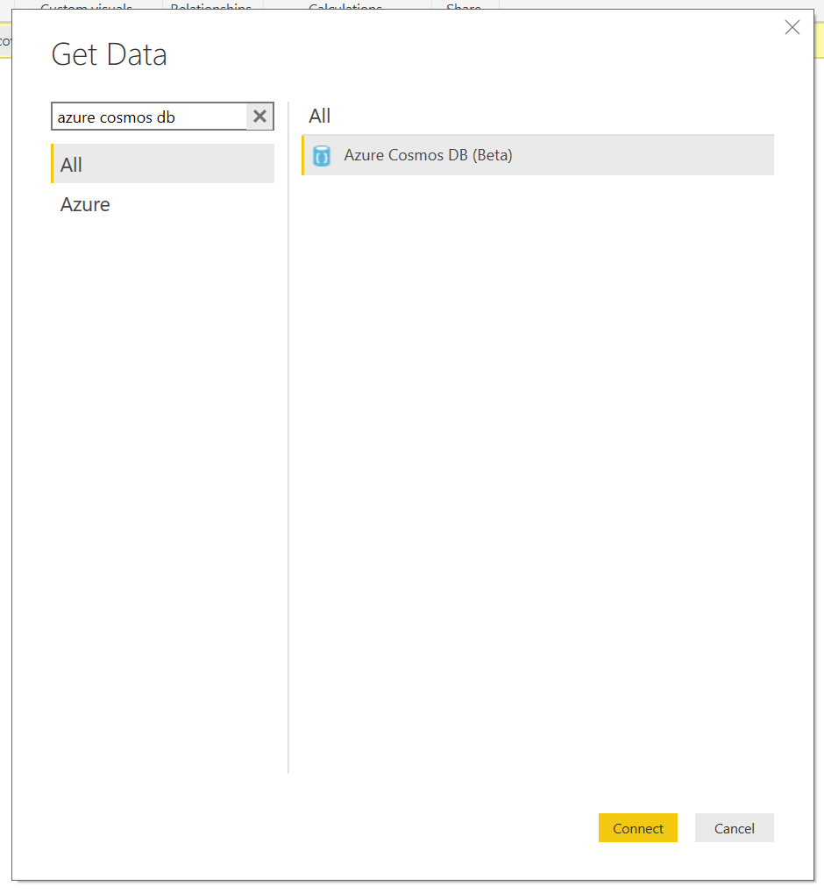
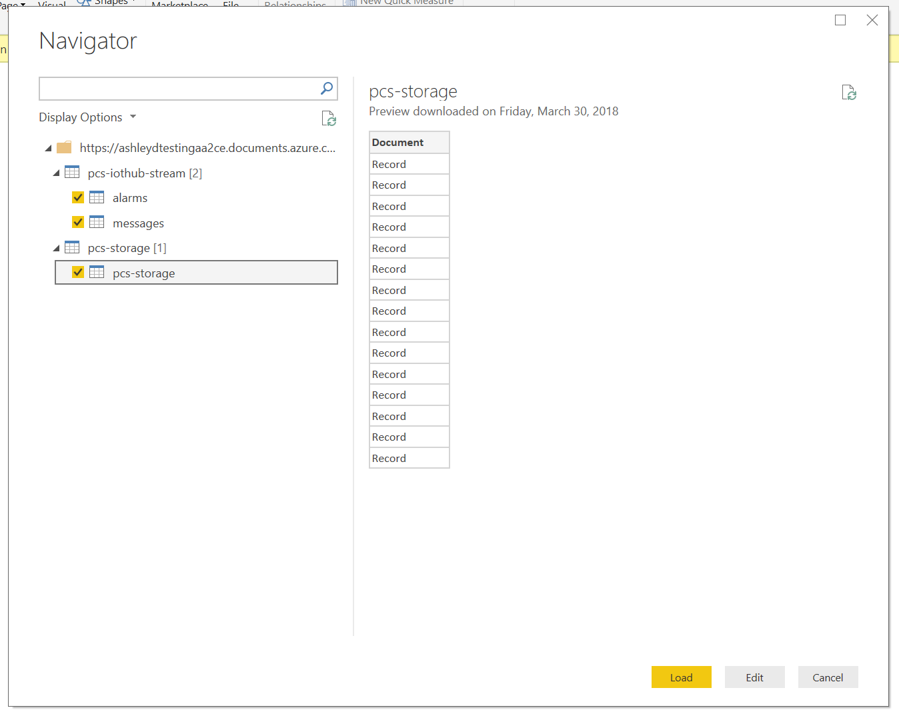
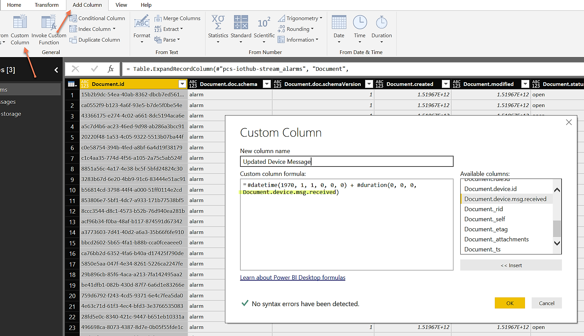
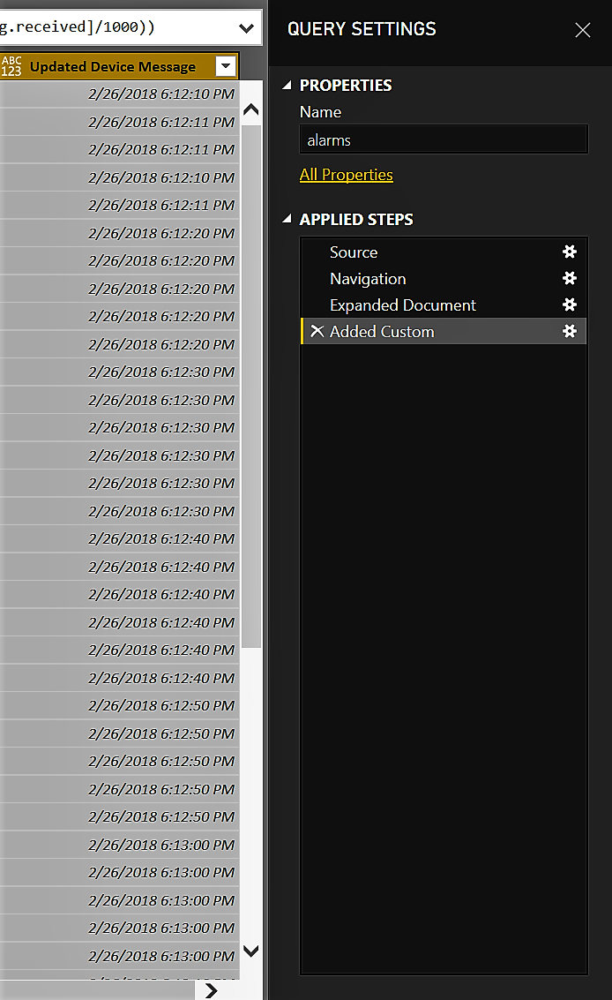

# Visualize Remote Monitoring data using Power BI

This tutorial will walk you through how to plug-in your Remote Monitoring solution data from CosmosDB into Power BI. With this connection established, you can then create your own custom dashboards, and add them back onto your Remote Monitoring solution dashboard. This allows for more specialized graphs to be created, in addition to the ones out of the box. You can then use this tutorial to integrate with other data streams or build custom dashboards to be consued outside of your Remote Monitoring Solution. You can also extend these steps to use your visualization tool of choice and hook into the Cosmos Database, or custom database if you have set one up.

## Prerequisites

- You must have a Remote Monitoring solution currently running
- You must have access to the [Azure Portal](https://portal.azure.com) and your subscription on which the IoT Hub and Solutiong are running
- You must have [Power BI desktop](https://powerbi.microsoft.com) installed, any version will do


## Information Needed from Azure Portal

1. Navigate to the [Azure Portal](https://portal.azure.com) and log in if needed

2. On the left hand panel, click Resource groups

    

3. Navigate to the Resource Group of which your Iot Solution is running on and click to be taken to that Resource Group's Overview page. 

4. On that overview page, click the item which has type "Azure Cosmos DB Account", you will then be taken to the overview page of the Cosmos DB stream for that IoT Solution.

    

5. On the panel to the left, click the "Keys" section and take note of the following values to be used in PowerBi:

    - URI
    - Primary Key

    

## Setting up the Stream in Power BI
  
1.Open up the Power BI desktop app and click "Get Data" from the top left corner. 

    

2. When asked to enter data, choose to Search for "Azure Cosmos DB" and select this connector. This connector essentially pulls data straight from the cosmos database of your Azure IoT Solution
  
    
  
3. Enter the information which you have recorded above:

    - URI
    - Primary Key

4. Select all the tables to be imported into Power BI. This will kick off the loading of the data. Note that the longer your solution has been running, the longer it can take for the data to load (up to a few hours). 

    

5. Once the data has finished loading, click "Edit Queries" on the top row of Power BI and expand all the tables by clicking the arrows in the yellow bar for each table. This will essentially expand to show all the columns. You will notice how data for things such as humidity, speed time, etc. are not of the correct type.

    
  
    For example, the data coming into Power BI was changed into UNIX time when it came in through the connector. To adjust for this, going forward you can create a new column and use this equation to get it into date time format: 

    ```text
    #datetime(1970, 1, 1, 0, 0, 0) + #duration(0, 0, 0, [Document.device.msg.received]/1000)
    ```

    
  
    Document.device.msg.received is just one of the columns with UNIX formatting and can be substituted with others that need conversion. 
  
    Other data points were converted to type String can should be changed into Doubles or Int where appropriate using the same steps as above.

## Refreshing the Power BI Data
