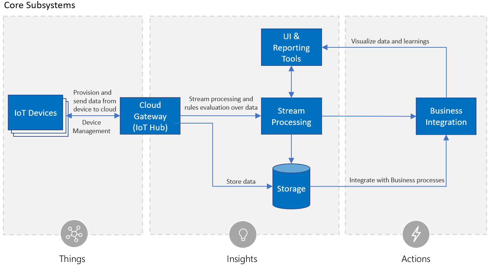

# Remote Monitoring architectural choices

The Azure IoT Remote Monitoring (RM) is an open-source, MIT licensed, solution accelerator that introduces common IoT scenarios such as device connectivity, device management, and stream processing, so customers can speed up their development process.  RM follows the recommended Azure IoT reference architecture published [here](https://azure.microsoft.com/updates/microsoft-azure-iot-reference-architecture-available/).  

This article describes the architectural and technical choices made in each of the subsystems for RM, and discusses alternatives considered.  It is important to note that the technical choices made in RM are not the only way to implement a remote monitoring IoT solution.  The technical implementation is a baseline for building a successful application and should be modified to fit the skills, experience, and vertical application needs for a customer solution implementation.

## Architectural choices

### Microservices, serverless, and cloud native

The architecture we recommend for IoT applications are cloud native, microservice, and serverless based.  The different subsystems of an IoT application should be built as discrete services that are independently deployable, and able to scale independently.  These attributes enable greater scale, more flexibility in updating individual subsystems, and provide the flexibility to choose appropriate technology on a per subsystem basis.  Microservices can be implemented with multiple technologies. For example, using container technology such as Docker with serverless technology such as Azure Functions, or hosting microservices in PaaS services such as Azure App Services.

## Core subsystem technology choices

This section details the technology choices made in RM for each of the core subsystems.

 

### Cloud Gateway
The Azure IoT Hub is used as the RM Cloud Gateway.  The IoT Hub offers secure, bi-directional communication with devices. You can learn more about IoT Hub [here](https://azure.microsoft.com/services/iot-hub/). For IoT Device Connectivity, the .NET Core and Java IoT Hub SDKs are used.  The SDKs offer wrappers around the IoT Hub REST API and handle scenarios such as retry, 

### Stream processing
For Stream Processing RM uses Azure Stream Analytics for complex rule processing.  For customers wanting simpler rules, we also have a custom microservice with support for processing of simple rules, although this set-up not part of the out of the box deployment. The reference architecture recommends use of Azure Functions for simple rule processing and Azure Stream Analytics (ASA) for complex rule processing.  

### Storage
For Storage, Cosmos DB is used for all storage needs: cold storage, warm storage, rules storage, and alarms. We are currently in the process of moving to Azure blob storage, as recommended by the reference architecture.  Cosmos DB is the recommended general-purpose warm storage solution for IoT applications though solutions such as Azure Time Series Insights and Azure Data Lake are appropriate for many use cases.

### Business integration
Business integration in RM is limited to generation of alarms, which are placed in warm storage. Further business integrations can be performed by integrating the solution with Azure Logic Apps.

### User Interface
The web UI is built with JavaScript React.  React offers a commonly used industry web UI framework and is similar to other popular frameworks such as Angular.  

### Runtime and orchestration
The Application Runtime chosen for subsystem implementation in RM is Docker containers with Kubernetes (K8s) as the orchestrator for horizontal scale.  This architecture allows for individual scale definition per subsystem however incurs DevOps costs in keeping VMs and containers up-to-date from a security perspective.  Alternatives to Docker & K8s include hosting microservices in PaaS services (for example, Azure App Service) or using Service Fabric, DCOS, Swarm, etc. as an orchestrator.

## Next steps:
* Deploy your RM solution [here](https://www.azureiotsuite.com/).
* Explore GitHub code in [C#](https://github.com/Azure/azure-iot-pcs-remote-monitoring-dotnet/) and [Java](https://github.com/Azure/azure-iot-pcs-remote-monitoring-java/).  
* Learn more about the IoT Reference Architecture [here](https://azure.microsoft.com/updates/microsoft-azure-iot-reference-architecture-available/).
