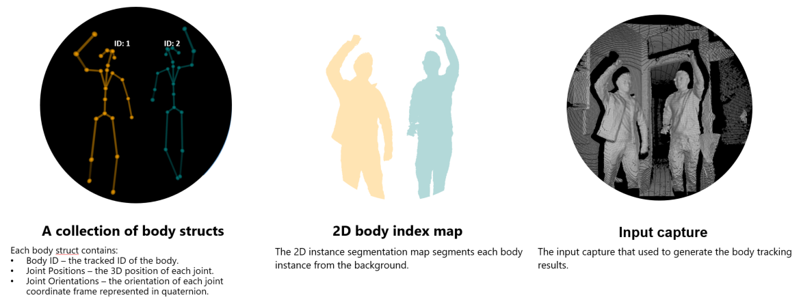

# Access data in body frame

This article describes the data contained in a body frame and the functions to access the data.

The following functions are covered:

- [k4abt_frame_get_num_bodies()](https://microsoft.github.io/Azure-Kinect-Sensor-SDK/master/index.html)
- [k4abt_frame_get_body_skeleton()](https://microsoft.github.io/Azure-Kinect-Sensor-SDK/master/index.html)
- [k4abt_frame_get_body_id()](https://microsoft.github.io/Azure-Kinect-Sensor-SDK/master/index.html)
- [k4abt_frame_get_timestamp_usec()](https://microsoft.github.io/Azure-Kinect-Sensor-SDK/master/index.html)
- [k4abt_frame_get_body_index_map()](https://microsoft.github.io/Azure-Kinect-Sensor-SDK/master/index.html)
- [k4abt_frame_get_capture()](https://microsoft.github.io/Azure-Kinect-Sensor-SDK/master/index.html)

## Key components of a body frame

Each body frame contains a collection of body structs, a 2D body index map, and the input capture that generated this result.

-

## Access the collection of body structs

Multiple bodies might be detected in a single capture. You can query the number of bodies by calling the [k4abt_frame_get_num_bodies()](https://microsoft.github.io/Azure-Kinect-Sensor-SDK/master/index.html) function.

```C
size_t num_bodies = k4abt_frame_get_num_bodies(body_frame);
```

You use the [k4abt_frame_get_body_id()](https://microsoft.github.io/Azure-Kinect-Sensor-SDK/master/index.html) and [k4abt_frame_get_body_skeleton()](https://microsoft.github.io/Azure-Kinect-Sensor-SDK/master/index.html) functions to iterate through each body index to find the body ID and joint position/orientation information.

```C
for (size_t i = 0; i < num_bodies; i++)
{
    k4abt_skeleton_t skeleton;
    k4abt_frame_get_body_skeleton(body_frame, i, &skeleton);
    uint32_t id = k4abt_frame_get_body_id(body_frame, i);
}
```

## Access the body index map

You use the [k4abt_frame_get_body_index_map()](https://microsoft.github.io/Azure-Kinect-Sensor-SDK/master/index.html) function to access the body index map. Refer to  [body index Map](body-index-map.md) for detailed explanation of the body index map. Release the body index map when no longer needed.

```C
k4a_image_t body_index_map = k4abt_frame_get_body_index_map(body_frame);
...  // Do your work with the body index map
k4a_image_release(body_index_map);
```

## Access the input capture

The body tracker is an asynchronous API. The original capture may already have been released by the time the result is popped. Use the [k4abt_frame_get_capture()](https://microsoft.github.io/Azure-Kinect-Sensor-SDK/master/index.html) function to query the 
input capture used to generate this body tracking result. The reference count for the k4a_capture_t is increased each time this function is called. Use [k4a_release_capture()](https://microsoft.github.io/Azure-Kinect-Sensor-SDK/master/index.html) function when the capture is no longer needed.

```C
k4a_capture_t input_capture = k4abt_frame_get_capture(body_frame);
... // Do your work with the input capture
k4a_capture_release(input_capture);
```

## Next steps

> [!div class="nextstepaction"]
>[Azure Kinect Body Tracking SDK](https://microsoft.github.io/Azure-Kinect-Sensor-SDK/master/index.html)