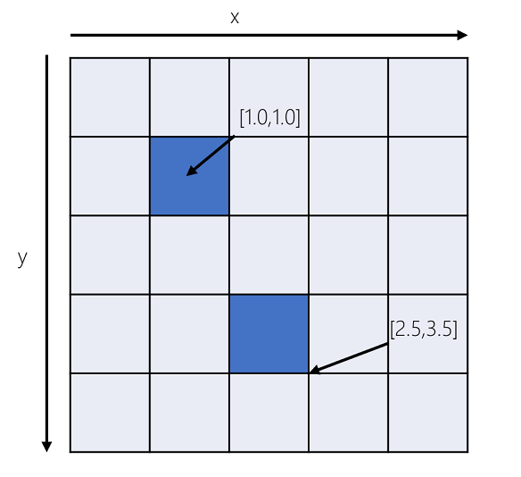
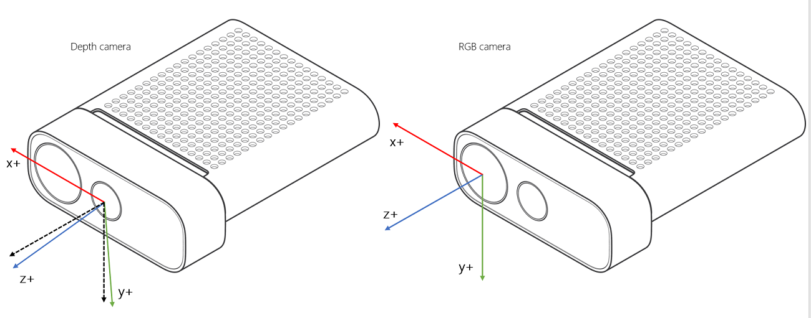
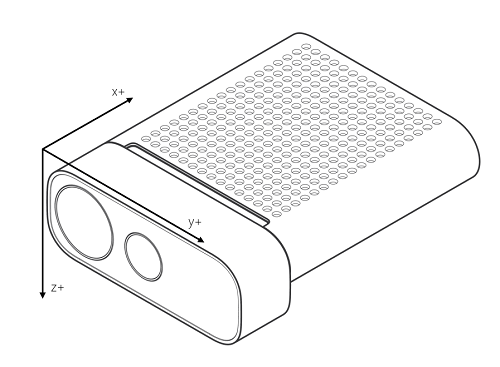

# Azure Kinect DK coordinate systems

In this article we describe conventions used for 2D and 3D coordinate systems.  There are separate coordinate systems associated with each sensor's device and the [calibration functions](use-azure-kinect-calibration-functions.md) allowed to transform points between them. The [transformation functions](use-image-transformation.md) transform entire images between coordinate systems.  

## 2D coordinate systems

 Each camera, that is, depth and color, is associated with an independent 2D coordinate system. An [x,y]-coordinate is represented in units of pixels where *x* ranges from 0 to width-1 and *y* ranges from 0 to height-1. Width and height depend on the chosen mode in which depth and color cameras are operated. The pixel coordinate `[0,0]` corresponds to the top-left pixel of the image. Pixel coordinates can be fractional representing subpixel coordinates.

The 2D coordinate system is 0-centered, that is, the subpixel coordinate `[0.0, 0.0]` represents the center and `[0.5,0.5]` the bottom-right corner of the pixel, as shown below.

   

## 3D coordinate systems

Each camera, that is, depth and color, and IMU component, that is, gyroscope and accelerometer, is associated with an independent 3D coordinate space system. Points in the 3D-coordinate systems are represented as metric [X,Y,Z]-coordinate triplets with units in millimeters.

### Depth and color camera

The origin `[0,0,0]` is located at the focal point of the camera. The coordinate system is oriented such that the positive X-axis points right, the positive Y-axis points down, and the positive Z-axis points forward. Note that depth the camera module and narrow field-of-view (NFOV) illuminator are tilted 6 degrees downwards and wide field-of-view (WFOV) is tilted an additional 1.3 degrees, as shown below. 

### Gyroscope and accelerometer

The gyroscope's origin `[0,0,0]` is identical to the origin of the depth camera. The origin of the accelerometer coincides with its physical location. Both IMU coordinate systems are right-handed with the positive X-axis pointing backward, the positive Y-axis pointing left, and the positive Z-axis pointing down, as shown below.

## Next steps

> [!div class="nextstepaction"]
>[Learn about Azure Kinect SDK](overview-sensor-sdk.md)