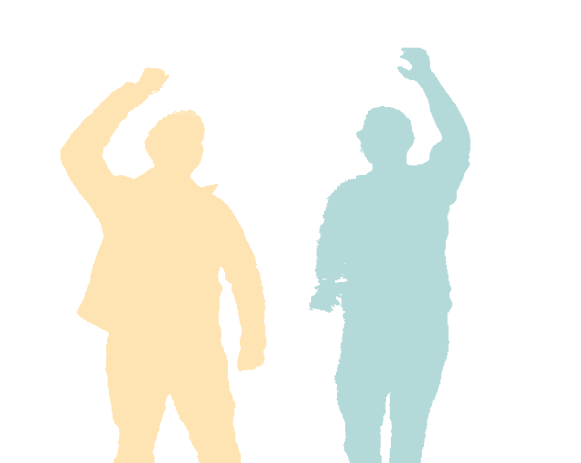

# Body tracking index map

The body index map includes the instance segmentation map for each body in the depth camera capture. Each pixel maps to the corresponding pixel in the depth or IR image. The value for each pixel represents which body the pixel belongs to. It can be either background (value `K4ABT_BODY_INDEX_MAP_BACKGROUND`) or the index of a detected `k4abt_body_t`.

>[!NOTE]
> The body index is different than the body id. You can query the body id by first querying the `k4abt_body_t` struct for a given index and then access the body id in `k4abt_body_t.id`.

## Using body index map

The body index map is stored as a `k4a_image_t` and has the same resolution as the depth or IR image. Each pixel is an 8-bit value. It can be queried from a `k4abt_frame_t` by calling `k4abt_frame_get_body_index_map`. The developer is responsible for releasing the memory for the body index map by calling `k4a_image_release()`.

## Next steps

> [!div class="nextstepaction"]
>[Coordinate systems](coordinate-systems.md)