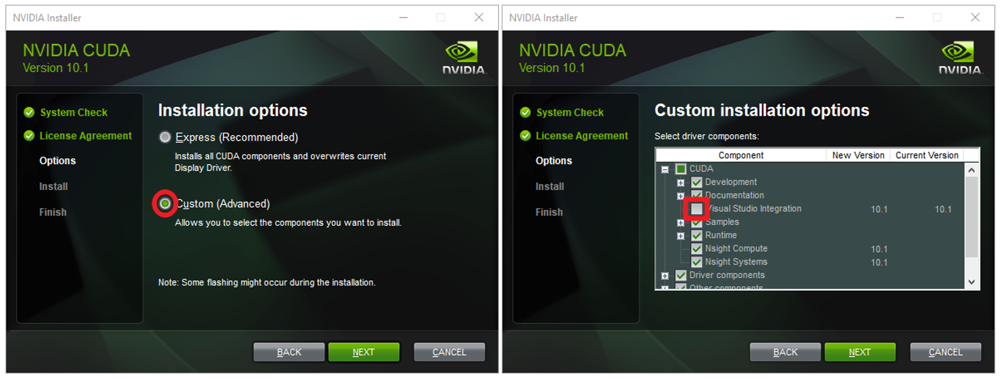
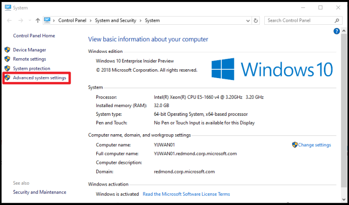
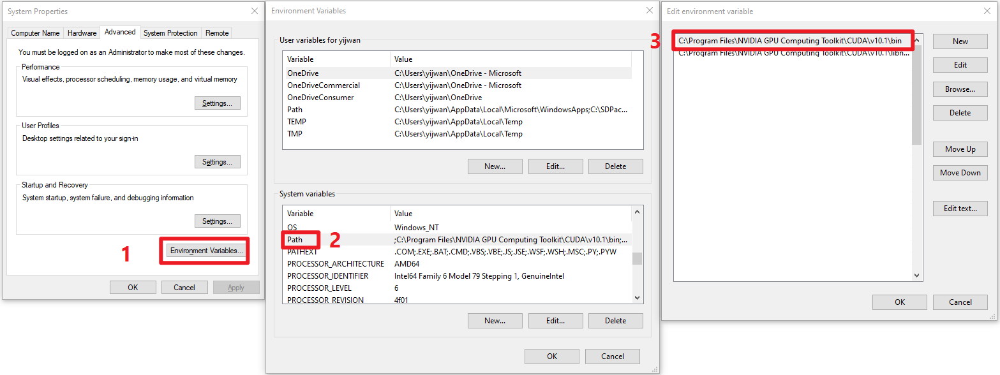

# Setup Azure Kinect Body Tracking

This page will guide you through getting body tracking running on our Azure Kinect DK. 

## System requirements

- Windows 10 PC
  - Core i5 or better
- NVIDIA GPU
  - GTX 1070 or better
  - RTX graphics cards are supported now!

## Install software

### [CUDA 10.1](https://developer.nvidia.com/cuda-downloads)

Please follow the the on-screen prompts to install the CUDA 10.1 and all their patches.

>[!NOTE]
> If installing with the "Express" installation options fails, please select "Custom" installation option and click "Next".
> Then expand the "CUDA" tag and unselect "Visual Studio Integration".

### [cuDNN v7.5.x for CUDA 10.1](https://developer.nvidia.com/rdp/cudnn-download)

You will need to log-in your NVIDIA account to download the cudnn64_7.dll. Remember to add the dll path to the "Environment Variables - Path":
1. Launch "Control Pannel" -> Select "System and Security" -> Select "System" -> Select "Advanced system settings"

    

2. Select "Environment Variables" -> Double click the "Path" variable under "System variables" block -> Make sure the path that contains your cudnn64_7.dll is there.

    

### [Install the latest NVIDIA Driver](https://www.nvidia.com/Download/index.aspx?lang=en-us)

An older version of NVIDIA graphics driver will be installed with the CUDA 10.1. But in order for it to work correctly, you will need to install the latest NVIDIA driver for your graphics card. 

## Setup hardware

*   A working Azure Kinect device
    -   Update sensor firmware:
        The minimum firmware version is FW 1.5.926614. Please refer to sensor SDK documentation for how to upgrade your firmware.

    -   Verify your Azure Kinect is working (Optional):
        * Download the [K4A SDK v1.0.0](https://review.docs.microsoft.com/en-us/azurekinect/download-sdk?branch=master) 
        * Find the k4aviewer.exe at [Path To your installed Azure Kinect SDK]\tools\k4aviewer.exe. Run the tool to verify whether the Azure Kinect device can produce depth and 
        IR results correctly. 

## Verify body tracking

The body tracking SDK can be verified by running the body tracking simple 3d viewer sample: \
The simple 3d viewer that consumes K4ABT SDK can be found at examples\bin\simple-3d-viewer.exe. All the required binaries and the model files are already in the folder. 
Once you setup your machine to meet the prerequisites, you can simply double click the k4abt_simple_3d_viewer.exe to run the simple 3d viewer.

If everything is set up properly, you will see the 3d point cloud and the tracked bodies in a pop-up window.

>[!NOTE]
> The first time an Azure Kinect Body Tracking application is launched on a machine it may take several minutes to load as CUDA is initialized. 
> Subsequent launches on the same machine will be faster. 

## Next steps

> [!div class="nextstepaction"]
>[Coordinate systems](azure-kinect-dk-coordinate-systems.md)