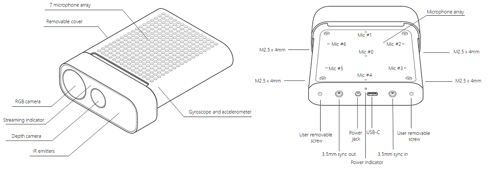
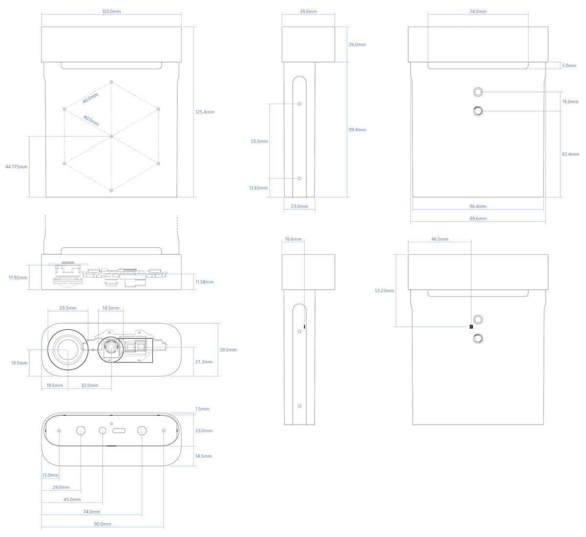
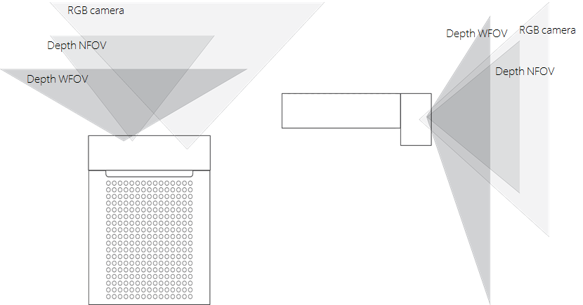
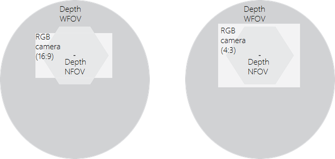
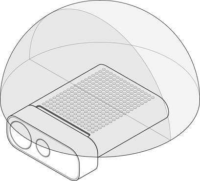
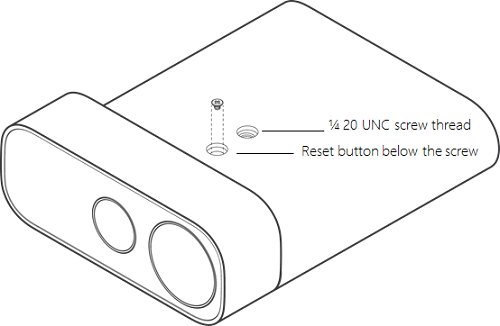

# Azure Kinect DK hardware specifications 

This article provides details about how Azure Kinect hardware integrates Microsoft's latest sensor technology into a single, USB-connected accessory.

## Product dimensions and weight

The Azure Kinect device consists of the following size and weight dimensions.

- **Dimensions**: 103 x 39 x 126 mm
- **Weight**: 440 g

## Operating environment

Azure Kinect DK is intended for developers and commercial businesses operating under the following ambient conditions:

- **Temperature**: 10-25⁰C
- **Humidity**: 8-90% (non-condensing) RH

>[!NOTE]
>Use outside of the ambient conditions could cause the device to fail and/or function incorrectly. These ambient conditions are applicable for the environment immediately around the device under all operational conditions. When used with an external enclosure, active temperature control and/or other cooling solutions are recommended to ensure the device is maintained within these ranges. The device design features a cooling channel in between the front section and rear sleeve. When you implement the device, make sure this cooling channel is not obstructed.

Refer to additional product [safety information](https://support.microsoft.com/help/4023454/safety-information).

## Depth camera supported operating modes

Azure Kinect DK integrates a Microsoft designed 1-Megapixel Time-of-Flight (ToF) depth camera using the Yeats image sensor presented at ISSCC 2018. The depth camera supports the modes indicated below:

 | Mode            | Resolution | FOI       | FPS                | Operating range* | Exposure time |
|-----------------|------------|-----------|--------------------|------------------|---------------|
| NFOV unbinned   | 640x576    | 75°x65°   | 0, 5, 15, 30       | 0.5 - 3.86 m       | 12.8 ms        |
| NFOV 2x2 binned (SW) | 320x288    | 75°x65°   | 0, 5, 15, 30       | 0.5 - 5.46 m       | 12.8 ms        |
| WFOV 2x2 binned | 512x512    | 120°x120° | 0, 5, 15, 30       | 0.25 - 2.88 m      | 12.8 ms        |
| WFOV unbinned   | 1024x1024  | 120°x120° | 0, 5, 15           | 0.25 - 2.21 m      | 20.3 ms        |
| Passive IR      | 1024x1024  | N/A       | 0, 5, 15, 30       | N/A              | 1.6 ms         |

*15% to 95% reflectivity, 2.2 uW/cm^2/nm, random error std. dev. <= 17 mm, typical systematic error < 11 mm + 0.1% of distance without multi-path interference. Depth provided outside of indicated range depending on object reflectivity.

## Color camera supported operating modes

Azure Kinect DK includes an OV12A10 12MP CMOS sensor rolling shutter sensor. The native operating modes are listed below:

|             RGB Camera Resolution (HxV)  |          Aspect Ratio  |          Format Options   |          Frame Rates (FPS)  |          Nominal FOV (HxV)(post-processed)  |
|------------------------------------------|------------------------|---------------------------|-----------------------------|---------------------------------------------|
|       3840x2160                          |          16:9          |          MJPEG            |          0, 5, 15, 30       |          90x59                              |
|       2560x1440                          |          16:9          |          MJPEG            |          0, 5, 15, 30       |          90x59                              |
|       1920x1080                          |          16:9          |          MJPEG            |          0, 5, 15, 30       |          90x59                              |
|       1280x720                           |          16:9          |          MJPEG/YUY2/NV12  |          0, 5, 15, 30       |          90x59                              |
|       4096x3072                          |          4:3           |          MJPEG             |          0, 5, 15           |          90x74.3                            |
|       2048x1536                          |          4:3           |          MJPEG             |          0, 5, 15, 30       |          90x74.3                            |

The RGB camera is USB Video class-compatible and can be used without the Sensor SDK.

>[!NOTE]
>SDK exposes BGRA mode that is converted from MJPEG on host CPU. This is not native more and causes CPU load when used.

## Camera field of view

View the next image of both the Depth and RGB camera FOV and what sensors "see". The diagram is illustrative where the RGB camera is in 4:3 mode.

Camera FOV front from 2000 mm distance is visualized below. Notice that the 4:3 resolution mode has better pixel overlap in NFOV mode (hexagon shape) than the 16:9 resolution.

## Motion sensor (IMU)

The embedded Inertial Measurement Unit (IMU) is an LSM6DSMUS and includes both an accelerometer and a gyroscope, simultaneously sampled at 1.6 kHz and reported to the host at a 208-Hz rate.

## Microphone array

Azure Kinect DK embeds a high-quality, 7-microphone circular array that identifies as a standard USB audio class 2.0 device. The performance specifications are: 

- Sensitivity: -22 dBFS (94 dB SPL, 1 kHz)
- Signal to noise ratio > 65 dB
- Acoustic overload point: 116 dB

## USB

Azure Kinect DK is a USB3 composite device that exposes the following hardware endpoints to the operating system:

Vendor ID is 0x045E (Microsoft), Product ID table below:

|    USB Interface        |    PNP IP    |     Notes            |
|-------------------------|--------------|----------------------|
|    USB3.1 Gen1 Hub    |    0x097A    |    The   main hub    |
|    USB2.0 Hub         |    0x097B    |    HS   USB          |
|    Depth camera       |    0x097C    |    USB3.0            |
|    Color camera       |    0x097D    |    USB3.0            |
|    Microphones        |    0x097E    |    HS   USB          |

## Indicators

The device has a camera streaming indicator on the front of the device that can be disabled programmatically using the Sensor SDK.

The status LED behind the device indicates device state:

| When the light is     | It means                                                   |
|-----------------------|------------------------------------------------------------|
| Solid white           | Device is on and working properly.                         |
| Flashing white        | Device is on but doesn’t have a USB 3.0 data connection.   |
| Flashing amber        | Device doesn't have enough power to operate.               |
| Amber flashing white  | Firmware update or recovery in progress                    |

## Power device

The device can be powered using the in-box power supply and USB Type-C to A cable, or by using a Type-C to C cable for both power and data. A type-C to C cable is not included.

>[!NOTE]
> - The in-box power supply cable is a USB Type-A to single post barrel connector. Use the provided wall-power supply with this cable. The device is capable of drawing more power than two standard USB Type-A ports can provide.
> - USB cables do matter and we recommended to use high-quality cables and verify functionality before deploying the unit remotely.

>[!TIP]
>Tips for selecting good type-C to Type-C cable:
>- The [USB certified cable](https://www.usb.org/products), must support both power and data.
>- Passive cable should be less than 1.5m in length, for longer cables use active cable. 
>- The cable shall support no less than >1.5A, else you need connect external PSU.

Verify cable:

- Connect device via the cable to the host PC.
- Validate that all devices enumerate correctly in Windows device manager. Depth and RGB camera should appear as shown in the example below.

  

- Validate that cable can stream reliably on all sensors in the Azure Kinect Viewer, with the  following settings:

  - Depth camera: NFOV unbinned
  - RGB Camera: 2160p
  - Microphones and IMU enabled

## Power consumption

Azure Kinect DK consumes up to 5.9 W; specific power consumption is use-case dependent.

## Calibration

Azure Kinect DK is calibrated at the factory. The calibration parameters for visual and inertial sensors may be queried programmatically through the Sensor SDK.

## External synchronization

The device includes 3.5 mm synchronization jacks that can be used to link multiple units together to achieve coordinated Depth/RGB camera triggering. There are specific sync-in and sync-out jacks on the device, enabling easy daisy chaining. A compatible cable is not included in box and must be purchased separately.

Cable requirements:

- 3.5 mm tip male-to-male cable ("3.5 mm audio cable")
- Maximum cable length < 10 m
- Both stereo and mono cable are supported

More details on [external synchronization setup](https://aka.ms/support)

## Device recovery

Device firmware can be reset to original firmware using button underneath the lock pin.

To perform recovery, see [instructions here](https://aka.ms/support)

## Next steps

Now you are familiar with Azure Kinect hardware specification, you also can review
> [!div class="nextstepaction"]
>[Host PC minimum requirement](system-requirements.md)
>[Set up hardware](set-up-azure-kinect-dk.md)