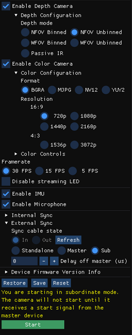

# Synchronize multiple Azure Kinect DK devices

Each Azure Kinect DK device includes 3.5-mm synchronization ports (**Sync in** and **Sync out**) that you can use to link multiple units together. When linked, cameras can coordinate the trigger timing of multiple depth cameras and RGB cameras. 

In this article, we will explore the benefits of multi device synchronization and its details.

## Why use multiple Azure Kinect DK devices?

There are many reasons to use multiple Azure Kinect DK devices. Some examples are
- Fill in occlusions.
   *Occlusion* means that there is something you want to see, but can't see it due to some interference. In our case Azure Kinect DK device has two cameras (depth and color cameras) that do not share the same origin, so one camera can see part of an object that other cannot. Therefore, when transforming depth to color image, you may see a shadow around an object.
   On the image below, the left camera sees the grey pixel P2, but the ray from the right camera to P2 hits the white foreground object. As a result the right camera cannot see P2.  
     
   Using additional Azure Kinect DK devices will solve this issue and fill out an occlusion problem.

- Scan objects in three dimensions.
- Increase the effective frame rate to something higher than the 30 FPS
- Capture multiple 4K color images of the same scene, all aligned within 100 microseconds of the start of exposure.
- Increase camera coverage within the space.

## Plan your multi-device configuration

Before you start, make sure to review [Azure Kinect DK Hardware specification](hardware-specification.md). 

### Select a camera configuration

You can use two different approaches for your camera configuration:

- **Daisy chain configuration**. Synchronize one master device and up to eight subordinate devices.  
   
- **Star configuration**. Synchronize one master device with up to two subordinate devices.  
   

### Plan your camera settings and software configuration

#### Exposure
We recommend using a manual exposure setting if you want to control the precise timing of each device. Automatic exposure allows each color camera to dynamically change exposure, as a result it is impossible for the timing between the two devices to stay exactly the same.  

Do not repeatedly set the same exposure setting in the image capture loop.  

Do set the exposure when needed, just call the API once.

#### Timestamps
The device timestamp reported for images changes meaning to ‘Start of Frame’ from ‘Center of Frame’ when using master or subordinate modes.

#### Interference between IR cameras

Avoid IR camera interference between different cameras. 

Interference happens when the depth sensor's ToF lasers are on at the same time as another depth camera.
To avoid it, cameras that have overlapping areas of interest need to have their timing shifted by the "laser on time" so they are not on at the same time.  For each capture, the laser turns on nine times and is active for only 125us and is then idle for 1450us or 2390us depending on the mode of operation. As a result, depth cameras need their "laser on time" shifted by a minimum of 125us and that on time needs to fall into the idle time of the other depth sensors in use. 

Due to the differences in the clock used by the firmware and the clock used by the camera, 125&mu;s cannot be used directly. Instead the software setting required to ensure sure there is no camera interference is 160&mu;s. It allows nine more depth cameras to be scheduled into the 1450&mu;s of idle time of NFOV. The exact timing changes based on the depth mode you are using.

Using the [depth sensor raw timing table](hardware-specification.md) the exposure time can be calculated as:

> *Exposure Time* = (*IR Pulses* &times; *Pulse Width*) + (*Idle Periods* &times; *Idle Time*)

In your software, use ```depth_delay_off_color_usec``` or ```subordinate_delay_off_master_usec``` to make sure that each IR laser fires in its own 160&mu;s window or has a different field of view.

When using multiple depth cameras in synchronized captures, depth camera captures should be offset from one another by 160μs or more to avoid depth cameras interference.

#### Using an external sync trigger

A custom sync source can be used to replace the master Azure Kinect DK. It is helpful when the image captures need to be synchronized with other equipment. The custom trigger must create a sync signal, similar to the master device, via the 3.5-mm port.

- The SYNC signals are active high and pulse width should be greater than 8us.
- Frequency support must be precisely 30 fps, 15 fps, and 5 fps, the frequency of color camera's master VSYNC signal.
- SYNC signal from the board should be 5 V TTL/CMOS with maximum driving capacity no less than 8 mA.
- All styles of 3.5-mm port can be used with Kinect DK, including "mono", that is not pictured. All sleeves and rings are shorted together inside Kinect DK and they are connected to ground of the master Azure Kinect DK. The tip is the sync signal.


## Prepare your devices and other hardware

### Azure Kinect DK devices

For each of the Azure Kinect DK devices that you want to synchronize, do the following:

- Ensure that the latest firmware is installed on the device. For more info about updating your devices, go to [Update Azure Kinect DK](). 
- Remove the device cover to reveal the sync ports.
- Note the serial number for each device. You will use this number later in the setup process.

### Host computers

- Host PC for each Azure Kinect DK. A dedicated host controller can be used, but it depends on how you're using the device and the amount of data being transferred over USB. 
- Azure Kinect Sensor SDK installed on each host PC. For more info on installing Sensor SDK, go to [Set up Azure Kinect DK](). 

#### Linux computers: USB Memory on Ubuntu

If you are setting up multi-camera synchronization on Linux, by default the USB controller is only allocated 16 MB of kernel memory for handling of USB transfers. It is typically enough to support a single Azure Kinect DK, however more memory is needed to support multiple devices. To increase the memory, follow these steps:

1. Edit /**etc/default/grub**.
1. Replace the following line:
   ```cmd
   GRUB_CMDLINE_LINUX_DEFAULT="quiet splash"
   ```
   with this line:
   ```cmd
   GRUB_CMDLINE_LINUX_DEFAULT="quiet splash usbcore.usbfs_memory_mb=32"
   ```
   In this example, we set the USB memory to 32 MB twice that of the default, however it can be set much larger. Choose a value that is right for your solution.
1. Run **sudo update-grub**.
1. Restart the computer.

### Cables

To connect the cameras to each other and to the host computers, you need 3.5-mm male-to-male cables (also known as 3.5-mm audio cable). The cables should be less than 10 meters long, and may be stereo or mono.

The number of cables that you need depends on the number of cameras you are using as well as the specific configuration. The Azure Kinect DK box does not include cables&mdash;you must purchase them separately.

If you are connecting the cameras in the star configuration, you also need one headphone splitter.

## Set up multiple Azure Kinect DK devices

### Connect your devices

#### Daisy chain configuration 

1. Connect each Azure Kinect DK to power.
1. Connect one device to one host PC. 
1. Select one device to be the master device, and plug a 3.5-mm audio cable into its **Sync out** port.
1. Plug the other end of the cable into the **Sync in** port of the first subordinate device.
1. To connect another device, plug another cable into the **Sync out** port of the first subordinate device, and plug the other end of that cable into the **Sync in** port of the next device.
1. Repeat the previous step until all of the devices are connected. The last device should have one cable plugged into its **Sync in** port, and its **Sync out** port should be empty.

#### Star configuration 

1. Connect each Azure Kinect DK to power.
1. Connect one device to one host PC. 
1. Select one device to be the master device, and plug the single end of the headphone splitter into its **Sync out** port.
1. Connect 3.5-mm audio cables to the "split" ends of the headphone splitter.
1. Plug the other end of each cable into the **Sync in** port of one of the subordinate devices.

## Verify that the devices are connected and communicating

Use the [Azure Kinect Viewer](azure-kinect-viewer.md) to validate the device setup. 

1. Get the serial number for each device.
2. Open two instances of [Azure Kinect Viewer](azure-kinect-viewer.md)
3. Open subordinate Azure Kinect DK device first. Navigate to Azure Kinect viewer, and in the Open Device section choose subordinate device:

      

4. In the section "External Sync", choose option "Sub" and start the device. Images will not be sent to the subordinate after hitting start due to the device waiting for the sync pulse from the master device.

      

5. Navigate to another instance of the Azure Kinect viewer and open the master Azure Kinect DK device.
6. In the section "External Sync", choose option "Master" and start the device.

> [!NOTE]  
> The master device must always be started last the get precise image capture alignment between all devices.

When the master Azure Kinect Device is started, the synchronized image from both of the Azure Kinect devices should appear.

### Configure the software control settings

Once you've set up your hardware for synchronized triggering, you'll need to set up the software. For more info on setting this up, go to the [Azure Kinect developer documentation]() (English only). 

### Calibrate the devices as a synchronized set

In a single device depth and RGB cameras are factory calibrated. However, when multiple devices are used, new calibration requirements need to be considered to determine how to transform an image from the domain of the camera it was captured in, to the domain of the camera you want to process images in.

There are multiple options for cross-calibrating devices, but in the [GitHub green screen code sample](https://github.com/microsoft/Azure-Kinect-Sensor-SDK/tree/develop/examples/green_screen) we are using OpenCV method. The Readme file for this code sample provides more details and instructions for calibrating the devices.

## Next steps

- [Use Azure Kinect Sensor SDK](about-sensor-sdk.md)
- [Capture Azure Kinect device synchronization](capture-device-synchronization.md)
- [Set up hardware](set-up-azure-kinect-dk.md)

## Related topics

- [Meet Azure Kinect DK]() 
- [Set up Azure Kinect DK]() 
- [Update Azure Kinect DK]() 
- [Where to use Azure Kinect DK]() 
- [Reset Azure Kinect DK](reset-azure-kinect-dk.md) 
- [Use Azure Kinect Viewer]() 
