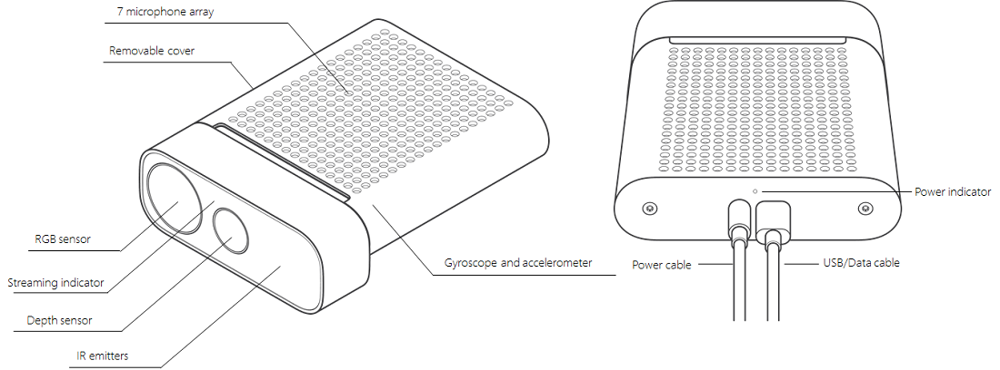

# Quickstart: Set up Azure Kinect DK

This quickstart provides guidance about how to set up your Azure Kinect hardware. We'll show you how to test sensor stream visualization and use the Azure Kinect Viewer.

If you don't have an Azure subscription, create a [free account](https://azure.microsoft.com/free/?WT.mc_id=A261C142F) before you begin.

## System requirements

Check [System requirements](system-requirements.md) to verify that your host PC configuration meets all Azure Kinect DK minimum requirements.

## Set up hardware

> [!NOTE]
> Make sure to remove the camera protective film before using the device.

1. Plug the power connector into the power jack on the back of your device. Connect the USB power adapter to the other end of the cable, and then plug it into a power outlet.
2. Connect the USB data cable into a your device, and then to a USB 3.0 port on your PC.
   >[!NOTE]
   >Use a direct cable from the PC to the back of the device, as this works better than connecting through adapters or extensions.

3. Verify the power indicator LED next to the USB cable is solid white.
4. Device power-on takes a few seconds. The device is ready to use when the front-facing LED streaming indicator turns off.

    

## Download the SDK

1. Select the link to [Download the SDK](sensor-sdk-download.md).
2. Install the SDK on your PC.

## Verify that the device streams data

1. Launch `k4aviewer.exe` located under the installed tools directory (for example `C:\Program Files\Azure Kinect SDK\tools\k4aviewer.exe`). You can launch it from either the command line or by double-clicking the executable. Azure Kinect Viewer is also available as a link in the start menu.
2. Select **Open Device**, then **Start**.

    

3. Verify each sensor stream is visualized in the tool.
    - Depth camera
    - Color camera
    - Infrared camera
    - IMU
    - Microphones

    

4. You're done with your Kinect setup.  Now you can start developing your application or integrating services.

If you have any issues, check [Troubleshooting](troubleshooting.md).

## See also

[Azure Kinect DK hardware information](hardware-specification.md)

[Update device firmware](azure-kinect-dk-update-device-firmware.md)

Learn more about [Kinect for Azure viewer](azure-kinect-sensor-viewer.md)

## Next steps

After the Azure Kinect device is ready and working, you can also learn how to
> [!div class="nextstepaction"]
>[Record sensor stream to a file](record-sensor-streams-file.md)
