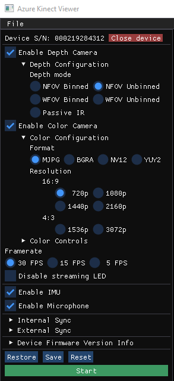
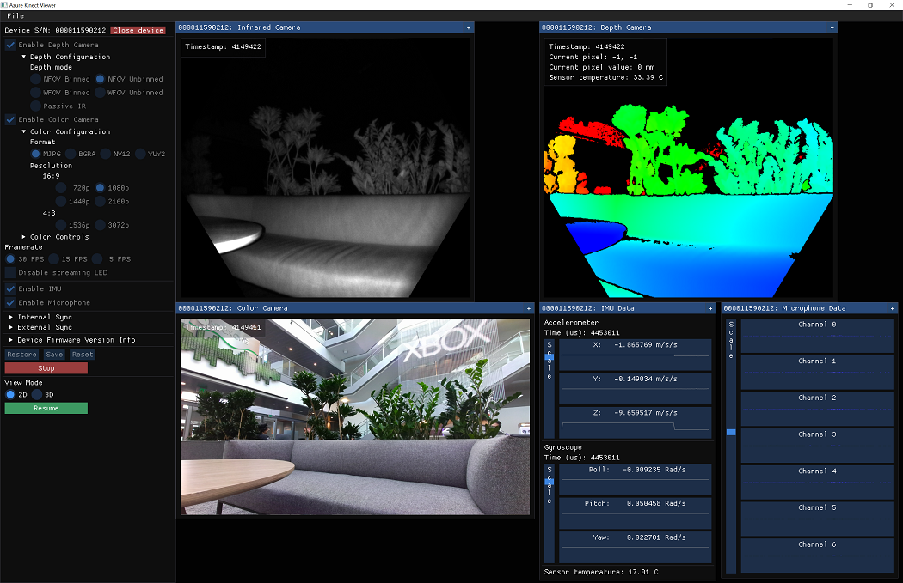
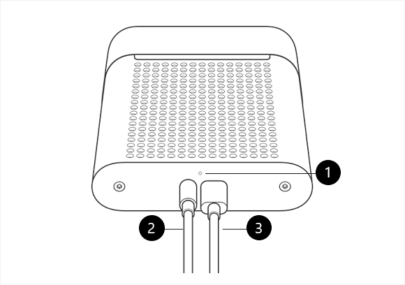

# Quickstart: Set up your Azure Kinect DK

This quickstart provides guidance about how to set up your Azure Kinect DK. We'll show you how to test sensor stream visualization and use the [Azure Kinect Viewer](azure-kinect-viewer.md).

If you don't have an Azure subscription, create a [free account](https://azure.microsoft.com/free/?WT.mc_id=A261C142F) before you begin.

## System requirements

Check [System requirements](system-requirements.md) to verify that your host PC configuration meets all Azure Kinect DK minimum requirements.

## Set up hardware

> [!NOTE]
> Make sure to remove the camera protective film before using the device.

1. Plug the power connector into the power jack on the back of your device. Connect the USB power adapter to the other end of the cable, and then plug the adapter into a power outlet.
2. Connect the USB data cable into your device, and then to a USB 3.0 port on your PC.
   >[!NOTE]
   >For best results, connect the cable directly to the device and to the PC. Avoid using extensions or extra adapters in the connection.

3. Verify that the power indicator LED (next to the USB cable) is solid white.
  
   Device power-on takes a few seconds. The device is ready to use when the front-facing LED streaming indicator turns off.  

   For more information about the power indicator LED, see [What does the light mean?](#what-does-the-light-mean)

    

## Download the SDK

1. Select the link to [Download the SDK](sensor-sdk-download.md).
2. Install the SDK on your PC.

## Update Firmware

To work properly, the SDK requires the latest version of the device firmware. To check and update your firmware version,follow the steps in [Update Azure Kinect DK firmware](update-device-firmware.md).

## Verify that the device streams data

1. Launch the [Azure Kinect Viewer](azure-kinect-viewer.md). You can start this tool by using one of these methods:
   - You can launch the viewer from the command line or by double-clicking the executable file. The file, `k4aviewer.exe`, resides in the SDK tools directory (for example, `C:\Program Files\Azure Kinect SDK vX.Y.Z\tools\k4aviewer.exe`, where `X.Y.Z` is the installed version of the SDK).
   - You can launch Azure Kinect Viewer from the device **Start** menu.
2. In Azure Kinect Viewer, select **Open Device** > **Start**.

    

3. Verify that the tool visualizes each sensor stream:
   - Depth camera
   - Color camera
   - Infrared camera
   - IMU
   - Microphones

    

You're done with your Azure Kinect DK setup. Now you can start developing your application or integrating services.

If you have any issues, check [Troubleshooting](troubleshooting.md).

## What does the light mean?

The power indicator is an LED on the back of your Azure Kinect DK. The color of the LED changes depending on the status of your device.

This figure labels the following components:

1. Power indicator
1. Power cable (connected to the power source)
1. USB-C data cable (connected to the PC)

Make sure that the cables are connected as shown. Then check the following table to learn what the various states of the power light indicate.

|When the light is: |It means that: |And you should: |
| ---| --- | --- |
|Solid white |The device is powered on and working correctly. |Use the device. |
|Not lit |The device is not connected to the PC. |Make sure that the round power connector cable is connected to the device and to the USB power adapter.  Make sure that the USB-C cable is connected to the device and to your PC. |
|Flashing white |The device is powered on but doesn't have a USB 3.0 data connection. |Make sure that the round power connector cable is connected to the device and to the USB power adapter.  Make sure that the USB-C cable is connected to the device and to a USB 3.0 port on your PC.  Connect the device to a different USB 3.0 port on the PC.  On your PC, open Device Manager (**Start** > **Control Panel** > **Device Manager**), and verify that your PC has a supported USB 3.0 host controller. |
|Flashing amber |The device doesn't have enough power to operate. |Make sure that the round power connector cable is connected to the device and to the USB power adapter.  Make sure that the USB-C cable is connected to the device and to your PC. |
|Amber, then flashing white |The device is powered on and is receiving a firmware update, or the device is restoring the factory settings. |Wait for the power indicator light to become solid white. For more information, see [Reset Azure Kinect DK](https://support.microsoft.com/help/4494277/reset-azure-kinect-dk). |

## See also

- [Azure Kinect DK hardware information](hardware-specification.md)
- [Update device firmware](update-device-firmware.md)
- Learn more about [Azure Kinect Viewer](azure-kinect-viewer.md)

## Next steps

After the Azure Kinect DK is ready and working, you can also learn how to
> [!div class="nextstepaction"]
> [Record sensor streams to a file](record-sensor-streams-file.md)
