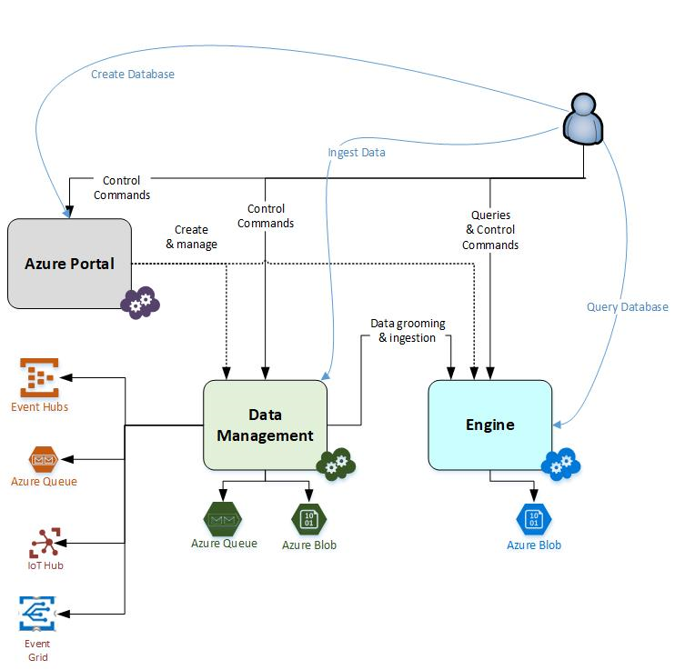

# Azure Kusto data ingestion

Data ingestion is the process used to load data records from one or more sources to create or update a table in Azure Kusto. Once ingested, the data becomes available for query. The diagram below shows the end-to-end flow for working in Kusto, including data ingestion.

The Kusto Data Management service, which is responsible for data ingestion, provides the following functionality:

- **Data pull** : Pull data from external sources (Event Hubs, IoT Hubs), or read ingestion requests from an Azure Queue.
- **Batching** : Batch data flowing to the same database and table to optimize ingestion throughput.
- **Validation** : Preliminary validation and format conversion if required.
- **Persistence point in the ingestion flow** : Manage ingestion load on the engine and handle retries upon transient failures.

> [!NOTE]
> Ingesting data requires **Table ingestor** or **Database ingestor** permissions

## Ingestion methods

Kusto supports several ingestion methods, each with its own target scenarios, advantages, and disadvantages. Kusto offers connectors to common services, programmatic ingestion using SDKs, and direct access to the engine for exploration purposes.

### Connectors

Kusto has connectors to the following messaging services, which can be managed using the Kusto Management wizard in the Azure portal.

- **Azure Event Hub**: Stream your data from Azure Event Hub.
- **Azure IoT Hub**: Stream your IoT Hub data directly to Kusto.
- **Azure Event Grid**: Configure blob creation notifications on a blob container to be delivered to Kusto, to trigger ingestion of new blobs.

### Programmatic ingestion​

Kusto provides SDKs that can be used both for query and data ingestion into Kusto.
Programmatic ingestion is optimized for reducing ingestion costs (COGs), by attempting to minimize storage transactions during and following the ingestion process.

**Client flow**:

1. Data is uploaded to an Azure blob.
2. An ingestion message pointing to the blob and describing how and where it needs to be ingested is posted to an Azure queue. The Kusto Data Management service listens on this queue.

**Service flow**:

1. An Ingestion message is dequeued from an Azure queue by the Kusto Data Management service.
2. The data (blob URI) is batched with similar messages for the same database and table.
3. Once a batch is _sealed_, an ingest command containing URIs of all the blobs in the batch is dispatched to the engine service, which downloads all the blobs and produces one or more data shards.

**Available SDKs and open source projects** :

- .NET @ Nuget.org: [Microsoft.Azure.Kusto.Data](https://www.nuget.org/packages/Microsoft.Azure.Kusto.Data/4.0.0-beta) and [Microsoft.Azure.Kusto.Ingest](https://www.nuget.org/packages/Microsoft.Azure.Kusto.Ingest/4.0.1-beta)
- [Python @ GitHub: azure-kusto-python](https://github.com/Azure/azure-kusto-python)
- Python @ PyPi: [azure-kusto-data](https://pypi.org/project/azure-kusto-data/) and [azure-kusto-ingest](https://pypi.org/project/azure-kusto-ingest/)
- [Java @ GitHub: azure-kusto-java](https://repos.opensource.microsoft.com/Azure/repos/azure-kusto-java)
- [Logstash Kusto plugin (uses Java SDK)](https://repos.opensource.microsoft.com/Azure/repos/logstash-output-kusto)
- [REST API](https://kusto.azurewebsites.net/docs/api/kusto-ingest-client-rest.html)

**Programmatic ingestion techniques** :

- Ingesting data directly into the Kusto Engine (most appropriate for exploration and prototyping):

  - **Inline ingestion**: control command (.ingest inline) containing in-band data is intended for ad-hoc testing purposes.

  - **Ingest from query**: control command (.set, .set-or-append, .set-or-replace) that points to query results is used for generating reports or small temporary tables.

  - **Ingest from storage** : control command (.ingest into) with data stored externally (e.g., Azure Blob Storage) allows efficient bulk ingestion of data.

- Ingesting data through the Kusto Data Management service (high-throughput and reliable ingestion)

  - [Queued ingestion](https://kusto.azurewebsites.net/docs/api/kusto-ingest-client-library.html#queued-ingestion) (provided by SDK): the client uploads the data to Azure Blob storage (designated by the Kusto Data Management service) and posts a notification to an Azure Queue. This is the recommended technique for high-volume, reliable, and cheap  data ingestion.

**Latency of different methods**:

| Method | Latency |
| --- | --- |
| **Inline ingestion** | Immediate |
| **Ingest from query** | Query time + processing time |
| **Ingest from storage** | Download time + processing time |
| **Queued ingestion** | Batching time + processing time |
| |

Processing time depends on the data size, usually less than a few seconds. Batching time defaults to 5 minutes.

## Choosing the most appropriate ingestion method

Before you start to ingest data, you should ask yourself the following questions.

- Where does my data reside? ​
- What is the data format, and can it be changed? ​
- What are the required fields to be queried? ​
- What is the expected data volume and velocity? ​
- How many event types are expected (reflected as the number of tables)? ​
- How often is the event schema expected to change? ​
- How many nodes will generate the data? ​
- What is the source OS? ​
- What are the latency requirements? ​
- Can one of the existing managed ingestion pipelines be used? ​

For organizations with an existing infrastructure based on a messaging service like Event Hub, using a connector is likely the most appropriate solution. Queued ingestion is appropriate for large data volumes.

## Supported data formats

For all ingestion methods other than ingest from query, the data must be formatted in one of the supported data formats so that Kusto can parse it.

- CSV, TSV, PSV, SCSV, SOH​
- JSON (line-separated, multiline), Avro​
- ZIP and GZIP archives are supported

When data is being ingested, data types are inferred based on the target table columns. If a record is incomplete or a field cannot be parsed as the required data type, the corresponding table columns will be populated with null values.

## Next steps

> [!div class="nextstepaction"]
> [What is Kusto?](https://docs.microsoft.com/azure)