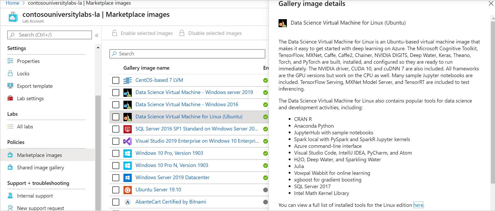
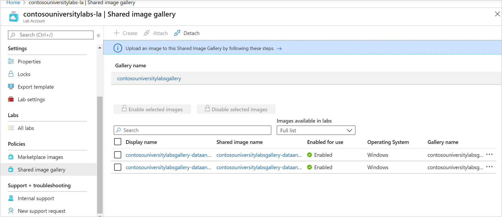

# Lab account setup guide
To start setting up your Azure Lab Services environment, administrators need to set up a **lab account** within your Azure subscription. A lab account is a container for your labs and only takes a few minutes to set up.

This guide includes two sections:
1.  The first section focuses on the prerequisites that need to be completed *before* you set up your lab account.  
1.  The second section provides step-by-step instructions for setting up a lab account.

## Prerequisites for setting up your lab account
This section outlines the prerequisites that you need to complete before you can set up a lab account.

### Obtain an Azure subscription
To create a lab account, you need access to an Azure subscription that is config set up for your school. Your school may have one or more subscriptions. You use a subscription to manage billing and security for all your Azure resources and services, including lab accounts.  Azure subscriptions are typically managed by your IT department.  For more information, read the following topic:
 - [Administrator Guide - Subscription](https://docs.microsoft.com/azure/lab-services/classroom-labs/administrator-guide#subscription)

### Estimate the number of VMs and VM sizes that you need
You will need to estimate the number of virtual machines (VMs) and the [VM sizes](https://docs.microsoft.com/azure/lab-services/administrator-guide#vm-sizing) that your school needs.  Refer to the following blog post for guidance on how to plan the structure of your labs\images which helps determine the number of VMs and the VM sizes that are needed:
- [Moving from a Physical Lab to Azure Lab Services](https://techcommunity.microsoft.com/t5/azure-lab-services/moving-from-a-physical-lab-to-azure-lab-services/ba-p/1654931)

Also, read this article that explains additional guidance on how to structure labs:
- [Administrator Guide - Lab](https://docs.microsoft.com/azure/lab-services/administrator-guide#classroom-lab)

### Understand subscription VM limits and regional VM capacity
Once you have an estimate of the number of VMs and the VM sizes for your labs, you need to:

- Ensure that your Azure subscription's capacity limit allows for the number of VMs and the VM size that you plan to use in your labs.

- Create your lab account within a region that has sufficient VM capacity available.

Read the following blog post to learn more: [VM Subscription Limits and Regional Capacity](TODO: Link to blog post when posted).

### Plan the configuration of your school's lab account

To plan your lab account's configuration, you should consider the below questions.

#### How many lab accounts need to be created?

To get started quickly, create a single lab account within its own resource group; later, you can create additional lab accounts (and resource groups) as needed. For example, you might eventually have one lab account and resource group per department as a way to to clearly separate costs.  To learn more about lab accounts, resource groups, and separating costs; read the following articles:
- [Administrator Guide - Resource Group](https://docs.microsoft.com/azure/lab-services/administrator-guide#resource-group)
- [Administrator Guide - Lab Account](https://docs.microsoft.com/azure/lab-services/administrator-guide#lab-account) 
- [Cost management for Azure Lab Services](https://docs.microsoft.com/azure/lab-services/cost-management-guide)

#### Who should be owners and contributors of the lab account?
Your school's IT administrators are typically the Owners and Contributors for a lab account. They are responsible for managing the policies that apply to all the labs contained within the lab account. The person that creates the lab account is automatically an Owner. You can add additional Owners and Contributors from the Azure Active Directory (AAD) tenant that is associated with your subscription. For more information about the lab account Owner and Contributor roles, read:
-  [Administrator Guide - Manage Identity](https://docs.microsoft.com/azure/lab-services/administrator-guide#manage-identity).

#### Who will be allowed to create labs?
You may choose to have your IT and faculty members create labs. When a user creates a lab, they automatically are assigned as the Owner of the lab.  To create labs, users (typically from the AAD tenant associated with your subscription) must be assigned to the Lab Creator role within the lab account.  For more information about the Lab Creator role, read:
- [Administrator Guide - Manage identity](https://docs.microsoft.com/azure/lab-services/administrator-guide#manage-identity)

#### Who will be allowed to own and manage labs?
You can also choose to have IT and faculty members own\manage labs *without* giving them the ability to create labs.  In this case, users from your subscription's AAD tenant are assigned either the Owner or Contributor for existing labs.  For more information about a lab's Owner and Contributor roles, read:
- [Administrator Guide - Manage identity](https://docs.microsoft.com/azure/lab-services/administrator-guide#manage-identity)

#### Do you want to save images that can be shared across labs?
A Shared Image Gallery is a repository that you can use for saving and sharing images. If you have several classes that need the same image, lab creators can create the image and then export it to Shared Image Gallery.  Once an images is exported to Shared Image Gallery, it can be used to create new labs.

Also, you may want to create your images in your physical environment and then import them into Shared Image Gallery.  For more details on this, read the following blog post: 
- [Import Custom Image to Shared Image Gallery](https://techcommunity.microsoft.com/t5/azure-lab-services/import-custom-image-to-shared-image-gallery/ba-p/1777353)

If you decide you need to use a Shared Image Gallery, you will need to create or attach a Shared Image Gallery to your lab account. Also, you can postpone this decision until later since it can be attached to a lab account at any time.  For more information about Shared Image Gallery, read:
- [Adminstrator Guide - Shared image gallery](https://docs.microsoft.com/azure/lab-services/administrator-guide#shared-image-gallery)
- [Administrator Guide - Shared image gallery pricing](https://docs.microsoft.com/azure/lab-services/administrator-guide#shared-image-gallery-2)

#### Which images in Azure Marketplace will your labs use?
Azure Marketplace provides hundreds of images that you can enable so that lab creators can use the image for creating their lab. Some images might include everything that a lab already needs. In other cases, you might use an image as a starting point, and then the lab creator can customize it by installing additional applications or tools.

If you don't know which images you will need to use, you can always come back later to enable them. Also, the best way to see which images are available is to first create a lab account. This gives you access so that you can review the list of available images and their contents.  For more information about marketplace images, read:
- [Specify Marketplace images avialable to lab creators](https://docs.microsoft.com/azure/lab-services/specify-marketplace-images)
  
#### Do the lab's VMs need to have access to other Azure or on-premises resources?
When you set up a lab account, you also have the option to peer your lab account with a virtual network (VNet).  Keep in mind that both your VNet and lab account must be located in the same region.  To decide whether you need to peer with a VNet, consider the following scenarios:

- **Access to a licensing server**
  
   When you use Azure Marketplace images, the cost of the operating system license is bundled into the pricing for lab services. Therefore, you don't need to provide licenses for the operating system itself. However, for additional software and applications that are installed, you do need to provide a license as appropriate.  To access a licensing server:
   - You may choose to connect to an on-premise licensing server which requires additional setup (see the next bullet about accessing on-premise resources).
   - Another option which is usually faster to set up, is to create a licensing server that is hosted on an Azure VM within a virtual network that is peered to your lab account.

- **Access to other on-premise resources such as a file share or database**

   You create a VNet to provide access to on-premises resources, typically by using a site-to-site virtual network gateway. If you don't have this currently set up, you will need to invest additional time for this.

- **Access to other Azure resources that are located within a VNet**

   If you need access to Azure resources that are *not* secured within a VNet, then you can access these resources through the public internet, without doing any peering.

It's important to note can choose to peer a VNet after you have created a lab account.

For more information on virtual networks, read:
- [Architecture fundamentals - Virtual Network](https://docs.microsoft.com/azure/lab-services/classroom-labs-fundamentals#virtual-network)
- [How to create a lab with a shared resource in Azure Lab Services](https://docs.microsoft.com/azure/lab-services/how-to-create-a-lab-with-shared-resource)

## Set up your lab account

After you've finished planning, you're ready to set up your lab account.  Note that these same steps are applicable for setting up a lab [Azure Lab Services with Teams](https://docs.microsoft.com/azure/lab-services/lab-services-within-teams-overview).

1. **Create your lab account.** Refer to the tutorial on [creating a lab account](https://docs.microsoft.com/azure/lab-services/classroom-labs/tutorial-setup-lab-account#create-a-lab-account) for instructions.
   
    For additional guidance on naming, refer to the following article:

   - [Naming guidance for resources](https://docs.microsoft.com/azure/lab-services/classroom-labs/administrator-guide#naming)

2. **Add users to the lab creator role.** For instructions, see [adding users to the lab creator role](https://docs.microsoft.com/azure/lab-services/classroom-labs/tutorial-setup-lab-account#add-a-user-to-the-lab-creator-role).

3. **Connect to a peer virtual network.** For instructions, see [connecting your lab's network with a peer virtual network](https://docs.microsoft.com/azure/lab-services/classroom-labs/how-to-connect-peer-virtual-network).

   You might also need to refer to instructions on [configuring the lab VMs address range](https://docs.microsoft.com/azure/lab-services/classroom-labs/how-to-configure-lab-accounts#specify-an-address-range-for-vms-in-the-lab).

4. **Enable and review images.** For instructions, see [enabling Azure Marketplace images for lab creators](https://docs.microsoft.com/azure/lab-services/classroom-labs/specify-marketplace-images).

   To review the contents of each Azure Marketplace image, select the image name. For example, the following screenshot shows the details for the Ubuntu Data Science VM image:

   

   If you have a shared image gallery attached to your lab account, and you want to enable custom images to be shared by lab creators, complete steps similar to those shown in the following screenshot:

   

## Next steps

Next steps that are common to setting up a lab environment:

- [Manage lab accounts](how-to-manage-lab-accounts.md)
- [Lab setup guide](setup-guide.md)
