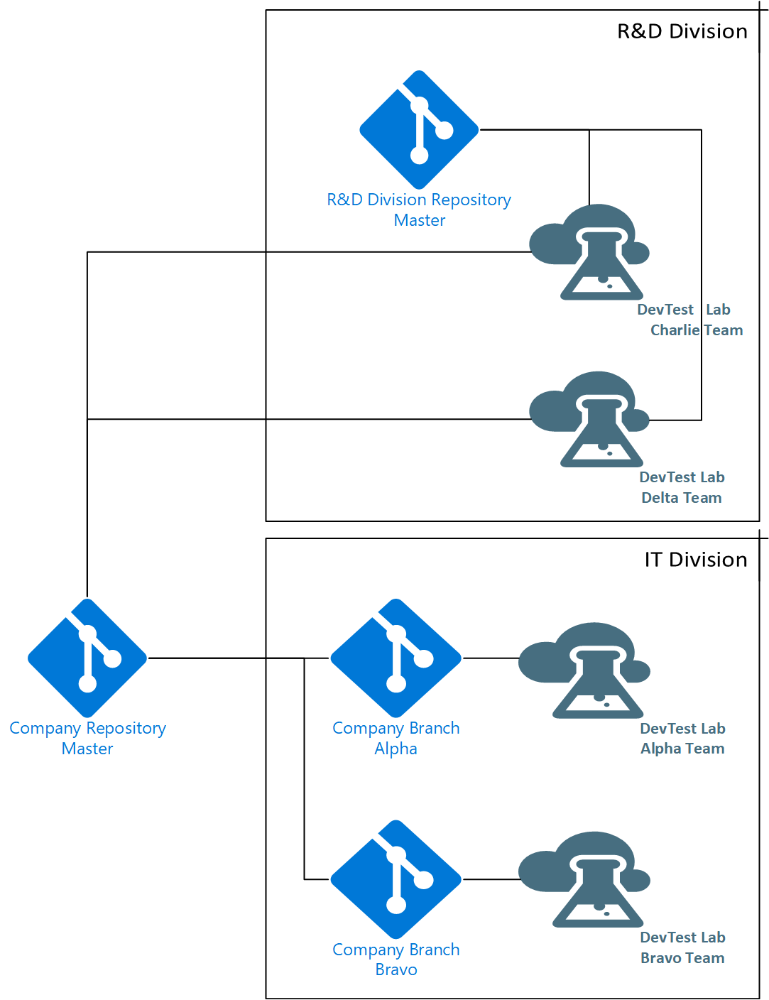

# Best practices for distributed and collaborative development of Azure DevTest Labs resources
Distributed collaborative development allows different teams or people to develop and maintain a code base. To be successful, the development process depends on the ability to create, share, and integrate information. This key development principle can be used within Azure DevTest Labs. There are several types of resources within a lab that are commonly distributed between different labs within an enterprise. The different types of resources are focused into two areas:

- Resources that are internally stored within the lab (lab-based)
- Resources that are stored in [external repositories that are connected to the lab](devtest-lab-add-artifact-repo.md) (code repository-based). 

This document describes some best practices that allow collaboration and distribution across multiple teams while ensuring customization and quality at all levels.

## Lab-based resources

### Custom virtual machine images
You can have a common source of custom images that are deployed to labs on a nightly basis. For detailed information, see [Image factory](image-factory-create.md).    

### Formulas
[Formulas](devtest-lab-manage-formulas.md) are lab-specific and don't have a distribution mechanism. The lab members do all the development of formulas. 

### Code repository-based
There are two different features that are based on code repositories, artifacts and environments. This article goes over the features and how to most effectively set up repositories and workflow to allow the ability to customize the available artifacts and environments at the organization level or team level.  This workflow is based on standard [source code control branching strategy](/devops/repos/tfvc/branching-strategies-with-tfvc?view=azure-devops). 

### Key concepts
For the artifacts, the source information includes metadata, scripts. For the environments, the metadata and the Resource Manager templates with any supporting files like PowerShell scripts, DSC scripts, Zip files, and so on.  

### Repository structure  
The most common configuration for source code control (SCC) is to set up a multi-tier structure for storing code files (Resource Manager templates, metadata, and scripts) that are used to in the labs. Specifically, create different repositories to store resources that are managed by the different levels of the business:   

- Company-wide resources.
- Business unit/Division-wide resources
- Team-specific resources.

Each of these levels link to a different  repository where the master branch is required to be of the production quality. The [branches]((/devops/repos/git/git-branching-guidance?view=azure-devops)) in each repository would be for development of those specific resources (artifacts or templates). This structure aligns well with DevTest Labs as you can easily connect multiple repositories and multiple branches at the same time to the organization’s labs. The repository name is included in the user interface (UI) to avoid confusion when there are identical names, description, and publisher.
     
The following diagram shows two repositories: a company repository that is maintained by the IT Division, and a division repository maintained by the R&D division.

   
This layered structure allows for development while keeping a higher level of quality at the master branch while having multiple repositories connected to a lab allows for greater flexibility.

## Next steps    
See the following articles:

- Add a repository to a lab using either the [Azure portal](devtest-lab-add-artifact-repo.md) or via [Azure Resource Management template](add-artifact-repository.md)
- [DevTest Labs artifacts](devtest-lab-artifact-author.md)
- [DevTest Labs environments](devtest-lab-create-environment-from-arm.md).
 

