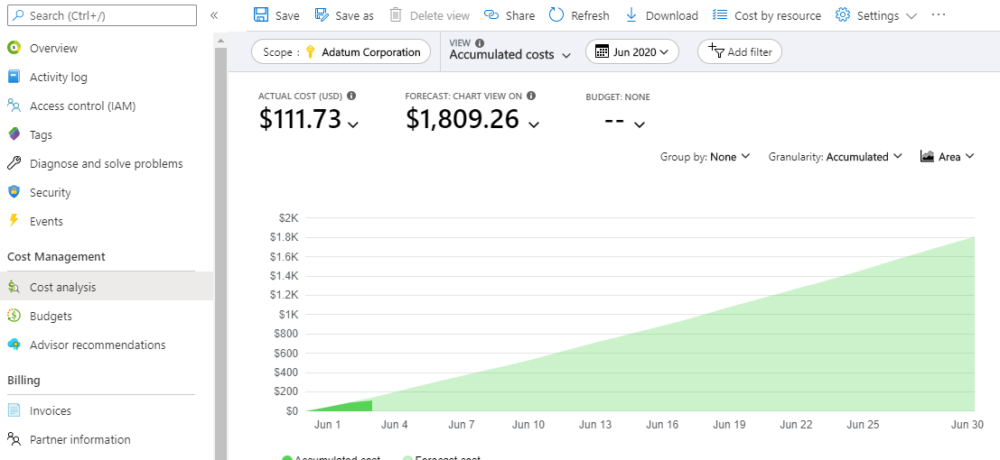

# Cost Management for Azure Lab Services

Cost management can be broken down into two distinct areas, cost estimation and cost analysis.  Cost estimation occurs when setting up the lab to make sure that initial structure of the lab will fit within the expected budget.  Cost analysis usually occurs at the end of the month, to analyze the costs and determine the necessary actions for the next month.

# Estimating the lab costs

Each lab dashboard has a Costs & Billing section that lays out a rough estimate of what the lab will cost for the month.  The cost estimate summarizes the hour usage with the maximum number of users by the estimated cost per hours.  This estimate may not be all the possible costs, there are a few resources that are not included.  The template cost is not factored into the cost estimate as it may vary significantly, but the template cost is the same as overall lab cost per hour for manual estimation. Any Shared image gallery costs are not included into the lab dashboard as a gallery may be shared between multiple labs.  Lastly hours incurred when the lab creator starts a machine are excluded.

> [!div class="mx-imgBorder"]
> 

# Analyzing previous months usage

The cost analysis is for reviewing previous months usage to help determine any adjustments for the lab.  The breakdown of costs in the past can be found in the Subscription Cost Analysis.  In the Azure Portal, one can type "Subscriptions" in the upper search field then select the Subscriptions option.  

> [!div class="mx-imgBorder"]
> 

Select the specific subscription that is to be reviewed.

> [!div class="mx-imgBorder"]
> 

 Select "Cost Analysis" in the left hand pane under "Cost Management".

 > [!div class="mx-imgBorder"]
> 

This dashboard will allow in-depth cost analysis, including the ability to export to different file types on a schedule.  The Cost Management has numerous capabilities for more information see > 

Filtering by the resource type: microsoft.labservices/labaccounts will show only the cost associated with Lab services.

# Understanding the usage

Below is a sample of the cost analysis 

 > [!div class="mx-imgBorder"]
> 

There are six columns: Resource, Resource Type, Location, Resource group name, Tags, Cost.  The Resource column contains the information about the Lab account, Lab Name, and the VM.  The rows with Lab account / Lab Name / default is the overall cost for the lab, excluding any VMs started by the Lab owner, which can be seen on the second and third rows.  The VMs started by the Lab owner will have a cost under the Lab account / Lab Name / default / VM name.  In this example summing the first row with second row, both starting with "aaalab / dockerlab" will give you the total cost for the different labs.  The other individual VMs are rolled into the overall lab cost and show a cost of zero.  The Tags column can be useful as a place to add additional data to the specific lab, like cost centers.  

 To get Shared image gallery information, change the resource type to XXXXX which will give you the overall cost for the image gallery which can then be equally divided by the number of labs connected to the Image gallery.