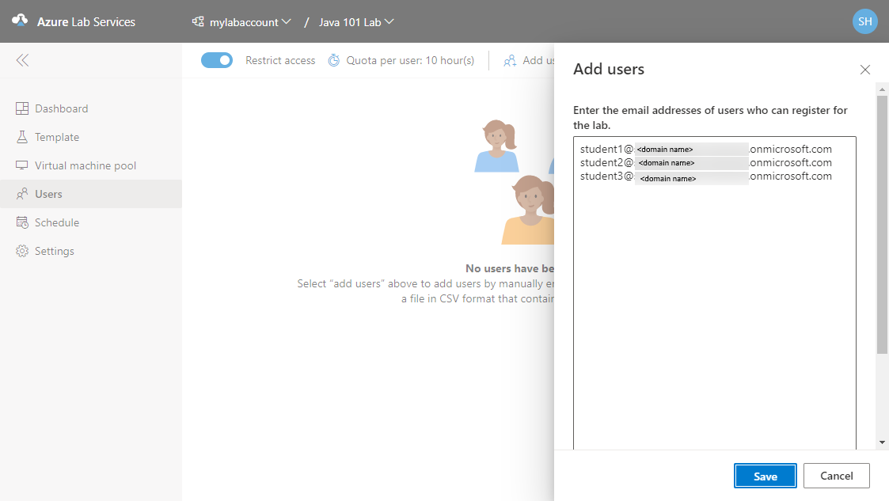
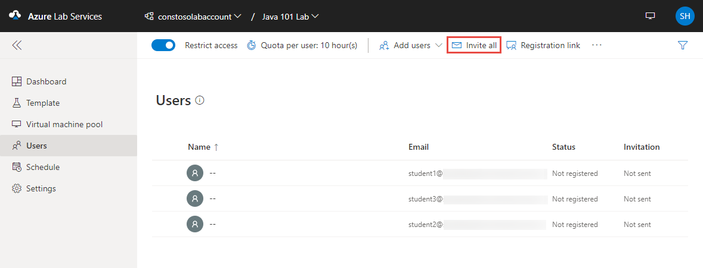
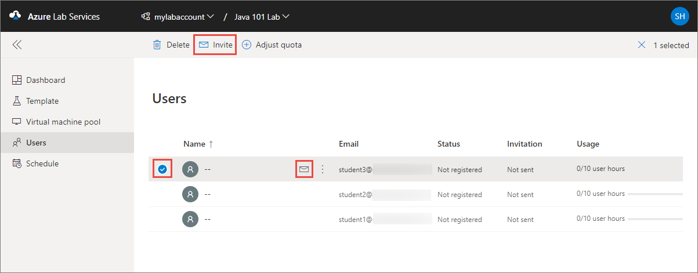
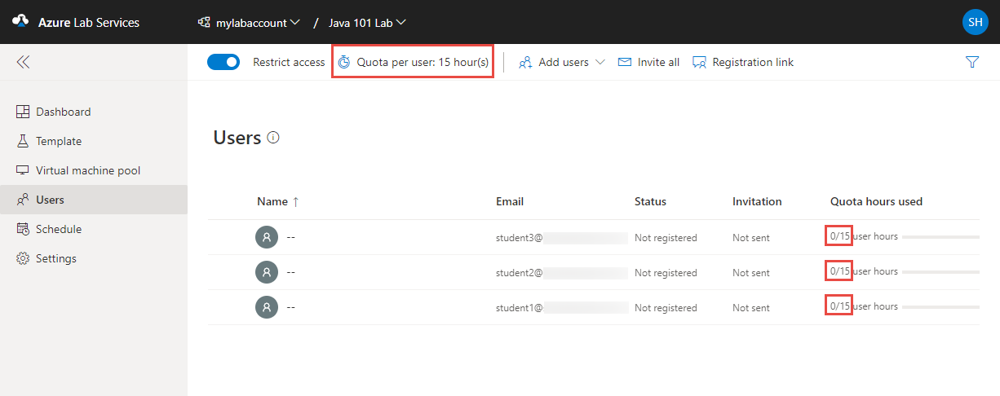
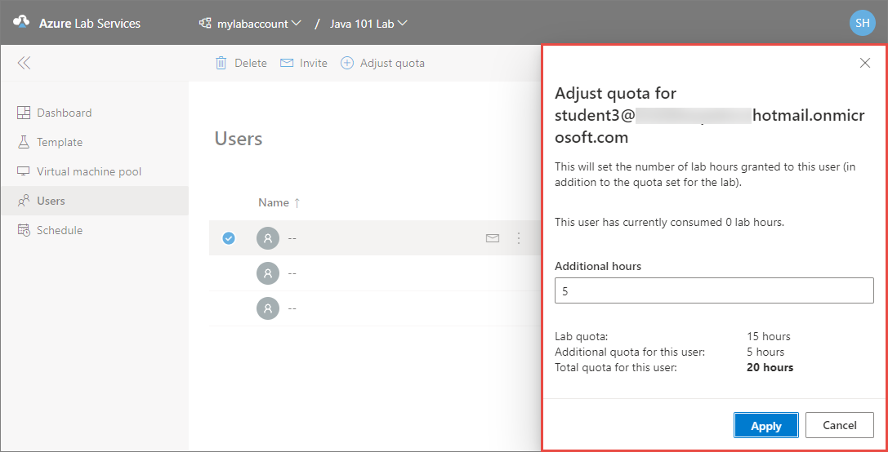
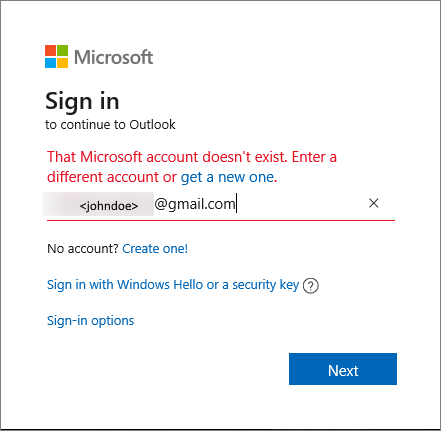

# Add and manage lab users
This article describes how to add users to the lab, get them registered with the lab, control the number of hours they can use the VM, and more. 

## Add users to the lab

1. Select **Users** on the left menu. By default, the **Restrict access** option is enabled. When this setting is on, a user can't register with the lab even if the user has the registration link unless the user is in the list of users. Only users in the list can register with the lab by using the registration link you send. In this procedure, you add users to the list. Alternatively, you can turn off **Restrict access**, which allows users to register with the lab as long as they have the registration link. 
2. Select **Add users** on the toolbar, and then select **Add by email addresses**. 

    
1. On the **Add users** page, enter email addresses of users in separate lines or in a single line separated by semicolons. 

    
4. Select **Save**. You see the email addresses of users and their statuses (registered or not) in the list. 

    

    > [!NOTE]
    > You will see names of users in the list after they are registered to the lab. The name shown in the list is constructed by using first and last names of the user in the Azure Active Directory. 

### Add users by uploading a CSV file
You can also add users by uploading a CSV file with email addresses of users.

1. Create a CSV file with email addresses of users in one column.

    
2. On the **Users** page of the lab, select **Add users** on the toolbar, and then select **Upload CSV**.

    
3. Select the CSV file with user email addresses. When you select **Open** after selecting the CSV file, you see the following **Add users** window. The email address list is filled with email addresses from the CSV file. 

    
4. Select **Save** in the **Add users** window. 
5. Confirm that you see users in the list of users. 

    

## Send invitations to users
To send the registration link to students, use one of the following methods. The first method shows you how to send emails to students with the registration link and an optional message. The second method shows you how to get the registration link that you can share with others any way you want. 

If the **Restrict access** is enabled for the lab, only users in the list of users can use the registration link to register to the lab. This option is enabled by default. 

### Invite all users
1. Switch to the **Users** view if you are not on the page already, and select **Invite all** on the toolbar. 

    

1. On the **Send invitation by email** page, enter an optional message, and then select **Send**. The email automatically includes the registration link. You can get this registration link by selecting **... (ellipsis)** on the toolbar, and **Registration link**. 

    
4. You see the status of **invitation** in the **Users** list. The status should change to **Sending** and then to **Sent on \<date>**. 

    For more information about adding students to a class and managing their usage of the lab, see [How to configure student usage](how-to-configure-student-usage.md).

### Invite selected users

1. Select a user or multiple users in the list. 
2. Then, select **envelope** icon you see in the selected row (or) select **Invite** on the toolbar. 

    
3. In the **Send invitation by email** window, enter an optional **message**, and then select **Send**. 

    

    You see the status of this operation in the **Invitation** column of the **Users** list. The invitation email includes the registration link that users can use to register with the lab.

1. Switch to the **Users** view if you aren't on the page already. 

## Get registration link
You can also get the registration link from the portal and send it using your own email client application. 

1. Switch to the **Users** view by selecting **Users** on the left menu. 
2. Select **...(ellipsis)** on the toolbar, and then select **Registration link**.

    
1. On the **User registration** dialog box, select the **Copy** button. The link is copied to the clipboard. Paste it in an email editor, and send an email to the student. 

    
2. On the **User registration** dialog box, select **Done**. 
4. Send the **registration link** to a student so that the student can register for the class. 

## View registered users

1. Navigate to [Azure Lab Services website](https://labs.azure.com). 
2. Select **Sign in** and enter your credentials. Azure Lab Services supports organizational accounts and Microsoft accounts.
3. On the **My labs** page, select the lab for which you want to track the usage. 
4. Select **Users** on the left menu or **Users** tile. You see students who have registered with your lab.  

    

## Set quotas for users
You can set quotas per user by using the following steps: 

1. Select **Users** on the left menu if the page isn't already active. 
2. Select **Quota per user: \<number> hours** on the toolbar. 
3. On the **Quota per user** page, specify the number of hours you want to give to each user (student) outside the scheduled class time, and then select **Save**.

        
5. You see the changed values on the toolbar now: **Quota per user: \<number of hours>** and also in the users list.

    

    > [!IMPORTANT]
    > The [scheduled running time of VMs](how-to-create-schedules.md) does not count against the quota allotted to a user. The quota is for the time outside of schedule hours that a student spends on VMs. 

## Set additional quota for a specific user
You can specify additional quota for a user. This quota is in addition to the common quota set for all users in the previous section. For example, if you (as an instructor) set the quota for all users to 10 hours and set additional quota of 5 hours for a specific users, that users gets 15 (10 + 5) hours of quota. If you change the common quota later to, say, 15, then the user gets 20 (15 + 5) hours of quota. Remember that this overall quota is in outside the scheduled time. The time that student spends on a lab VM during the schedule time does not count against this quota. 

To do so, follow these steps:

1. Select a user(student) from the list of users on the **Users** page.
2. Then, select **Adjust quota** from the toolbar. 

    
3. Enter the number of **additional hours** for the selected user or users, and then select **Apply**. 

    
4. You see the updated usage for the user in the **Usage** column. 

    

## Student accounts
To add students to a classroom lab, you use their email accounts. The following types of email accounts might be used:

- A student email account that's provided by your university's Office 365 Azure Active Directory (AAD). 
- A Microsoft email account, such as `@outlook.com`, `@hotmail.com`, `@msn.com`, or `@live.com`.
- A non-Microsoft email account, such as one provided by Yahoo or Google. However, these types of accounts must be linked with a Microsoft account.
- A GitHub account. This account must be linked with a Microsoft account.

### Using a non-Microsoft email account
Students can use non-Microsoft email accounts to register and sign in to a classroom lab.  However, the registration requires that students first create a Microsoft account that's linked to their non-Microsoft email address.

Many students might already have a Microsoft account linked to their non-Microsoft email addresses. For example, students already have a Microsoft account if they have used their email address with Microsoft's other products or services, such as Office, Skype, OneDrive, or Windows.  

When a student clicks on the registration URL to sign in to a classroom, they are prompted for their email address and password. If the student attempts to sign in with a non-Microsoft account that does not have a Microsoft account linked, the student will receive the following error message: 

To sign up for a Microsoft account, students should go to [http://signup.live.com](http://signup.live.com).  

> [!IMPORTANT]
> When students sign in to a classroom lab, they are not given the option to create a Microsoft account. So, we recommend that you include this sign-up link in the classroom lab registration email that you send to students who are using non-Microsoft accounts.

### Using a GitHub account
Students can also use an existing GitHub account to register and sign in to a classroom lab. If the student already has a Microsoft account linked to their GitHub account, then they can sign in and provide their password as shown in the previous section. If they have not yet linked their GitHub account to a Microsoft account, they should select **Sign-in options**:

On the **Sign-in options** page, select **Sign in with GitHub**.

Finally, they are prompted to create a Microsoft account that's linked to their GitHub account. It happens automatically when the student selects **Next**.  The student is then immediately signed in and connected to the classroom lab.

## Export list of users to a CSV file

1. Switch to the **Users** tab.
2. Select **...** (ellipsis) on the toolbar and then select **Export CSV**. 

    

## Next steps
See the following articles:

- [As an admin, create and manage lab accounts](how-to-manage-lab-accounts.md)
- [As a lab owner, create and manage labs](how-to-manage-classroom-labs.md)
- [As a lab owner, set up and publish templates](how-to-create-manage-template.md)
- [As a lab user, access classroom labs](how-to-use-classroom-lab.md)
