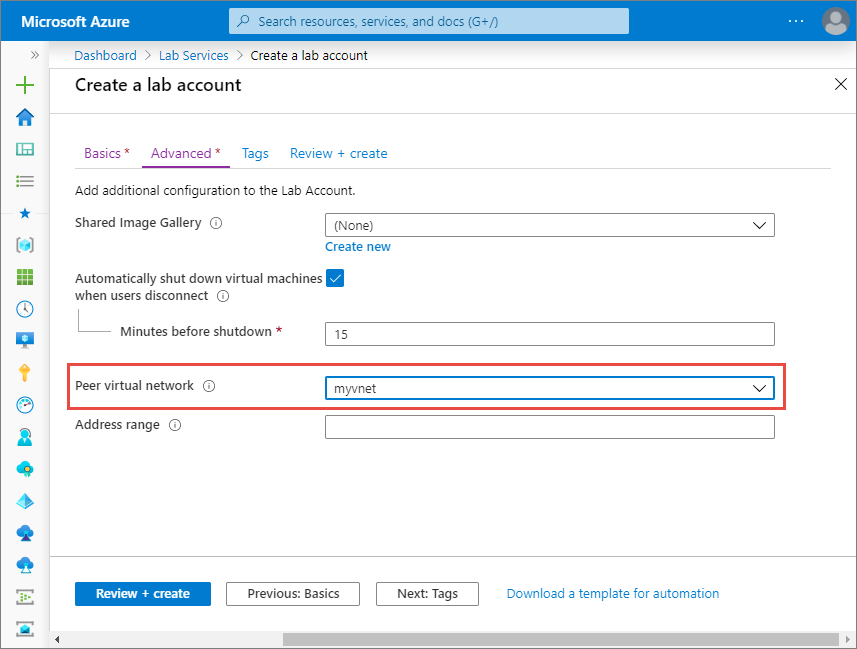
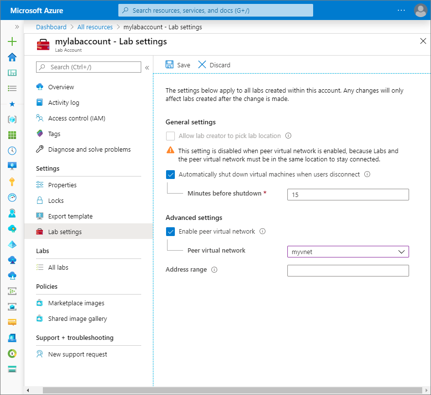

# Connect your lab's network with a peer virtual network in Azure Lab Services 
This article provides information about peering your labs network with another network. 

## Overview
Virtual network peering enables you to seamlessly connect Azure virtual networks. Once peered, the virtual networks appear as one, for connectivity purposes. The traffic between virtual machines in the peered virtual networks is routed through the Microsoft backbone infrastructure, much like traffic is routed between virtual machines in the same virtual network, through private IP addresses only. For more information, see [Virtual network peering](../../virtual-network/virtual-network-peering-overview.md).

You may need to connect your lab's network with a peer virtual network in some scenarios including the following ones:

- The virtual machines in the lab have software that connects to on-premises license servers to acquire license
- The virtual machines in the lab need access to data sets (or any other files) on university's network shares. 

Certain on-premises networks are connected to Azure Virtual Network either through [ExpressRoute](../../expressroute/expressroute-introduction.md) or [Virtual Network Gateway](../../vpn-gateway/vpn-gateway-about-vpngateways.md). These services must be set up outside of Azure Lab Services. To learn more about connecting an on-premises network to Azure using ExpressRoute, see [ExpressRoute overview])(../expressroute/expressroute-introduction.md). For on-premises connectivity using a Virtual Network Gateway, the gateway, specified virtual network, and the lab account must all be in the same region.

## Configure at the time lab account creation
During the new lab account creation, you can pick an existing virtual network that shows in the **Peer virtual network** dropdown list. The selected virtual network is connected(peered) to labs created under the lab account. All the virtual machines in labs that are created after the making this change would have access to the resources on the peered virtual network. 

> [!NOTE]
> For detailed step-by-step instructions for creating a lab account, see [Set up a lab account](tutorial-setup-lab-account.md)

## Configure after the lab is created
The same property can be enabled from the **Labs configuration** tab of the **Lab Account** page if you didn't set up a peer network at the time of lab account creation. Change made to this setting applies only to the labs that are created after the change.

 

As you can see in the image, you can enable or disable **Peer virtual network** for labs in the lab account. 

> [!IMPORTANT]
> This setting change applies only to labs that are created after the change is made, not to the existing labs. 

## Next steps
See the following articles:

- [As a lab owner, set up and publish templates](how-to-create-manage-template.md)
- [As a lab owner, configure and control usage of a lab](how-to-configure-student-usage.md)
- [As a lab user, access classroom labs](how-to-use-classroom-lab.md)

