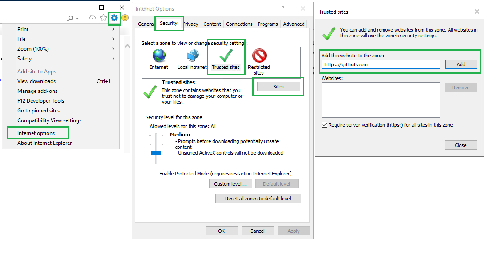

# Enable nested virtualization on a template virtual machine in Azure Lab Services using a script

Nested virtualization enables you to create a multi-VM environment inside a lab's template virtual machine. Publishing the template will provide each user in the lab with a virtual machine set up with multiple VMs within it.  For more information about nested virtualization and Azure Lab Services, see [Enable nested virtualization on a template virtual machine in Azure Lab Services](how-to-enable-nested-virtualization-template-vm.md).

The steps in this article focus on setting up nested virtualization for Windows Server 2016 or Windows Server 2019. You will use a script to set up template machine with Hyper-V.  The following steps will guide you through how to use the [Lab Services Hyper-V scripts](https://github.com/Azure/azure-devtestlab/tree/master/samples/ClassroomLabs/Scripts/HyperV).

>[!IMPORTANT]
>Select **Large (nested virtualization)** or **Medium (nested virtualization)** for the virtual machine size when creating the lab.  Nested virtualization will not work otherwise.  

1. If you're using Internet Explorer, you may have to add `https://github.com` to the trusted sites list.
    1. Open Internet Explorer.
    1. Select the gear icon, and choose **Internet options**.  
    1. When the **Internet Options** dialog appears, select **Security**, select **Trusted Sites**, click **Sites** button.
    1. When the **Trusted sites** dialog appears, add `https://github.com` to the trusted websites list, and select **Close**.

        
1. Download the Git repository files as outlined in the following steps.
    1. Go to  [https://github.com/Azure/azure-devtestlab/](https://github.com/Azure/azure-devtestlab/).
    1. Click the **Clone or Download** button.
    1. Click **Download ZIP**.
    1. Extract the ZIP file

    >[!TIP]
    >You can also clone the Git repository at [https://github.com/Azure/azure-devtestlab.git](https://github.com/Azure/azure-devtestlab.git).

1. Launch **PowerShell** in **Administrator** mode.
1. In the PowerShell window, navigate to the folder with the downloaded script. If you're navigating from the top folder of the repository files, the script is located at `azure-devtestlab\samples\ClassroomLabs\Scripts\HyperV\`.
1. You may have to change the execution policy to successfully run the script. Run the following command:

    ```powershell
    Set-ExecutionPolicy bypass -force
    ```

1. Run the script:

    ```powershell
    .\SetupForNestedVirtualization.ps1
    ```

    > [!NOTE]
    > The script may require the machine to be restarted. Follow instructions from the script and re-run the script until **Script completed** is seen in the output.
1. Don't forget to reset the execution policy. Run the following command:

    ```powershell
    Set-ExecutionPolicy default -force
    ```

## Conclusion

Now your template machine is ready to create Hyper-V virtual machines. See [Create a Virtual Machine in Hyper-V](/windows-server/virtualization/hyper-v/get-started/create-a-virtual-machine-in-hyper-v) for instructions on how to create Hyper-V virtual machines. Also, see [Microsoft Evaluation Center](https://www.microsoft.com/evalcenter/) to check out available operating systems and software.  
