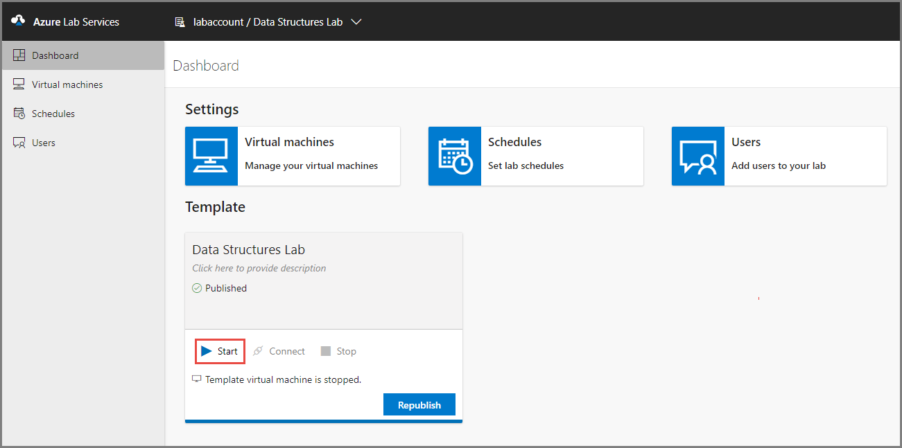
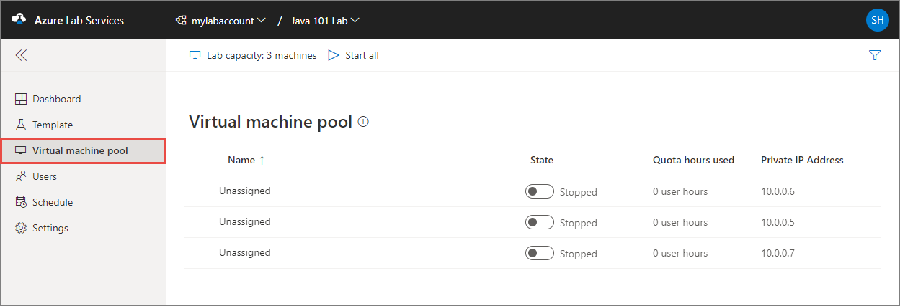

# Manage classroom labs in Azure Lab Services 
This article describes how to create and configure a classroom lab, view all classroom labs, or delete a classroom lab.

## Prerequisites
To set up a classroom lab in a lab account, you must be a member of the **Lab Creator** role in the lab account. A lab owner can add a user to the Lab Creator role by using steps in the following article: [Add a user to the Lab Creator role](tutorial-setup-lab-account.md#add-a-user-to-the-lab-creator-role).

## Create a classroom lab

1. Navigate to [Azure Lab Services website](https://labs.azure.com).
2. In the **New Lab** window, do the following actions: 
    1. Specify a **name** for the classroom lab. 
    2. Select the **size** of the virtual machine that you plan to use in the classroom.
    3. Select the **image** to use to create the virtual machine.
    4. Specify the **default credentials** to use for logging into the virtual machines in the lab.
    7. Select **Save**.

        
1. You see the **home page** for the lab. 
    
    

## Configure usage policy

1. Select **Usage policy**. 
2. In the **Usage policy**, settings, enter the **number of users** allowed to use the lab.
3. Select **Save**. 

    

## Set up the template
A template in a lab is a base virtual machine image from which all users’ virtual machines are created. Set up the template virtual machine so that it is configured with exactly what you want to provide to the lab users. You can provide a name and description of the template that the lab users see. Set the visibility of the template to public to make instances of the template VM available to your lab users.  

### Set template title and description
1. In the **Template** section, select **Edit** (pencil icon) for the template. 
2. In the **User view** window, Enter a **title** for the template.
3. Enter **description** for the template.
4. Select **Save**.

    

### Set up the template VM
 You connect to the template VM and install any required software on it before making it available to your students. 

1. Wait until the template virtual machine is ready. Once it is ready, the **Start** button should be enabled. To start the VM, select **Start**.

    
1. To connect to the VM, select **Connect**, and follow instructions. 

    
1. Install any software that's required for students to do the lab (for example, Visual Studio, Azure Storage Explorer, etc.). 
2. Disconnect (close your remote desktop session) from the template VM. 
3. **Stop** the template VM by selecting **Stop**. 

    

### Publish the template 
To publish a template VM, you set the availability of the template to **public**. When you do so, Azure Lab Services creates VMs in the lab by using the template. The number of VMs created in this process is same as the maximum number of users allowed into the lab, which you can set in the usage policy of the lab. All virtual machines have the same configuration as the template. 

1. Wait until the template VM is ready. 
2. Select **Publish** in the **Template** section. 
3. In the **Publish** page, select **Published**.
    
    > [!IMPORTANT]
    > Once a template is publicly available, its access can't be changed to private. 
4. Select **Publish**. This process may take some time depending on how many VMs are being created, which is same as the number of users allowed into the lab.  

    
4. Switch to the **Virtual machines** page, and confirm that you see five virtual machines that are in **Unassigned** state. These VMs are not assigned to students yet. 

    
5. Wait until the VMs are created. They should be in **Stopped** state. You can start a student VM, connect to the VM, stop the VM, and delete the VM on this page. You can start them in this page or let your students start the VMs. 

    

## Send registration link to students

1. Switch to the **Dashboard** view. 
2. Select **User registration** tile.

    
1. In the **User registration** dialog box, select the **Copy** button. The link is copied to the clipboard. Paste it in an email editor, and send an email to the student. 

    
2. On the **User registration** dialog box, select **Close**. 

## View all classroom labs
1. Navigate to [Azure Lab Services portal](https://labs.azure.com).
2. Confirm that you see all the labs in the selected lab account. 

    
3. Use the drop-down list at the top to select a different lab account. You see labs in the selected lab account. 

## Delete a classroom lab
1. On the tile for the lab, select three dots (...) in the corner. 

    
2. Select **Delete**. 

    
3. On the **Delete lab** dialog box, select **Delete**. 

    
 
## Manage student VMs
Once students register with Azure Lab Services using the registration link you provided to them, you see the VMs assigned to students on the **Virtual machines** tab. 

You can do the following tasks on a student VM: 

- Stop a VM if the VM is running. 
- Start a VM if the VM is stopped. 
- Connect to the VM. 
- Delete the VM. 

## Next steps
Get started with setting up a lab using Azure Lab Services:

- [Set up a classroom lab](how-to-manage-classroom-labs.md)
- [Set up a lab](../tutorial-create-custom-lab.md)
