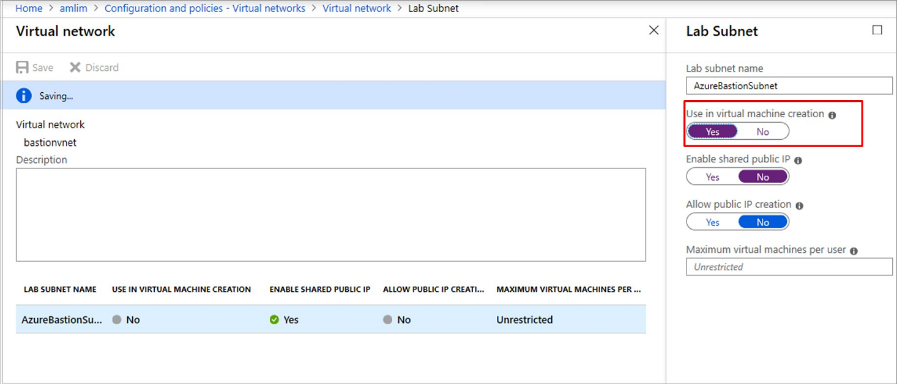
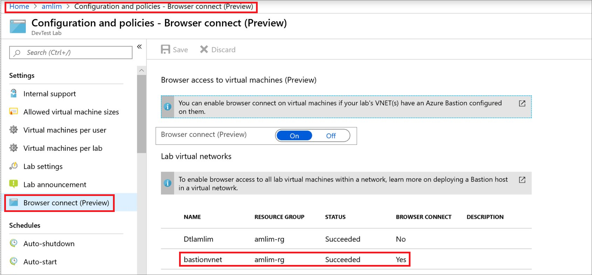

# Enable browser connection on lab virtual machines 

DevTest Labs integrates with [Azure Bastion](https://docs.microsoft.com/en-us/azure/bastion/), which enables you to connect to your virtual machines through a browser. You first need to enable browser connection on lab virtual machines.

As an owner of a lab you can enable accessing all lab virtual machines through a browser. You don't need an additional client, agent, or piece of software. Azure Bastion provides secure and seamless RDP/SSH connectivity to your virtual machines directly in the Azure portal over SSL. When you connect via Azure Bastion, your virtual machines do not need a public IP address. For more information, see [What is Azure Bastion?](../bastion/bastion-overview.md)

> [!NOTE]
> Enabling browser connection on lab virtual machines is in preview.

This article shows how to enable browser connection on lab virtual machines.

## Prerequisites 

[Have a Bastion host deployed in your lab VNet](../bastion/bastion-create-host-portal.md)

## Connect and configure the Bastion host

To use the browser access functionality in labs, you will need to [Connect your lab with a Bastion configured VNet](devtest-lab-configure-vnet.md). Make sure to enable the VNet for the virtual machine creation in the subnet settings by following these steps:

1. Sign in to the [Azure portal](https://portal.azure.com).
2. Select **All Services** on the left navigational menu. 
3. Select **DevTest Labs** from the list.
4. From the list of labs, select *your lab*.  
5. Select **Configuration and policies** in the **Settings** section on the left menu. 
6. Select **Virtual network**.
7. Click **Lab Subnet**.

## Enable browser connection 

Once you have a Bastion configured VNet inside the lab, as a lab owner, you can enable browser connect on lab virtual machines.

To enable browser connect on lab virtual machines, follow these steps:

1. In the Azure portal, navigate to *your lab*.
1. Select **Configuration and policies**.
1. In **Settings**, select **Browser connect (Preview)**.

## Next Steps

[Add a VM to a lab in Azure DevTest Labs](devtest-lab-add-vm.md)