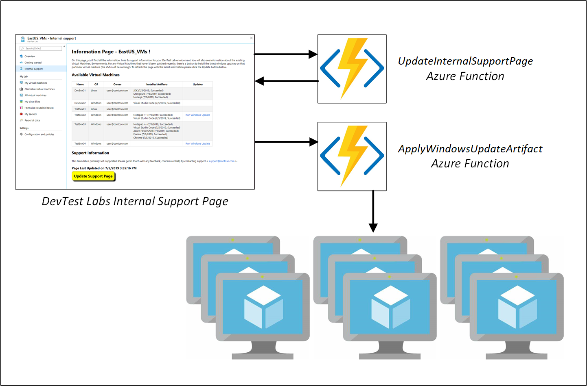

## Use Azure Functions to extend DevTest Labs
You can use Azure Functions to support additional scenarios beyond the scenarios already supported by DevTest Labs. Azure Functions can be used to extend the built-in functionality of the services to meet business-specific needs. The following list provides some of the possible scenarios. This article shows you how to implement one of those sample scenarios.

- Provide a top-level summary of virtual machines (VMs) in the Lab
- [Configure a lab to use a remote desktop gateway](configure-lab-remote-desktop-gateway.md)
- Compliance reporting on the internal support page
- Enable users to complete operations that require increased permissions in the subscription
- [Listening to DevTest Labs events and initiating workflows based on them](https://github.com/RogerBestMsft/DTL-SecureArtifactData)

## Overview
[Azure Functions](../azure-functions/functions-overview.md) is a serverless computing platform in Azure. Using Azure Functions in a solution with DevTest Labs enables us to augment the existing features with our own custom code. For more information on Azure Functions, see [Azure Functions documentation](../azure-functions/functions-overview.md). To illustrate how Azure Functions can help fulfill your requirements or complete scenarios in DevTest Labs, this articles uses an example of providing a top-level summary of VMs in the Lab as follows:

**Example requirement/scenario**: Users are easily able to see details about all VMs in a lab including the operating system, owner, and any applied artifacts.  In addition, if the **Apply Windows Updates** artifact hasn't been recently applied, there is an easy way to apply it.

To complete the scenario, you will use two functions as described in the following diagram.  The source code for these sample functions is located in the [DevTest Labs GitHub repository](https://github.com/Azure/azure-devtestlab/tree/master/samples/DevTestLabs/AzureFunctions) (both C# and PowerShell implementations are available).

- **UpdateInternalSupportPage**: This function queries DevTest Labs and updates the internal support page directly with details about the virtual machines.
- **ApplyWindowsUpdateArtifact**: For a VM in a lab, this function applies the **Windows Update** artifact.

## How it works
When users select the **Internal Support** page in DevTest Labs, they have a pre-populated page with information about VMs, lab owners, and support contacts.  

When you select the **Click Here to Refresh** button, the page calls the first Azure function: **UpdateInternalSupportPage**. The function queries the lab for information and then rewrites the **Internal Support** page with the new information.

There’s an additional action that can be taken, for any VMs that haven’t recently applied the Windows Update artifact, there will be a button to apply windows updates.  

When you select the ***Run Windows Update** button for a VM, the page calls the second Azure Function: **ApplyWindowsUpdateArtifact**. This function checks whether the virtual machine is running and if so, applies the [Windows Update](https://github.com/Azure/azure-devtestlab/tree/master/Artifacts/windows-install-windows-updates) artifact directly.

## Step-by-step Walkthrough
This section provides step-by-step instructions for setting up Azure Resources needed to enable updating the **Internal Support** page. This is an example on extending DevTest Labs. There are many other ways to use this pattern for other scenarios.

### Step 1: Create a service principal 
The first step is to get a service principal with permission to the subscription that contains the lab. For the example, the service principal must use password-based authentication. It can be done with [Azure CLI](/cli/azure/create-an-azure-service-principal-azure-cli?view=azure-cli-latest), [Azure PowerShell](/powershell/azure/create-azure-service-principal-azureps?view=azps-2.5.0), or the [Azure portal](../active-directory/develop/howto-create-service-principal-portal.md). If you already have a service principal to use, you can skip this step.

## Step 2: Download the sample and open in Visual Studio 2019
Download a copy of the C# Azure Functions sample locally (either by cloning the repo locally or download the repo from here).  Open the C# Azure Functions sample solution file with Visual Studio 2019.  (NOTE:  you will need the “Azure Development” workload installed to proceed, this can be installed via Tools -> Get Tools and Features menu item).  Complete a build of the solution (Build -> Build Solution menu item) to download NuGet packages and confirm everything is working as expected.

