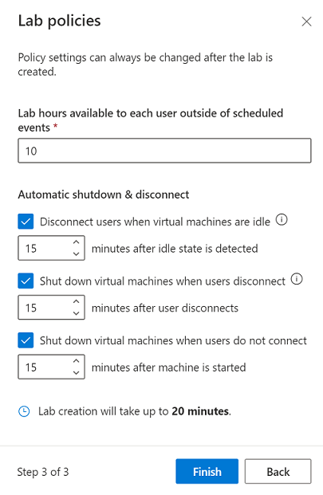

# Enable automatic shutdown of VMs on disconnect

This article shows you how you can enable or disable automatic shutdown lab VMs (template or student) after a remote desktop connection is disconnected. You can also specify how long the VMs should wait for the user to reconnect before automatically shutting down.

Review details about the automatic shutdown in the [Maximize cost control with auto-shutdown settings](cost-management-guide.md#maximize-cost-control-with-auto-shutdown-settings) section.

A lab account administrator can configure this setting for the lab account in which you create labs. For more information, see [Configure automatic shutdown of VMs on disconnect for a lab account](how-to-configure-lab-accounts.md). As a lab owner, you can override the setting when creating a lab or after the lab is created. 

## Configure for the lab level

You can configure the auto-shutdown setting in the [Azure Lab Services](https://labs.azure.com/).

* when creating a lab (in **Lab policies**), or
* after the lab is created (in **Settings**)

> [!div class="mx-imgBorder"]
> 

Make sure to review details about the automatic shutdown in the [Maximize cost control with auto-shutdown settings](cost-management-guide.md#maximize-cost-control-with-auto-shutdown-settings) section.

> [!WARNING]
> If you shutdown the Windows operating system (OS) on a VM before disconnecting an RDP session to the VM, the autoshutdown feature will not work properly.  

## Next steps

[Dashboard for classroom labs](use-dashboard.md)
