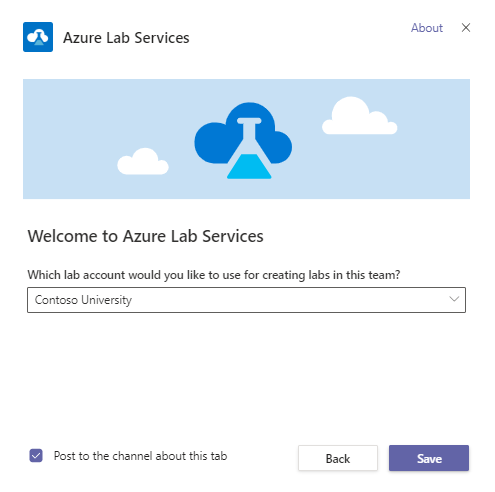

# Get started and create a Lab Services lab from Teams

This article shows how to add the **Azure Lab Services** app to a Team and then how to create a lab within MS Teams environment.

## Prerequisites

In this tutorial you set up a lab with virtual machines for your team. To set up a lab in a lab account, you must be a member of one of these roles in the lab account: Owner, Lab Creator, or Contributor. The account you used to create a lab account is automatically added to the owner role. So, you can use the user account that you used to create a lab account to create a lab.

Here is the typical workflow when using Azure Lab Services within Teams

1. User [creates a Lab Account](tutorial-setup-lab-account.md#create-a-lab-account) on the Azure Portal.
1. A [lab account creator adds other users](tutorial-setup-lab-account.md#add-a-user-to-the-lab-creator-role) to the **Lab Creator** role. For example, the lab account creator/admin adds educators to the **Lab Creator** role so that they can create labs for their classes.
1. Then, the educators create labs, pre-configures the template VM and publishes the lab to provision VM's to everyone on the team.
1. Once the lab is published, a VM is assigned to everyone on the team membership list on their first login to Azure Lab Services, either by clicking on the tab containing **Azure Lab Services** App within Teams(SSO) or by accessing the [labs website](https://labs.azure.com). Users can then use the VM to do the class work and homework.

## Add Azure Lab Services app as a tab to a Team

You, as a Team owner, can add **Azure Lab Services** app directly in your Teams channels, and then the app is available for everyone in the team to use. Follow the below three steps:

1. Navigate to the Teams channel where you want to add the app and select **+** to add a tab. 
1. Search for **Azure Lab Services** from the tab options and add this app. 

    > [!NOTE]
    > Only Team **Owners** will be able to create labs for the team.
1. Select a Lab Services account, which you would like to use for creating classroom labs in this team. 

    Azure Lab Services uses single sign-on into the [Azure Lab Services website](https://labs.azure.com) and pulls all the lab accounts that you have access to. 

    The accounts that are in the same tenant as Teams and for which you have **Owner**, **Contributor**, or **Creator** access are displayed. 

    
1. Press **Save** and the tab gets added to the channel.

    Now you can select the **Azure Lab Services** tab from your channel and start managing labs as described in the following step.

After the lab account is selected, Team owners will be able to create labs for the team. The entire lab creation process and all the tasks at the lab level can be performed within Teams. Users will have the option to create multiple labs within the same team and the Team owner, with appropriate access at the lab account level, will see only the labs associated with the specific team.

## Deleting classroom labs

A lab created within Teams can be deleted in the [Lab Services website](https://labs.azure.com) by deleting the lab directly, as described in [Manage classroom labs in Azure Lab Services](how-to-manage-classroom-labs.md). 

Lab deletion is also triggered when the team is deleted. If the team in which the lab is created gets deleted, lab would be automatically deleted 24 hours after the automatic user list sync is triggered. 

Deletion of the tab or uninstalling the app will not result in deletion of the lab. If the tab is deleted, users on the team membership list will still be able to access the VMs on the [Lab Services website](https://labs.azure.com) unless the lab deletion is explicitly triggered by deleting the lab on website or deleting the team. 

## Next steps

When a lab is created within Teams, the lab user list is automatically populated and synced with the team membership. Everyone on the team, including Owners, Members and Guests will be automatically added to the lab user list. Azure lab Services will maintain a sync with the team membership and an automatic sync is triggered every 24 hours. For details, see:

[Manage Lab Services user lists from Teams](how-to-manage-user-lists-within-teams.md)

### See also

Also see the following articles:

- [Use Azure Lab Services within Teams overview](lab-services-within-teams-overview.md)
- [Manage lab user lists within Teams](how-to-manage-user-lists-within-teams.md)
- [Manage lab's VM pool within Teams](how-to-manage-vm-pool-within-teams.md)
- [Create and manage lab schedules within Teams](how-to-create-schedules-within-teams.md)
- [Access a VM within Teams – Student view](how-to-access-vm-for-students-within-teams.md)

