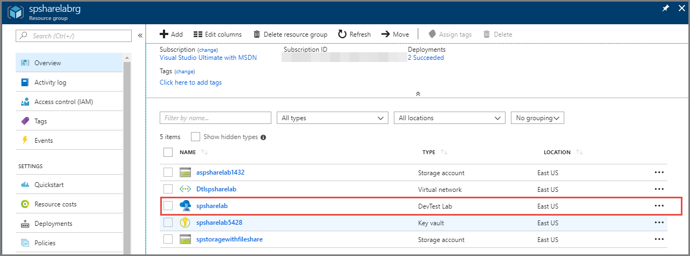
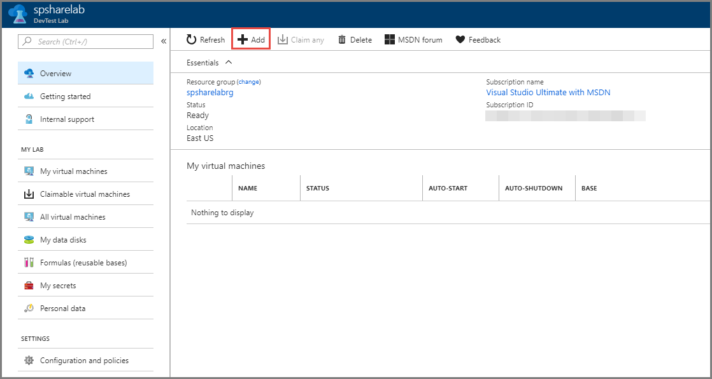
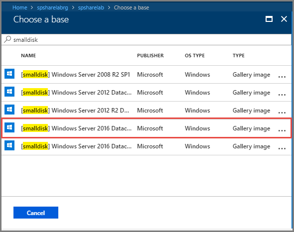
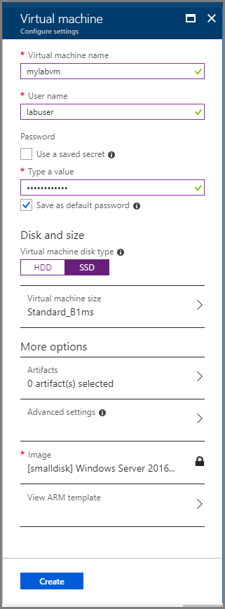
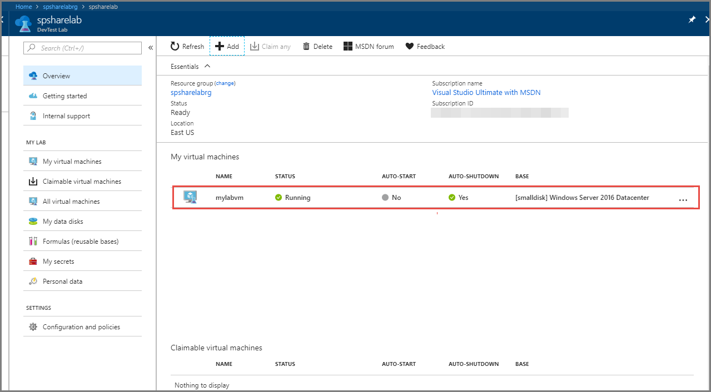
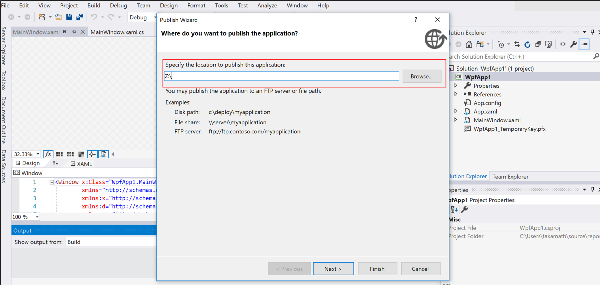
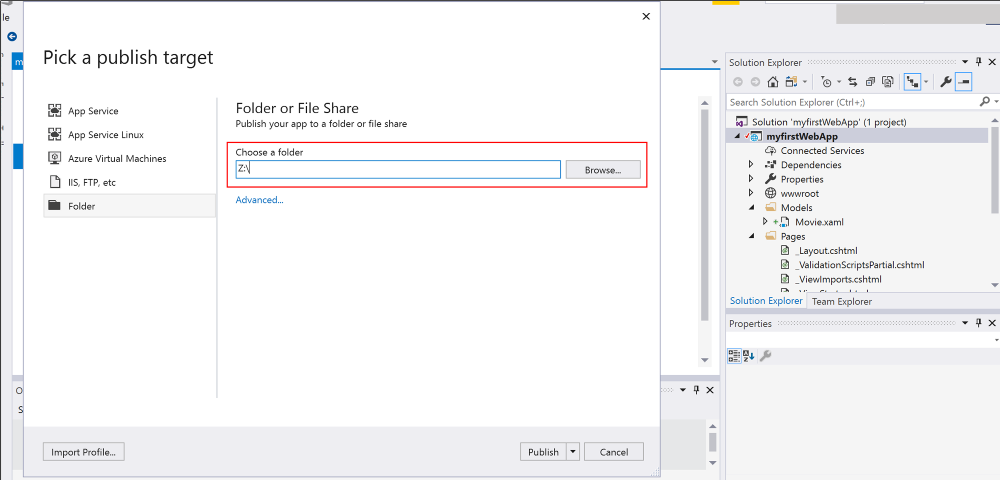
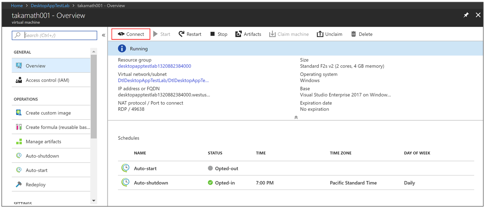
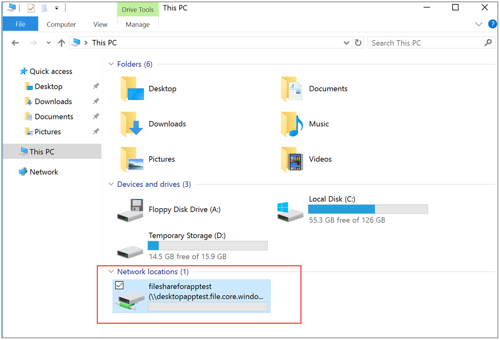
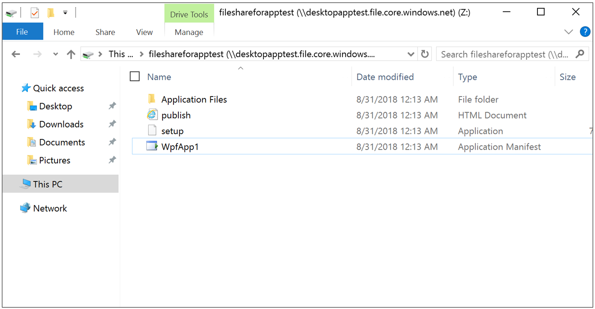

# Test your app in Azure 
This article provides steps for testing your application in Azure using DevTest Labs. First, you set up a file share within a lab and mount it as a drive on your local development machine and a VM inside a lab. Then, you use Visual Studio 2017 to deploy your app to the file share so that you can run the app on the VM in the lab.  

## Create a lab using Azure DevTest Labs 
1. [Create an Azure subscription](https://azure.microsoft.com/free/) if you don't already have one, and sign into [Azure portal](https://portal.azure.com).
2. Follow instructions in [this article](devtest-lab-create-lab.md) to create a lab using Azure DevTest Labs. Pin the lab to your dashboard so that you can easily find it next time you sign in. Azure DevTest Labs enables you to create resources within Azure quickly by minimizing waste and controlling cost. To learn more about DevTest Labs, see [overview](devtest-lab-overview.md). 

## Create an Azure Storage account
Create an Azure Storage account in the lab's resource group by following instructions in the [Create a storage account](../storage/common/storage-create-storage-account.md) article. On the **Create storage account** page, select **Use existing** for **Resource group**, and select the **lab's resource group**. 

## Create a file share in the storage

6. On the **Notifications** page, confirm that the storage account is created successfully. Select the **resource group** link in the notification message. Close the **Notifications** page by clicking **X** in the right corner. 

    
7. On the **Resource group** page, select the storage account you created.  

    
1. On the **Storage account** page, select **Files**. 

    
2. Select **+ File share** button on the toolbar. 

    
3. On the **File share** page, enter a **name** and **quota** for the file share, and select **Create**.

    
4. After the file share is created, select the **file share** from the list. 

    
6. On the **File share** page, select **Connect** on the toolbar. 

    
7. On the **Connect** page, you see different ways of mounting the file share as a drive on your machine. The next section has detailed instructions for mounting a file share. 
 

## Mount the file share 

1. On your local machine, use the script from [Persisting Azure file share credentials in Windows](../storage/files/storage-how-to-use-files-windows.md#persisting-azure-file-share-credentials-in-windows) section of [Use an Azure file share with Windows](../storage/files/storage-how-to-use-files-windows.md) article. 
2. Then, use `net use` command to mount the file share on your machine. Here is the sample command: Specify your Azure storage name and file share name before running the command. 

    `net use Z: \\<YOUR AZURE STORAGE NAME>.file.core.windows.net\<YOUR FILE SHARE NAME> /persistent:yes`

## Create a VM in the lab

1. On the **File share** page, select the **resource group** in the breadcrumb menu at the top. You see the **Resource group** page. 
    
    
2. On the **Resource group** page, select the **lab** you created in DevTest Labs.

    
3. On the **DevTest Lab** page for your lab, select **+ Add** on the toolbar. 

    
4. On the **Choose a base** page, search for **smalldisk**, and select **[smalldisk] Windows Server 2016 Data Center**. 

    
5. On the **Virtual machine** page, specify **virtual machine name**, **user name**, **password**, and select **Create**.    
    
        

## Mount the file share on your VM

1. After the virtual machine is created successfully, select the **virtual machine** from the list.    

    
2. Select **Connect** on the toolbar to connect to the VM. 
3. [Install Azure PowerShell](https://azure.microsoft.com/downloads/) by using the **Windows install** link in the **Command-line tools** section. For other ways of installing Azure PowerShell, see [this article](/powershell/azure/install-azurerm-ps?view=azurermps-6.8.1).
4. Follow instructions in the [Mount the file share](#mount-the-file-share) section. 

## Publish your app from Visual Studio
In this section, you publish your app from Visual Studio to a test VM in the cloud.

1. Create a desktop/web application by using Visual Studio 2017.
2. Build your app.
3. To publish your app, right-click your project in the **Solution Explorer**, and select **Publish**. 
4. In the **Publish wizard**, enter the **drive** that's mapped to your file share.

    **Desktop app:**

    

    **Web app:**

    

1. Select **Next** to complete the publish workflow, and select **Finish**. When you finish the wizard steps, Visual Studio builds your application and publishes it to your file share. 

## Test the app on your test VM in the lab

1. Navigate to the virtual machine page for your VM in the lab. 
2. Select **Start** on the toolbar to start the VM if it's in stopped state. You can set up auto-start and auto-shutdown policies for your VM to avoid starting and stopping each time. 
3. Select **Connect**.

    
4. Within the virtual machine, launch **File Explorer**, and select **This PC** to find your file share.

    

    > [!NOTE]
    > For any reason, if you are unable to find your file share on your virtual machine or on your local machine, you can remount it by running the `net use` command. You can find the `net use` command on the **Connect** Wizard of your **File Share** in the Azure portal.
1. Open the file share and confirm that you see the app you deployed from Visual Studio. 

    

    You can now access and test your app within the test VM you created in Azure.

## Next steps
See the following articles to learn how to use VMs in a lab. 

- [Add a VM to a lab](devtest-lab-add-vm.md)
- [Restart a lab VM](devtest-lab-restart-vm.md)
- [Resize a lab VM](devtest-lab-resize-vm.md)
