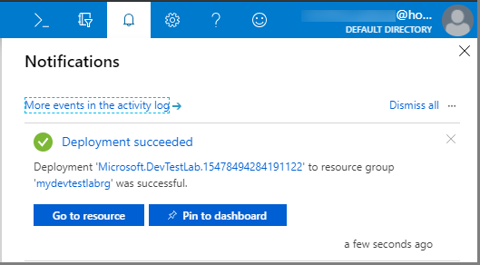
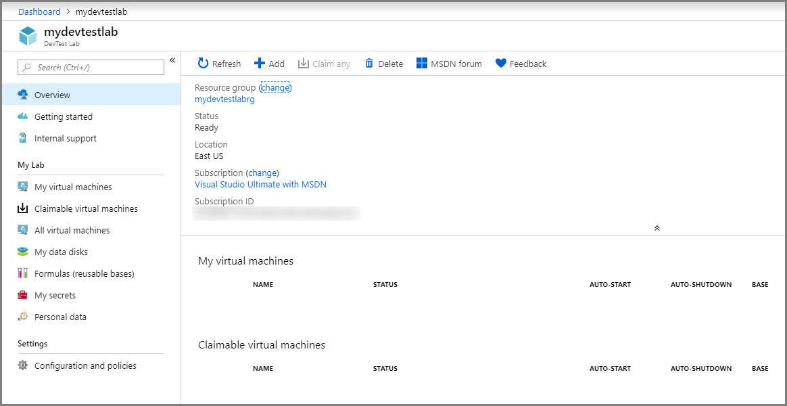
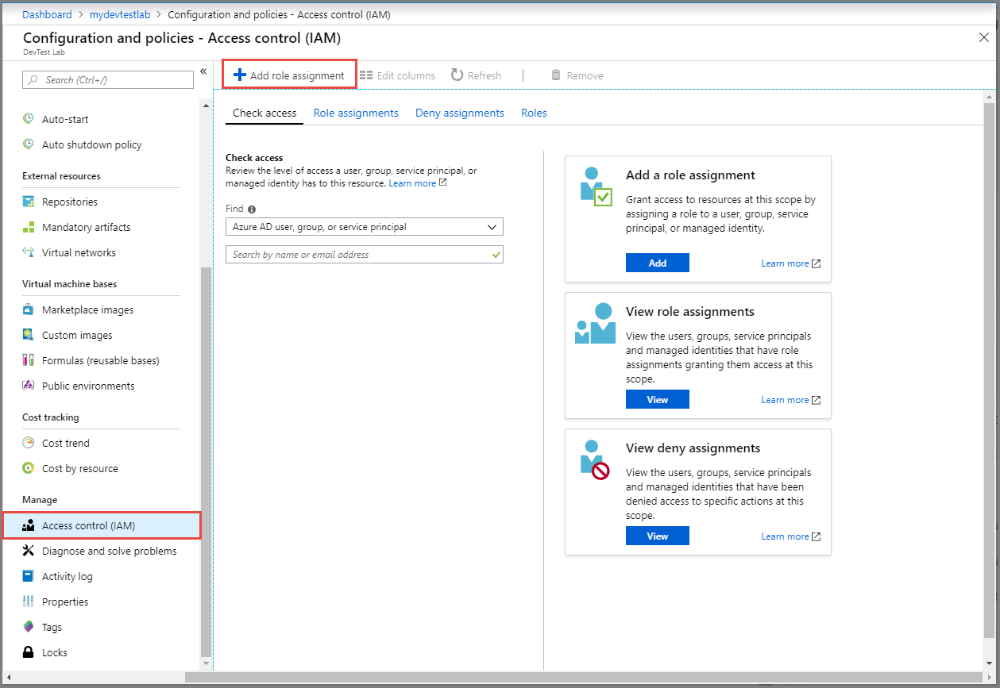
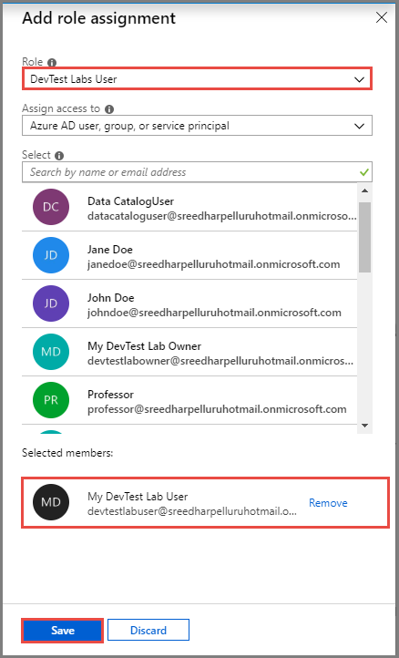
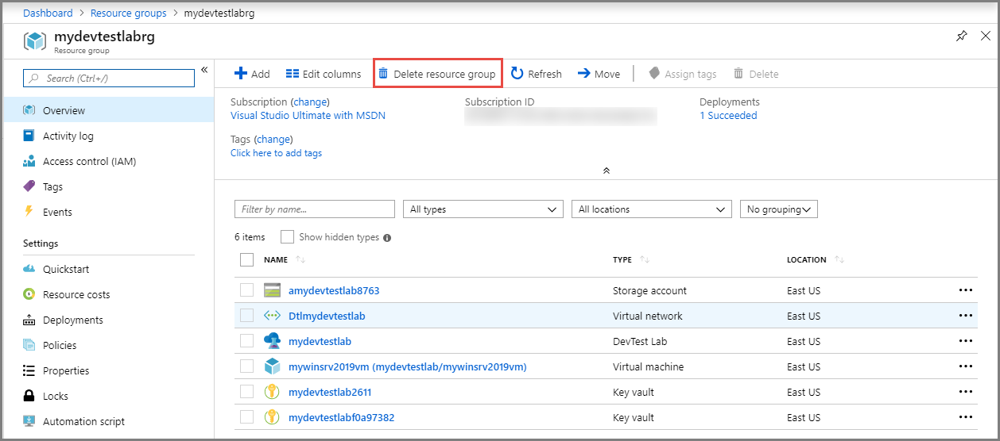

# Tutorial: Set up a lab by using Azure DevTest Labs
In this tutorial, you create a lab by using the Azure portal. A lab admin sets up a lab in an organization, creates VMs in the lab, and configures policies. Lab users (for example: developer and testers) claim VMs in the lab, connect to them, and use them. 

In this tutorial, you do the following actions:

> [!div class="checklist"]
> * Create a lab
> * Add virtual machines (VM) to the lab
> * Add a user to the Lab User role

If you don't have an Azure subscription, create a [free account](https://azure.microsoft.com/free/) before you begin.

## Create a lab
The following steps illustrate how to use the Azure portal to create a lab in Azure DevTest Labs. 

1. Sign in to the [Azure portal](https://portal.azure.com).
2. From the main menu on the left side, select **Create a resource** (at the top of the list), point to **Developer tools**, and click **DevTest Labs**. 

	
1. In the **Create a DevTest Lab** window, do the following actions: 
    1. For **Lab name**, enter a name for the lab. 
    2. For **Subscription**, select the subscription in which you want to create the lab. 
    3. For **Resource group**, select **Create new**, and enter a name for the resource group. 
    4. For **Location**, select the location/region in which you want the lab to be created. 
    5. Select **Create**. 
    6. Select **Pin to dashboard**. After you create the lab, the lab shows up in the dashboard. 

        
2. Confirm that the lab is created successfully by looking at the notificaitons. Select **Go to resource**.  

    
3. Confirm that you see the **DevTest Lab** page for your lab. 

    

## Add a VM to the lab

1. On the **DevTest Lab** page, select **+ Add** on the toolbar. 

	
1. On the **Choose a base** page, search with a keyword (for example: Windows, Ubuntu), and select one of the base images in the list. 
1. On the **Virtual machine** page, do the following actions: 
    1. For **Virtual machine name**, enter a name for the virtual machine. 
    2. For **User name**, enter a name for the user that has access to the virtual machine. 
    3. For **Password**, enter the password for the user. 

        
1. Select **Advanced settings** tab.
    1. For **Make this machine claimable**, select **Yes**.
    2. Confirm that the **instance count** is set to **1**. If you set it to **2**, 2 VMs are created with names: `<base image name>00' and <base image name>01`. For example: `win10vm00` and `win10vm01`.     
    3. Select **Submit**. 

        
    9. You see the status of the VM in the list of **Claimable virtual machines** list. Creation of the virtual machine may take approximately 25 minutes. The VM is created in a separate Azure resource group, whose name starts with the name of the current resource group that has the lab. For example, if the lab is in `labrg`, the VM may be created in the resource group `labrg3988722144002`. 

        
1. After the VM is created, you see it in the list of **Claimable virtual machines** in the list. 

    > [!NOTE] 
    > When adding a Linux VM to a lab, you can enable SSH and RDP access to the VM. If you don't enable the access while creating the VM, you can manually add rules in the network security group associated with the VM to open ports for SSH and RDP.

## Add a user to the Lab User role

1. Select **Configuration and policies** in the left menu. 

	
1. Select **Access control (IAM)** from the menu, and select **+ Add role assignment** on the toolbar. 

	
1. On the **Add permissions** page, do the following actions:
    1. For **Role**, select **DevTest Labs User**. 
    2. Select the **user** you want to add. 
    3. Select **Save**.

	    

## Cleanup resources
The next tutorial shows how a lab user can claim and connect to a VM in the lab. If you don't want to do that tutorial, and clean up the resources created as part of this tutorial, follow these steps: 

1. In the Azure portal, select **Resource groups** in the menu. 

	
1. Select your resource group in which you created the lab. 
2. Select **Delete resource group** from the toolbar. Deleting a resource group deletes all the resources in the group including the lab. 

	
1. Repeat these steps to delete the additional resource group created for you with the name `<your resource group name><random numbers>`. For example: `splab3988722144001`. The VMs are created in this resource group rather than in the resource group in which the lab exists. 

## Next steps
In this tutorial, you created a lab with a VM and gave a user access to the lab. To learn about how to access the lab as a lab user, advance to the next tutorial:

> [!div class="nextstepaction"]
> [Tutorial: Access the lab](tutorial-use-custom-lab.md)

