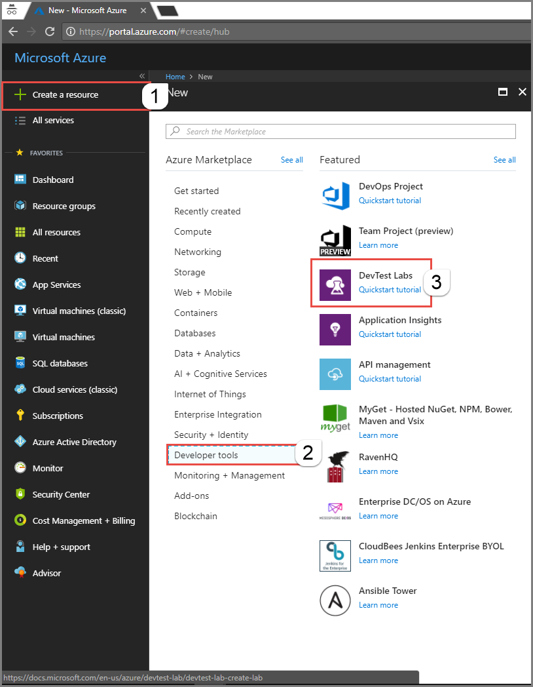

# Tutorial: Set up a self-managed custom lab (formerly DevTest Labs) by using Azure Lab Services
In this tutorial, you create a custom lab by using the Azure portal. A lab admin sets up a custom lab in an organization, creates VMs in the lab, and configures policies. Lab users (for example: developer and testers) claim VMs in the lab, connect to them, and use them. 

In this tutorial, you do the following actions:

> [!div class="checklist"]
> * Create a custom lab
> * Add VMs to the custom lab
> * Claim and connect to the VM
> * Add a user to the Lab User role

If you don't have an Azure subscription, create a [free account](https://azure.microsoft.com/free/) before you begin.

## Create a custom lab
The following steps illustrate how to use the Azure portal to create a lab in Azure DevTest Labs. 

1. Sign in to the [Azure portal](https://portal.azure.com).
2. From the main menu on the left side, select **Create a resource** (at the top of the list), point to **Developer tools**, and click **DevTest Labs**. 
	
3. In the **Create a DevTest Lab** window, do the following actions: 
    1. For **Lab name**, enter a name for the lab. 
    2. For **Subscription**, select the subscription in which you want to create the custom lab. 
    3. For **Resource group**, select **Create new**, and enter a name for the resource group. 
    4. For **Location**, select the location/region in which you want the custom lab to be created. 
    5. Select **Create**. 
    6. Select **Pin to dashboard**. After you create the custom lab, the lab shows up in the dashboard. 
        

## Add a VM to the custom lab

1. On the **Custom lab** page, select **+ Add** on the toolbar. 
	
2. On the **Choose a base** page, search with **Windows 10** keyword, and select **Windows 10 Pro**. 
	
3. On the **Virtual machine** page, do the following actions: 
    1. For **Virtual machine name**, enter a name for the virtual machine. 
    2. For **User name**, enter a name for the user that has access to the virtual machine. 
    3. For **Type a value**, enter the password for the user. 
    4. Select **Advanced settings**.
    5. For **Make this machine claimable**, select **Yes**.
    6. Confirm that the **instance count** is set to **1**. If you set it to **2**, 2 VMs are created with names: `<base image name>00' and <base image name>01`. For example: `win10vm00` and `win10vm01`. 
    7. To close the **Advanced** page, click **OK**. 
    8. Select **Create**. 

        
    9. You see the status of the VM in the list of **Claimable virtual machines** list. Creation of the virtual machine may take approximately 25 minutes. The VM is created in a separate Azure resource group, whose name starts with the name of the current resource group that has the custom lab. For example, if the custom lab is in `customlabrg`, the VM may be created in the resource group `customlabrg3988722144002`. 
        
1. After the VM is created, you see it in the list of **Claimable virtual machines** in the list. 

## Add a user to the Lab User role

1. Select **Configuration and policies** in the left menu. 
	
2. Select **Access control (IAM)** from the menu, and select **+ Add** on the toolbar. 
	
3. On the **Add permissions** page, do the following actions:
    1. For **Role**, select **DevTest Labs User**. 
    2. Select the **user** you want to add. 
    3. Select **Save**.

	    
4. To close **Configuration and policies - Access control (IAM)**, select **X** in the right corner. 

## Cleanup resources
The next tutorial shows how a lab user can claim and connect to a VM in the lab. If you don't want to do that tutorial, and clean up the resources created as part of this tutorial, follow these steps: 

1. In the Azure portal, select **Resource groups** in the menu. 
2. Select your resource group in which you created the custom lab. 
3. Select **Delete resource group** from the toolbar. Deleting a resource group deletes all the resources in the group including the custom lab. 
4. Repeat these steps to delete the additional resource group created for you with the name `<your resource group name><randmo numbers>`. For example: `spcustomlab3988722144001`. The VMs are created in this resource group rather than in the resource group in which the custom lab exists. 

## Next steps
In this tutorial, you created a custom lab with a VM and gave a user access to the lab. To learn about how to access the lab as a lab user, advance to the next tutorial:

> [!div class="nextstepaction"]
> [Tutorial: Use the custom lab](tutorial-use-custom-lab.md)

