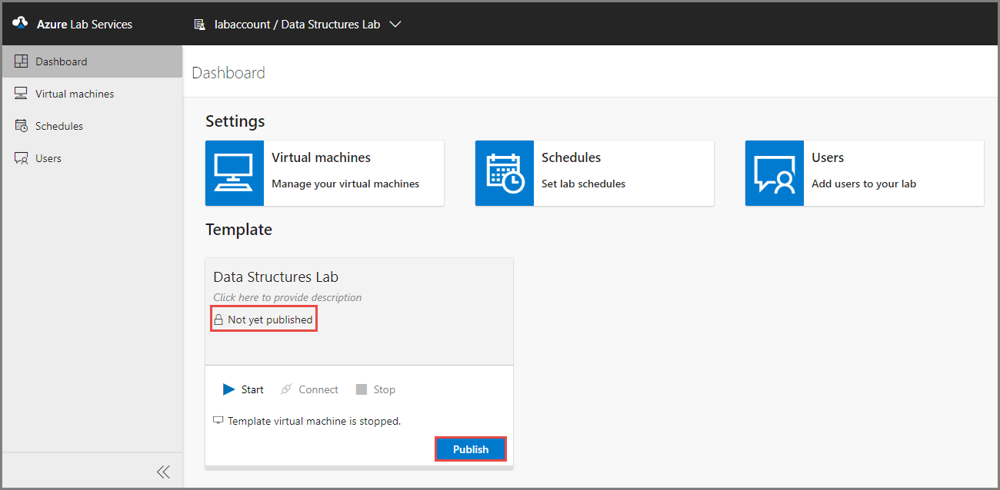
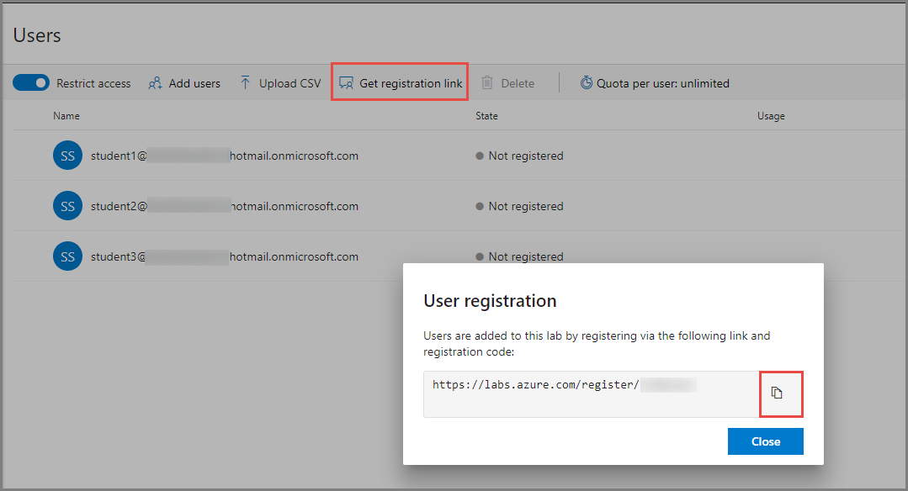

# Tutorial: Set up a classroom lab 
In this tutorial, you set up a classroom lab with a set of virtual machines that are used by students in the classroom.  

In this tutorial, you do the following actions:

> [!div class="checklist"]
> * Create a classroom lab
> * Configure the classroom lab
> * Send registration link to students

## Create a classroom lab

1. Navigate to [Azure Lab Services website](https://labs.azure.com).
2. In the **New Lab** window, do the following actions: 
    1. Specify a **name** for the classroom lab. 
    2. Select the **size** of the virtual machine that you plan to use in the classroom.
    3. Select the **image** to use to create the virtual machine.
    4. Specify **default credentials** for logging into virtual machines in the lab. 
    7. Select **Save**.

        
1. You see the **home page** for the lab. 
    
    

## Configure usage policy

1. Select **Usage policy**. 
2. In the **Usage policy**, settings, enter the **number of users** allowed to use the lab.
3. Select **Save**. 

    

## Set up the template 
A template in a lab is from which all users’ virtual machines are created. Set up the template virtual machine so that it is configured with exactly what you want to provide to the lab users. You can provide a name and description of the template that the lab users see, and set the visibility to “Public” to make instances of the template VM available to your lab users. 

### Set title and description
1. In the **Template** section, select **Edit** (pencil icon) for the template. 
2. In the **User view** window, Enter a **title** for the template.
3. Enter **description** for the template.
4. Select **Save**.

    

### Make instances of the template public
Once you set the visibility of a template to **Public**, Azure Lab Services creates VMs in the lab by using the template. The number of VMs created in this process are the same as the maximum number of users allowed into the lab, which you can set in the usage policy of the lab. All virtual machines have the same configuration as the template. 

1. Select **Visibility** in the **Template** section. 
2. In the **Availability** page, select **Public**.
    
    > [!IMPORTANT]
    > Once a template is publicly available, its access can't be changed to private. 
3. Select **Save**.

    

## Send registration link to students

1. Select **User registration** tile.
2. In the **User registration** dialog box, select the **Copy** button. The link is copied to the clipboard. Paste it in an email editor, and send an email to the student. 

    

## Next steps
In this tutorial, you created a classroom lab, and configured the lab. To learn how a student can access a VM in the lab using the registration link, advance to the next tutorial:

> [!div class="nextstepaction"]
> [Connect to a VM in the classroom lab](tutorial-connect-virtual-machine-classroom-lab.md)

