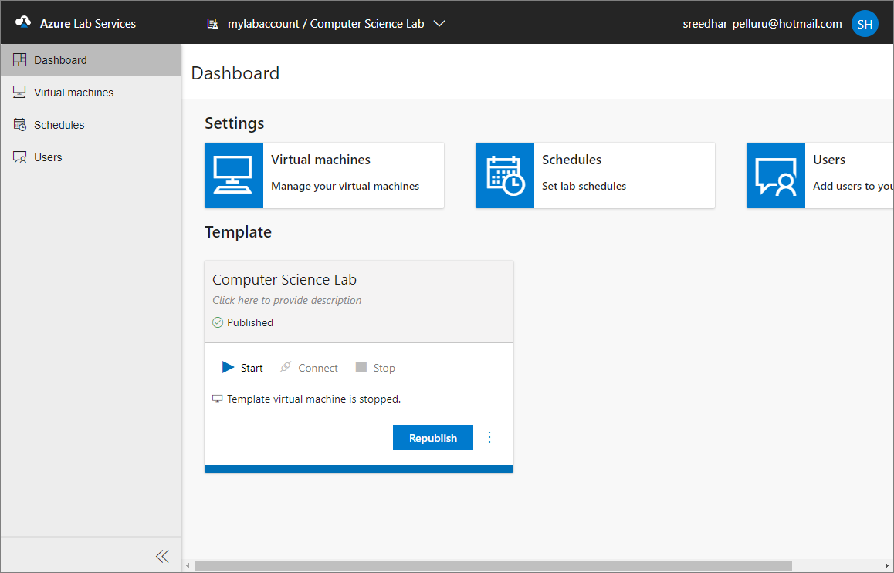

# Tutorial: Set up a classroom lab 
In this tutorial, you set up a classroom lab with a set of virtual machines that are used by students in the classroom.  

In this tutorial, you do the following actions:

> [!div class="checklist"]
> * Create a classroom lab
> * Configure the classroom lab
> * Send registration link to students

## Create a classroom lab

1. Navigate to [Azure Lab Services portal](https://labs.azure.com).
2. In the **New Lab** window, do the following actions: 
    1. Specify a **name** for the classroom lab. 
    2. Select the **size** of the virtual machine to use in the classroom.
    3. Select the **image** to use to create the virtual machine.
    4. Specify the **name of the user** who has access to the lab. 
    5. Specify the password for the user. 
    6. Confirm the password. 
    7. Select **Save**.

        
1. You see the **home page** for the lab. 
    
    

## Configure usage policy

1. Select **Usage policy**. 
2. In the **Usage policy**, settings, enter the **number of users** allowed to use the lab.
3. Select **Save**. 

    

## Set title and description
1. In the **Template** section, select **Edit** (pencil icon) for the template. 
2. In the **User view** window, Enter a **title** for the template.
3. Enter **description** for the template.
4. Select **Save**.

    

## Configure visibility
1. Select **Visibility** in the **Template** section. 
2. In the **Availability** page, select **Public**.
    
    > [!IMPORTANT]
    > Once a template is publicly available, its access can't be changed to private. 
3. Select **Save**.

    

## Send registration link to students

1. Select **User registration** tile.
2. You see the URL in the **User registration** window that you can send to students in the class. The link is copied to the clipboard, so you can paste it in an email editor, and send an email to the student. 

    

## Next steps
In this tutorial, you created a classroom lab, and configured the lab. To learn how a student can access a VM in the lab using the registration link, advance to the next tutorial:

> [!div class="nextstepaction"]
> [Connect to a VM in the classroom lab](tutorial-connect-virtual-machine-classroom-lab.md)

