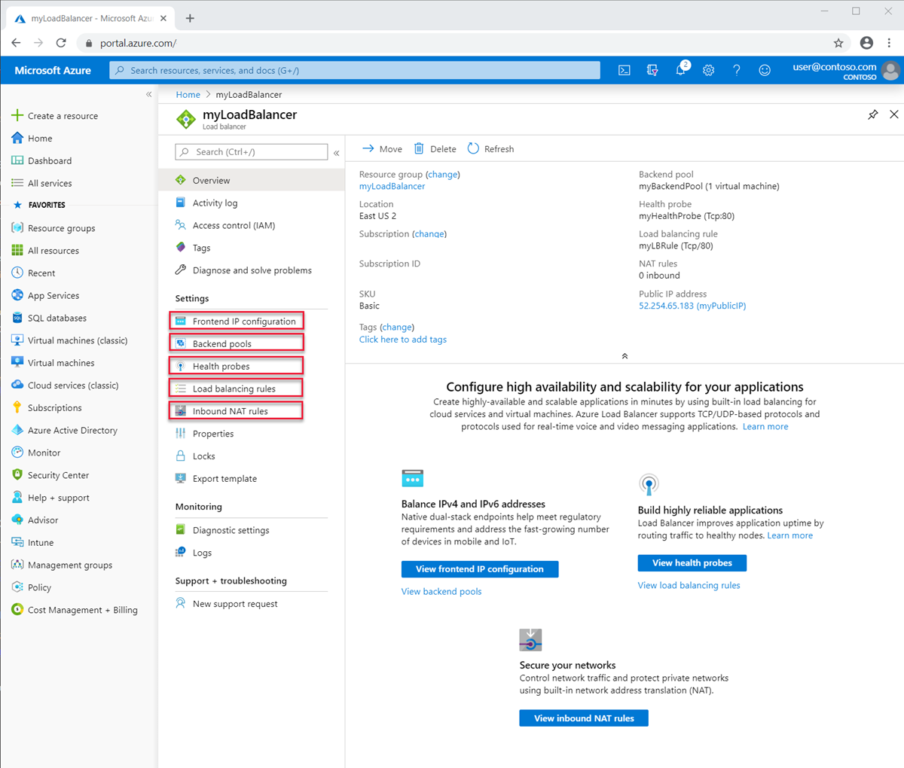

# Azure Load Balancer components

Azure Load Balancer contains several key components for its operation.  

These components can be configured in your subscription via: 
* **Azure portal** 
* **Azure CLI**
* **Azure PowerShell**
* **Templates** 

## Frontend IP configurations

The IP address of the load balancer. It's the point of contact for clients. These addresses can be either:

- **Public IP Address**
- **Private IP Address**

The selection of the IP address determines the **type** of load balancer created. Private IP address selection creates an internal load balancer. Public IP address selection creates a public load balancer.

## Backend pool

The group of virtual machines or instances in a virtual machine scale set that is serving the incoming request. To scale cost-effectively to meet high volumes of incoming traffic, computing guidelines generally recommend adding more instances to the backend pool. 

Load balancer instantly reconfigures itself via automatic reconfiguration when you scale instances up or down. Adding or removing VMs from the backend pool reconfigures the load balancer without additional operations. The scope of the backend pool is any virtual machine in the virtual network. 

When considering how to design your backend pool, design for the least number of individual backend pool resources to optimize the length of management operations. There's no difference in data plane performance or scale.

## Health probes

A health probe is used to determine the health of the instances in the backend pool. You can define the unhealthy threshold for your health probes. When a probe fails to respond, the load balancer stops sending new connections to the unhealthy instances. A probe failure doesn't affect existing connections. The connection continues until the application:

- Ends the flow
- Idle timeout occurs
- The VM shuts down

Load Balancer provides different health probe types for endpoints:

- TCP
- HTTP
- HTTPS

Basic load balancer doesn't support HTTPS probes. Basic load balancer closes all TCP connections (including established connections).

## Load balancing rules

Load balancing rules tell the load balancer what to do. A load balancing rule maps a given frontend IP configuration and port to multiple backend IP addresses and ports.

## Inbound NAT rules

Inbound NAT rules forward traffic from the frontend ip address to a backend instance inside the virtual network. Port forwarding is done by the same hash-based distribution as load balancing. 

Example of use is Remote Desktop Protocol (RDP) or Secure Shell (SSH) sessions to separate VM instances inside a virtual network. Multiple internal endpoints can be mapped to ports on the same front-end IP address. The front-end IP addresses can be used to remotely administer your VMs without an additional jump box.

## Outbound rules

An outbound rule configures outbound Network Address Translation (NAT) for all virtual machines or instances identified by the backend pool.

Basic load balancer doesn't support Outbound rules.

## Next steps

- See [Create a public Standard Load Balancer](quickstart-load-balancer-standard-public-portal.md) to get started with using a Load Balancer.
- Learn more about [Azure Load Balancer](load-balancer-overview.md).
- Learn about [Public IP Address](https://docs.microsoft.com/azure/virtual-network/virtual-network-public-ip-address)
- Learn about [Private IP Address](https://docs.microsoft.com/azure/virtual-network/virtual-network-ip-addresses-overview-arm#private-ip-addresses)
- Learn about using [Standard Load Balancer and Availability Zones](load-balancer-standard-availability-zones.md).
- Learn about [Standard Load Balancer Diagnostics](load-balancer-standard-diagnostics.md).
- Learn about [TCP Reset on Idle](load-balancer-tcp-reset.md).
- Learn about [Standard Load Balancer with HA Ports load balancing rules](load-balancer-ha-ports-overview.md).
- Learn about using [Load Balancer with Multiple Frontends](load-balancer-multivip-overview.md).
- Learn more about [Network Security Groups](../virtual-network/security-overview.md).
- Learn about [Probe types](load-balancer-custom-probe-overview.md#types).
- Learn more about [Load balancer limits](https://docs.microsoft.com/azure/azure-resource-manager/management/azure-subscription-service-limits#load-balancer).
- Learn about using [Port forwarding](https://docs.microsoft.com/azure/load-balancer/tutorial-load-balancer-port-forwarding-portal).
- Learn more about [Load balancer outbound rules](https://docs.microsoft.com/azure/load-balancer/load-balancer-outbound-rules-overview).